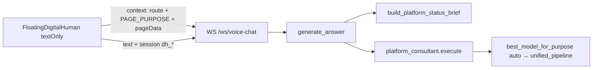

# 小朱数字人 — 能力说明书（迭代底稿）

> **状态**：以 2026-10-06 代码为准，不是设计目标清单。  
> **用途**：后续改顾问行为、记忆、简报、前端上报时，先改本文件对应章节，再改代码，避免口头约定漂移。  
> **规约**：Agent SOP 仍只属于 `AGENT.md`；本文件描述**接线与能力边界**。冲突时以代码为准，24h 内同步本文件。

---

## 1. 它是什么

管理端浮层文字顾问。用户问 aiPlat「现在有什么、这一页怎么用、该走工厂还是 Agent、审核卡片怎么改」；通用知识可以答，但必须标明 **不是本平台既有资产/能力**。

**不是**：语音唤醒助手（浮层已关麦/关 TTS）、不是 RAG 客服、不是执行器（不 `pipeline.start`、不改配置）、不是工作区里那 47 个业务 Agent 之一的运行时。

运行时身份：工作区 Agent `platform_consultant`（磁盘 `~/.aiplat/agents/platform_consultant/AGENT.md`，种子 `aiPlat-core/core/workspace_seeds/agents/platform_consultant/AGENT.md`）。

---

## 2. 端到端链路



| 层 | 路径 | 作用 |
|---|---|---|
| 浮层 UI | `aiPlat-management/frontend/src/components/digital-human/FloatingDigitalHuman.tsx` | 拖拽面板、展示问答、模型 chip、解析 `[ACTION:navigate:/path]` |
| 会话 hook | `frontend/src/hooks/useVoiceChat.ts` | `textOnly: true`；localStorage `aiplat.digital_human.session`；发 `context`/`text` |
| 页面桥 | `frontend/src/lib/pageDataBridge.ts` + `captureVisiblePage.ts` | 结构化上报 + 弹窗标题/按钮/短字段（不贴源码） |
| WS | `core/server.py` `@app.websocket("/ws/voice-chat")` | 可选 `AIPLAT_VOICE_WS_TOKEN` |
| 管线 | `core/harness/digital_human/voice_pipeline.py` | 组 payload、选顾问、选模、兜底、轨迹 |
| 简报 | `platform_status_brief.py` + `menu_catalog.json` | 磁盘资产 + 菜单 + Chat LLM purpose |
| 个人笔记 | `consultant_personal.py` | `~/.aiplat/memory/tenants/{tenant}/xiaozhu.md`（default 可回退旧路径） |
| 轨迹 | `trajectory_collector.py` | 本会话 JSONL + 可选 SFT 导出 |

超时：`AIPLAT_DIGITAL_HUMAN_TIMEOUT_SEC`（默认 90，下限 15）。无 Agent 时 echo `收到: {text}`。

---

## 3. 能力清单（已接线）

### 3.1 文字咨询（主路径）

- 浮层 `textOnly: true`：不请求麦克风、不播放 TTS。
- TTS 总闸 `AIPLAT_DIGITAL_HUMAN_TTS` 默认 `false`。打开后走 `sys_tts_generate`。
- ASR/语音帧协议仍在 `voice_chat_handler`（`audio`/`end`），浮层顾问不用。
- 回复去掉「步骤1 分析…」类 CoT（`_strip_consultant_cot`）。
- `No model available` 改写成引导去「模型管理」。

### 3.2 答全部 aiPlat 问题（实况，非手册）

每轮用户消息结构（`_consultant_user_payload`）：

1. **本句用户问题**（最先）
2. **本会话刚才**（`recent_session_turns`，轨迹 JSONL）
3. **关于你**（`xiaozhu.md`，若有）
4. **平台心智卡**（`consultant_constitution.md`，稳定规则；与简报冲突以简报为准）
5. **按需能力摘录**（`consultant_knowledge.build_on_demand_pack`：概念题才注入 CAPABILITIES/registry 短摘；**非**默认语义 RAG）
6. **平台实况简报 / 当前页**

页面专用简报（`use_page_only_brief`）时仍带心智卡，**跳过**按需摘录以免冲掉审核。

简报（`include_inventory=True` 时）扫描 `AIPLAT_HOME`：

- 工作区 Agent / Skill / Tool / MCP / Workflow 名单与数量
- 默认团队 `stages`
- Chat LLM：已登记 `purpose`、`open_qa_purposes`、入口「purpose → unified_pipeline」、界面 `/infra/models`（**不点名具体模型**）
- Adapters 本地/API 模型名单 + 进程内 ModelManager 已启用 Chat 摘要（状态计数；**不是**指定选哪个）
- 最近失败 Agent/Skill 运行（id/status/error_code，不含 input/output）
- 菜单：优先解析 `pageManifest.ts`，失败用 `menu_catalog.json`
- 构建路径索引（工厂 / Skill / Tool / MCP / Agent / FDE / 视频样例说明）

**不扫能力图谱**（避免 code_graph 拖死首包）。

顾问降级到 `materials_chat` 时：`_consultant_agent` → `_consultant_live_answer`，**禁止** wiki/CRAG，只靠已注入简报作答。

### 3.3 当前页感知

前端始终带 `route`、`label`、`group`、`PAGE_PURPOSE`（`pageManifest.ts`）。

`reportPageData` 另报实时字段。已接线页面：

- 工作区：Agent / Skill / Tool / MCP 列表 + 对应编辑弹窗（Skill/Agent/MCP/Tool 含审核 `issue0…`，中文建议优先于英文引擎原文）
- 工厂 `/app/factory`、治理、本体编辑器、模型、诊断、运行、可观测、告警

编辑弹窗打开且本句是「这个画面 / 审核 / 精简追问」时 **只用当前页简报**（`use_page_only_brief`），避免 47 个 Agent 冲掉审核。其它问题（选模、通用概念、工厂怎么走）即使弹窗开着也带全量简报。

指代词「这个画面」**不是意图分类器**，只触发省略全量名单。

### 3.4 三类回答策略（AGENT.md）

| 类 | 何时 | 规则 |
|---|---|---|
| A 平台事实 | 有没有某资产、本页审核、菜单 | 只引用简报/页面；没有则「简报未见」 |
| B 平台怎么用 | 本句才问工厂 vs Agent、选模链路等 | 心智卡 + 按需摘录 + 简报路径 |
| C 通用知识 | OSS/K8s 等外部概念 | 必须标明「通用说明，非 aiPlat 既有」；`ensure_generic_disclaimer` 漏标时后置补上；禁止说成工作区已有同名能力 |

优先级：**当前页实时数据 > 本会话刚才 > 个人笔记 > 磁盘简报 > 心智卡/按需摘录 > 模型通用知识**。

### 3.5 选模

- 顾问 `model: auto`，调用 `best_model_for_purpose("auto", messages=本句)`。
- `intent_route` 只输出 **purpose 名**（枚举 `open_qa_purposes`：chat/clarify/reasoning/code_gen），再 `unified_pipeline` 打分选模型。
- 业务代码禁止写死模型名。DeepSeek 可以在意图匹配时胜出。
- 浮层 header 展示本轮真实 `model` + `purpose`。
- ControlProfile `platform_consultant`：`tool_whitelist: []`、`semantic_injection: false`。工作区 `control_presets.yaml` 与 `~/.aiplat/profiles/control_presets.yaml` 需一起改。

### 3.6 记忆（分层，不要混为一谈）

| 层 | 开了吗 | 实现 | 干什么 |
|---|---|---|---|
| 本 WS 会话 Working | 是 | `trajectories/{session}.jsonl` + localStorage `dh_*` | 「精简一点」接上一问 |
| 个人笔记 | 是 | `~/.aiplat/memory/tenants/{tenant_id}/xiaozhu.md`（default 读可回退旧路径；写迁到 tenants/default） | 称呼、偏好、嘱咐；**不**当资产名单；租户隔离 |
| MemoryManager Episodic/Semantic | 顾问热路径否 | `_consultant_agent` 时 `BaseAgent` 不注入、不 `save_interaction` | 避免巨量简报污染编码 Agent 记忆 |
| 语义检索 Wiki | 否 | `semantic_injection: false` | 手册会盖过磁盘实况 |
| SFT 轨迹 | 采集有、在线学习无 | 全量 `export_sharegpt_dataset`；**策展** `export_curated_sharegpt_dataset`；**种子** `export_seed_sharegpt_dataset` → `training/sft_digital_human_seed.jsonl` | 离线口音；运行时 brief 仍是事实源 |

「记住/请叫我/我负责…」写入笔记；「太长/精简」可记短答偏好。审核句、密钥类不入库。

**策展反馈**：浮层「有用/不对」→ WS `feedback` → `mark_feedback`；口说「讲得对」/「不对，应该是…」→ `infer_feedback_from_user`。会话结束只导出策展样本，避免噪音全量进训练目录。

### 3.7 执行与工具

- 顾问 `required_tools/skills` 皆空 → `BaseAgent` **直调** `sys_llm_generate`（无 ReAct 空转）。
- `_skip_claude_md: true`、`_coding_policy_profile: off`（澄清向，避免架构宪法灌进咨询）。
- **禁止**代执行流水线/未问就建项目。
- 需要用户立刻去某菜单时，答末可写一行 `[ACTION:navigate:/path]`（path 须在本轮简报/菜单出现；每答最多一个）。浮层会跳转并隐藏该标记。

### 3.8 答偏兜底（非意图模板）

- 角色确认腔（「了解了您的角色」「请提供详细信息…」）→ 若有审核字段则改成本页压缩解读。
- **仅当本轮是页面专用简报**时，未问却输出「做应用 vs Agent」模板 → 同样回退审核解读。
- 通用问题即使提到应用工厂，**不**用审核卡覆盖。

### 3.9 回退 Agent

registry 无 `platform_consultant` 时用 `materials_chat`。降级仍注入 `_consultant_agent` → `_consultant_live_answer`（`consultant_live_only`），**禁止** wiki/CRAG，只靠本轮简报作答。

---

## 4. 环境变量

| 变量 | 默认 | 作用 |
|---|---|---|
| `AIPLAT_DIGITAL_HUMAN_TTS` | false | 文字顾问勿开 |
| `AIPLAT_DIGITAL_HUMAN_TIMEOUT_SEC` | 90 | 单轮 Agent 超时 |
| `AIPLAT_VOICE_WS_TOKEN` | 空=开放 | WS 握手 token |
| `AIPLAT_TRAJECTORY_DIR` | `~/.aiplat/trajectories` | 会话 JSONL |
| `AIPLAT_LLM_CONFIG_PATH` | infra `llm_profile.yaml` | purpose 登记 |
| `AIPLAT_HOME` | `~/.aiplat` | 简报扫描根 |

---

## 5. 测试锚点

- `core/tests/unit/test_harness/test_digital_human/test_platform_status_brief.py`
- `core/tests/unit/test_harness/test_digital_human/test_consultant_knowledge.py`
- `core/tests/unit/test_harness/test_digital_human/test_trajectory_curated.py`
- `core/tests/unit/test_harness/test_digital_human/test_voice_pipeline_fixes.py`
- `core/tests/unit/test_apps/test_materials_chat_consultant_live.py`
- `core/tests/unit/test_harness/test_digital_human/test_consultant_reload.py`

改简报/payload/兜底后至少跑这两份。前端改 TSX 后 `npm run build`，hashed dist 须重启 5173 代理。

---

## 6. 明确不做 / 已知缺口（迭代队列）

改之前先在本表加行，完成后再勾。

| # | 缺口 | 现状 | 建议方向 |
|---|---|---|---|
| G1 | 多数页面无 `reportPageData` | ✅ 咨询高频页（工作区/工厂/治理/模型/审批/运行等）已上报；本轮补 `/app/sessions`。其余诊断子页仍可按需补，勿全站 DOM dump | 低频诊断子页按咨询量增量补 |
| G2 | 简报无「当前启用模型名单」 | ✅ 已接线：Adapters 清单 + 进程内 ModelManager 已启用 Chat 摘要（状态/禁用数）；仍禁止业务点名选模 | — |
| G3 | 无运行时指标（某次 pipeline 失败原因） | ✅ 已接线：最近失败 Agent/Skill 运行（id/status/error_code，不含 I/O）→ `/diagnostics/runs` | — |
| G4 | `[ACTION:navigate]` 无顾问侧规范 | ✅ 已接线：AGENT.md + 心智卡规定「简报内 path、每答最多一个」；浮层隐藏 ACTION 标记仍执行跳转 | — |
| G5 | `materials_chat` 降级会 RAG | ✅ 已接线：`_consultant_agent` 时走 `_consultant_live_answer`，禁 wiki/CRAG | — |
| G6 | 弱模型仍可能忽略「通用说明」标注 | ✅ 已接线：`ensure_generic_disclaimer` 仅对外部泛知识题（OSS/K8s 等）且答句无平台路径时前置标注；名单/页面/选模/Skill 不问 | — |
| G7 | 个人笔记启发式（「我是」）易误存 | ✅ 已收紧：去掉裸「我是」；纠正/问句/本页句不入库；显式「记住」仍优先 | — |
| G8 | 热更新 AGENT.md 需重启 gunicorn | ✅ 已接线：每轮按 mtime 热载 `AGENT.md` system_prompt + `consultant_constitution.md`（`consultant_reload`） | — |
| G9 | 多用户同机 `xiaozhu.md` 一份 | ✅ 已接线：非 default → `memory/tenants/{tenant}/xiaozhu.md`；default 读可回退旧路径，**写**迁到 `tenants/default`（拷贝旧笔记）；前端传 `active_tenant_id` | — |
| G10 | 语音管线仍存在 | 顾问 UI 不用 | 不要在顾问迭代里顺手改 ASR，除非产品要唤醒 |
| G11 | SFT 口音无启动语料 | ✅ 种子包：`export_seed_sharegpt_dataset`（心智卡蒸馏 6 条）；真人策展仍走「有用/不对」 | 样本攒够后在 `/infra/finetune` 训适配器，Chat 仍走 `best_model_for_purpose` |

---

## 7. 改代码时的检查单

1. 有没有用关键词把「这个画面」当成意图开关？（禁止）
2. 有没有在顾问业务代码里写死模型名？（禁止）
3. 平台事实是否仍只来自简报/当前页？
4. 通用回答是否仍要求「非 aiPlat 既有」？
5. 本页审核追问是否仍 `use_page_only_brief`？
6. 种子 `AGENT.md` 与 `~/.aiplat/agents/platform_consultant/AGENT.md` 是否同步？
7. `workspace_seeds/profiles/control_presets.yaml` 与 `~/.aiplat/profiles/control_presets.yaml` 是否同步？
8. 对应 pytest + 若改了前端则 dist/代理？

---

## 8. 相关文件速查

```
aiPlat-core/core/harness/digital_human/
  voice_pipeline.py
  platform_status_brief.py
  menu_catalog.json
  consultant_personal.py
  consultant_constitution.md
  consultant_knowledge.py
  consultant_reload.py       # AGENT.md / 心智卡 mtime 热重载
  trajectory_collector.py
  BOUNDARY.yaml          # 目录属 harness，不是业务 app
  XIAOZHU.md             # 本文件
aiPlat-core/core/workspace_seeds/agents/platform_consultant/AGENT.md
aiPlat-core/workspace_seeds/profiles/control_presets.yaml  # platform_consultant
aiPlat-management/frontend/src/components/digital-human/
aiPlat-management/frontend/src/hooks/useVoiceChat.ts
aiPlat-management/frontend/src/lib/pageDataBridge.ts
aiPlat-management/frontend/src/lib/captureVisiblePage.ts
aiPlat-management/frontend/src/pageManifest.ts            # PAGE_PURPOSE
```
