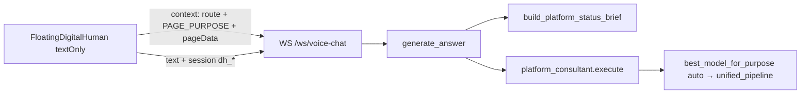

# 小朱数字人 — 能力说明书（迭代底稿）

> **状态**：以 2026-11-06 代码为准，不是设计目标清单。  
> **用途**：后续改顾问行为、记忆、简报、前端上报时，先改本文件对应章节，再改代码，避免口头约定漂移。  
> **规约**：Agent SOP 仍只属于 `AGENT.md`；本文件描述**接线与能力边界**。冲突时以代码为准，24h 内同步本文件。

---

## 1. 它是什么

管理端**全局悬浮**文字顾问（挂在 `AppLayout` → `FloatingDigitalHuman`，任意路由可见），不是评测中心或某几个页面的插件。用户问 aiPlat「现在有什么、这一页怎么用、该走工厂还是 Agent、审核卡片怎么改」；通用知识可以答，但必须标明 **不是本平台既有资产/能力**。

运行时身份：工作区 Agent `platform_consultant`（磁盘 `~/.aiplat/agents/platform_consultant/AGENT.md`，种子 `aiPlat-core/core/workspace_seeds/agents/platform_consultant/AGENT.md`）。

### 1.1 能力边界裁决表

| 能做 | 不能做 |
|------|--------|
| 任意路由上解释当前页用途、可见字段、告警、按钮 | 执行器 / 审批人 / 改配置 / `pipeline.start` |
| 据磁盘简报答资产名单与菜单路径 | 打开全库 Wiki/CRAG 客服（`semantic_injection: false`；顾问降级仍禁 CRAG） |
| 据心智卡答平台用法；概念题按需 CAPABILITIES + **受控 Wiki 短摘** | 手册全文 / runbook 整篇注入；用 Wiki 覆盖简报名单数量 |
| `[ACTION:navigate:/path]`（path 须在本轮简报内，每答最多一个） | 把设计目标态说成已实现；用 Wiki 猜未上报的本页字段 |
| 外部通识 + 「通用说明，非 aiPlat 既有」 | 语音唤醒（浮层 `textOnly`） |

未 `reportPageData` 的页面：仍有 `PAGE_PURPOSE` + **可见 DOM 短摘**（`captureVisiblePage`：标题/共 N 个/卡片短标题/按钮，非全站 dump）+ 全局简报；细字段答不上时说「本页未上报科目，只能按菜单用途说明」。
有 glossary 时**不得挤掉**可见列表快照；提问前浮层会刷新 live context。页面手写 list 字段是增强，不是唯一感知路径。

### 1.2 知识分层 A / B / C

| 层 | 放什么 | 载体 |
|:--:|--------|------|
| **A** | 会变或须核验的短事实（本页字段、审核卡、磁盘实况、诚实锁） | `reportPageData` / 模块 glossary / `platform_status_brief` |
| **B** | 稳定「怎么设计/怎么用」 | 心智卡；`build_on_demand_pack`：CAPABILITIES + registry；概念题可追加**受控 Wiki 短摘** |
| **C** | 措辞、外部通识 | 模型 + `ensure_generic_disclaimer` |

三问：① 随本机/本页变？→ A；② 稳定平台概念？→ B；③ 离开 aiPlat 仍成立？→ C。

优先级：**当前页 > 会话 > 笔记 > 简报 > 心智卡/B 摘录 > 通用知识**。B 内冲突：**简报/当前页 > CAPABILITIES > Wiki**。

**受控 Wiki 短摘门禁**（全部满足才注入；不是开放 RAG）：

1. `_wants_concept_pack` 为真（与 CAPABILITIES 同触发）
2. 非清单/审核/`use_page_only_brief`；本页有 `guideGlossary` 且问字段科目 → 只吃 A
3. 集合白名单：`AIPLAT_CONSULTANT_WIKI_COLLECTIONS`（逗号分隔；**显式空字符串=关闭**；未设则用内置平台相关默认名，再与磁盘求交）
4. 最多 2 段、合计 ≤800 字；CAPABILITIES 先占 `build_on_demand_pack` 预算
5. 前缀：「Wiki短摘（手册；与简报/当前页冲突时以简报为准）」
6. 禁止改 `semantic_injection`；禁止 CRAG 多跳

### 1.3 全站页面感知契约（必做 — 已收口）

| 契约项 | 状态 |
|--------|------|
| 菜单路由均有 `PAGE_PURPOSE` | ✅ `pageManifest.ts` + `pageManifest.test.ts` 全量覆盖 |
| 浮层带 route/label/group/purpose | ✅ `FloatingDigitalHuman` / `useVoiceChat` |
| 无结构化 pageData 时 | ✅ 只按 `PAGE_PURPOSE`+可见 DOM+简报；字段题且无 glossary/审核实况时 `ensure_unreported_page_field_note` 前置「未上报科目」说明 |
| Layer B/C 全局一次 | ✅ 心智卡 + `build_on_demand_pack`（CAPABILITIES + 受控 Wiki）+ disclaimer |

复杂交互页应 `reportPageData`；科目密集页加模块 glossary。计划明确：**不为每个菜单页硬写 glossary**；未列页靠 PURPOSE 即可。

### 1.4 Layer A 加深覆盖表（咨询高频 / 科目密集）

SSOT：`aiPlat-management/frontend/src/lib/consultantLayerARoutes.ts`（与本表同步）。
门禁：`consultantLayerACoverage.test.ts` + `python3 scripts/check_consultant_layer_a.py`（每条 deep 路由必须有 `reportPageData(route)`）。

| 路由 | glossary / pageData |
|------|---------------------|
| `/eval` | `evalGlossary.ts` + `evalTabGuides.ts` |
| `/workspace/agents` | `agentsGlossary.ts` |
| `/workspace/skills` | `skillsGlossary.ts` |
| `/workspace/tools` | `toolsGlossary.ts` |
| `/workspace/mcp` | `mcpGlossary.ts` |
| `/app/factory` | `factoryGlossary.ts` |
| `/infra/models` | `modelsGlossary.ts` |
| `/governance` | `consultantLayerA` governance 包 |
| `/alerts` | `consultantLayerA` alerts 包 |
| `/diagnostics` | `consultantLayerA` diagnostics 包 |
| `/diagnostics/fde` | `fdeGlossary.ts` + `FdeDashboard` `reportPageData`（含「新建客户」Profile 入口） |
| `/diagnostics/runs` | `consultantLayerA` runs 包 |
| `/diagnostics/observability` | `consultantLayerA` observability 包 |
| `/diagnostics/production-depth` | `consultantLayerA` production-depth 包 |
| `/diagnostics/evolution-status` | `consultantLayerA` evolution-status 包 + `EvolutionStatus.tsx` |
| `/ontology-editor` | `consultantLayerA` ontology 包 |
| `/approval` | `consultantLayerA` approval 包 + 实况计数 |
| `/app/sessions` | `consultantLayerA` sessions 包 + 会话计数 |
| `/knowledge/business` | `consultantLayerA` knowledgeBusiness 包 + `BusinessOntologyShell`（≠ FDE 客户） |
| `/knowledge/library` | `consultantLayerA` knowledgeLibrary 包 + `KnowledgeLibraryShell` |
| `/org/pilot` | `consultantLayerA` orgPilot 包 + `OrgPilotPage`（≠ FDE①新建客户） |

#### 存量画面怎么处理（分级，禁止全站 DOM dump）

| 级别 | 适用 | 做什么 | 不做 |
|------|------|--------|------|
| **deep** | 上表路由；科目密集或易与他页混淆（如 FDE「新建客户」） | 同 PR：`reportPageData` + `guideGlossary` + 写入 `LAYER_A_DEEP_ROUTES` + 本表 | 只靠聊天补词；只改 PURPOSE 不报 pageData |
| **purpose_only** | 其余已有菜单页 | 仅 `PAGE_PURPOSE`（`pageManifest` 全量门禁已覆盖） | 顾问不得宣称「功能不存在」；字段题须说「本页未上报科目」 |
| **增量回填** | 用户/顾问反复假阴性、或新增大入口 | 升为 deep：补 glossary 包 → 页内 `reportPageData` → 同步 Routes + 本表 → 跑覆盖测试 | 一次刷全站；为低频诊断子页硬写 glossary |

维护：新科目同 PR 入对应包；新增 deep 页必须先过覆盖测试再合并。

---


## 2. 端到端链路


```mermaid
flowchart LR
  UI["FloatingDigitalHuman textOnly"]
  WS["WS /ws/voice-chat"]
  GA["generate_answer"]
  Brief["build_platform_status_brief"]
  Agent["platform_consultant.execute"]
  LLM["best_model_for_purpose auto → unified_pipeline"]

  UI -->|context: route + PAGE_PURPOSE + pageData| WS
  UI -->|text + session dh_*| WS
  WS --> GA
  GA --> Brief
  GA --> Agent
  Agent --> LLM
```

| 层 | 路径 | 作用 |
|---|---|---|
| 浮层 UI | `aiPlat-management/frontend/src/components/digital-human/FloatingDigitalHuman.tsx` | 拖拽面板、展示问答、模型 chip、解析 `[ACTION:navigate:/path]` |
| 会话 hook | `frontend/src/hooks/useVoiceChat.ts` | `textOnly: true`；localStorage `aiplat.digital_human.session`；发 `context`/`text` |
| 页面桥 | `frontend/src/lib/pageDataBridge.ts` + `captureVisiblePage.ts` | 结构化上报 + 弹窗标题/按钮/短字段（不贴源码） |
| WS | `core/server.py` `@app.websocket("/ws/voice-chat")` | 可选 `AIPLAT_VOICE_WS_TOKEN` |
| 管线 | `core/harness/digital_human/voice_pipeline.py` | 组 payload、选顾问、选模、兜底、轨迹 |
| 简报 | `platform_status_brief.py` + `menu_catalog.json` | 磁盘资产 + 菜单 + Chat LLM purpose |
| 个人笔记 | `consultant_personal.py` | `~/.aiplat/memory/tenants/{tenant}/xiaozhu.md`（default 可回退旧路径） |
| 轨迹 | `trajectory_collector.py` | 本会话 JSONL + 可选 SFT 导出 |

超时：`AIPLAT_DIGITAL_HUMAN_TIMEOUT_SEC`（默认 90，下限 15）。无 Agent 时 echo `收到: {text}`。

---

## 3. 能力清单（已接线）

### 3.1 文字咨询（主路径）

- 浮层 `textOnly: true`：不请求麦克风、不播放 TTS。
- TTS 总闸 `AIPLAT_DIGITAL_HUMAN_TTS` 默认 `false`。打开后走 `sys_tts_generate`。
- ASR/语音帧协议仍在 `voice_chat_handler`（`audio`/`end`），浮层顾问不用。
- 回复去掉「步骤1 分析…」类 CoT（`_strip_consultant_cot`）。
- `No model available` 改写成引导去「模型管理」。

### 3.2 答全部 aiPlat 问题（实况，非手册）

每轮用户消息结构（`_consultant_user_payload`）：

1. **本句用户问题**（最先）
2. **本会话刚才**（`recent_session_turns`，轨迹 JSONL）
3. **关于你**（`xiaozhu.md`，若有）
4. **平台心智卡**（`consultant_constitution.md`，稳定规则；与简报冲突以简报为准）
5. **按需能力摘录**（`build_on_demand_pack`：概念题才注入 CAPABILITIES/registry；预算内可追加受控 Wiki 短摘；本页 `guideGlossary`+字段题则跳过整包；**非**开放 CRAG）
6. **平台实况简报 / 当前页**

页面专用简报（`use_page_only_brief`）时仍带心智卡，**跳过**按需摘录（含 Wiki）以免冲掉审核。

简报（`include_inventory=True` 时）扫描 `AIPLAT_HOME`：

- 工作区 Agent / Skill / Tool / MCP / Workflow 名单与数量
- 默认团队 `stages`
- Chat LLM：已登记 `purpose`、`open_qa_purposes`、入口「purpose → unified_pipeline」、界面 `/infra/models`（**不点名具体模型**）
- Adapters 本地/API 模型名单 + 进程内 ModelManager 已启用 Chat 摘要（状态计数；**不是**指定选哪个）
- 最近失败 Agent/Skill 运行（id/status/error_code，不含 input/output）
- 菜单：优先解析 `pageManifest.ts`，失败用 `menu_catalog.json`
- 构建路径索引（工厂 / Skill / Tool / MCP / Agent / FDE / 视频样例说明）

**不扫能力图谱**（避免 code_graph 拖死首包）。

顾问降级到 `materials_chat` 时：`_consultant_agent` → `_consultant_live_answer`，**禁止** wiki/CRAG，只靠已注入简报作答。

### 3.3 当前页感知

前端始终带 `route`、`label`、`group`、`PAGE_PURPOSE`（`pageManifest.ts`）。

`reportPageData` 另报实时字段。已接线页面见 §1.4；另含 `/app/sessions`。

编辑弹窗审核实况：`reportAssetAuditToPage` 写入 `issue0…` + `skillId`/`agentId`/`toolId`/`mcpId`/`auditSummary`（中文 suggestion 优先于英文引擎原文，见 `formatAuditIssueForPage`）。列表页 glossary 与审核字段共存（`reportPageData` 保留审核键）。关弹窗时 `clearAssetAuditPageFields`。

编辑弹窗打开且本句是「这个画面 / 审核 / 精简追问」时 **只用当前页简报**（`use_page_only_brief`），避免全量名单冲掉审核。其它问题（选模、通用概念、工厂怎么走）即使弹窗开着也带全量简报。

指代词「这个画面」**不是意图分类器**，只触发省略全量名单。

### 3.4 三类回答策略（AGENT.md）

| 类 | 何时 | 规则 |
|---|---|---|
| A 平台事实 | 有没有某资产、本页审核、菜单 | 只引用简报/页面；没有则「简报未见」 |
| B 平台怎么用 | 本句才问工厂 vs Agent、选模链路等 | 心智卡 + 按需摘录 + 简报路径 |
| C 通用知识 | OSS/K8s 等外部概念 | 必须标明「通用说明，非 aiPlat 既有」；`ensure_generic_disclaimer` 漏标时后置补上；禁止说成工作区已有同名能力 |

优先级：**当前页实时数据 > 本会话刚才 > 个人笔记 > 磁盘简报 > 心智卡/按需摘录 > 模型通用知识**。

### 3.5 选模

- 顾问 `model: auto`，调用 `best_model_for_purpose("auto", messages=本句)`。
- `intent_route` 只输出 **purpose 名**（枚举 `open_qa_purposes`：chat/clarify/reasoning/code_gen），再 `unified_pipeline` 打分选模型。
- 业务代码禁止写死模型名。DeepSeek 可以在意图匹配时胜出。
- 浮层 header 展示本轮真实 `model` + `purpose`。
- ControlProfile `platform_consultant`：`tool_whitelist: []`、`semantic_injection: false`。工作区 `control_presets.yaml` 与 `~/.aiplat/profiles/control_presets.yaml` 需一起改。

### 3.6 记忆（分层，不要混为一谈）

| 层 | 开了吗 | 实现 | 干什么 |
|---|---|---|---|
| 本 WS 会话 Working | 是 | `trajectories/{session}.jsonl` + localStorage `dh_*` | 「精简一点」接上一问 |
| 个人笔记 | 是 | `~/.aiplat/memory/tenants/{tenant_id}/xiaozhu.md`（default 读可回退旧路径；写迁到 tenants/default） | 称呼、偏好、嘱咐、**纠偏**；**不**当资产名单；租户隔离 |
| MemoryManager Episodic/Semantic | 顾问热路径否 | `_consultant_agent` 时 `BaseAgent` 不注入、不 `save_interaction` | 避免巨量简报污染编码 Agent 记忆 |
| 语义检索 Wiki | 否 | `semantic_injection: false` | 手册会盖过磁盘实况 |
| SFT 轨迹 + 自动 job | 采集有；达标可自动提交微调 | 策展 `export_curated_sharegpt_dataset` → `maybe_submit_digital_human_sft`（Dataset+Job）；种子 `export_seed_sharegpt_dataset` | **不**自动把未评测模型挂进 `best_model_for_purpose`；训完去 `/infra/finetune` 人工启用 |
| 进化提案台账 | 是 | `evolution_proposals.py` → `~/.aiplat/digital_human/evolution_proposals.jsonl` | 习性可自动；升生产（种子/巩固/SFT 启用指引）须 HUMAN_GATE；**永不**静默改选模 |

「记住/请叫我/我负责/以后…优先…」写入笔记；「太长/精简」可记短答偏好；「不对，应该是…」→ `remember_correction`（纠偏行）。审核句、密钥类不入库。

**策展反馈**：浮层「有用/不对」→ WS `feedback` → `mark_feedback`；口说「讲得对」/「不对，应该是…」→ `infer_feedback_from_user`。导出后若样本 ≥ `AIPLAT_DH_SFT_MIN_SAMPLES`（默认 10）且 `AIPLAT_DH_SFT_AUTO_SUBMIT≠0`，自动建 `digital_human_curated` 数据集并 `JobManager.create`（优先 local，否则 deepseek；无 provider → 状态 `pending_provider`）。运维脚本：`python3 scripts/digital_human_curated_learn.py [--dry-run|--force]`。

### 3.6.1 受控自演进（多环，非 E5）

目标：小朱像「可见的进化生命体」——能说清学了什么、待批什么；**不是**生产无门禁自主改核心。

**五域机读目标**（`evolution_goals.py`，简报一行「五域进化目标」；管理端显示中文 title/description）：

| 可读名 | goal_id | 达标 |
|---|---|---|
| 小朱答得怎么样 | `consultant.sft_quality.v1` | 好评率≥0.7 且样本够 + 结构 holdout（AND） |
| 该测的能力测全了没 | `eval.coverage.v1` | 覆盖率≥0.90 |
| 交付清单做到哪了 | `fde.evidence.v1` | 证据覆盖≥0.95 |
| 沉淀的经验靠谱吗 | `knowledge.case_fitness.v1` | mean(reward_ema)≥0.8 且待批不过堆积 |
| 试点试验准备好了没 | `evo.pilot_sandbox.v1` | 三试点均有可回放候选（≠生产最优） |

提案 payload 挂 `goal_id` + `goal_progress`；`e5_claimed` 恒 false。

**Phase B 最小优化闭环**（`evolution_optimize.py`，结果只进 HUMAN_GATE/沙箱）：

| 域 | 自动草稿 | 仍禁止 |
|---|---|---|
| 顾问 | 低好评轨迹 → `seed_qa`（扫描/Facade） | 自动 `purpose_bind` 生效 |
| 评测 | `remediation_plan` 补测清单 | 改 runs_eval 策略 |
| FDE | `completion_plan` 步骤补齐序 | 自动改 plan status |
| 知识 | `target_state_summary` + fitness | `auto_apply` 入图 |
| 试点 | 沙箱短程 DE → `best_genes` | `use_global_router` |

| 环 | 自动？ | 入口 |
|---|---|---|
| 快环·习性笔记 | 自动生效 | `remember_*` |
| 中环·策展 SFT Job | 达标可自动提 Job | `maybe_submit_digital_human_sft` |
| 慢环·升生产/巩固 | **须人批** | `create/decide_evolution_proposal`；WS `evolution_list` / `evolution_decide`；口令「批准第N条」；管理端 `/diagnostics/evolution-status` |
| 平台 evo 试点 | ✅ Phase2 | `propose_pilot_config` / `ensure_pilot_config_proposals`；批准 → `record_human_gate_decision` + **沙箱** `request_evo_canary_cutover(use_global_router=False)` |
| FDE/评测/知识 | ✅ 三域桥+活源 | 扫描读 `eval_inventory.json`/`fde_inventory.json` + 高奖励案例；浮层「扫描领域进化」；知识批准尽力 `maybe_enqueue`（仍 auto_apply=false） |

提案类型：`habit_promotion` | `seed_qa` | `sft_promote` | `purpose_bind` | `constitution_patch` | `pilot_config` | `knowledge_evolve` | `eval_coverage` | `fde_evolve`。  
状态词对齐 evo：`HUMAN_GATE` → `APPROVED|REJECTED` → `APPLIED` →（纠偏）`ROLLED_BACK`。  
诚实锁：`production_model_changed` 恒 false；`sft_promote` 批准前过 `evaluate_sft_promote_gate`（种子 holdout 结构门）；通过才 APPLIED，失败保持 APPROVED；通过后链式生成 `purpose_bind` 待批（第二道人批）。  
`purpose_bind` 批准 → 写 `purpose_bind.json` 回执；**默认不改选模**；仅 `AIPLAT_DH_PURPOSE_BIND=1` 时顾问热路径可读绑定模型（仍不改全局 `best_model_for_purpose`）。  
紧急跳过评测门：`AIPLAT_DH_SFT_PROMOTE_SKIP_GATE=1`（仍不改选模）。  
试点 **默认不** `use_global_router`。  
口令：「准备试点提案」→ 三试点幂等待批；「申请绑定」→ `purpose_bind`；「扫描领域进化」→ FDE/评测/知识待批；「批准第N条」→ 有界应用。

**管理端可见面 + 方向纠偏**（`evolution_status.py` + `/diagnostics/evolution-status`）：

| 阶段 | 动作 | 效果 |
|---|---|---|
| 待批 `HUMAN_GATE` | **拒绝** | → `REJECTED`；不落地 |
| 已 `APPLIED` / `APPROVED` | **回滚**（填原因） | → `ROLLED_BACK`；有界撤销（`seed_qa` 作废标记；`purpose_bind` 删回执；`pilot_config`/SFT/三域仅台账+回执） |
| 习性笔记偏了 | `remember_correction` / 新 `seed_qa` | 追加纠正，不删历史 |

聚合 API：`get_evolution_status_snapshot` / `GET /api/core/digital-human/evolution/status`（goals + proposals + timeline；`e5_claimed=false`）。  
决定/回滚：`POST .../proposals/{id}/decide`、`POST .../proposals/{id}/rollback`。  
非目标：不宣称可逆远端 SFT Job 权重；不自动改 `best_model_for_purpose`；不把本页当作 FDE evolution Tab 唯一入口。

### 3.7 执行与工具

- 顾问 `required_tools/skills` 皆空 → `BaseAgent` **直调** `sys_llm_generate`（无 ReAct 空转）。
- `_skip_claude_md: true`、`_coding_policy_profile: off`（澄清向，避免架构宪法灌进咨询）。
- **禁止**代执行流水线/未问就建项目。
- 需要用户立刻去某菜单时，答末可写一行 `[ACTION:navigate:/path]`（path 须在本轮简报/菜单出现；每答最多一个）。浮层会跳转并隐藏该标记。

### 3.8 答偏兜底（非意图模板）

- 角色确认腔（「了解了您的角色」「请提供详细信息…」）→ 若有审核字段则改成本页压缩解读。
- **仅当本轮是页面专用简报**时，未问却输出「做应用 vs Agent」模板 → 同样回退审核解读。
- 通用问题即使提到应用工厂，**不**用审核卡覆盖。

### 3.9 回退 Agent

registry 无 `platform_consultant` 时用 `materials_chat`。降级仍注入 `_consultant_agent` → `_consultant_live_answer`（`consultant_live_only`），**禁止** wiki/CRAG，只靠本轮简报作答。

---

## 4. 环境变量

| 变量 | 默认 | 作用 |
|---|---|---|
| `AIPLAT_DIGITAL_HUMAN_TTS` | false | 文字顾问勿开 |
| `AIPLAT_DIGITAL_HUMAN_TIMEOUT_SEC` | 90 | 单轮 Agent 超时 |
| `AIPLAT_VOICE_WS_TOKEN` | 空=开放 | WS 握手 token |
| `AIPLAT_TRAJECTORY_DIR` | `~/.aiplat/trajectories` | 会话 JSONL |
| `AIPLAT_LLM_CONFIG_PATH` | infra `llm_profile.yaml` | purpose 登记 |
| `AIPLAT_HOME` | `~/.aiplat` | 简报扫描根 |
| `AIPLAT_CONSULTANT_WIKI_COLLECTIONS` | 未设=内置默认名 | Layer B 受控 Wiki 白名单（逗号分隔）；**设为空字符串则关闭** Wiki 短摘 |
| `AIPLAT_DH_SFT_MIN_SAMPLES` | 10 | 策展样本达此数才自动提交微调 |
| `AIPLAT_DH_SFT_AUTO_SUBMIT` | 1 | `0/false` 时只导出不建 job |
| `AIPLAT_DH_SFT_BASE_MODEL` | 空→`best_model_for_purpose("chat")` | 自动微调基座模型名 |

---

## 5. 测试锚点

- `core/tests/unit/test_harness/test_digital_human/test_platform_status_brief.py`
- `core/tests/unit/test_harness/test_digital_human/test_consultant_knowledge.py`
- `core/tests/unit/test_harness/test_digital_human/test_trajectory_curated.py`
- `core/tests/unit/test_harness/test_digital_human/test_consultant_personal.py`
- `core/tests/unit/test_harness/test_digital_human/test_consultant_sft_loop.py`
- `core/tests/unit/test_harness/test_digital_human/test_evolution_proposals.py`
- `core/tests/unit/test_harness/test_digital_human/test_evolution_status.py`
- `core/tests/unit/test_harness/test_digital_human/test_consultant_sft_gate.py`
- `core/tests/unit/test_harness/test_digital_human/test_consultant_purpose_bind.py`
- `core/tests/unit/test_harness/test_digital_human/test_domain_evolution_bridge.py`
- `core/tests/unit/test_harness/test_digital_human/test_voice_pipeline_fixes.py`
- `core/tests/unit/test_apps/test_materials_chat_consultant_live.py`
- `core/tests/unit/test_harness/test_digital_human/test_consultant_reload.py`

改简报/payload/兜底后至少跑这两份。前端改 TSX 后 `npm run build`，hashed dist 须重启 5173 代理。

---

## 6. 明确不做 / 已知缺口（迭代队列）

改之前先在本表加行，完成后再勾。

| # | 缺口 | 现状 | 建议方向 |
|---|---|---|---|
| G1 | 多数页面无 `reportPageData` | ✅ §1.4 deep 表（含知识业务/知识库/组织试点回填）+ Routes/coverage 门禁；其余菜单 purpose_only | 假阴性再升 deep，按咨询量增量补 |
| G2 | 简报无「当前启用模型名单」 | ✅ 已接线：Adapters 清单 + 进程内 ModelManager 已启用 Chat 摘要（状态/禁用数）；仍禁止业务点名选模 | — |
| G3 | 无运行时指标（某次 pipeline 失败原因） | ✅ 已接线：最近失败 Agent/Skill 运行（id/status/error_code，不含 I/O）→ `/diagnostics/runs` | — |
| G4 | `[ACTION:navigate]` 无顾问侧规范 | ✅ 已接线：AGENT.md + 心智卡规定「简报内 path、每答最多一个」；浮层隐藏 ACTION 标记仍执行跳转 | — |
| G5 | `materials_chat` 降级会 RAG | ✅ 已接线：`_consultant_agent` 时走 `_consultant_live_answer`，禁开放 CRAG；概念题可走受控 Wiki 短摘（§1.2），不改 `semantic_injection` | — |
| G6 | 弱模型仍可能忽略「通用说明」标注 | ✅ 已接线：`ensure_generic_disclaimer` 仅对外部泛知识题（OSS/K8s 等）且答句无平台路径时前置标注；名单/页面/选模/Skill 不问 | — |
| G7 | 个人笔记启发式（「我是」）易误存 | ✅ 已收紧：去掉裸「我是」；纠正/问句/本页句不入库；显式「记住」仍优先 | — |
| G8 | 热更新 AGENT.md 需重启 gunicorn | ✅ 已接线：每轮按 mtime 热载 `AGENT.md` system_prompt + `consultant_constitution.md`（`consultant_reload`） | — |
| G9 | 多用户同机 `xiaozhu.md` 一份 | ✅ 已接线：非 default → `memory/tenants/{tenant}/xiaozhu.md`；default 读可回退旧路径，**写**迁到 `tenants/default`（拷贝旧笔记）；前端传 `active_tenant_id` | — |
| G10 | 语音管线仍存在 | 顾问 UI 不用 | 不要在顾问迭代里顺手改 ASR，除非产品要唤醒 |
| G11 | SFT 口音无启动语料 | ✅ 种子包：`export_seed_sharegpt_dataset`（心智卡蒸馏 6 条）；真人策展仍走「有用/不对」 | 样本攒够后在 `/infra/finetune` 训适配器，Chat 仍走 `best_model_for_purpose` |
| G12 | 无跨环进化提案/人批可见面 | ✅ 提案+holdout+`purpose_bind` 第二道人批；试点沙箱 Canary | 仍禁 E5；全局选模不变；顾问覆盖须 `AIPLAT_DH_PURPOSE_BIND=1` |

---

## 7. 改代码时的检查单

1. 有没有用关键词把「这个画面」当成意图开关？（禁止）
2. 有没有在顾问业务代码里写死模型名？（禁止）
3. 平台事实是否仍只来自简报/当前页？
4. 通用回答是否仍要求「非 aiPlat 既有」？
5. 本页审核追问是否仍 `use_page_only_brief`？
6. 种子 `AGENT.md` 与 `~/.aiplat/agents/platform_consultant/AGENT.md` 是否同步？
7. `workspace_seeds/profiles/control_presets.yaml` 与 `~/.aiplat/profiles/control_presets.yaml` 是否同步？
8. 对应 pytest + 若改了前端则 dist/代理？

---

## 8. 相关文件速查

```
aiPlat-core/core/harness/digital_human/
  voice_pipeline.py
  platform_status_brief.py
  menu_catalog.json
  consultant_personal.py
  consultant_constitution.md
  consultant_knowledge.py
  consultant_reload.py       # AGENT.md / 心智卡 mtime 热重载
  consultant_sft_loop.py     # 策展达标自动提 Job（不切路由）
  evolution_proposals.py     # 受控进化提案台账 + HUMAN_GATE + rollback
  evolution_status.py        # 管理端聚合快照（goals/timeline）
  evolution_goals.py         # 五域机读目标
  evolution_optimize.py      # Phase B 最小优化闭环草稿
  consultant_sft_gate.py     # sft_promote 最小 holdout 门
  consultant_purpose_bind.py # 第二道人批绑定回执（env 门控）
  domain_evolution_bridge.py # FDE/评测/知识 → HUMAN_GATE 提案桥
  trajectory_collector.py
  BOUNDARY.yaml          # 目录属 harness，不是业务 app
  XIAOZHU.md             # 本文件
aiPlat-core/core/workspace_seeds/agents/platform_consultant/AGENT.md
aiPlat-core/workspace_seeds/profiles/control_presets.yaml  # platform_consultant
aiPlat-management/frontend/src/components/digital-human/
aiPlat-management/frontend/src/hooks/useVoiceChat.ts
aiPlat-management/frontend/src/lib/pageDataBridge.ts       # reportPageData / reportAssetAuditToPage
aiPlat-management/frontend/src/lib/captureVisiblePage.ts
aiPlat-management/frontend/src/lib/consultantLayerA.ts     # 治理/告警/诊断/审批/会话等短 glossary
aiPlat-management/frontend/src/pageManifest.ts            # PAGE_PURPOSE + pageManifest.test.ts
aiPlat-management/frontend/src/pages/Eval/evalGlossary.ts
aiPlat-management/frontend/src/pages/Workspace/{Agents,Skills,Tools,MCP}/*Glossary.ts
```
