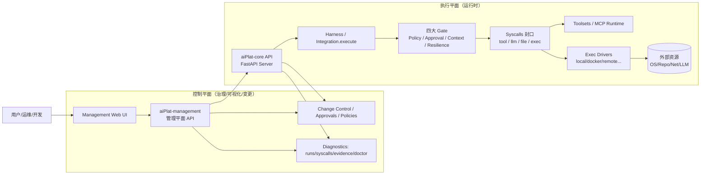
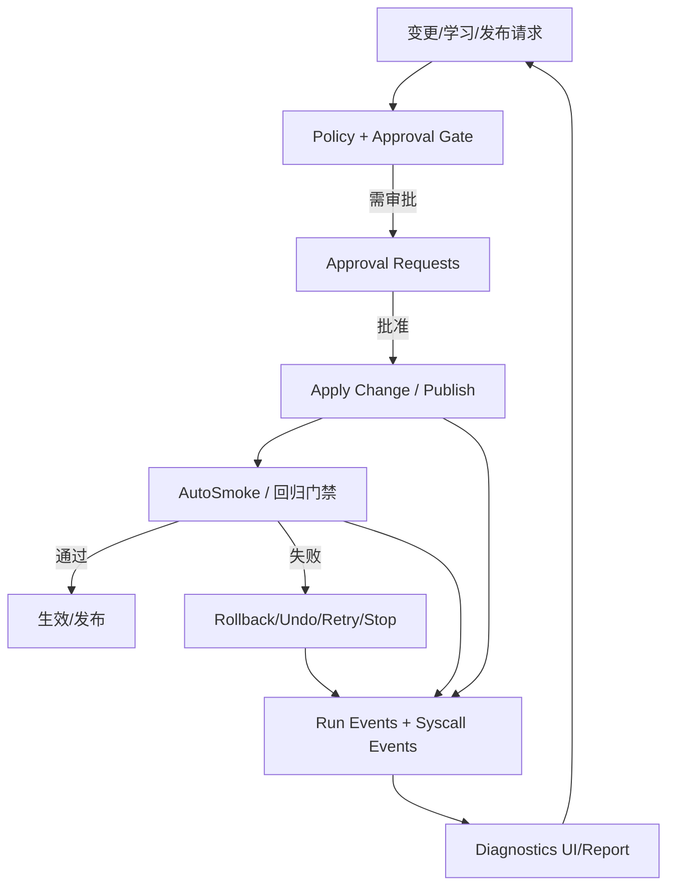

# 现有系统架构对照：aiPlat vs Hermes vs Claude Code vs OpenClaw

> 目标：用同一套维度对照四套系统的“控制平面 / 执行平面 / 治理与可观测性 / 扩展机制”，判断 aiPlat（你当前系统）相较开源标杆是否已形成明显改进。

---

## 0. 一句话定位

- **aiPlat（当前）**：偏“企业级平台化 Agent Runtime + 可治理的管理平面”，强调 **不可绕过的 syscalls、审批/回滚、可观测性、可运营的资源库（engine/workspace）**。
- **Hermes**：偏“个人/团队的自我进化 Agent + 多入口（CLI/IM）+ 多执行后端”，强调 **内建 learning loop、跨会话记忆、Gateway 多渠道**。
- **Claude Code**：偏“IDE/终端/CI 的 agentic coding 工具”，强调 **工具权限、插件与 MCP、会话管理与压缩**。
- **OpenClaw**：偏“自托管个人助手的 Gateway 控制平面”，强调 **多渠道接入、节点/设备生态、WebSocket/RPC、配置与安全边界**。

---

## 1) aiPlat（你当前系统）架构图（As‑Is）

### 1.1 高层（控制平面 vs 执行平面）



### 1.2 核心闭环（“可治理 + 可恢复 + 可观测”）



**你这版 aiPlat 已具备（从最近的优化落地可以直接看到的能力）**：
- 初始化向导（Onboarding）+ 报告导出（聚合 state/doctor/approvals/evidence）
- run 维度的 **/stop(cancel) /retry /undo**（并落 run_events）
- Exec backend：健康 + 切换入口（带审批）+ 后端维度 metrics（success_rate/latency/policy_denied_count）
- Prompt 模板：版本体系 + diff/rollback + **发布/灰度语义（pin/rollout/rollback + 解析 resolve）**
- 学习产物强制落 **workspace scope**（避免 engine 被污染，形成“内核稳定、外部可演进”的边界）

---

## 2) Hermes 架构图（抽象）

```mermaid
flowchart LR
  User --> Entry[CLI / Gateway(多渠道) / ACP]
  Entry --> AgentLoop[AIAgent Core Loop]
  AgentLoop --> Prompt[Prompt Build + Cache + Compression]
  AgentLoop --> Tools[Tools Runtime + Toolsets]
  Tools --> Term[Terminal Backends<br/>local/docker/ssh/daytona/modal...]
  AgentLoop --> Memory[SQLite Session/State + Search]
  AgentLoop --> Skills[Skills System + 自我进化 Learning Loop]
  AgentLoop --> Providers[LLM Providers Resolver]
  Entry --> Cron[Cron Scheduler]
```

Hermes 的“标志性差异”在于：**内建 learning loop + 多入口（尤其 gateway 多平台）+ 多终端后端**（更像“随处可用的个人助理/研究代理”）。

---

## 3) Claude Code 架构图（抽象）

```mermaid
flowchart TB
  User --> CLI[claude CLI / IDE / GitHub Actions]
  CLI --> Session[Session Manager<br/>~/.claude/sessions + transcript.jsonl]
  CLI --> Agent[Main Agent + Subagents(Task)]
  Agent --> Tools[Tool Execution Engine]
  Tools --> Perm[Permission Layer<br/>rules + interactive approval]
  Tools --> Sandbox[Linux Sandbox / seccomp]
  Tools --> MCP[MCP Server Manager]
  Tools --> Plugins[Plugins + Hooks + Skills]
  Agent --> Compact[Auto-compaction (/compact)]
```

Claude Code 的重心：**“编码工作流”**（git/worktree、工具权限、插件/MCP、会话管理/压缩）。

---

## 4) OpenClaw 架构图（抽象）

```mermaid
flowchart LR
  User --> Channels[多渠道入口<br/>WhatsApp/Telegram/Slack/...]
  User --> UI[Control UI / WebChat]
  User --> CLI[openclaw CLI]

  Channels --> GW[Gateway Control Plane<br/>HTTP + WebSocket/RPC]
  UI --> GW
  CLI --> GW

  GW --> Sessions[Sessions/State]
  GW --> AgentRT[Agent Runtime (Pi embedded runner)]
  AgentRT --> Tools[Tools + Tool Policies]
  Tools --> Sandbox[Sandbox Context / Exec & BG Processes]
  AgentRT --> Skills[Skills/Plugins]
  AgentRT --> Models[Model Providers + Auth/Fallback]
```

OpenClaw 的“标志性差异”在于：**把 Gateway 作为强控制平面**（多渠道/多设备/多节点/强配置体系），Agent Runtime 嵌入其后。

---

## 5) 对照表（关键维度）

| 维度 | aiPlat（当前） | Hermes | Claude Code | OpenClaw |
|---|---|---|---|---|
| 核心定位 | 平台化 Agent Runtime + 管理平面 | 自我进化 agent + 多入口 | 终端/IDE/CI coding agent | 自托管多渠道 Gateway 助理 |
| 控制平面 | **Management Web + API**（跨层） | Gateway + CLI | CLI/IDE + 企业 settings | **Gateway（WS/RPC）+ Control UI** |
| 执行入口 | API（runs/skills/tools/agents） | CLI、IM、ACP | CLI、IDE、GitHub | 多渠道、WebChat、CLI |
| 执行隔离/封口 | **syscalls 封口 + gates**（policy/approval/…） | 工具/终端后端隔离（多模式） | sandbox + seccomp + permissions | sandbox context + tool policy |
| 治理（审批/回滚） | **一等能力（approval + undo/retry/stop + 发布灰度）** | 有 /undo /retry /stop（更偏交互） | 强权限与审批规则 | pairing/DM policy + tool policy（偏安全接入） |
| 可观测性 | **run_events + syscall_events + doctor + report** | insights/usage + session DB | session + hooks + analytics | gateway/agent 日志 + UI 诊断 |
| Prompt 发布/灰度 | **pin/rollout/resolve + 回滚** | 以技能/人格/配置为主 | compaction + plugins/skills | 以配置/技能注入为主 |
| 扩展机制 | Skills/Agents/MCP + engine/workspace 双域 | Skills + MCP + toolsets | Plugins + MCP + hooks + skills | Plugins/Skills + channels |
| 多渠道 | （当前更偏平台 UI/API） | **强（多 IM + gateway）** | 较弱（偏终端/IDE） | **强（多 IM + web UI）** |

---

## 6) 结论：你们系统“是否已经有很大改进？”

### 6.1 相比三者共同“短板区”，aiPlat 的明显增强点

1. **治理闭环更工程化**：你们把 *审批/回滚/重试/停止*、*发布灰度*、*自动回归门禁* 做成了平台一等能力，并且贯穿 UI/API/落库事件。  
2. **可观测性更系统化**：run/syscall 事件化 + 报告导出 + exec backend metrics，使“排障/审计/运营”成本显著低于单纯 CLI agent。  
3. **Engine vs Workspace 的边界更清晰**：把“内核稳定”与“外部可演进”强隔离（学习产物落 workspace），比很多开源工具更接近生产平台形态。  

### 6.2 仍可能落后/不覆盖的方向（不是问题，只是定位差异）

- 若你的目标是“个人助理随处可用”，Hermes/OpenClaw 的 **多渠道 gateway**、设备/节点生态会更成熟。  
- 若你的目标是“开发者日常终端工具”，Claude Code 的 **IDE/终端交互细节、插件生态、worktree 工作流**更专注。  

### 6.3 建议你用来验证“改进幅度”的三条验收问题（可直接对标）

1. **一次高风险变更（切 exec backend / 发布 prompt 灰度）能否做到：审批→回归→可回滚→全链路可追溯？**（aiPlat 已覆盖）  
2. **一次失败任务能否做到：定位到具体 syscall / policy_denied 原因，并可一键 retry/stop？**（aiPlat 已覆盖）  
3. **学习/演进产物是否能保证“不污染内核 + 可回滚 + 可审计”？**（aiPlat 已覆盖关键边界）  

---

## Sources

- Hermes Agent 仓库与官方架构文档：  
  - https://github.com/NousResearch/hermes-agent  
  - https://hermes-agent.nousresearch.com/docs/developer-guide/architecture
- Claude Code 仓库与 DeepWiki 架构页：  
  - https://github.com/anthropics/claude-code  
  - https://deepwiki.com/anthropics/claude-code/1.1-system-architecture
- OpenClaw 仓库、官方 onboarding/架构说明与 DeepWiki：  
  - https://github.com/openclaw/openclaw  
  - https://docs.openclaw.ai/start/wizard  
  - https://deepwiki.com/openclaw/openclaw

