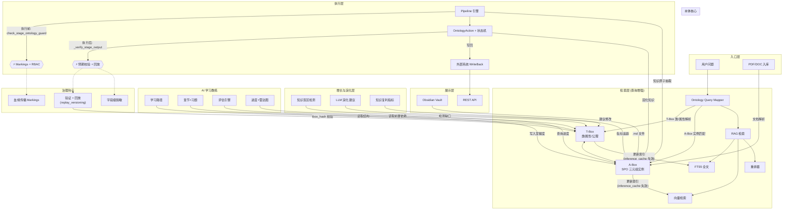

# aiPlatform 知识库本体系统 — 架构总览

> 版本: v2.1 | 更新: 2026-06-15

## 系统架构图

## 层次职责

| 层次 | 职责 | 核心模块 |
|------|------|------|
| **入口层** | 用户输入、文档入库 | — |
| **检索层** | 本体查询映射 → 多路检索 → 重排 | `ontology_query_mapper.py`, `hybrid_retriever.py`, `wiki_context.py` |
| **本体核心** | T-Box 类/属性/公理, A-Box SPO 三元组 | `knowledge_ontology.py`, `knowledge_abox_builder.py`, `wiki_engine.py` |
| **执行层** | Pipeline 编排, Action 执行, 写回 | `pipeline_engine.py`, `knowledge_action.py`, `knowledge_writeback.py` |
| **治理钩子** | 安全过滤、验证、脱敏（纵向注入） | `policy_gate.py`, `verification.py`, `field_level_security.py` |
| **增长与演化** | 盲区检测、LLM 建议、增长指标 | `knowledge_quality.py`, `knowledge_growth.py`, `knowledge_evolution_llm.py` |
| **AI 学习教练** | 三条内置路径、评估引擎、双向本体连接 | `learning_ontology.py`, `learning_paths.py`, `learning_assessment.py` |
| **展示层** | Obsidian Vault, REST API | — |

## 关键闭环

| 闭环 | 路径 | 状态 |
|------|------|:---:|
| **入库→检索** | PDF → chunk → embed → FTS5/Vector | ✅ |
| **检索→盲区** | query → match → gap_detection → prompt | ✅ |
| **执行→本体** | Pipeline → OntologyAction → A-Box | ✅ (Phase 1) |
| **本体→安全** | A-Box → Markings propagation → access_check | ✅ (Phase 2) |
| **演化→索引** | write_page → invalidate cache → reindex | ✅ (修正 2) |
| **教练→本体** | complete_chapter → mastery triples → A-Box | ✅ (修正 3) |
| **回放→版本** | tbox_hash → stale_check → skip_or_compare | ✅ (修正 4) |
| **查询→映射** | question → T-Box match → rewritten_query | ✅ (修正 1) |

## 已知待观察项

| 项 | 说明 |
|------|------|
| KB 路径安全入口不一致 | `sys_knowledge_retrieve` 未透传 `actor_scopes` 到 KB 子路径，详见 Issue #TBD |
| Wiki/KB 分数未归一化 | 余弦相似度与 RRF+BM25 混排，不同量纲直接比较 |
