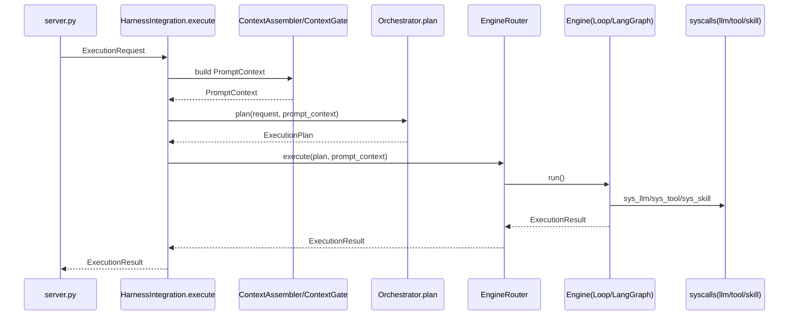

# 00｜总体架构设计：Harness Kernel + Orchestrator User-space

状态：草案（Phase 1~3 已部分对齐实现；Phase 4+ 待落地）  
更新时间：2026-04-16

## 1. 背景与目标

### 1.1 背景
- 当前 `aiPlat-core` 的执行路径存在“入口分散/执行分散”的风险：server、agent、loop、graph、tool/skill 等可能形成多个事实入口。
- 需要吸收 `rangen_core` 的优点（多路径、多引擎、强上下文/Prompt、强治理、反馈自学），但避免其常见工程债（多入口、多套 registry、治理可绕过）。

### 1.2 北极星约束（必须写死）
- 唯一执行入口：`HarnessIntegration.execute(request)`
- 系统调用封口：`sys_llm.generate / sys_tool.call / sys_skill.call`
- 四大 Gate 必经：Policy/Trace/Context/Resilience
- Orchestrator 只产出 plan，不直接执行副作用（不得调用 tool/llm/skill）

### 1.3 当前未落地的原因（简述）

> 这部分用于解释“为何文档的 To‑Be 尚未完全落地”，并给出最小可行落地路径，避免改造陷入“概念完备但无法验收”。

未落地主要集中在 Phase 4~6：
- **Prompt/Context 收敛（Phase 4）**：需要把现有 Loop/Graph 中分散的 prompt 拼装逻辑统一迁移，且要引入 prompt_version 与回放兼容策略；属于“高行为风险改造”，不适合与 Phase 1~3（P0）混在一起上线。
- **多引擎 Router/Orchestrator（Phase 5）**：需要新增 Engine 接口与路由层，并明确 fallback 轨迹落库字段与解释性；当前仓库以 Loop-first 为主运行态，Router 仍为 To‑Be。
- **自学闭环（Phase 6）**：依赖稳定的 ExecutionPlan/PromptContext/指标口径与 evaluation pipeline；需在 Phase 4/5 的契约与落库字段冻结后推进。

## 2. As-Is 现状（代码映射）

> 目标：用 1 张图 + 1 张表描述当前的“可执行主链路”与“潜在分叉点”。

### 2.1 关键入口与组件（As-Is）
- `core/server.py`：FastAPI 入口、初始化 registries/managers、trace 与 execution_store 注入
- `core/apps/agents/*`：Agent 实现（ReAct/PlanExecute/…）
- `core/harness/execution/loop.py`：ReActLoop/PlanExecuteLoop
- `core/harness/execution/langgraph/*`：LangGraph graphs/nodes/callbacks
- `core/apps/tools/*`：BaseTool、ToolRegistry、PermissionManager、recaller
- `core/apps/skills/*`：SkillRegistry、SkillExecutor
- `core/services/*`：ExecutionStore、TraceService、ContextService、PromptService
- `core/harness/integration.py`：Kernel 单入口 execute（Phase 1 已落地）
- `core/harness/syscalls/*`：sys_llm/sys_tool/sys_skill（Phase 2 已落地）
- `core/harness/infrastructure/gates/*`：四大 Gate（Phase 3 已落地：Context/Resilience 为最小实现）

### 2.2 分叉风险点（待填）
- 入口层面：哪些 HTTP handler/manager 直接调用了 agent.execute/loop.run/graph.run？
- 执行层面：哪些地方存在直接 adapter.generate / tool.execute / skill.execute？

As-Is（已扫描发现的代表性绕过点，冻结前需清零）：
- `core/apps/agents/plan_execute.py`：直接 `_model.generate(...)`、`tool.execute(...)`
- `core/apps/agents/rag.py`：直接 `_model.generate(...)`
- `core/apps/agents/conversational.py`：直接 `_model.generate(...)`
- `core/apps/mcp/server.py`：直接 `tool.execute(arguments)`

验收口径与扫描命令见：`02-syscalls-and-gates.md` / 6.2

## 3. To-Be 架构分层（Kernel / User-space）

### 3.1 Kernel（Harness）职责边界
- syscall 入口：execute + 3 类 syscalls
- 调度：EngineRouter + 多引擎适配（Loop/LangGraph/未来 AgentLoop）
- 治理：四大 Gate 强制装配
- 资源管理：ContextAssembler/PromptAssembler（预算、压缩、模板版本、输出契约）
- 观测与回放：Trace + ExecutionStore + checkpoints

### 3.2 User-space（Orchestrator）职责边界
- 计划生成：ExecutionPlan（Quick/Reasoning/Parallel/Hybrid/…）
- 路径选择与动态调整：但只能通过 Kernel 接口生效（不直接执行副作用）

## 4. 运行时主链路（To-Be）

## 5. 目录与模块落点（To-Be 映射）

> 待评审冻结：新增目录是否放在 `core/harness/kernel/*` 还是 `core/harness/*` 顶层。

- 新增：
  - `core/harness/kernel/types.py`
  - `core/harness/syscalls/*`
  - `core/harness/infrastructure/gates/*`
  - `core/harness/assembly/*`
  - `core/harness/execution/engines/*` + `core/harness/execution/router.py`
  - `core/orchestration/*`
- 修改：
  - `core/server.py`：执行类路由收敛到 integration.execute
  - `core/harness/execution/loop.py`：LLM/Tool/Skill 调用改走 syscalls；prompt 拼装改走 PromptAssembler

### 5.1 当前已落地（As-Is）与缺口（Gap）

已落地（可对齐到代码）：
- 单入口：`core/harness/integration.py::HarnessIntegration.execute`
- syscalls：`core/harness/syscalls/{llm,tool,skill}.py`
- gates：`core/harness/infrastructure/gates/*`
- 审批/审计/恢复执行（Phase 3.5）：
  - ExecutionStore：`approval_requests`、`syscall_events`、`approval_request_id` 关联索引
  - API：`/approvals/*`、`/agents/executions/{execution_id}/resume`

仍未落地（Phase 4+）：
- `core/harness/assembly/*`（ContextAssembler/PromptAssembler）
- `core/harness/execution/engines/*` + `router.py`
- `core/orchestration/*`
- evaluation/feedback/evolution pipeline

### 5.2 最小落地路径（建议）

> 目标：让后续 Phase 4/5 也能像 Phase 1~3 一样“可独立上线、可回滚、可验收”。

建议拆成两步：
1) Phase 4（Prompt/Context 收敛）先只做“**不改策略的收敛**”
   - PromptAssembler 仅复用现有 prompt 拼装逻辑，但把生成过程集中到 Kernel 层，并写入 `prompt_version`
   - ContextAssembler 先只做“预算计算与裁剪日志”，不改变实际内容（灰度开关）
2) Phase 5（Router/Orchestrator）先只做“**plan 产生 + explain 落库**”
   - 初期 plan 固定为 Loop-first（不引入实际路由变化），只保证 plan/explain/fallback_trace 字段落库
   - 第二阶段再启用真正 Router 与 fallback 链（graph→loop→quick）

## 6. 关键取舍（Decision Log）

### 6.1 为什么 Orchestrator 不放进 Kernel（语义上）
- Kernel 应稳定、可证明、可审计；Orchestrator 需要高频迭代、灰度、快速回滚。
- Orchestrator 纳入 Kernel 管控：通过 integration 调用 + 禁止绕过 syscalls + CI 规则确保治理必经。

### 6.2 为什么 Loop-first 为主引擎
- As-Is Loop 链路更成熟可控，利于先实现“治理必经”与一致性。
- LangGraph 作为高上限插件引擎，由 plan 选择进入；失败可 fallback 至 Loop。

## 7. 风险与缓解（高优先级）
- 行为漂移：Phase 1-3 只做入口/封口/观测，不改策略；Phase 4 起引入 prompt/context 收敛并加回归基线。
- 分叉回归：CI 静态规则 + syscall 封口 + server 单入口。
- 性能回归：Gate/syscall 必须轻量；重操作异步化/分级。

## 8. 本文待确认清单（Review Checklist）
- [ ] 北极星约束是否完整且可执行？
- [ ] To‑Be 分层是否满足“治理不可绕过”？
- [ ] 目录落点与依赖方向是否清晰？
- [ ] 风险点与缓解是否覆盖主要场景？

## 9. 冻结前置条件（强约束）

> 满足以下条件后，00/01/02/04/05 才适合进入“冻结”状态。

1) Phase 2：静态扫描清零（禁止绕过 syscalls）
2) CI/Hook 落地：pre-commit + CI job 与本地扫描口径一致
3) Phase 3：可执行指标口径落地（至少能从 ExecutionStore 统计 trace_id/落库覆盖率）
4) Phase 4/5：契约（PromptContext/ExecutionPlan）与落库字段冻结后，再推进更高级编排与自学闭环
