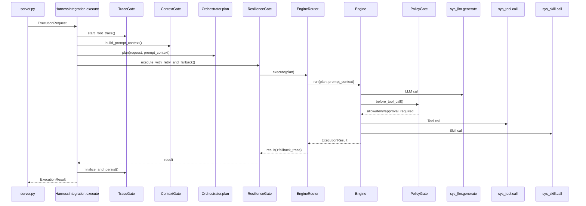

# 02｜Syscalls 与 Gates 设计（Kernel Runtime）

状态：草案（Phase 2/3 已部分对齐实现；待补齐 CI 后可冻结“不可绕过”机制）  
更新时间：2026-04-16

---

## 0. 现状对齐（As-Is vs To-Be）

> 本节用于把“设计目标”与“当前实现”对齐，避免文档验收口径与代码现实不一致。

已实现（As-Is）：
- `core/harness/syscalls/{llm,tool,skill}.py` 已落地，并在 Loop/LangGraph nodes/SkillExecutor/HarnessIntegration 的关键路径接入
- `core/harness/infrastructure/gates/*` 已落地并接入 syscalls（Policy/Trace/Context/Resilience，Context/Resilience 当前为最小实现）
- PolicyGate 已支持：
  - RBAC（PermissionManager）
  - 审批（ApprovalManager，含 approval_request_id）
  - resume 语义（通过 `_approval_request_id` 校验已批准后放行）

未实现/仍需补齐（To-Be，作为冻结前置条件）：
- **不可绕过 CI 静态扫描**（pre-commit + CI job）尚未落地：目前仓库仍存在绕过点（agents 与 MCP server）
- Orchestrator / EngineRouter / PromptContext/ExecutionPlan 等 Phase 4+ 模块未落地（见 03/05 文档）

## 1. 目标

1) 通过 syscalls 统一封口 LLM/Tool/Skill 的所有副作用执行入口  
2) 通过四大 Gate（Policy/Trace/Context/Resilience）保证治理能力不可绕过  
3) 明确执行时序：Integration → Gates → Engine → Syscalls → Result

---

## 2. 代码落点（To-Be）

### 2.1 syscalls
- `core/harness/syscalls/llm.py`
- `core/harness/syscalls/tool.py`
- `core/harness/syscalls/skill.py`

### 2.2 gates
- `core/harness/infrastructure/gates/policy_gate.py`
- `core/harness/infrastructure/gates/trace_gate.py`
- `core/harness/infrastructure/gates/context_gate.py`
- `core/harness/infrastructure/gates/resilience_gate.py`

### 2.3 接入点（强制）
- `core/harness/integration.py::HarnessIntegration.execute`
- `core/harness/execution/loop.py`：LLM/Tool/Skill 调用必须走 syscalls
- `core/harness/execution/langgraph/nodes/*`：LLM/Tool 调用必须走 syscalls
- `core/apps/skills/executor.py`：Skill 执行必须走 sys_skill
- `core/harness/integration.py::_execute_tool`：Tool API 执行必须走 sys_tool

---

## 3. 执行时序（To-Be）



---

## 4. syscalls 设计细节

### 4.1 sys_llm.generate
职责：
- 统一创建 span、记录 token_usage、统一超时与重试（可选）
- 统一输出结构：content + tool_calls（结构化）+ raw
- 输出必须携带 `trace_context`/`model_params` 的审计信息（落库）

不可绕过保证：
- 引擎（Loop/Graph）不持有 adapter 实例，或 adapter 只对 sys_llm 可见
- CI 扫描禁止 `create_adapter().generate()` 在非 sys_llm 中出现

### 4.2 sys_tool.call
职责：
- PolicyGate（权限+审批）必经
- TraceGate span 必经
- ResilienceGate（重试/回退/超时）必经
- 统一将调用记录写入 ExecutionStore（ToolCallRecord）

不可绕过保证：
- 禁止在 Engine/Agent 层直接 `tool.execute`
- ToolRegistry 只提供“句柄”，但实际执行入口在 sys_tool

### 4.3 sys_skill.call
职责：
- TraceGate span
- 超时与重试（视 skill 类型配置）
- 记录 SkillCallRecord

---

## 5. Gates 设计细节

### 5.1 PolicyGate（权限+审批）
依赖：
- `core/apps/tools/permission.py::PermissionManager`
- `core/harness/infrastructure/approval/*::ApprovalManager`

输入：
- ToolCall（含 tool_name、args、user_id、session_id）

输出：
- `ALLOW | DENY | APPROVAL_REQUIRED`
- 若 `APPROVAL_REQUIRED`：返回可恢复执行所需的 “恢复 token / checkpoint 引用”

落库：
- policy decision、命中规则、审批状态、决策人/系统版本

### 5.2 TraceGate（全链路追踪）
依赖：
- `core/services/trace_service.py::TraceService`
- `core/services/execution_store.py::ExecutionStore`

职责：
- 生成 root trace_id/run_id
- 为每个 syscall 创建 span
- 持久化执行摘要与步骤记录（含 plan、prompt_version、fallback 轨迹）

### 5.3 ContextGate（预算+压缩）
依赖：
- `core/services/context_service.py`
- `core/harness/context/loader.py`（文件上下文渐进加载）

职责：
- 统一 token budget 策略（compact_threshold）
- 对 messages/artifacts 做压缩与裁剪
- 输出 PromptContext（后续 prompt 拼装必须只用它）

### 5.4 ResilienceGate（重试/回退）
依赖：
- `core/harness/execution/retry.py`、`policy.py`（可复用）

职责：
- 统一 retry：对 tool/llm/engine step
- 统一 fallback：graph → loop → quick
- 记录 fallback 轨迹、失败原因链

---

## 6. CI/Hook 规则草案（不可绕过）

> 目标：把“不可绕过”从约定变成**可验证**。
>
> 说明：目前仓库缺少 `.pre-commit-config.yaml` 与 `.github/workflows/*`，因此下面给出：
> 1) **可本地执行的验收命令（rg 扫描）**  
> 2) **建议的 allowlist/denylist**  
> 3) **冻结前置条件**（CI 落地）

### 6.1 静态扫描验收口径（建议冻结口径）

总体规则：在“执行链路层”（server/agents/loops/graphs/orchestration/mcp server）禁止绕过 syscalls：
- 禁止 `tool.execute(`（除：工具实现本身 `core/apps/tools/**` 与 sys_tool 本体）
- 禁止 `skill.execute(`（除：skill 实现本身与 sys_skill 本体）
- 禁止 `adapter.generate(` / `model.generate(`（除：adapter 实现与 sys_llm 本体）

### 6.2 本地验收命令（可直接复制执行）

> 说明：以下命令以 ripgrep（`rg`）为例；如 CI 环境不含 rg，可用同等 grep/AST 工具替代，但验收口径需一致。

#### A) 禁止非允许目录直接 tool.execute
```bash
rg -n "\\btool\\.execute\\(" core -g'*.py' \
  --glob '!core/harness/syscalls/**' \
  --glob '!core/apps/tools/**' \
  --glob '!core/tests/**'
```

#### B) 禁止非允许目录直接 skill.execute
```bash
rg -n "\\bskill\\.execute\\(" core -g'*.py' \
  --glob '!core/harness/syscalls/**' \
  --glob '!core/apps/skills/**' \
  --glob '!core/tests/**'
```

#### C) 禁止非允许目录直接 *.generate（LLM 调用）
```bash
rg -n "\\.generate\\(" core -g'*.py' \
  --glob '!core/harness/syscalls/**' \
  --glob '!core/adapters/**' \
  --glob '!core/management/adapter_manager.py' \
  --glob '!core/tests/**'
```

冻结前置条件（必须达成）：
- 上述三类扫描在主分支下输出为空（或仅包含显式豁免的“示例/实验目录”）

### 6.3 当前已知绕过点（需在冻结前清零）

截至 2026-04-16，已知存在（示例）：
- `core/apps/agents/plan_execute.py`：直接 `_model.generate(...)`、`tool.execute(...)`
- `core/apps/agents/rag.py`：直接 `_model.generate(...)`
- `core/apps/agents/conversational.py`：直接 `_model.generate(...)`
- `core/apps/mcp/server.py`：直接 `tool.execute(arguments)`

处理建议：
- 将上述调用改为 `sys_llm_generate/sys_tool_call`（并注入 user_id/session_id/trace_context）
- 或将这些模块迁移到 `examples/` 并在扫描中显式豁免（不建议，除非明确不参与主链路）

### 6.4 pre-commit + CI 落地点（建议）

1) 本地：`pre-commit` hook 在提交前执行上面的 rg 扫描（失败则阻断提交）  
2) CI：workflow job 重复执行同样扫描（失败则阻断合入）

1) server 层禁止直接执行：
- 禁止 `agent.execute(`、`loop.run(`、`graph.run(`、`tool.execute(`、`adapter.generate(`

2) orchestration 层禁止副作用：
- 禁止 `tool.execute(`、`adapter.generate(`、`skill.execute(`

3) engines 层禁止绕过 syscalls：
- 禁止 `tool.execute(`、`adapter.generate(`、`skill.execute(`

---

## 7. 评审检查清单

- [ ] syscalls 的输入输出结构是否足以承载审计/回放？
- [ ] Gate 的接入点是否“结构上不可绕过”？
- [ ] approval_required 的恢复执行是否定义清晰（哪怕 Phase 1 先同步阻塞）？
- [ ] fallback 链与记录字段是否完整？
