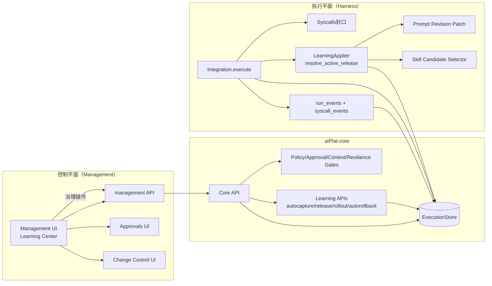
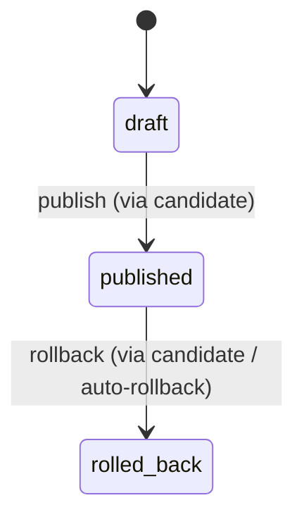
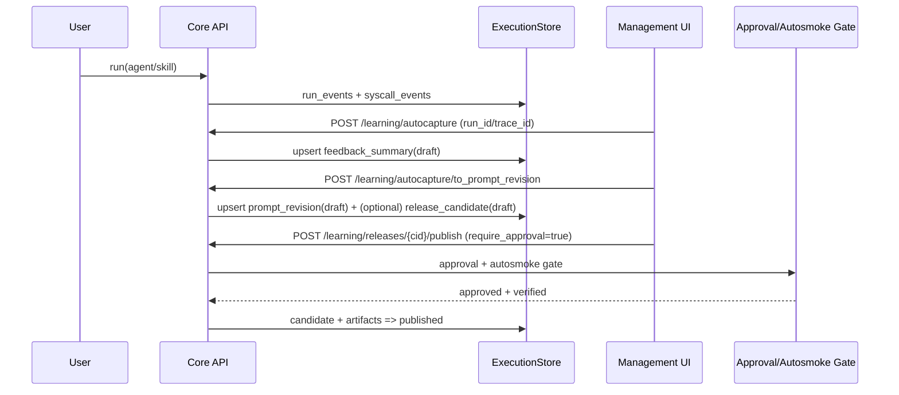
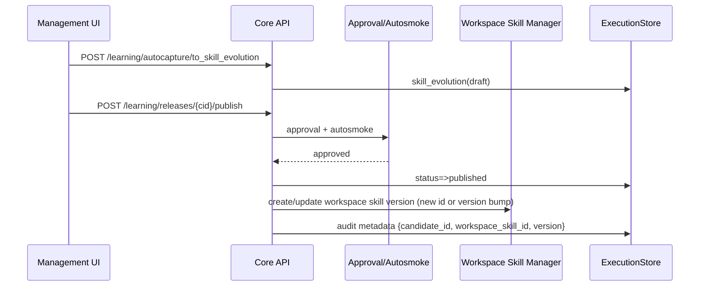
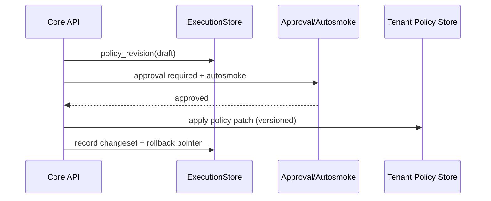

# aiPlat 自进化（Self‑Evolution）闭环：可落地实现级方案（Skills + Prompts + Tool/Policy）

> 面向对象：平台/架构/后端/前端/运维  
> 目标：把“自进化”从开源项目常见的“黑盒自学习”升级为 **可治理、可审计、可灰度、可回滚、可观测** 的工程闭环，并与你们现有的 **Gates / Approvals / Change Control / ExecBackends / Prompt 发布灰度** 体系打通。

---

## 0. 术语与设计原则

### 0.1 术语

- **Artifact（学习产物）**：从一次或多次执行中抽取出的“可审阅的改进建议/证据”。只是一条记录（JSON + 元数据），**默认不改变线上行为**。
- **Release Candidate（发布候选）**：把一组 artifacts 打包成一次“可发布”的变更集；发布/回滚仅做状态迁移与绑定关系（**仍然不直接执行工具**）。
- **Active Release（生效发布）**：运行时解析出来的“当前对某个 target 生效的候选发布”。由 `LearningApplier` 在执行时解析并附着到执行上下文/trace。
- **Rollout（灰度）**：在 tenant 维度为某个 target 选择 candidate 的策略（百分比/白名单/黑名单等）。

### 0.2 设计原则（关键：与 Hermes/OpenClaw 区分）

1. **闭环必须“可回滚”**：任何自进化产物都必须能被撤回到之前状态，并且可解释原因。
2. **闭环必须“可审计”**：所有关键动作（创建候选、发布、灰度、回滚）都有 changeset/audit log、run/syscall 证据链接。
3. **行为变化必须“走 Gate”**：自进化可以生成建议，但“上线生效”必须通过 policy/approval/autosmoke 等 gate。
4. **Engine vs Workspace 强边界**：学习产物默认落在 workspace scope（必要时自动 fork engine target），避免污染内核。

---

## 1. 当前 As‑Is 资产盘点（你们已经具备的“闭环骨架”）

你们的代码库里其实已经有较完整的 Phase6 学习子系统骨架，核心包括：

### 1.1 数据层（ExecutionStore）

- `learning_artifacts` 表：用于保存 artifacts（kind/target/version/status/payload/metadata + trace/run 链接）
- `release_rollouts` 表：tenant 维度 rollout（candidate_id + 规则）
- `release_metric_snapshots` 表：candidate 指标快照（用于回归监控/自动回滚）

（对应实现集中在 `core/services/execution_store.py`）

### 1.2 核心模块（core/learning）

- `LearningManager`：创建/更新 artifact 状态（当前是 persistence helper，但足够作为“闭环状态机 API”使用）
- `pipeline.py`：把 benchmark/feedback/evolution 等结果转换为 artifacts（纯函数/无副作用）
- `release.py`：candidate 发布/回滚审批规则（learning:publish_release / learning:rollback_release）
- `apply.py (LearningApplier)`：运行时解析 active release，并能合并 prompt_revision patch（含 strict/priority/exclusive_group）
- `autorollback.py`：离线自动回滚（按回归指标 + 审批 + 证据链接）

### 1.3 HTTP API（core/server.py）

已存在并可直接作为 management 平面能力的核心 API：

- Artifacts
  - `GET  /learning/artifacts`
  - `GET  /learning/artifacts/{artifact_id}`
  - `POST /learning/artifacts/{artifact_id}/status`
- AutoCapture（从一次执行提炼可审阅建议）
  - `POST /learning/autocapture`
  - `POST /learning/autocapture/to_prompt_revision`
  - `POST /learning/autocapture/to_skill_evolution`
- Releases（发布候选）
  - `POST /learning/releases/{candidate_id}/publish`（支持审批 + autosmoke gate + rollout 写入）
  - `POST /learning/releases/{candidate_id}/rollback`（支持审批 + gate）
- Rollouts / Metrics / AutoRollback
  - `GET/PUT/DELETE /learning/rollouts`
  - `POST/GET /learning/releases/{candidate_id}/metrics/snapshots`
  - `POST /learning/auto-rollback/regression`
  - `POST /learning/approvals/cleanup-rollback-approvals`

> 结论：你们不是“从 0 到 1”补自进化，而是要把现有骨架补齐为 **产品级闭环**（UI、指标、运行时挂接、策略与默认值、验收口径）。

---

## 2. To‑Be 总体架构（控制平面 vs 执行平面）

---

## 3. 闭环对象与“最小可用”能力定义（MVP→增强）

你选择“全部纳入”（Skills + Prompt + Tool/Policy）。建议按 **“先易后难”** 做三条闭环，但底座统一复用 artifacts + candidate + rollout：

### 3.1 Prompt 自进化（优先级最高、风险可控）

**为什么先做**：对线上行为影响可局部化（只改提示词/patch），更容易灰度与回滚。

**MVP（你们几乎已经具备）**
1. autocapture → feedback_summary
2. feedback_summary → prompt_revision（draft）
3. prompt_revision + candidate（draft）
4. publish candidate（审批 + autosmoke gate）
5. LearningApplier 在 runtime 解析 candidate，并把 patch 合并进 PromptAssembler

**增强**
- 优先级/互斥组（你们已在 `resolve_prompt_revision_patch` 支持 priority/exclusive_group）
- strict 模式：冲突时只选最高优先级（你们已支持 env 开关）
- 运行时写入 span/syscall：prompt_version 覆盖率（你们 pipeline 已有 `prompt_version_coverage` 指标）

### 3.2 Skill 自进化（中等难度，收益大）

**目标**：从多次失败/反馈中生成 skill_evolution（比如补齐工具编排、错误处理、参数校验），并以候选发布形式上线。

**建议的“产品化策略”**
- skill_evolution artifact **只存“差异/补丁/新版本候选”**，不直接写入 skill 文件
- 发布时由“Applier/Publisher”把候选写成 workspace skill 新版本（需要审批 + 回归）
- 运行时按 rollout 选择 skill 的 active version（类似 prompt resolve）

**落地步骤**
1. autocapture/to_skill_evolution 生成草案（draft）
2. 人工审阅（diff view）→ 生成 release_candidate
3. publish 后：写 workspace skill 新版本（或 workspace 新 skill），并记录 lineage（forked_from + candidate_id）
4. 运行时：skill 调用时附带 active_release 元信息（用于可追溯）

### 3.3 Tool/Policy 自进化（难度最高，必须“建议化”）

这里强烈建议只做“建议 + 审批 + 回归后应用”，默认不自动放开：

- policy_revision artifact：建议新增 allowlist/降低限制/增加审批规则
- 发布时通过 Change Control + Policy Gate 应用到 tenant policy（并可回滚）

**关键原则**
1. 自动生成的 policy 变更 **必须 require_approval=true**
2. 必须强制 autosmoke 通过才可发布
3. 必须提供一键回滚到上一个 policy 版本

---

## 4. 数据模型（建议最终冻结口径）

### 4.1 learning_artifacts（已存在，建议补齐约束）

字段建议（你们表已覆盖核心字段；这里补充“必须/建议”的语义约束）：

- `artifact_id`（PK）
- `kind`：evaluation_report / regression_report / feedback_summary / prompt_revision / skill_evolution / policy_revision / release_candidate
- `target_type`：agent / skill / prompt / policy
- `target_id`
- `version`：建议约定格式：
  - feedback_summary：`auto:<ts>`
  - prompt_revision：`pr:<ts>` 或 `pr:<candidate_id>:<n>`
  - skill_evolution：`se:<ts>`
  - release_candidate：`rc:<ts>` 或业务语义版本
- `status`：draft / published / rolled_back（你们当前 enum 够用；也允许扩展自定义状态字符串）
- 链接字段：`trace_id` / `run_id`
- `payload_json` / `metadata_json`
- `created_at`

**建议新增（或作为 metadata 强制字段）**
- `metadata.scope`: workspace/engine（用于 UI 分组与策略）
- `metadata.created_by`: actor_id
- `metadata.change_id`: 关联 change_control
- `metadata.approval_request_id`
- `metadata.evidence`: {run_ids, trace_ids, syscall_event_ids}

### 4.2 release_rollouts（已存在）

建议支持三类 rollout 模式：
- `all`：全量生效
- `percentage`：按 actor_id（或 session_id）hash 分桶
- `include/exclude`：白名单/黑名单

你们 `LearningApplier.resolve_active_release` 已支持 tenant + actor_id 的 bucket 逻辑，属于可用状态。

### 4.3 release_metric_snapshots（已存在）

建议 metric_key 最少标准化：
- `success_rate`
- `error_rate`
- `avg_duration_ms`
- `policy_denied_count`（或拒绝率）
- `avg_tokens`（可选）

并记录 window_start/window_end，方便做回归窗口比较。

---

## 5. 状态机与关键流程（可直接按此实现 UI/后台任务）

### 5.1 Artifact 状态机（统一）

### 5.2 Prompt 自进化流程（建议默认开启）

### 5.3 Skill 自进化流程（建议先做“半自动发布”）

核心差异：publish 后多一步“生成 workspace skill 新版本”（仍受审批+门禁保护）。

> 注：你们当前 publish API 对 skill 的治理 metadata 已有 best-effort 写入；下一步就是把“skill_evolution → workspace skill 版本”做成明确的、可验收的动作。

### 5.4 Policy 自进化流程（只建议、强审批）

---

## 6. 运行时挂接点（让“发布”真正影响执行，但仍可控）

### 6.1 统一：执行上下文附着 active_release

目标：每次执行都能回答“我用的是哪个 candidate/哪个版本”。

建议在 `Integration.execute` 入口：
1. `LearningApplier.resolve_active_release(target_type,target_id)`
2. 把结果写入：
   - `run_start.payload.active_release`
   - trace span attributes（若你们有 tracing）
3. Prompt/Skill/Policy 在各自 assembler/gate 中读取该 active_release

### 6.2 Prompt：把 prompt_revision patch 合并进 PromptAssembler

你们已有 `LearningApplier.resolve_prompt_revision_patch`，下一步是定义“合并策略契约”：
- prepend → system prompt 前置（或 template header）
- append → system prompt 末尾（或 tool instructions 末尾）
- conflicts → 必须在 UI 明示，并支持 strict 模式

### 6.3 Skill：active_release 影响“skill 版本选择”

建议两条路（先简单后复杂）：

**方案 A（简单，先做）**  
发布 candidate 时生成新的 workspace skill（新 skill_id），然后让 orchestrator/agent prompt 选择新 skill_id（通过 prompt_revision patch 引导）。

**方案 B（正统，后做）**  
skill 支持 versioning：skill_id 不变，运行时按 active_release 选择 `skill_version`（需要 skill registry 支持版本索引与 fallback）。

### 6.4 Policy：active_release 影响 Gate 决策

policy_revision 发布后进入 tenant policy store（版本化），Gate 在评估时读取该版本（并写入 policy_denied 的可解释原因）。

---

## 7. Management UI（必须补齐的“产品化差距”）

建议新增一个顶层模块：**Learning Center**，至少包含 5 个页面：

1) **Artifacts 列表**
- 过滤：target_type/target_id/kind/status/run_id/trace_id
- 行内：summary + created_at + linked evidence
- 操作：查看详情、生成候选、加入 candidate、标记状态

2) **Artifact 详情**
- JSON 可视化（payload/metadata）
- evidence drill-down：跳转 Runs/Syscalls
- 对 prompt_revision/skill_evolution 提供 diff 视图（patch diff / skill 文件 diff）

3) **Release Candidates**
- candidate 列表 + candidate 详情（包含 artifact_ids）
- 操作：publish/rollback（显示审批状态与 change-control 链接）

4) **Rollouts（灰度配置）**
- tenant 维度：target_type/target_id → candidate + mode + percentage + include/exclude
- 操作：启用/停用/删除

5) **Metrics & Auto‑Rollback**
- candidate 指标快照图表（error_rate/success_rate/latency）
- 一键触发：`POST /learning/auto-rollback/regression`（支持 dry_run）
- 自动回滚的审批清理：`cleanup-rollback-approvals`

> 这些页面都可以直接基于 core 已存在 API 做 management 代理与前端实现（工作量可控、收益巨大）。

---

## 8. 后台任务（Cron/Jobs）建议

把“持续评估与回归”做成自动化，才能形成真正自进化：

### 8.1 周期性指标快照
- 周期：每 10min / 1h（可配置）
- 输入：candidate_id + window
- 输出：写 `release_metric_snapshots`

### 8.2 自动回滚守护
- 条件：error_rate 上升超过阈值、latency 上升超过阈值、policy_denied 激增等
- 动作：调用 auto_rollback_regression（require_approval 可按风险策略决定）
- 结果：生成 regression_report artifact + changeset +（可选）自动创建 rollback approval

---

## 9. 安全与治理（强制规则）

1. **任何“应用到线上”的动作必须有 change_id**  
publish/rollback/release rollout/policy apply 都应写 changeset & audit log。

2. **默认 require_approval=true（可配置）**  
尤其是 policy/tool 相关。

3. **autosmoke_enforce 开关打开时：未 verified 的 target 不允许 publish**  
你们 publish_release_candidate 已集成 gate（并会生成 change-control 引导）。

4. **workspace scope 强制**  
所有 autocapture / to_prompt_revision / to_skill_evolution 已调用 `_ensure_workspace_target`（你们已落地）。后续 skill 发布也必须确保写 workspace。

---

## 10. 验收清单（可自动化）

### 10.1 Prompt 自进化验收
- [ ] 从某 run_id 生成 feedback_summary artifact，artifact 可关联到 syscall_events（数量一致/可追溯）
- [ ] feedback_summary → prompt_revision（含 patch）并可创建 release_candidate
- [ ] publish candidate：若未审批返回 approval_required；审批通过后状态变 published
- [ ] runtime 解析 active_release：run_start 事件包含 candidate_id/version
- [ ] 灰度有效：同一 actor_id 稳定命中同一 candidate（hash 稳定）
- [ ] rollback candidate 后：解析回到上一个 candidate / 或 none

### 10.2 Skill 自进化验收
- [ ] 生成 skill_evolution artifact（含 diff/新版本候选信息）
- [ ] publish 后在 workspace 生成新 skill（或新版本），并记录 lineage（forked_from + candidate_id）
- [ ] 执行时可观测：run_start/trace 可看到使用的 skill 版本或 candidate
- [ ] rollback 能恢复到前一版本（或旧 skill）

### 10.3 Policy 自进化验收
- [ ] policy_revision 只能 draft（默认）→ 审批 → 发布应用（版本化）
- [ ] Gate 能解释 policy_denied 原因并落 syscall/run 事件
- [ ] 一键回滚到上一 policy 版本

---

## 11. 实施路线图（建议 2~4 周）

### Week 1：Learning Center（只做可视化 + 手动闭环）
1. management 代理 learning APIs
2. 前端：Artifacts/ReleaseCandidates/Rollouts/Metrics 页面
3. 将 prompt_revision 的 diff/冲突可视化出来

### Week 2：运行时挂接（Prompt 先打通）
1. Integration.execute 附着 active_release（run_start + trace）
2. PromptAssembler 合并 prompt_revision patch（严格/非严格两模式）
3. 指标快照：把 success_rate/latency/policy_denied 统一口径

### Week 3：Skill 发布自动化（半自动→自动）
1. publish candidate 后生成 workspace skill 新版本（可审计）
2. UI 增加 skill diff + 回滚按钮

### Week 4：Auto‑Rollback 守护上线
1. 定时写 metric snapshots
2. 回归检测触发 rollback（可选自动创建审批）
3. 回滚审批清理与噪音治理

---

## 12. 与 Hermes / Claude Code / OpenClaw 的“吸收点”映射（你要的“吸收”落地方式）

- Hermes 的 learning loop：**吸收“闭环形态”**，但上线必须通过你们的 Gate/审批/回滚/审计体系（Hermes 往往更偏个人助理，治理弱）
- Claude Code 的权限/插件/MCP：**吸收“扩展生态”**，但你们更进一步：把变更纳入 Change Control 与灰度发布
- OpenClaw 的 Gateway control plane：**吸收“多入口/多渠道”**的控制面思想，但你们的优势是“执行平面不可绕过 + 平台治理”

---

## 13. 下一步我可以直接帮你做什么

你如果确认要继续推进落地，我建议下一步我直接在仓库里做：

1) management 代理 learning APIs（/learning/artifacts /releases /rollouts /metrics /autorollback）  
2) 前端新增 Learning Center 页面（最小 3 页：Artifacts / Releases / Rollouts+Metrics）  
3) 把 prompt_revision patch 实际接到 PromptAssembler（让发布真正改变运行时行为）  

只要你回复：**“先做 1+2”** 或 **“直接做 1+2+3”**，我就可以按你们现有代码风格继续实现。

