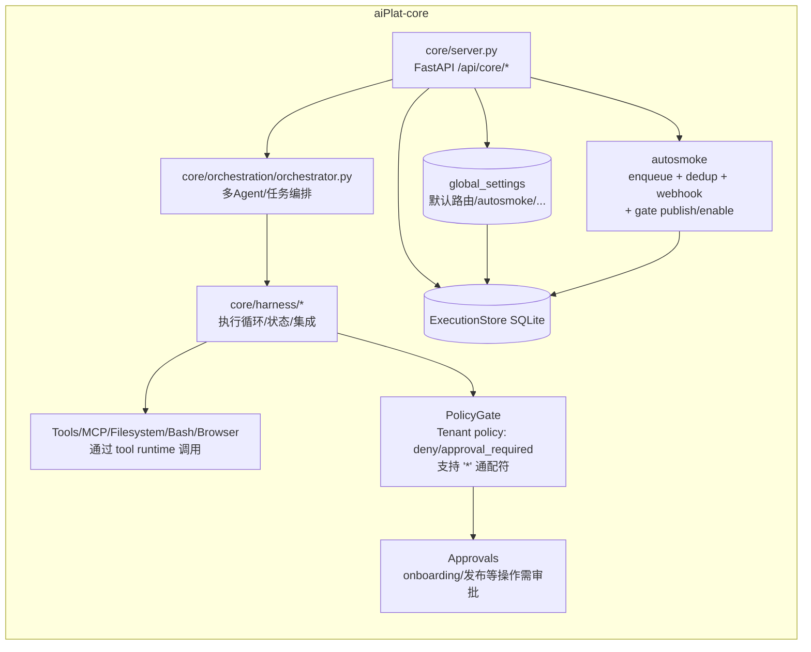
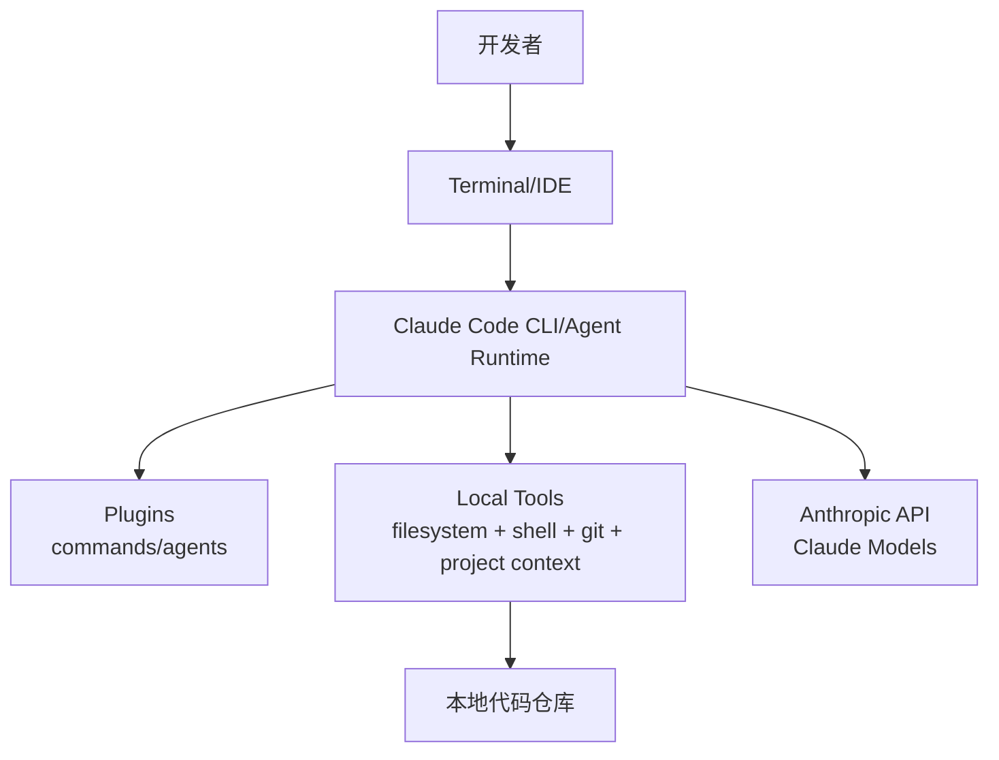

# aiPlat（现有系统） vs Hermes vs Claude Code vs OpenClaw ——架构对照图（基于代码/仓库分析）

> 说明：  
> - **aiPlat** 部分基于本仓库代码与 `aiPlat-management/docs/*` 设计/实现现状整理。  
> - **Hermes / Claude Code / OpenClaw** 部分基于对应开源仓库 README/目录结构的高层归纳（非逐文件深挖到每个模块的类图级别）。  
> - 图使用 Mermaid（便于后续迭代/粘贴到文档站或 PR 里）。

---

## 0. 术语对齐（便于读图）

- **控制面（Control Plane）**：管理/配置/审批/诊断/观测、策略下发、发布流程编排等。
- **数据面（Data Plane）**：实际执行推理/工具调用/任务调度/对外服务的运行时。
- **Agent Runtime**：Agent loop + tool runtime + memory + skills + 任务调度。
- **Policy/Gate**：权限/门禁/审批策略（如 tool allow/deny/approval）。

---

## 1) 你的现有系统架构（aiPlat，按代码整理）

### 1.1 四层 + 管理面总览

```mermaid
flowchart TB
  U[用户/运维/开发] -->|Browser| FE[aiPlat-management Frontend (Vite/React)]
  FE -->|HTTP| MGMT[aiPlat-management API (FastAPI, :8000)]

  subgraph layers[四层业务/运行时分层]
    INFRA[aiPlat-infra (FastAPI, :8001)\n节点/服务/存储/网络/调度/监控]
    CORE[aiPlat-core (FastAPI, :8xxx)\nAgent Runtime/Harness/Skills/MCP/Memory/Policies/Approvals]
    PLATFORM[aiPlat-platform\nRBAC/tenants/registry/gateway/governance/quotas]
    APP[aiPlat-app\nChannels/CLI/Agent client/Events bus]
  end

  MGMT -->|HTTP转发/聚合| INFRA
  MGMT -->|HTTP转发/聚合| CORE
  MGMT -->|HTTP转发/聚合| PLATFORM
  MGMT -->|HTTP转发/聚合| APP

  subgraph stores[主要存储（按代码）]
    ES[(core: ExecutionStore SQLite\nexecutions/approvals/global_settings/...)]
    INFDB[(infra: storage/config db\n实现可为 sqlite/其他)]
    PLATDB[(platform: storage/tenants/audit/...)]
    APPDB[(app: sqlite\nsessions/messages/...)]
  end

  CORE --- ES
  INFRA --- INFDB
  PLATFORM --- PLATDB
  APP --- APPDB
```

### 1.2 aiPlat-core 内部（Agent Runtime + 门禁/审批/验证闭环）



### 1.3 aiPlat-management（诊断即修复）

```mermaid
flowchart TB
  FE[Management UI] -->|GET /api/diagnostics/doctor| MGMT[Management API]
  MGMT -->|聚合 health/adapter/policy/secrets/autosmoke| CORE[Core API]
  MGMT -->|doctor 输出 actions + input_schema| FE
  FE -->|点击 action (需审批)\n轮询 approvals->auto retry| MGMT
  MGMT -->|转调 onboarding/*| CORE
```

**从“产品形态”看 aiPlat：**
- 你现在不是单纯做一个 CLI agent，而是做一个**可运维的 agent 平台**：分层（infra/core/platform/app）+ 管理面 + 审批/策略/门禁 + 诊断闭环（Doctor→Action）。

---

## 2) Hermes（NousResearch/hermes-agent）架构图（对照）

> Hermes 更像“强 agent runtime + 多入口网关 + 内建学习闭环”的一体化产品。

```mermaid
flowchart TB
  U[用户] --> CLI[Hermes CLI/TUI]
  U --> MSG[Messaging Channels\nTelegram/Discord/Slack/WhatsApp/...]
  MSG --> GW[Hermes Gateway\n(统一消息入口)]
  CLI --> Agent[Agent Loop\nplanner/executor/memory/skills]
  GW --> Agent

  Agent --> Models[LLM Providers\nOpenAI/OpenRouter/本地...]
  Agent --> Toolsets[Toolsets\nfile/git/web/browser/terminal...]
  Toolsets --> TermBackends[Terminal Backends\nlocal/Docker/SSH/Daytona/Modal/...]

  Agent --> Cron[内建 Cron/Scheduler]
  Agent --> Store[(本地持久化\nconfig/skills/memory/session索引等)]
```

**相对 aiPlat 的关键差异：**
- Hermes 把“入口（CLI+多聊天平台）+ runtime + cron + 工具后端”做成**单套产品进程/生态**；  
- aiPlat 则更强调 **“平台分层 + 运维控制面（management）+ 门禁/审批 + 可治理发布”**。

---

## 3) Claude Code（anthropics/claude-code）架构图（对照）

> Claude Code 更像“面向软件工程的终端/IDE agent”，核心是 **coding workflow**（读写文件、运行命令、git、插件扩展）。



**相对 aiPlat 的关键差异：**
- Claude Code 是**单机开发工具**（围绕本地 repo），默认不提供你这种“多层平台运维/infra 管理/多租户策略/发布门禁”的平台化结构；
- 但它在 **IDE/插件生态、命令行开发体验** 上更聚焦、更成熟。

---

## 4) OpenClaw（openclaw/openclaw）架构图（对照）

> OpenClaw 更像“个人常驻助理（always-on）”，核心是 **Gateway daemon + 多渠道接入 + 技能/插件 + agent runtime**。

```mermaid
flowchart TB
  User[用户] --> Channels[多渠道\nWhatsApp/Telegram/Slack/Discord/...]
  Channels --> Gateway[OpenClaw Gateway Daemon\n(控制面/消息入口)]
  User --> UI[Web UI/Canvas]
  UI --> Gateway

  Gateway --> Agent[Agent Runtime]
  Agent --> Skills[Skills/Extensions]
  Agent --> Models[LLM Providers/Auth Profiles]
  Agent --> Sandbox[Sandbox/Exec\n(本地/容器/受控执行)]
  Gateway --> Store[(本地持久化\n配置/记忆/技能/配对信息等)]
```

**相对 aiPlat 的关键差异：**
- OpenClaw 是“个人助理产品”取向：渠道覆盖极广、常驻 daemon、配对/安全默认值；  
- aiPlat 是“平台/企业运维”取向：infra+core+platform+app 分层、管理面聚合、审批治理与发布门禁、可观测与诊断闭环。

---

## 5) 横向对照（更能体现“各自特点”的维度）

你提到的点很关键：如果维度选得不对，表格会把四个东西“抹平”。  
这里我把对照拆成两套：**对外卖点版** + **技术实现版**（更符合“都需要”的使用场景）。

### 5.1 一句话抓住每个系统的“标志性能力”

- **aiPlat（你）**：平台化分层（infra/core/platform/app） + 管理控制面（management）+ **治理闭环**（Policy/Approvals/Doctor→Action）+ **发布/启用门禁**（autosmoke）。
- **Hermes**：强 agent runtime + 多入口（CLI/TUI + Messaging Gateway）+ **自我改进/技能生长** + 多种终端后端（local/Docker/SSH/…）。
- **Claude Code**：围绕软件工程的“本地 repo agent”——**终端/IDE 内的 coding workflow** + plugin 扩展。
- **OpenClaw**：个人常驻助理——**always-on Gateway daemon + 超多渠道** + 配对/安全默认 + UI/Canvas。

### 5.2 对外卖点版（产品视角）

| 维度（卖点） | aiPlat（你） | Hermes | Claude Code | OpenClaw |
|---|---|---|---|---|
| 主要使用场景 | 企业/团队：可运维、可治理的 agent 平台 | 个人/团队：多端入口+自动化+学习闭环 | 开发者：写代码/改代码/跑命令/提 PR | 个人：常驻助理 + 全渠道触达 |
| “入口体验”主轴 | Web 管理台（+ API） | CLI/TUI + 多聊天平台 | 终端/IDE（本地项目上下文） | daemon 常驻 + 多聊天平台 + UI |
| 最独特卖点（可一句话讲清） | **诊断即修复（Doctor→Action）+ 审批/策略/门禁 + autosmoke gate** | **闭环学习 + 技能自生长 + 多终端后端** | **coding workflow 最强（repo-aware + plugins）** | **渠道覆盖/常驻体验最强（assistant as a service on your devices）** |

### 5.3 技术实现版（你选的重点：执行面/工具、记忆/学习、渠道/生态）

> 备注：你提到的“**core 作为 Agent Runtime 服务；management 为控制面**”本身就是 aiPlat 的目标形态之一。  
> 下表中 aiPlat 这一列按“当前代码已具备 + 未来目标方向”综合描述。

#### A) 执行面 / 工具运行时 / 沙箱与后端

| 维度（执行面） | aiPlat（你） | Hermes | Claude Code | OpenClaw |
|---|---|---|---|---|
| 运行时形态 | core 作为 Agent Runtime 服务；management 为控制面 | 单体 runtime 为主（agent + gateway + toolsets） | 本地 CLI/IDE agent | gateway daemon + agent runtime |
| 工具系统抽象 | Tool runtime（Filesystem/Bash/Browser/MCP…）+ PolicyGate | toolsets + 多 terminal backend | 本地 filesystem/shell/git 为核心 | skills/extensions + sandbox/exec |
| 执行安全/门禁 | PolicyGate（deny/approval_required，支持 `*`）+ approvals + doctor 可回滚 | allowlist/approval（以交互为主） | 交互确认/安全限制（围绕开发环境） | pairing/权限/安全默认（面向个人设备） |
| “发布/启用门禁” | **autosmoke 驱动 gate（publish/enable 前必须验证通过）** | 以任务/cron 自动化为主 | 无“发布门禁”概念（偏本地 workflow） | 更偏“常驻可用”，不强调发布门禁 |

#### B) 记忆 / 学习 / 自我改进机制

| 维度（记忆/学习） | aiPlat（你） | Hermes | Claude Code | OpenClaw |
|---|---|---|---|---|
| 记忆形态 | core 内：会话/长期记忆/知识库（可运维） | 强调 memory + user modeling + 技能自改进 | 以项目上下文与对话为主 | 个人助理取向的长期数据/配置 |
| 学习闭环 | 你的闭环更偏“工程治理”：Doctor→Action、autosmoke、审计/审批 | **内建学习 loop**（技能从经验生成并自我改进） | 更偏“工具化协作”，不强调自学习 | 强调持续运行与用户体验，不强调自学习 |

#### C) 渠道 / 生态 / 扩展面

| 维度（渠道/生态） | aiPlat（你） | Hermes | Claude Code | OpenClaw |
|---|---|---|---|---|
| 渠道入口 | management Web +（未来可扩展 app/channels） | CLI + Messaging Gateway | Terminal/IDE + GitHub 集成 | **超多 IM 渠道 + daemon** |
| 扩展机制 | engine vs workspace（内容来源/权限边界）+ MCP/skills/agents | skills 系统 + MCP + 多 backends | plugins（commands/agents） | skills/extensions + plugin/runtime（大型生态） |
| 运维可视化 | **management（Dashboard/Doctor/Policies/Onboarding…）** | CLI/TUI + insights/doctor | 主要在终端/IDE 内 | UI + doctor + onboard 向导 |

### 5.4 每个维度：是否建议吸收其他平台的优点（建议清单）

下面按“你最关心的维度”逐项给出：**是否值得吸收**、**向谁学**、以及 **落地方式**。  
（建议优先级：P0=建议尽快做；P1=值得做；P2=可选。）

#### A) 执行面 / 工具运行时

| 子维度 | 是否建议吸收 | 向谁学 | 建议吸收点（具体到实现） | 优先级 |
|---|---|---|---|---|
| 多执行后端（local/SSH/Docker/远程沙箱） | 建议吸收 | Hermes / OpenClaw | 把“工具执行后端”抽象成可插拔 Driver（local/docker/ssh/remote-sandbox），并在 management 提供后端健康检查与切换；减少 core 对单一执行环境的耦合。 | P1 |
| IDE/Repo-aware 开发体验 | 建议吸收 | Claude Code | 增加“repo context”能力：工作区索引（.gitignore-aware）、快速 diff/patch、git workflow 原语（branch/commit/PR）；最好通过 toolset 统一封装而不是散落在 agent prompt。 | P0 |
| 命令审批的人机交互（快速 approve/undo/retry） | 部分吸收 | Hermes / Claude Code | 你已经有 approvals + Doctor→Action；可再吸收 CLI 的“/undo /retry /stop”交互模型，把“可逆操作/回滚”做成一等能力（尤其是写文件/执行命令/发布）。 | P1 |

#### B) 记忆 / 学习 / 自我改进

| 子维度 | 是否建议吸收 | 向谁学 | 建议吸收点（具体到实现） | 优先级 |
|---|---|---|---|---|
| Skills 的“自生长/自我改进”闭环 | 建议吸收（但需治理） | Hermes | 把学习闭环纳入你的治理体系：技能生成/更新必须进入 workspace scope，并通过 policy/approvals 审核；同时做离线评估（自动用 autosmoke/回归测试验证）。 | P1 |
| 用户画像/长期偏好建模 | 可选吸收 | Hermes / OpenClaw | 如果你的目标是企业/团队平台，用户画像优先级不如“项目画像/组织策略”；可先做“组织级默认策略 + 项目级偏好”，避免把个人化做太重。 | P2 |
| 会话/记忆的可检索与压缩 | 建议吸收 | Hermes | 你已有 ExecutionStore/会话概念；建议补齐：全文检索（FTS）+ 压缩摘要策略 + 可视化回溯，作为 Doctor 的数据来源之一。 | P1 |

#### C) 渠道 / 生态 / 扩展机制

| 子维度 | 是否建议吸收 | 向谁学 | 建议吸收点（具体到实现） | 优先级 |
|---|---|---|---|---|
| 多入口（CLI/TUI + Messaging Gateway） | 建议吸收（选其一先做强） | Hermes / OpenClaw | aiPlat 已有 management Web；建议增加一个“运维 CLI”（面向 admin/devops），用同一套 approvals/doctor/actions；消息网关可后做，避免一开始渠道过宽。 | P1 |
| 插件/扩展标准化 | 建议吸收 | Claude Code / OpenClaw / Hermes | 你已有 engine vs workspace + MCP；建议补齐“插件元数据规范”（版本/依赖/权限声明/测试声明）并在 UI 提供安装/升级/回滚。 | P0 |
| Onboarding Wizard（从 0 到可用的一键流程） | 建议吸收 | OpenClaw | 你已有 Onboarding 页面，但可学习 OpenClaw 的“onboard”体验：按步骤检测依赖→配置→验证→daemon/运行；并把每一步都用 Doctor→Action 自动修复。 | P0 |

### 5.5 补齐你关心但之前缺失的维度：上下文管理 / Agent / Skill / 提示词管理

> 之前没有展开这四个维度，是因为前一轮你选择的重点是“执行面/工具、记忆/学习、渠道/生态”。  
> 但对于一个 agent 平台，这四项其实是“内核差异”的关键维度，应该补齐。

#### A) 上下文管理（Context Assembly / Budget / 注入防护）

| 子维度 | aiPlat（你） | Hermes | Claude Code | OpenClaw |
|---|---|---|---|---|
| 项目上下文文件 | core 有 ContextEngine：读取 `AGENTS.md / AIPLAT.md` 并注入 system 层；带基础注入检测/截断 | 有“workspace instructions/AGENTS.md”等概念（偏产品化） | 典型是 repo instructions（如 CLAUDE.md/.claude 体系），强调对代码库的持续上下文 | 有 SOUL/记忆/频道上下文 + onboarding 引导 |
| 上下文分层 | 已出现“stable/ephemeral overlay”概念（project_context / session_search） | 强调压缩/insights/跨会话回忆 | 更偏“开发任务上下文”（repo-aware） | 更偏“个人长期上下文”（always-on） |
| 上下文安全 | ContextEngine 有 prompt injection/exfiltration pattern 检测；支持阻断/审批策略（Roadmap） | 产品层面常见 allowlist/审批 + 记忆治理 | 主要靠交互确认/安全策略（开发环境） | pairing/安全默认 + 渠道安全 |
| Token budgeting/压缩 | 目前主要是“可扩展点”（ContextEngine should_compact/compact） | 体系更成熟（/compress、insights 等） | 更偏工程对话优化（开发效率） | 有，但不以“token 预算”为主对外卖点 |

#### B) Agent 体系（Agent 规格、生命周期、编排/子代理）

| 子维度 | aiPlat（你） | Hermes | Claude Code | OpenClaw |
|---|---|---|---|---|
| Agent 规格表达 | `AGENT.md`（带 front matter），engine/workspace 双 scope | profiles/personality/skills 组合（产品化） | 内建 agent + plugins/commands | agent + skills/extensions（偏产品化） |
| 生命周期运维 | core 提供 agents CRUD/start/stop；management 做控制面 | CLI 侧更强（交互与多入口） | CLI/IDE 内工作流强，但偏本地单体 | daemon 常驻，生命周期更像“服务” |
| 子代理/并行 | core orchestration 支持多 agent 编排（目标形态） | 强调 subagents/并行工作流 | 插件能模拟多 agent，但不以此为核心叙事 | 可有多 agent 模式，但重点在渠道与常驻 |

#### C) Skill 体系（包管理/版本/权限/测试/可观测）

| 子维度 | aiPlat（你） | Hermes | Claude Code | OpenClaw |
|---|---|---|---|---|
| Skill 的“规格文件” | `SKILL.md` + front matter（input_schema/output_schema/版本/状态）+ engine/workspace | skills 目录 + 自生成/自改进（学习闭环） | plugins（commands/agents）本质是“可扩展能力”，不叫 skill | skills/extensions + 大生态 |
| 版本与回滚 | 有版本字段/写回（管理面可运维）；未来可与 autosmoke 联动 | 自改进能力强，但治理要小心 | plugin 版本化（依赖 npm/发布） | 生态大，版本/渠道发布机制明显 |
| 权限声明/沙箱 | 你有 PolicyGate（工具层）与 approvals，但“skill 级权限声明”可更强 | 工具/后端多样，安全策略很关键 | 主要是本地开发者权限域 | 通过 daemon/pairing/权限默认控制 |
| 测试/验证闭环 | **你有 autosmoke，非常适合做 skill/agent 的回归验证门禁** | 有轨迹/评估/训练工具链 | 更偏“让开发工作更快” | 更多是“可用性/稳定性” |

#### D) 提示词管理（Prompt/Instruction 版本化、组装、审计）

| 子维度 | aiPlat（你） | Hermes | Claude Code | OpenClaw |
|---|---|---|---|---|
| Prompt 管理机制 | 有 `PromptService`（模板/变量/版本号），但当前更偏“库能力”；与 Agent/Skill/Context 的统一组装还在演进 | personalities/skills/记忆深度融合 | repo instructions + 插件命令（更工程化） | persona（SOUL）+ 常驻习惯 |
| Prompt 组装链路 | ContextEngine 提供“上下文层注入”；Prompt 组装可进一步产品化为“Prompt Assembler” | 压缩/insights/经验注入更成熟 | 重点是代码上下文与命令执行链 | 重点是渠道与常驻体验 |
| 审计与变更治理 | 你有 approvals/doctor/audit 的基础设施，适合把 prompt 变更纳入审批与回滚 | 更偏产品内的经验/技能变更 | 插件/命令更新的工程流程 | 更新渠道/daemon 版本控制 |

### 5.6 针对这四个维度：是否需要吸收其他平台的优点（建议）

| 维度 | 是否建议吸收 | 吸收对象 | 建议吸收点 | 优先级 |
|---|---|---|---|---|
| 上下文管理 | 建议吸收 | Claude Code / Hermes | **Claude Code** 的“repo-aware context 管理”（文件索引、变更集、diff 驱动上下文）；**Hermes** 的“压缩/回忆/检索注入”产品化交互。 | P0 |
| Agent 体系 | 部分吸收 | Hermes / OpenClaw | 吸收“profiles/personality/场景预设”的表达（Hermes/OpenClaw），但在 aiPlat 内要落到 engine/workspace scope + policy/approvals 体系里。 | P1 |
| Skill 体系 | 建议吸收 | Hermes / Claude Code / OpenClaw | 吸收 **Hermes** 的技能自生长，但必须加“治理闸门”（审批 + autosmoke 回归）；吸收 **Claude Code/OpenClaw** 的插件分发与生态机制（包/依赖/版本/升级）。 | P0 |
| 提示词管理 | 建议吸收 | Claude Code / Hermes | 把 PromptService 从“库能力”升级成“平台能力”：prompt 版本、diff、审批、回滚、灰度（可先从 skills/agents 的模板化开始）；并把上下文组装（ContextEngine）与 prompt 渲染统一到一条可观测链路。 | P0 |

---

## 5.7 全量亮点维度对照矩阵（不再按重点筛选）

> 目标：把四个系统的“亮点/强项”全部摊开对照，避免因为选维度而“抹平差异”。  
> 注：表内 aiPlat 列兼顾“当前代码已具备 + 明确目标形态（core=runtime，management=控制面）”。

### 5.7.1 产品/入口/运行形态

| 维度 | aiPlat（你） | Hermes | Claude Code | OpenClaw |
|---|---|---|---|---|
| 产品定位 | 平台化 Agent 系统（分层+运维+治理） | 自我改进 agent（多入口） | 终端/IDE coding agent | 个人常驻助理（全渠道） |
| 核心入口 | Web 管理台 + API | CLI/TUI + Messaging Gateway | Terminal/IDE + plugins | Gateway daemon + UI/Canvas + 多 IM |
| 运行形态 | **控制面/数据面分离**：management ↔ core/infra/platform/app | 单体生态（agent+gateway+toolsets） | 单机工具（围绕 repo） | daemon 常驻（gateway 为中心） |
| 典型用户 | 企业/团队运维/研发 | 个人/小团队 power user | 开发者 | 个人用户/多设备 |

### 5.7.2 安全/治理/可运维闭环（亮点）

| 维度 | aiPlat（你） | Hermes | Claude Code | OpenClaw |
|---|---|---|---|---|
| 权限/门禁 | **Tenant policy + PolicyGate**（deny/approval_required + `*`） | allowlist/审批（产品交互） | 本地安全限制+确认 | pairing/权限默认（个人设备） |
| 审批系统 | **Approvals 一等公民**（Onboarding/策略/迁移/门禁…） | 有审批交互 | 有交互确认 | 有配对/确认/权限域 |
| 诊断闭环 | **Doctor→Actions→审批轮询→自动重试** | doctor/insights | 偏 troubleshooting/插件 | doctor + onboard 向导 |
| 发布/启用门禁 | **autosmoke gate（验证通过才能 publish/enable）** | 任务/cron 自动化 | 不强调发布门禁 | 不强调发布门禁 |
| 审计/追踪 | ExecutionStore + syscall events（方向正确） | 有日志/insights | 以 dev workflow 为主 | daemon 侧日志/健康 |

### 5.7.3 执行/工具/沙箱

| 维度 | aiPlat（你） | Hermes | Claude Code | OpenClaw |
|---|---|---|---|---|
| 工具抽象 | tool runtime + MCP + policy gate | toolsets | filesystem/shell/git + plugins | skills/extensions + sandbox |
| 终端/执行后端 | 当前偏本机/受控执行（可继续抽象） | **多后端**（local/docker/ssh/daytona/modal） | 本机 shell 为主 | 本机/容器/daemon 控制 |
| 代码变更工作流 | 已具备（apply_patch/builder/审计）但可更工程化 | 有（但不专注于 code） | **最强项**（repo-aware + plugins） | 非核心叙事 |

### 5.7.4 上下文管理（Context）/提示词（Prompt）

| 维度 | aiPlat（你） | Hermes | Claude Code | OpenClaw |
|---|---|---|---|---|
| 项目上下文 | ContextEngine 注入 `AGENTS.md/AIPLAT.md` + 注入检测 | workspace instructions/AGENTS | repo instructions（.claude/CLAUDE.md 等） | persona/频道上下文 |
| 分层/组装 | stable/ephemeral overlay（project + session_search） | /compress/insights 等产品化 | 以 repo 变更集为中心 | always-on 长期上下文 |
| Prompt 管理 | PromptService（模板/变量/版本）→待平台化 | personality/skills/记忆融合 | 插件命令+指令体系 | SOUL/persona + 习惯 |

### 5.7.5 Agent 体系（规格/编排/生命周期）

| 维度 | aiPlat（你） | Hermes | Claude Code | OpenClaw |
|---|---|---|---|---|
| Agent 规格 | `AGENT.md`（engine/workspace 双 scope） | profiles/personality | 内建 agent + plugins | agent + extensions |
| 编排/并行 | core orchestration（目标形态） | subagents 并行（亮点） | 插件化多流程 | 重点不在并行编排 |
| 运维/生命周期 | agents CRUD/start/stop（服务化） | CLI/TUI 强交互 | 本地流程强 | daemon 常驻 |

### 5.7.6 Skills/插件生态（分发/依赖/回滚）

| 维度 | aiPlat（你） | Hermes | Claude Code | OpenClaw |
|---|---|---|---|---|
| Skill 规格 | `SKILL.md` + schema + scope | skills 自生成/自改进 | plugins（commands/agents） | skills/extensions（大生态） |
| 分发与依赖 | 已有包/安装测试雏形（可强化） | skills hub/生态 | 插件目录/工程发布 | 多渠道/多平台发布 |
| 回滚/验证 | **autosmoke 非常适合做回归门禁** | 轨迹/评估/训练工具链 | 工程化发布流程 | 渠道发布/daemon 版本 |

---

## 5.8 全量维度：是否需要吸收其他平台优点（总表）

| 维度 | 是否建议吸收 | 主要学习对象 | 吸收点（落地建议） | 优先级 |
|---|---|---|---|---|
| 开发者工作流（repo-aware） | 建议吸收 | Claude Code | 把 diff/patch、git primitives、repo 索引与上下文策略做成 core 的一等 toolset，并纳入审批/审计。 | P0 |
| 多执行后端/远程沙箱 | 建议吸收 | Hermes / OpenClaw | 抽象 Exec Driver（local/docker/ssh/remote），management 提供健康检查与路由选择。 | P1 |
| 自生长技能（学习闭环） | 建议吸收（强治理） | Hermes | 学习产物必须落在 workspace scope；审批+autosmoke 回归+版本回滚。 | P1 |
| 全渠道/常驻体验 | 可选吸收 | OpenClaw | 先做运维 CLI，再逐步引入 Messaging Gateway（避免渠道过宽导致运维成本飙升）。 | P2 |
| Onboarding Wizard 产品化 | 建议吸收 | OpenClaw | 把“从 0 到可用”拆成可检测/可修复步骤，每一步都用 Doctor→Action 自动化。 | P0 |
| 上下文压缩/可观测 | 建议吸收 | Hermes | 把 ContextEngine 的 compaction/预算/缓存/摘要做成可观测指标（tokens saved、hash cache hit）。 | P1 |
| 插件生态规范化 | 建议吸收 | Claude Code / OpenClaw | 插件元数据规范（权限声明/依赖/测试声明/版本），management 提供安装/升级/回滚。 | P0 |

---

## 7) 更“体系化”的能力雷达矩阵（可评分、可落到路线图）

> 目的：把“亮点维度”变成可讨论、可评分、可形成路线图的能力模型。  
> 注意：对 Hermes/Claude Code/OpenClaw 的打分基于公开 README/仓库结构的**外部可见能力**，不代表其全部内部实现细节；因此每项都附带**置信度**。

### 7.1 评分标尺（0~5）

| 分值 | 含义（落地程度） |
|---|---|
| 0 | 不具备 / 未见相关能力 |
| 1 | 雏形（概念/脚本/手工流程） |
| 2 | 基础可用（可跑通，但缺少治理/可观测/规模化能力） |
| 3 | 工程化可用（有边界、接口稳定、可运维） |
| 4 | 先进（自动化闭环、良好生态、可扩展） |
| 5 | 行业标杆（成熟产品化 + 大规模验证） |

### 7.2 维度总览（Top-level Radar）

下表用于快速“看趋势”；真正的落地建议看 7.3 的子项分解。

| 维度域 | aiPlat-现状 | aiPlat-目标 | Hermes | Claude Code | OpenClaw | 备注（aiPlat 差异化主线） |
|---|---:|---:|---:|---:|---:|---|
| 控制面/治理闭环（Policy/Approvals/Doctor） | 4 | 5 | 3 | 2 | 3 | aiPlat 强项：Doctor→Action + 审批 |
| Agent Runtime 服务化（core） | 3 | 5 | 3 | 2 | 3 | 你目标是“runtime 服务化 + 控制面分离” |
| 工具执行底座/多后端（local/docker/ssh/remote） | 2 | 4 | 5 | 2 | 3 | Hermes 明显领先（多终端后端） |
| 上下文管理（Context Engine/预算/压缩/注入防护） | 3 | 5 | 4 | 4 | 3 | aiPlat 已有 ContextEngine 雏形（可进化） |
| Prompt/提示词工程（版本化/组装/审计/灰度） | 2 | 5 | 3 | 3 | 3 | aiPlat 需要把 PromptService 平台化 |
| Agent 体系（规格/编排/并行/生命周期） | 3 | 5 | 4 | 3 | 3 | Hermes 的并行/subagents 值得学 |
| Skill/插件生态（分发/依赖/权限声明/回滚） | 3 | 5 | 4 | 4 | 4 | aiPlat 有 SKILL.md + scope，需补分发治理 |
| 记忆/学习闭环（记忆治理/自改进/评估） | 3 | 5 | 5 | 2 | 3 | Hermes 在“自我改进”是标杆 |
| 开发者体验（repo-aware coding workflow） | 2 | 4 | 3 | 5 | 2 | Claude Code 的绝对强项 |
| 渠道/交互入口（CLI/TUI/多 IM/daemon） | 2 | 4 | 5 | 3 | 5 | Hermes/OpenClaw 都是强入口产品 |

> 置信度：aiPlat=高（代码）；Hermes/Claude/OpenClaw=中（README/结构）。

### 7.3 子项分解（用于“是否吸收优点 + 怎么落地”）

下面每一行都给出：**现状/目标/对标得分** + **是否吸收** + **落地点**（尽量指向你仓库里的模块）。

#### 7.3.1 上下文管理（Context）

| 子项 | aiPlat-现状 | aiPlat-目标 | Hermes | Claude Code | OpenClaw | 吸收建议 | 落地点（aiPlat） | 置信度 |
|---|---:|---:|---:|---:|---:|---|---|---|
| 项目上下文文件（repo instructions） | 3 | 4 | 4 | 5 | 3 | 吸收 Claude Code 的“repo-aware context”最佳实践 | `core/harness/context/engine.py`（Project Context 注入） | 高/中 |
| 上下文分层（stable/ephemeral） | 3 | 5 | 4 | 3 | 3 | 继续保持 aiPlat 分层，并补可观测与策略 | ContextEngine 的 message metadata layers | 高 |
| 注入防护（检测/阻断/审批） | 3 | 5 | 3 | 2 | 3 | 值得保持领先：把 decision=block/approval_required 正式接到 approvals | ContextEngine decision→Approvals | 中 |
| 压缩/预算/缓存（token-aware） | 2 | 5 | 4 | 3 | 3 | 吸收 Hermes 的 /compress、insights 思路 | ContextEngine should_compact/compact + metrics | 中 |
| 跨会话检索注入 | 2 | 4 | 4 | 1 | 2 | 值得吸收 Hermes（会话搜索/摘要） | ContextEngine session search（已雏形） | 中 |

#### 7.3.2 Agent 体系

| 子项 | aiPlat-现状 | aiPlat-目标 | Hermes | Claude Code | OpenClaw | 吸收建议 | 落地点（aiPlat） | 置信度 |
|---|---:|---:|---:|---:|---:|---|---|---|
| Agent 规格化（可版本化/可审计） | 3 | 5 | 4 | 3 | 3 | 保持：AGENT.md + scope 很强；补审批/回滚工作流 | `core/management/agent_manager.py` + management UI | 高 |
| Agent 编排/并行（subagents） | 3 | 5 | 5 | 2 | 3 | 强烈建议吸收 Hermes 的并行模型（但纳入 governance） | `core/orchestration/orchestrator.py` + Harness loop | 中 |
| Agent 生命周期（start/stop/状态机） | 3 | 4 | 4 | 3 | 4 | 吸收 OpenClaw 的“daemon化稳定运行”经验 | core harness state + health/monitoring | 中 |
| Agent 与工具权限绑定 | 4 | 5 | 3 | 2 | 3 | aiPlat 已领先（PolicyGate/approvals），可扩展到“按 toolset/风险等级” | PolicyGate + tenant policy schema | 高 |

#### 7.3.3 Skill 体系（+ 插件生态）

| 子项 | aiPlat-现状 | aiPlat-目标 | Hermes | Claude Code | OpenClaw | 吸收建议 | 落地点（aiPlat） | 置信度 |
|---|---:|---:|---:|---:|---:|---|---|---|
| Skill 规格（schema/版本/状态） | 4 | 5 | 4 | 4 | 4 | 保持领先：SKILL.md + schema 很好 | `core/management/skill_manager.py` | 高 |
| Skill 分发（包/仓库/市场） | 2 | 5 | 4 | 4 | 4 | 吸收三者：包管理、签名、版本渠道、升级回滚 | `core/management/package_manager.py` + skill packs | 中 |
| Skill 权限声明（capabilities） | 2 | 5 | 3 | 3 | 3 | 建议做成“capability manifest”并映射到 PolicyGate | tenant policy + skill metadata | 中 |
| Skill 回归验证门禁 | 3 | 5 | 3 | 2 | 2 | aiPlat 特有优势：把 autosmoke/测试绑定到 skill 发布 | autosmoke + publish/enable gate | 高 |
| Skill 自我改进（学习闭环） | 2 | 4 | 5 | 1 | 2 | 可吸收 Hermes，但必须：workspace + approvals + 回归门禁 | learning pipeline + skill writeback | 中 |

#### 7.3.4 提示词管理（Prompt）

| 子项 | aiPlat-现状 | aiPlat-目标 | Hermes | Claude Code | OpenClaw | 吸收建议 | 落地点（aiPlat） | 置信度 |
|---|---:|---:|---:|---:|---:|---|---|---|
| Prompt 模板库（变量/渲染） | 2 | 4 | 3 | 3 | 3 | aiPlat 已有 PromptService；需要“持久化 + scope + API” | `core/services/prompt_service.py` | 高 |
| Prompt 版本化与 diff | 1 | 5 | 3 | 3 | 2 | 吸收 Claude Code 的工程化变更流程（diff/回滚） | ExecutionStore + approvals + UI diff | 中 |
| Prompt 组装链路可观测 | 1 | 5 | 3 | 2 | 2 | 吸收 Hermes insights 思路：tokens/层级/命中缓存 | ContextEngine status + tracing | 中 |
| Prompt 变更治理（审批/灰度） | 2 | 5 | 2 | 2 | 2 | aiPlat 最适合做：把 prompt 变更纳入 approvals + autosmoke | approvals + autosmoke | 高 |

### 7.4 从评分到路线图：aiPlat 最值得“吸收”的 Top 5

按“高杠杆 + 可落地 + 能放大差异化”排序：

1. **Repo-aware 开发者工作流（向 Claude Code 学）**：索引/变更集/patch/diff/git primitives（P0）
2. **Context 压缩/预算/可观测（向 Hermes 学）**：/compress + insights + cache hit（P1）
3. **多执行后端（向 Hermes/OpenClaw 学）**：Exec Driver（local/docker/ssh/remote-sandbox）（P1）
4. **Prompt 平台化（你自己的强项延伸）**：版本化 + diff + 审批 + 灰度 + 回归门禁（P0）
5. **Skill 分发与 capability manifest（向三者学）**：权限声明/依赖/签名/升级回滚（P0/P1）

---

### 7.5 吸收后会增强 aiPlat 的什么能力（详细表述）

> 这一节把“向某平台学习”翻译成 **aiPlat 能力的明确增益**：  
> - **能力定义**：你获得了什么能力  
> - **外在表现**：谁会明显感知到变化  
> - **可量化指标**：建议纳入 Doctor/Insights 的指标  
> - **落点**：在你现有架构（core=runtime 服务，management=控制面）里落在哪里

| 吸收项（主要学习对象） | 会增强的核心能力（能力定义） | 增强后的外在表现（用户/运维/研发可感知） | 可量化指标（建议纳入 Doctor/Insights） | 主要落点（aiPlat） | 风险/约束 |
|---|---|---|---|---|---|
| **Repo-aware 开发者工作流**（Claude Code） | **工程交付吞吐能力**：把“会写代码”提升为“能稳定完成工程闭环”（理解→改动→验证→提交→回滚）。 | 研发：一次对话完成小改动并自动跑测试；diff 更小更干净；失败可 retry/undo。运维：每次修复都有可审计的变更集。 | 1) 任务平均 diff 行数/文件数 2) 首轮测试通过率 3) patch 冲突/失败率 4) “从指令到可合并变更”耗时 | **core**：统一封装 git primitives、diff/patch、repo index、ignore；**management**：展示变更集与 diff 审阅/审批 | 误改/误删风险；需要权限/沙箱/审计；索引成本需要缓存/增量 |
| **Context 压缩/预算/可观测**（Hermes） | **长任务稳定性能力**：在长对话/大项目下，通过预算+压缩+缓存，让 agent 不丢关键约束、不中途漂移。 | 研发：长任务不反复问同样问题；更少“跑偏”。运维：能解释质量变化原因（可观测）。 | 1) tokens 节省（压缩前后） 2) workspace_context_hash 命中率 3) session_search 命中数 4) 上下文溢出导致失败次数 | **core**：ContextEngine compaction/预算/缓存策略 + status 输出；**management**：Doctor/Insights 展示 token/命中率/压缩摘要 | 压缩不当会丢信息；需要可追溯（hash/摘要） |
| **多执行后端/远程沙箱 Driver**（Hermes / OpenClaw） | **环境弹性能力**：执行底座可路由、可迁移、可隔离；按风险/成本/延迟选择执行环境。 | 运维：高风险操作路由隔离沙箱；单点故障可切换后端。研发：本地依赖更少。 | 1) 执行成功率（按 backend） 2) 平均耗时（按 backend） 3) 违规/越权尝试次数 4) backend 健康度/可用率 | **core**：Exec Driver 抽象（local/docker/ssh/remote-sandbox）；**management**：后端健康检查/路由策略/成本延迟面板 | 凭证/网络安全复杂度上升；需要最小权限与强审计 |
| **Prompt 平台化（版本/diff/审批/灰度/回归门禁）**（Claude Code + 你自己的治理体系） | **提示词治理能力**：Prompt 从“代码/文件里的文本”变成“可版本化的配置资产”，支持审批、回滚、灰度，并与 autosmoke 绑定成门禁。 | 运维：能回答“效果变化来自哪个 prompt 版本”，并一键回滚。研发：更安全地迭代 prompt。 | 1) prompt 纳管覆盖率 2) 回滚平均时间 3) 灰度失败率 4) prompt 变更后的 autosmoke 通过率 | **core**：PromptService 持久化 + scope + API；**management**：diff/审批/灰度/回滚 + autosmoke gate | prompt 变更可能引入越权/注入；必须 approvals + 回归 |
| **Skill 分发 + capability manifest**（Hermes / Claude Code / OpenClaw） | **生态扩展能力**：Skill/插件可发布、可依赖、可验证、可回滚；能力需求（权限/依赖）显式化。 | 研发：安装/升级 skill pack 像装包一样可靠。运维：可禁用高危 capability；升级失败可回滚。 | 1) 安装成功率 2) 依赖冲突率 3) capability 声明覆盖率 4) 升级后回滚次数 | **core**：skill pack 管理/签名/校验 + capability→PolicyGate 映射；**management**：安装/升级/回滚 + 风险提示 | 生态越大越需要签名/来源可信；依赖管理复杂 |

### 7.6 指标埋点与展示位置（让“增强能力”可量化、可回归）

> 目标：把 7.5 里的指标落到你现有体系里：**core 产出指标 → management 展示/告警 → autosmoke/doctor 形成闭环**。

| 能力域 | core 侧建议埋点（产出） | management 侧建议呈现（消费） | 推荐纳入 Doctor 的结论/动作 |
|---|---|---|---|
| Context（预算/压缩/缓存） | ContextEngine 输出 `status`：tokens_in/tokens_out、compaction_applied、cache_hit、workspace_context_hash、session_search_hits | Diagnostics → Doctor/Insights：趋势图 + 单次请求详情 | “建议开启压缩/缓存/会话搜索”动作（需审批） |
| Repo-aware workflow | 变更集对象：files_changed/lines_added/lines_deleted/tests_run/git_ops；失败原因分类（patch_conflict/test_fail） | 在“修复动作”/变更审阅 UI 展示 diff 与测试结果 | “回滚到上一次变更集”动作（需审批） |
| 多执行后端 | Exec backend metrics：backend_id、latency、success_rate、policy_denied_count | 后端健康面板 + 路由策略 UI | “切换后端/隔离执行”动作（需审批） |
| Prompt 平台化 | prompt_version、render_time、template_id、diff_id；与 autosmoke 结果关联 | Prompt 管理页（diff/审批/灰度）+ Doctor 提示 | “回滚 prompt 版本/停止灰度”动作（需审批） |
| Skill 分发/capability | install_success、dependency_conflict、capability_risk_level；与 PolicyGate deny/approval_required 关联 | Skill 包管理页 + 风险提示 | “阻止高危 capability/要求审批”动作（需审批） |

### 7.7 两期路线图（P0/P1，可直接拆成项目 tasks）

> 下面按“先把优势做成产品闭环，再扩展执行面与生态”组织。

**P0（1~2 个迭代，目标：把差异化闭环做实）**
1. Repo-aware 工作流最小闭环：变更集（ChangeSet）+ git primitives + 测试执行 + diff 审阅（management）
2. Prompt 平台化最小闭环：模板持久化/版本/diff + approvals + 一键回滚 + autosmoke 绑定
3. Skill capability manifest（最小版）：skill 声明需要的工具能力 → 映射到 PolicyGate（deny/approval_required）
4. ContextEngine 可观测（最小版）：输出 tokens/hash/hit/compaction 状态，并进入 Doctor/Insights

**P1（2~4 个迭代，目标：扩展执行弹性与学习闭环）**
1. Exec Driver 抽象：local/docker/ssh/remote-sandbox + management 健康/路由
2. Context 压缩/预算：稳定策略 + 可追溯（摘要/hash）+ 回归指标
3. Skill 分发工程化：签名/来源可信 + 依赖治理 + 升级/回滚
4. 自生长技能（受治理）：学习产物仅 workspace；审批 + autosmoke 回归 + 回滚

### 7.8 已开始落地的优化（基于本分析文档）

> 用于追踪“分析 → 实施”的闭环：下面列出已合入的最小能力与对应 API/数据输出点。

- **Approvals ↔ Change Control 反向联动（治理可操作性增强）**  
  - core：`GET /api/core/approvals` / `GET /api/core/approvals/pending` / `GET /api/core/approvals/{request_id}` 返回中补齐 `change_id`（通过 `syscall_events(kind="changeset")` 的 `approval_request_id -> change_id` 反向推导），并提供 `change_links`（Change Control / Syscalls / Audit 等）。  
  - management：Approvals 列表页新增 `change_id` 列与跳转到 Change Control 的入口。

- **Gate 结构化错误 + 前端统一提示（toastGateError）**  
  - core：统一 gate/审批相关错误的 `detail` envelope：`{code,message,change_id,approval_request_id,links,next_actions,...}`，并扩展 governance links（Change Control / Syscalls / Audit / Evidence / Runs / Traces）。  
  - management：前端 `ApiClient` 保留 `err.detail`，并新增 `toastGateError` 在关键操作点统一展示 `code/change_id/approval_id`（便于从 toast 直接定位到 Change Control / Approvals）。

- **Context 可观测（最小版）**  
  - core：`GET /api/core/diagnostics/context/config`  
  - core：`POST /api/core/diagnostics/prompt/assemble`（用于查看 prompt/context 组装元数据）
  - management Doctor：增加 `context` 段与“session_search_disabled”提示

- **Skill capability manifest（最小版）**  
  - core：SkillManager 会从 `SKILL.md` front matter 归一化 `capabilities` 字段  
  - management Doctor：增加 `skills.capabilities` 汇总（capability 分布/高风险技能数量）与治理建议

- **Prompt 平台化（MVP）**  
  - core：ExecutionStore 增加 `prompt_templates` + `prompt_template_versions` 持久化  
  - core：CRUD + rollback API：`/api/core/prompts/*`（均支持审批门禁）  
  - management Doctor：增加 `prompts.templates` 汇总

- **ChangeSet/变更审计（最小版）**  
  - core：通过 `syscall_events(kind="changeset")` 记录关键变更（当前已覆盖 prompt template upsert/rollback）  
  - management Doctor：增加 `changesets` 最近变更列表（来源：`/api/core/syscalls/events?kind=changeset`）

- **ChangeSet 审计覆盖扩展（治理面）**  
  - core：已将 changeset 记录扩展到 tenant policy、onboarding（default_llm/autosmoke/init_tenant/secrets_migrate/strong_gate）、adapters（create/update/enable/disable/model add/delete）与 prompt delete  
  - 约束：changeset 仅记录摘要/哈希，避免写入敏感明文（如 api_key/prompt 全文）

- **Repo-aware 工作流（MVP）**  
  - core：`POST /api/core/diagnostics/repo/changeset/preview`（仅 git 命令；返回 numstat/摘要/hash，可选 patch）  
  - core：`POST /api/core/diagnostics/repo/changeset/record`（将 repo 变更摘要写入 changeset 时间线）  
  - management Doctor：可配置 `AIPLAT_REPO_ROOT` 后在报告中展示 `repo.changeset` 预览

---

## 6) aiPlat 架构图“产品化表达”的版本（主线不止三条）

之前给“三条主线”是为了做海报级的一句话；但对你当前平台来说，**更合理的是用 6 条主线**覆盖“架构形态 + 治理闭环 + 验证门禁 + 内核能力 + 资产体系 + 生态扩展”。

### 6.1 六条产品主线（对外一句话版本）

1) **控制面/数据面分离（平台分层）**：management 作为统一控制面，core/infra/platform/app 各自作为数据面服务（HTTP 聚合）。  
2) **治理与安全闭环**：Policy（租户策略）→ Approvals（审批）→ Doctor→Actions（诊断即修复）→ 回写，形成可控闭环。  
3) **验证驱动的发布门禁**：autosmoke 结果绑定 publish/enable，验证不过不可上线。  
4) **上下文工程与抗注入**：ContextEngine 负责上下文分层注入、注入检测、预算/压缩扩展点与可观测 hash。  
5) **可运营的 Agent/Skill 资产体系**：AGENT.md / SKILL.md + engine/workspace scope，支持版本、分发、回滚与验证门禁。  
6) **可插拔工具与生态扩展**：tool runtime + MCP +（未来）多执行后端 Driver，并把 capability→Policy 显式化。

### 6.2 一张“产品化主图”（建议对外展示）

```mermaid
flowchart TB
  U[用户/运维/研发] -->|Web| FE[Management UI]
  U -->|CLI/Channels(可扩展)| ENTRY[App/Channels]

  FE -->|HTTP| MGMT[Management Control Plane\nDashboard / Doctor / Approvals / Policies / Onboarding]
  ENTRY -->|HTTP| MGMT

  subgraph DataPlane[Data Plane Services]
    INFRA[Infra Service\nnodes/services/storage/network/scheduler]
    CORE[Core Runtime Service\nAgents / Skills / Tools / Context / Prompt]
    PLATFORM[Platform Service\nRBAC/Tenants/Registry/Governance]
    APP[App Service\nCLI/Channels/Events]
  end

  MGMT -->|aggregate/forward| INFRA
  MGMT -->|aggregate/forward| CORE
  MGMT -->|aggregate/forward| PLATFORM
  MGMT -->|aggregate/forward| APP

  subgraph GovernanceLoop[Governance Loop]
    Policy[PolicyGate\nTenant policy (* supported)]
    Approvals[Approvals\nhuman-in-the-loop]
    Doctor[Doctor -> Actions\napproval polling + auto retry]
  end

  CORE --> Policy --> Approvals
  MGMT --> Doctor --> Approvals
  Doctor -->|execute allowlisted actions| MGMT --> CORE

  subgraph VerificationGate[Verification Gate]
    Autosmoke[autosmoke\nverify -> gate publish/enable]
  end
  CORE --> Autosmoke --> CORE

  subgraph ContextPrompt[Context & Prompt]
    Ctx[ContextEngine\nproject context + session search\nbudget/compaction hooks]
    Prompt[PromptService\ntemplates/versioning -> platformize]
  end
  CORE --> Ctx
  CORE --> Prompt
```

### 6.3 主线=可量化能力（卖点版 + 工程指标版）

| 主线 | 卖点一句话（对外） | 关键词（对外） | 建议核心指标（对内/Doctor/Insights） | 主要落点（代码/模块） |
|---|---|---|---|---|
| 控制面/数据面分离 | 一个管理台管全栈 agent 平台 | 分层、解耦、可运维 | 聚合健康可用率、依赖链路耗时、转发错误率 | `aiPlat-management/*` + 各 service API |
| 治理与安全闭环 | 高风险动作可审批、可追溯、可回滚 | 审批、策略、诊断即修复 | approval 通过率/耗时、Doctor action 成功率、策略命中（deny/approval） | `core` PolicyGate/Approvals + `management` Doctor/Actions |
| 验证驱动发布门禁 | 验证不过，不允许上线 | 验证、门禁、可靠发布 | autosmoke 通过率、平均验证耗时、门禁拦截次数 | `core` autosmoke + publish/enable gate |
| 上下文工程与抗注入 | 长任务更稳、更安全 | 上下文分层、抗注入、可观测 | tokens_in/out、cache hit、session_search_hits、注入检测次数 | `core/harness/context/engine.py` |
| Agent/Skill 资产体系 | 能力可交付、可升级、可回滚 | 资产化、版本、scope | agent/skill 版本覆盖率、安装成功率、回滚次数 | `core/management/agent_manager.py` / `skill_manager.py` |
| 工具与生态扩展 | 工具可插拔、生态可控扩张 | MCP、tool runtime、capability | tool 调用成功率、risk 分类统计、capability 覆盖率 | tool runtime + PolicyGate + MCP |
