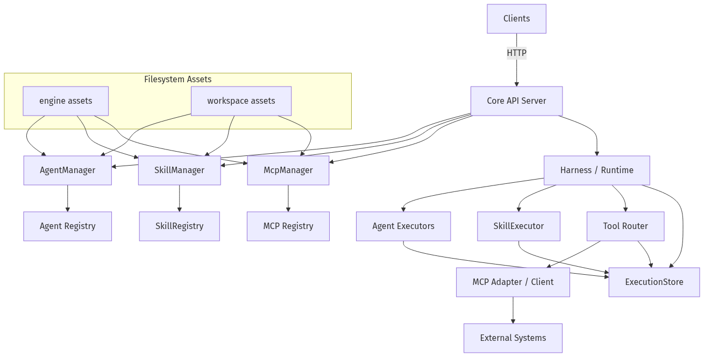
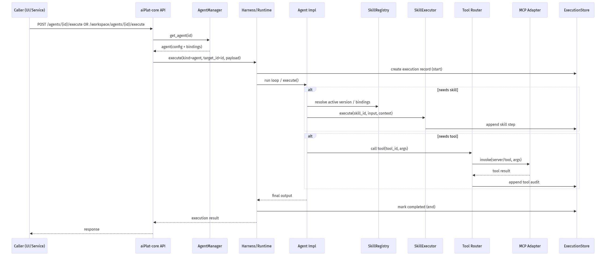
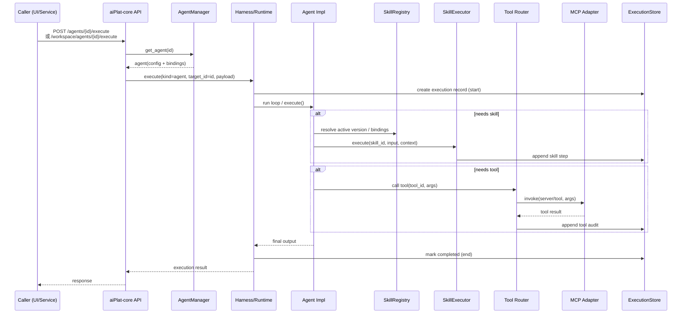
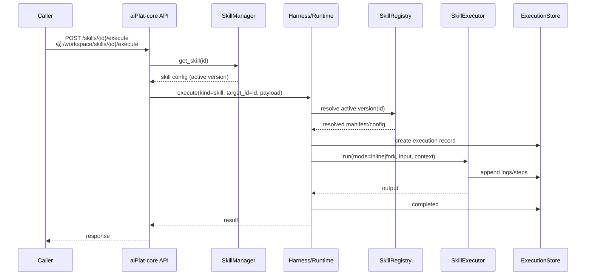
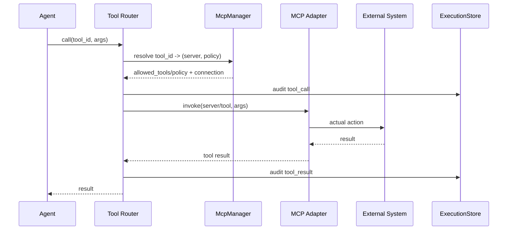

# 核心能力层（Layer 1 / aiPlat-core）最新架构图与执行流程

> 本文档以当前实现为准（As‑Is），并反映已落地的 **engine（核心能力层内置）** vs **workspace（对外应用库）** 分离。

## 0. 可视化图（直接可见）

### 0.1 架构图



### 0.2 执行流程图（Agent → Skill/Tool → MCP）



## 1. 总览：组件与职责

核心能力层（aiPlat-core）主要由以下几类组件构成：

- **HTTP API（FastAPI Server）**：对外提供 agent/skill/mcp 的管理与执行 API（含 engine 与 workspace 两套命名空间）。
- **Managers**：
  - `AgentManager`：加载、管理 agent（engine/workspace），提供 start/stop/execute/history/version 等能力。
  - `SkillManager`：加载、管理 skill（engine/workspace），提供 enable/disable/execute/versions/rollback 等能力。
  - `McpManager`：加载、管理 MCP servers（engine/workspace），提供 enable/disable/list 等能力。
- **Registries / Stores**：
  - `SkillRegistry`：版本、active-version、bindings、统计等（执行时作为“解析/版本”真值来源）。
  - `ExecutionStore`：执行历史、轨迹、审计落点（agent/skill/tool 的执行均会写入）。
- **Harness / Runtime**：
  - 统一执行入口：`execute(kind=agent|skill, target_id, payload)`
  - 执行循环/编排：驱动 agent（ReAct/Plan等）与 skill（inline/fork），以及工具调用与审计。
- **Tool Router + MCP Adapter**：
  - Tool Router：将 tool_id 映射到具体的 MCP server / tool，并做策略校验与审计。
  - MCP Adapter：通过 MCP 协议调用外部能力（browser/api等）。

## 2. 架构图（Mermaid）

```mermaid
flowchart TB
  U[Clients / aiPlat-management<br/>or other callers] -->|HTTP| API[aiPlat-core<br/>FastAPI Server]

  API --> AM[AgentManager<br/>(engine + workspace)]
  API --> SM[SkillManager<br/>(engine + workspace)]
  API --> MM[McpManager<br/>(engine + workspace)]
  API --> H[Harness / Runtime Executor]

  AM --> AR[Agent Registry]
  SM --> SR[SkillRegistry<br/>versions / bindings]
  MM --> MC[MCP Registry<br/>servers / policies]

  H --> AE[Agent Executors<br/>(ReAct / Plan / Tool / RAG / Conversational)]
  H --> SE[SkillExecutor<br/>(inline / fork)]
  H --> TR[Tool Router]

  TR --> MCP[MCP Adapter / Client]
  MCP --> EXT[External Systems<br/>(Browser/API/etc.)]

  H --> ES[ExecutionStore<br/>(history / traces / audit)]
  AE --> ES
  SE --> ES
  TR --> ES

  subgraph FS[Filesystem Assets (Definition Sources)]
    ENG[engine: aiPlat-core/core/engine/{agents,skills,mcps}]
    WKS[workspace: ~/.aiplat/{agents,skills,mcps}]
  end

  ENG --> AM
  ENG --> SM
  ENG --> MM
  WKS --> AM
  WKS --> SM
  WKS --> MM
```

## 3. engine vs workspace 分离（对执行的影响）

### 3.1 目录与管理入口

- **engine（核心能力层专用）**
  - 目录：`aiPlat-core/core/engine/{agents,skills,mcps}`
  - 管理端入口：侧边栏「核心能力层」→ `/core/*`
  - API：`/api/core/agents`、`/api/core/skills`、`/api/core/mcp/servers`

- **workspace（对外/应用库）**
  - 目录：`~/.aiplat/{agents,skills,mcps}`
  - 管理端入口：侧边栏「应用库」→ `/workspace/*`
  - API：`/api/core/workspace/*`

### 3.2 关键规则

1. **执行控制权不变**：无论 engine 还是 workspace，执行都统一由 Harness/Runtime 控制。
2. **禁止覆盖**：workspace 不允许创建与 engine 同名（同 id）的 agent/skill/mcp。
3. **对外暴露建议**：对外只通过 workspace 入口使用能力；如需 engine 能力，建议在 workspace 封装后再暴露，并走白名单/审批。

## 4. 执行流程（Agent / Skill / Tool(MCP)）

### 4.1 Agent 执行流程（ReAct / Plan / Tool / RAG / Conversational）



**说明**：
- ReAct/Plan 类 agent 通常是 loop（Reason→Act→Observe）。
- Conversational agent 可能直接调 model（不走 loop），但仍由 Harness 记录执行。

### 4.2 Skill 执行流程（inline / fork）



### 4.3 Tool / MCP 调用流程（从 Agent 内部触发）



## 5. 建议的“生产（prod）”门控

结合“workspace 默认拒绝 + 对外白名单”策略，推荐：
- L0/L1：允许对外，但必须审计（ExecutionStore 留痕）
- L2/L3：prod 默认禁止或强审批（尤其 browser/MCP、api_calling、tool_agent/react_agent）

相关策略文档：
- [对外能力白名单](../policy/external-allowlist.md)
