# PPT 场景说明：星邺汇捷篇 · aiPlat 篇（分开阅读）

| 字段 | 值 |
|------|-----|
| 文档 ID | `ONTOLOGY-PPT-SCENARIOS-2026-09` |
| 版本 | v3.2 |
| 关联 | [`ONTOLOGY_NARRATIVE.md`](./ONTOLOGY_NARRATIVE.md) · [`ONTOLOGY_RUNTIME_AUTHORITY.md`](./ONTOLOGY_RUNTIME_AUTHORITY.md) · [`ONTOLOGY_XINGYE_PPT_ANALYSIS.md`](./ONTOLOGY_XINGYE_PPT_ANALYSIS.md) · [`ONTOLOGY_OUTCOME_GOALS.md`](./ONTOLOGY_OUTCOME_GOALS.md) · [`ONTOLOGY_DEMO_PLAYBOOK.md`](./ONTOLOGY_DEMO_PLAYBOOK.md) · [`ONTOLOGY_CONNECTOR_TEMPLATES.md`](./ONTOLOGY_CONNECTOR_TEMPLATES.md) |
| 对标材料 | 《星邺汇捷本体平台介绍 v1.0》第 17–19 页 |
| 同步 | 2026-09：下篇路径 B 含 webhook + 表/CSV；三柱 API；建议≠权威；离线 OWL 审稿禁假绿；**v3.1 补全各镜图说**；**v3.2 图说改为引用块便于预览可见** |

---

## 0. 读法（必读）

**请只选一篇读完，再读另一篇。** 上篇只讲星邺；下篇只讲 aiPlat。不要交叉跳读。

| 你想了解 | 读 |
|----------|-----|
| 星邺产品愿景 / Palantir·OWL / 与 aiPlat 对照 | [`ONTOLOGY_XINGYE_PPT_ANALYSIS.md`](./ONTOLOGY_XINGYE_PPT_ANALYSIS.md) |
| 星邺：故障 / 治理（同结构加厚） | **上篇 A3 / A4** |
| aiPlat：故障 / 治理（同结构；治理含教学 vs 竖切） | **下篇 B3 / B4** |
| 30 分钟演示脚本 / 表映射口令 | [`ONTOLOGY_DEMO_PLAYBOOK.md`](./ONTOLOGY_DEMO_PLAYBOOK.md) |
| 用词对照 | 文末附录 |

### 0.1 中性概念

| 说法 | 含义 |
|------|------|
| 本体 / 说明书 | 类、关系类型、状态、**动作类型**；**不含**具体告警实例 |
| 事实层 / 真实层 | 今天实际存在的对象和边（GraphIndex / 运行对象图） |
| 推理 | 解题过程：只读说明书允许的类/关系/动作，在真实层上走图与写回 |
| 三层一致（强制） | **说明书有什么，真实层才能画什么；推理只能用这两层已声明的符号。** 禁止图上出现说明书没有的类/边，禁止推理步骤发明第三套词 |
| 动作在事实图上？ | **动作不是常驻节点。** 挂在目标对象旁为「可执行」；执行后改状态与边 |
| 是否由本体生成？ | **否**；实例由监控/配置/导入/动作写回；本体只约束 |

每篇的复杂事实图**只服务该篇**，不是两边共用的一张「教学全景」。

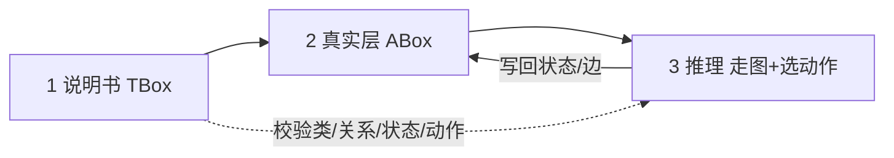

> **图说**：三层闭环——说明书约束真实层；推理只读已声明符号；写回改状态/边，不另造词表。

### 0.2 应有能力：数据源 / 已有本体 → 真实层（路径 A/B/C）

本体**不**凭空长出今晚的告警实例。正确产品能力是三条入轨：

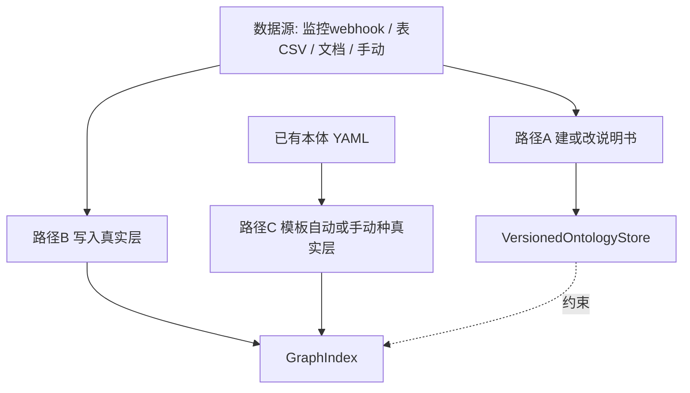

> **图说**：实例不从 TBox「长出」；A 改说明书，B 写真实层，C 按已有说明书模板种图。

| 路径 | 应有行为 | aiPlat 现状（防假绿 · 2026-09） |
|------|----------|--------------------------------|
| A 数据源→说明书 | 抽取草稿→confirm→本体提案 apply；代码/ER 亦可产**提案草稿** | **已实现竖切**：confirm 入队 → 批准 → apply 回执写 live YAML；`POST .../ontology/code-suggestions` 仅草稿、**禁自动 apply** |
| B 数据源→真实层 | 导入/抽取确认后写 GraphIndex | **已实现竖切（多入口）**：① JSON `POST .../graph/import`；② **webhook** `POST .../graph/webhook/{source_id}`（connector.json）；③ **表/CSV** `source_type=table_map`；④ 抽取 `confirm`→`write_extraction_to_graph_index`。DB 全自动建全域仍弱 |
| C 已有说明书→真实层 | 场景模板自动种 或 管理端手动建 | **已实现**：AcceptTab「演示告警」+「教学复杂拓扑」+（同构）`retail-ops`；种图前对齐故障版 `it-ops.yaml`；生产同步仍靠路径 B 数据源 |

「根据本体生成真实层」= 路径 C（模板/映射写入并校验），**不是** TBox 推导出业务现场。

### 0.3 下篇额外口径（读 B 篇前扫一眼）

| 口径 | 说明 |
|------|------|
| 三柱 | 数据=GraphIndex；逻辑=axioms / inference_rules（软）；行动=customer_action（硬）。`GET .../ontology/pillars/{domain}` + AcceptTab 速览 |
| 建议≠权威 | `GraphInference` / 离线 OWL 审稿 → 建议；落图须 `assert_inferred_*` 或提案。未跑检查 → `status=unchecked`，`valid` 不得为 true |
| 权限竖切 | GraphIndex ABox ACL + 角色桥（viewer/analyst/admin）；**非**企业全域 CBAC |
| 非目标 | 运行时 HermiT/OWL 权威；建模期内置完备 OWL 推理；星邺人天数字复现 |

---

# 上篇 · 星邺汇捷

> 据 PPT 叙事 + **本篇专用模拟事实**。不描述 aiPlat。

## A1. 本体（说明书）结构

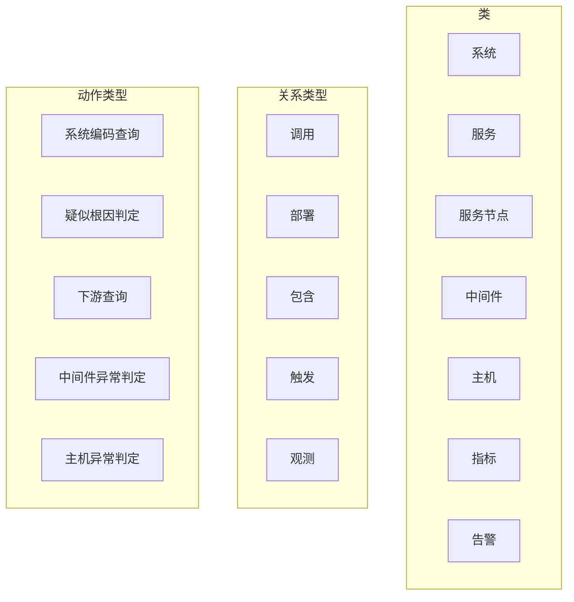

> **图说**：上篇说明书词表——类 / 关系类型 / 动作类型；不含今晚具体告警实例。

故障例关键是 **对象 + 动作 + 走图**。本篇也要求**三层一致**：A1 有的类/关系/动作，A3.2 才能画，A3.3 推理才能用。材料中的推理机名不作为本例关键路径。

---

## A2. 事实层从哪来

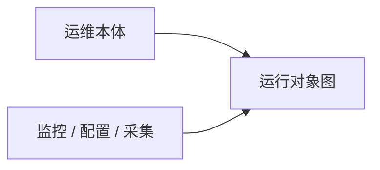

> **图说**：本体约束种类；实例由外部写入。下面 A3 的图是**模拟写入后的现场**，用来讲清筛选。

---

## A3. 例子一：故障诊断（对着复杂事实解题）

### A3.1 业务问题

晚高峰积分系统告警**同时响多条**。入口症状是查询超时（材料中的 `cast-query` 一类）。  
要回答：**根因是哪个运行对象？** 并说清为何不是磁盘告警、旁路从库、慢 SQL 主因。

### A3.2 本篇模拟事实层（运行对象图）

> 以下名称仅用于上篇理解，由「监控/配置」叙事写入，**不是**本体定义出来的实例清单。  
> **动作不画成独立实例节点**：材料里的动作类型挂在主告警旁（可执行清单）；执行效果见 A3.3 各镜。

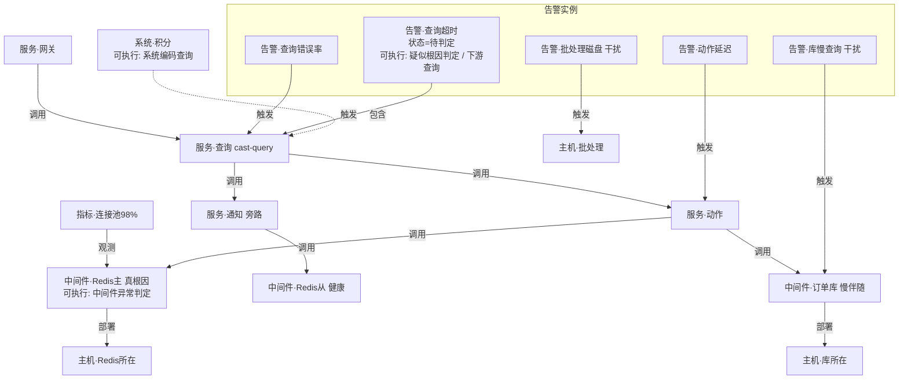

> **图说**：上篇教学全景——多告警同场、主路径与旁路、Redis 主/从对比、批处理噪音；节点名仅本篇使用。

#### 动作合同层（说明书类型 → 作用在哪些对象）

> 材料叙事动作名；**不是** aiPlat `action_id`。

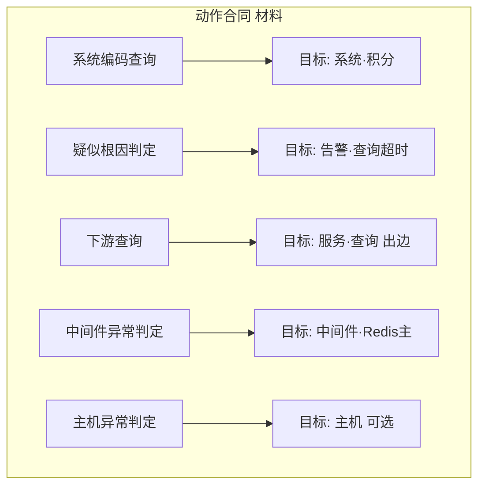

> **图说**：材料动作类型挂在目标对象上（合同），不是常驻实例节点；执行效果改状态与边。

| 动作类型（材料） | 要求/时机 | 在事实图上改什么 |
|------------------|-----------|------------------|
| 系统编码查询 | 开场 | 锁定 `系统·积分` |
| 疑似根因判定 | 多告警并存 | 选定 `告警·查询超时` 为主线索 |
| 下游查询 | 已有主告警 | 沿 `服务·查询` 调用边展开/旁路对比 |
| 中间件异常判定 | 走到中间件 | 结合指标判定 `Redis主` |
| 主机异常判定 | 需要主机层 | 本例不落主机根因 |

**这张图为什么「复杂」才有用：**

| 现象 | 解题时要做什么 |
|------|----------------|
| 5 条告警一起响 | 不能每条都当根因入口 |
| 查询服务两条出边 | 主路径 vs 旁路，要对比 |
| Redis 主池打满、从库健康 | 排除「整个 Redis 产品挂了」 |
| 订单库也慢 | 可能是被拖累的伴随，不是第一推动 |
| 批处理磁盘告警 | 与查询调用闭包无关，应丢掉 |

### A3.3 逐步解题（每镜 = 事实图快照）

以下节点名与 **A3.2** 完全一致。口号流水线已去掉；读图顺序即解题顺序。

**镜1 · 执行「系统编码查询 + 疑似根因判定」定入口**

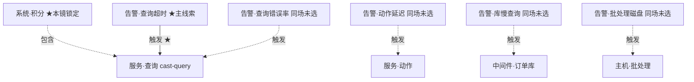

> **图说**：入口只认 `系统·积分` + `告警·查询超时→服务·查询`；其余告警同场但本镜不选。

**镜2 · 执行「下游查询」：调用闭包，丢闭包外噪音**

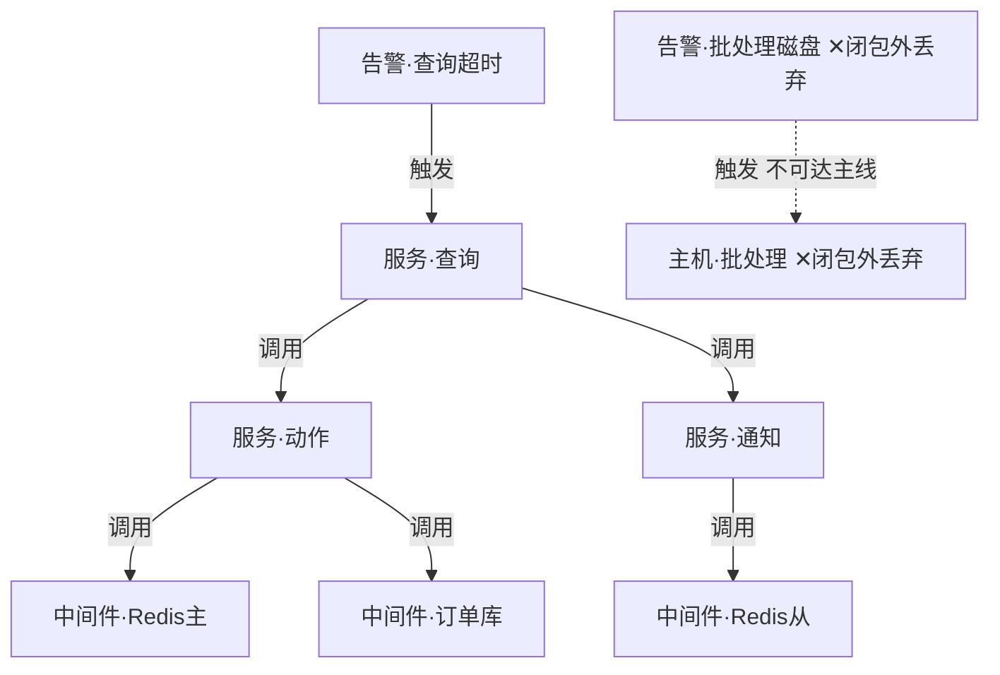

> **图说**：从 `服务·查询` 沿「调用」展开可达集；`告警·批处理磁盘`/`主机·批处理` 不在闭包内 → 移出主线。

**镜3 · 执行「下游查询」：旁路证伪**


> **图说**：走 `查询→通知→Redis从`；对象健康 → 证伪「Redis 产品全挂」。

**镜4 · 执行「中间件异常判定」：主路径 + 指标；订单库降级伴随**

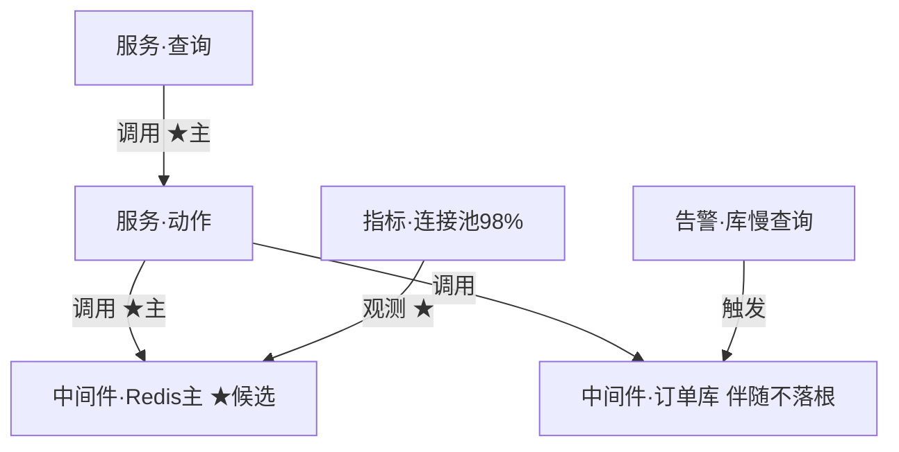

> **图说**：主路径 `查询→动作→Redis主` + 池打满 → 首选根因；`订单库` 有慢告警但解释为伴随。

**镜5 · 落点**


> **图说**：对业务交代的运行对象即本节点。

| 镜 | 执行的动作（材料） | 图上实施 | 结果 |
|----|--------------------|----------|------|
| 1 | 系统编码查询 + 疑似根因判定 | 锁 `系统·积分`、`告警·查询超时` | 正确入口 |
| 2 | 下游查询（闭包） | 丢 `批处理磁盘` 支路 | 噪音下降 |
| 3 | 下游查询（旁路） | `通知→Redis从` 健康排除 | 证伪全集群 |
| 4 | 中间件异常判定 | 主路径 + 指标；库=伴随 | Redis主首选 |
| 5 | （结论，材料侧无单独写回合同） | 落点=`中间件·Redis主` | 可交代 |

贯穿机制（材料）：SuperStar 规划 → 对象动作 → 沿调用/部署走图 → 落点。

### A3.4 本例小结

复杂事实让「排除」可见；说明书提供合法关系与动作类型；事实图提供今晚这些对象。解题步骤必须能指回 A3.2 同一节点。

---

## A4. 例子二：数据治理（与例子一同结构）

> 本例同样遵守三层一致：先定说明书词表 → 再画真实层 → 推理镜只用已声明符号。

### A4.1 业务问题

元数据缺、目录两张皮；同一业务线下多张表成熟度不一，还有**幽灵表 / 错挂目录 / 断链血缘**干扰，不能「一律入库走完河」。

### A4.2 本例说明书词表（治理向 · 材料）

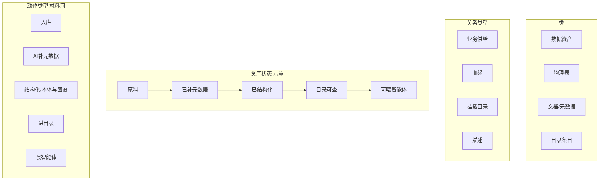

> **图说**：上篇治理说明书——类/关系/状态河 + 材料「河五步」动作类型；不含具体表实例。

### A4.3 本篇模拟真实层（复杂资产图）

> 实例由采集/导入写入，**不是**说明书生成。节点名仅上篇使用。

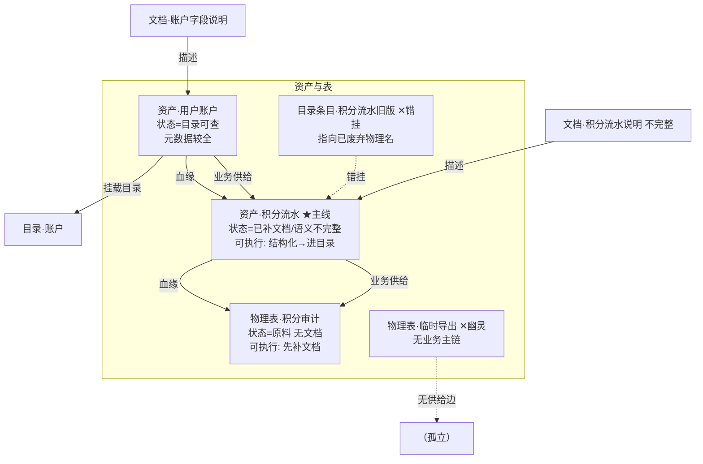

> **图说**：上篇治理教学全景——主线流水、账户金标准、审计原料、幽灵表、错挂目录；解题要排除噪音。

| 对象 | 现状 | 为何复杂 | 治理重点 |
|------|------|----------|----------|
| 用户账户 | 已可查 | 可当对照金标准 | 不必重做河 |
| 积分流水 | 文档有、结构化弱 | **主线** | 结构化→进目录→应用 |
| 积分审计 | 仅有表 | 断在河起点 | 先补文档再入库后续 |
| 临时导出 | 幽灵表 | 无业务供给边 | **丢弃/不进主线** |
| 旧版目录条目 | 错挂 | 与现物理名不一致 | **纠挂或下线**，防假绿 |

#### 动作合同层（材料河 → 作用对象）

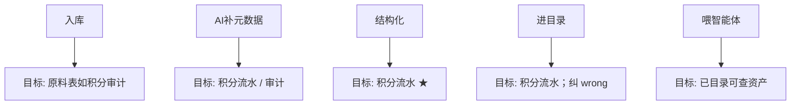

> **图说**：材料「河五步」动作合同——每步挂在目标资产/表上；主线优先跑结构化+进目录，支线不必齐步。

### A4.4 推理镜（锚定 A4.3）

**镜1 · 定主线资产**

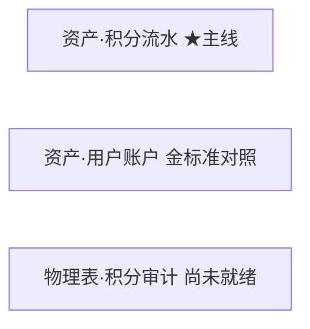

> **图说**：定主线=`资产·积分流水`；账户作金标准对照；审计支线尚未就绪。

**镜2 · 丢幽灵、标错挂**

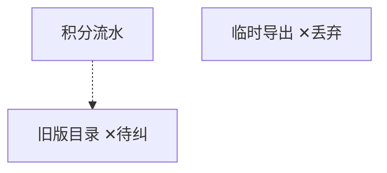

> **图说**：丢弃幽灵表；旧版目录标为错挂待纠——噪音↓。

**镜3 · 对主线执行「结构化」**


> **图说**：对主线执行「结构化」——语义不完整→已结构化，才可进目录。

**镜4 · 执行「进目录」+ 纠错挂**

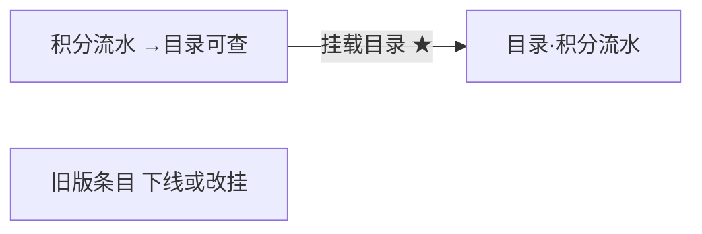

> **图说**：主线挂载真源目录；旧版条目下线或改挂。

**镜5 · 审计支线只做到「补文档」；账户可喂智能体**

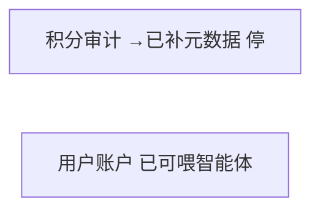

> **图说**：审计支线只补到元数据即停；账户已可喂智能体——河五步不是每张表都跑满。

| 镜 | 动作（材料） | 真实层操作 | 结果 |
|----|--------------|------------|------|
| 1 | （选题） | 锁积分流水为主线 | 不对齐账户重做 |
| 2 | （筛选） | 丢幽灵；标错挂 | 噪音↓ |
| 3 | 结构化 | 改流水状态 | 可进目录 |
| 4 | 进目录 | 挂载+纠 wrong | 目录真源 |
| 5 | 补元数据 / 喂智能体 | 审计停半程；账户可用 | 对症下药 |

贯穿：材料河五步**不是**每张表都跑满；推理按真实层成熟度选动作。

### A4.5 本例小结

与例子一相同：复杂真实层让排除可见；说明书给动作类型；推理镜指回同一节点。

---

## A5. 上篇总表

| | 内容 |
|--|------|
| 本体 | 故障向 + 治理向类/关系/动作；与真实层、推理同词 |
| 故障 | 复杂真实层 + 镜1–5 |
| 治理 | 复杂资产图（幽灵/错挂/断链）+ 镜1–5 + 动作合同 |

---

# 下篇 · aiPlat

> 只写 aiPlat。B3：路径 C 种真实层（minimal / complex）+ **路径 B 表/CSV·webhook** + 动作硬门。B4：路径 A/B 治理双轨。三柱与建议层见 §0.3。

## B1. 本体（说明书）— 与代码一致

锚点：[`it-ops.yaml`](../../aiPlat-core/workspace_seeds/ontologies/it-ops.yaml)、[`it_ops_alert_lifecycle.yaml`](../../aiPlat-core/core/workspace_seeds/actions/it_ops_alert_lifecycle.yaml)。

**下篇只用这一张词表**（真实层与推理不得另造类名/边名/状态名）。

| 种类 | 说明书符号（唯一） | 中文 label |
|------|-------------------|------------|
| 类 | `Alert` / `Service` / `Middleware` / `Host` | 告警 / 服务 / 中间件 / 主机 |
| 关系 | `calls` / `deployed_on` / `suspects` / `rooted_at` | 调用 / 部署于 / 疑似根因指向 / 根因落点 |
| 告警状态 | `open` → `triaging` → `rooted` | 未分诊 → 分诊中 → 已定位根因 |
| 动作 | `customer_action:it-ops:triage_alert` / `link_suspect` / `mark_root_cause` | 分诊告警 / 挂接疑似 / 确认根因 |

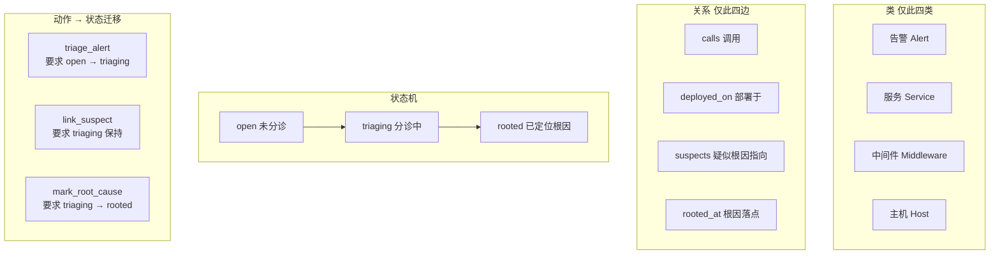

> **图说**：下篇唯一词表——四类、四边、三状态、三动作；真实层与推理不得另造符号。

**故意不在说明书里的**（因此真实层/推理也禁止当正式类或边）：「指标」类、「触发于」边、「观测」边。池利用率等写在中间件**属性**上；告警挂哪个服务写在告警**属性** `service_name`。

---

## B2. 真实层 = GraphIndex（被说明书校验）

```mermaid
flowchart LR
  yaml["it-ops.yaml"] -->|"类/关系/状态"| gi["GraphIndex 真实层"]
  act["动作合同 YAML"] -->|"执行写回"| gi
  pathB["路径B: webhook / JSON / 表CSV / confirm"] -->|"写入实例"| gi
  pathC["路径C: AcceptTab 模板"] -->|"种图"| gi
  reason["推理 Agent/人工"] -->|"只读说明书符号走图"| gi
  sug["建议层 infer / 离线OWL"] -.->|"不得静默写图"| gi
```

> **图说**：YAML/Action 约束与写回；路径 B/C 写入实例；推理只读符号；建议层虚线——不得静默改图。

Wiki 非权威。下面 B3 的教学图**只用 B1 词表**。路径 B 配置见 [`ONTOLOGY_CONNECTOR_TEMPLATES.md`](./ONTOLOGY_CONNECTOR_TEMPLATES.md)。

---

## B3. 例子一：故障诊断

### B3.1 业务问题

多告警干扰下，把根因落到正确中间件实例；过程要能**否决**错误状态、可审计。

---

### B3.2 教学复杂真实层（路径 C 目标样例；AcceptTab 可种）

> **路径 C**：按已有 `it-ops` 说明书 + 场景模板写入 GraphIndex（`scenario=it-ops-alert-complex`），**不是**本体自动派生。  
> **说明书对齐**：种图前安装 `workspace_seeds/ontologies/it-ops.yaml`（含类「告警/服务/中间件/主机」）；若 `~/.aiplat/ontologies/it-ops.yaml` 是另一份知识本体，会备份为 `it-ops.knowledge-bak.yaml` 再替换。  
> **三层一致**：类 ∈ B1 四类；边 ∈ `calls`/`deployed_on`（写回后才有 `suspects`/`rooted_at`）；状态 `open|triaging|rooted`。  
> AcceptTab「创建教学复杂拓扑」种本图；「创建演示告警」种 B3.3 直线子集；「导入表/CSV样例」走 B3.3b 路径 B。生产现场仍靠监控 webhook / 表映射 / JSON 导入（路径 B），不是路径 C。

```mermaid
flowchart TB
  subgraph gj [告警 Alert]
    g1["ALT-主\nservice_name=SVC-查询\nstate=open\n可执行: triage_alert"]
    g2["ALT-错误率\nservice_name=SVC-查询\nstate=open"]
    g3["ALT-延迟\nservice_name=SVC-动作\nstate=open"]
    g4["ALT-慢SQL\nservice_name=MW-MySQL\nstate=open 干扰"]
    g5["ALT-磁盘\nservice_name=HOST-批处理\nstate=open 干扰"]
  end
  gw["SVC-网关 Service"]
  q["SVC-查询 Service"]
  act["SVC-动作 Service"]
  ntf["SVC-通知 Service"]
  r1["MW-Redis主 Middleware\npool_util=98% 根因候选"]
  r2["MW-Redis从 Middleware\nhealthy=true"]
  my["MW-MySQL Middleware 伴随"]
  h8["HOST-8 Host"]
  h9["HOST-9 Host"]
  hb["HOST-批处理 Host"]
  gw -->|calls 调用| q
  q -->|calls 调用| act
  q -->|calls 调用| ntf
  act -->|calls 调用| r1
  act -->|calls 调用| my
  ntf -->|calls 调用| r2
  r1 -->|deployed_on 部署于| h8
  my -->|deployed_on 部署于| h9
```

> **图说**：路径 C 教学全景（与上篇 A3.2 同构）——多告警、主/旁路、`calls`/`deployed_on`；词表严格 ∈ B1。入口靠 `service_name` 属性对齐，不是「触发于」边。

入口靠告警属性 `service_name` 对齐到服务/中间件（说明书字段，**不是**「触发于」边）。池利用率是中间件属性，**不是**「指标」类。

#### 动作合同层（与 B1 / YAML 同一套 id）

```mermaid
flowchart TB
  t1["triage_alert"] --> r1a["要求 state=open"]
  r1a --> e1["→ triaging\n可写 suspects"]
  t2["link_suspect"] --> r2a["要求 state=triaging"]
  r2a --> e2["保持 triaging\n写 path_note"]
  t3["mark_root_cause"] --> r3a["要求 state=triaging"]
  r3a --> e3["→ rooted\n写 rooted_at"]
```

> **图说**：三动作合同与 YAML 同 id——状态门槛硬；推理镜1–4只读，镜5才写。

| 动作 id | 要求状态 | 目标类 | 真实层变化 |
|---------|----------|--------|------------|
| `…:triage_alert` | open | 告警 | →triaging；可选 `suspects` |
| `…:link_suspect` | triaging | 告警 | path_note；`suspects` |
| `…:mark_root_cause` | triaging | 告警 | →rooted；`rooted_at` |

推理分工：镜1–4 **只读** `calls`/`deployed_on` + 属性；镜5 **只写** 上表三动作。

#### 推理镜（每镜 = 真实层快照；符号 ∈ B1）

**镜1 · 选定目标告警（读属性；尚未执行动作）**

```mermaid
flowchart TB
  g1["ALT-主 ★\nservice_name=SVC-查询\nstate=open\n可执行: triage_alert"]
  g2["ALT-错误率 同场未选"]
  g3["ALT-延迟 同场未选"]
  g4["ALT-慢SQL 同场未选"]
  g5["ALT-磁盘 同场未选"]
  q["SVC-查询"]
  g1 -.->|属性对齐 service_name| q
```

> **图说**：入口只认 `ALT-主`（`service_name=SVC-查询`，`open`）；其余告警同场未选；尚未执行动作。

**镜2 · 沿 calls 闭包；丢闭包外噪音**

```mermaid
flowchart TB
  g1["ALT-主"]
  q["SVC-查询"]
  act["SVC-动作"]
  ntf["SVC-通知"]
  r1["MW-Redis主"]
  r2["MW-Redis从"]
  my["MW-MySQL"]
  g5["ALT-磁盘 ✕ service 不在查询闭包"]
  hb["HOST-批处理 ✕"]
  g1 -.->|service_name| q
  q -->|calls| act
  q -->|calls| ntf
  act -->|calls| r1
  act -->|calls| my
  ntf -->|calls| r2
```

> **图说**：从 `SVC-查询` 沿 `calls` 展开可达集；`ALT-磁盘` / `HOST-批处理` 不在闭包 → 移出主线。

**镜3 · 旁路 calls 证伪**

```mermaid
flowchart LR
  q["SVC-查询"]
  ntf["SVC-通知"]
  r2["MW-Redis从 healthy=true ★排除"]
  q -->|calls ★旁路| ntf
  ntf -->|calls ★旁路| r2
```

> **图说**：走 `SVC-查询→SVC-通知→MW-Redis从`；从库 healthy → 证伪「整个 Redis 产品挂了」。

**镜4 · 主路径 calls + 属性；MySQL 不 mark**

```mermaid
flowchart TB
  q["SVC-查询"]
  act["SVC-动作"]
  r1["MW-Redis主 ★候选 pool_util=98%"]
  my["MW-MySQL 伴随"]
  q -->|calls ★主| act
  act -->|calls ★主| r1
  act -->|calls| my
```

> **图说**：主路径 `查询→动作→Redis主` + `pool_util=98%` → 首选根因；MySQL 有慢告警但本镜不 `mark_root_cause`。

**镜5a · 执行 triage_alert**

```mermaid
flowchart LR
  g1["ALT-主 open→triaging\n可执行: link_suspect / mark_root_cause"]
  r1["MW-Redis主"]
  g1 -->|"suspects 疑似根因指向 ★ triage_alert"| r1
```

> **图说**：硬门写回——`open→triaging`，并写 `suspects` 指向 `MW-Redis主`；下一步可 `link_suspect` / `mark_root_cause`。

**镜5b · 执行 link_suspect 再 mark_root_cause**

```mermaid
flowchart TB
  g1["ALT-主 triaging→rooted\n可执行: 无"]
  q["SVC-查询"]
  act["SVC-动作"]
  r1["MW-Redis主"]
  q -->|calls| act
  act -->|calls| r1
  g1 -->|"rooted_at 根因落点 ★ mark_root_cause"| r1
  note["link_suspect path_note:\nSVC-查询→SVC-动作→MW-Redis主"]
  note -.-> g1
```

> **图说**：`link_suspect` 记 path_note；`mark_root_cause` 写 `rooted_at` 并 `→rooted`。对业务交代的根因对象即 `MW-Redis主`。

错误示例：`state≠open` 时执行 `triage_alert` → blocked；对 `MW-MySQL` 写 `rooted_at` 与镜4证据冲突。

| 镜 | 说明书依据 | 真实层操作 | 结果 |
|----|------------|------------|------|
| 1 | Alert 字段 | 选 ALT-主 | 入口 |
| 2–4 | `calls` + 属性 | 闭包/旁路/主路径 | 候选=Redis主 |
| 5a | `triage_alert` | →triaging + `suspects` | 硬门过 |
| 5b | `link_suspect`+`mark_root_cause` | path_note + `rooted_at` | 闭环 |

---

### B3.3 路径 C 最小竖切（AcceptTab「创建演示告警」）

入口：AcceptTab →「创建演示告警」→ `scenario=it-ops-alert`（`seed_it_ops_demo_graph(profile=minimal)`）。
复杂教学图用「创建教学复杂拓扑」→ `it-ops-alert-complex`（见 B3.2）。

```mermaid
flowchart LR
  gj["告警 ALT\nstate=open\n可执行: triage_alert"]
  q["SVC-CAST-QUERY"]
  a["SVC-CAST-ACTION"]
  r["MW-REDIS-1"]
  h["HOST-1"]
  q -->|calls| a
  a -->|calls| r
  r -->|deployed_on| h
```

> **图说**：路径 C 最小竖切——直线拓扑；AcceptTab「创建演示告警」一种即得。

**镜A · triage_alert**

```mermaid
flowchart LR
  gj["open→triaging"]
  r["MW-REDIS-1"]
  gj -->|"suspects ★ triage_alert"| r
```

> **图说**：分诊写回 `open→triaging` + `suspects` → Redis。

**镜B · link_suspect**

```mermaid
flowchart LR
  gj["保持 triaging"]
  note["path_note=cast-query→cast-action→redis"]
  note -.-> gj
```

> **图说**：挂路径笔记，状态保持 `triaging`。

**镜C · mark_root_cause**

```mermaid
flowchart LR
  gj["→rooted"]
  r["MW-REDIS-1"]
  gj -->|"rooted_at ★ mark_root_cause"| r
```

> **图说**：确认根因——`→rooted` + `rooted_at` 落点。

```text
分诊:   {"new_state":"triaging","suspected_root":"MW-REDIS-1"}
挂路径: {"new_state":"triaging","suspected_root":"MW-REDIS-1",
         "path_note":"cast-query→cast-action→redis"}
确认:   {"new_state":"rooted","root_entity_id":"MW-REDIS-1"}
```

### B3.3b 路径 B 竖切（非路径 C）

生产真实层主路径是**数据源入轨**，不是 AcceptTab 模板种图。

```mermaid
flowchart LR
  mon["监控 webhook"] --> gi["GraphIndex"]
  csv["表 / CSV table_map"] --> gi
  json["JSON import"] --> gi
  conf["抽取 confirm"] --> gi
  gi --> act["三动作硬门"]
```

> **图说**：路径 B 多入口写真实层（webhook / 表映射 / JSON / confirm）；入轨后仍过 L1 动作，不是种完就结案。

当前可演示：

| 入口 | 操作 | 口述 |
|------|------|------|
| JSON 样例 | AcceptTab「导入样例告警JSON」→ `POST .../graph/import` + `use_sample` | 监控 JSON → 真实层 |
| 表/CSV | AcceptTab「导入表/CSV样例」→ `source_type=table_map` + `use_sample` | 适配层表映射 → 真实层（connector.`table_map`） |
| Webhook | `POST .../graph/webhook/monitor-alerts` + connector.json | 生产推送 Path B |

```http
POST /api/platform/apps/fde/graph/import
{
  "domain_id": "it-ops",
  "source_type": "table_map",
  "use_sample": true
}
```

回执含 `created_entities` / `skipped` / `primary_id`。类与边须 ∈ connector allowlist（禁止 harness 硬编码表名）。入轨后仍走 B3.3 三动作硬门（分诊→挂疑似→落根因）。

同构第二域：`retail-ops`（零改 harness）— 见 OUTCOME Phase 2。

### B3.4 Agent 推理（必须三层同词）

```mermaid
flowchart LR
  a["读 B1 类/关系/动作"] --> b["读 GraphIndex"]
  b --> c["规划: calls走图 + 选动作id"]
  c --> d["ActionRegistry 硬门"]
  d --> e["写 suspects / rooted_at"]
```

> **图说**：Agent 推理闭环——读说明书 → 读图 → 选动作 → 硬门 → 写边；禁止发明说明书外符号。

禁止：推理输出「未分诊」英文混用而不带 `open`；禁止发明「触发于」边；禁止把 inference 建议当成已确认 `rooted`。锚点：`inject_ontology_context`；`ActionRegistry.execute`；`GraphIndex`；落推断边须 `platform_action:graph:assert_inferred_*`。

### B3.5 三柱速览（演示口述 30 秒）

```http
GET /api/platform/apps/fde/ontology/pillars/it-ops
```

| 柱 | 指什么 | 约束级别 |
|----|--------|----------|
| 数据 | 图实体/边计数 | ABox 事实 |
| 逻辑 | axioms / inference_rules | L2 软约束 |
| 行动 | `customer_action:it-ops:*` | L1 硬门 |

AcceptTab「本体三柱速览」只读聚合，**不是**第二套编辑器；改说明书仍走提案。

---

## B4. 例子二：数据治理（与例子一同结构）

> **词表说明**：本例**不是** `it-ops` 故障词表。治理走平台双轨——说明书变更走**本体提案 apply**；实例走 **GraphIndex / 抽取待审**。教学图用「数据资产」等类名表示业务对象；**不声称**已在 `it-ops.yaml` 注册。已实现竖切见 B4.4。

### B4.1 业务问题

多表成熟度不一 + 幽灵表/错挂目录；要把主线资产推到「可检索 + 说明书/实例一致」，且**不能**静默改 YAML、不能 Wiki 假发布。

### B4.2 本例说明书词表（治理向 · 教学）

```mermaid
flowchart TB
  subgraph lei [类 教学]
    da["数据资产"]
    tbl["物理表"]
    doc["文档片段"]
    cat["目录条目"]
    draft["抽取草稿"]
  end
  subgraph gx [关系 教学]
    feed["业务供给"]
    lineage["血缘"]
    describes["描述"]
    mounts["挂载目录"]
  end
  subgraph zt [资产侧状态 示意]
    raw["raw"] --> meta["meta_ready"]
    meta --> struct["structured"]
    struct --> listed["cataloged"]
    listed --> ready["agent_ready"]
  end
  subgraph gate [闸门 / 动作合同]
    g1["闸1 本体提案 apply\n改说明书 TBox"]
    g2["抽取 confirm\n草稿→待审通过"]
    g3["闸2 实例动作\n如发布/挂目录 写 ABox"]
  end
```

> **图说**：治理向教学词表——类/关系/状态河 + 闸1（改说明书）/ confirm / 闸2（写 ABox）；**未**注册进 it-ops.yaml。

| 符号 | 含义 | 真实层落点 |
|------|------|------------|
| 闸1 本体提案 apply | 改类/关系/状态定义 | `VersionedOntologyStore`（非 Evolve） |
| 抽取 confirm | 文档→实体草稿过审 | PendingExtraction → 可提案 |
| 闸2 实例动作 | 改 GraphIndex 实例/边 | GraphIndex + Action 硬门（若有合同） |

### B4.3 教学复杂真实层

```mermaid
flowchart TB
  subgraph assets [资产]
    a["DA-账户\nstate=cataloged\n可执行: 检索/喂智能体"]
    s["DA-积分流水 ★主线\nstate=meta_ready\n可执行: 结构化提案 + 挂目录"]
    u["TBL-积分审计\nstate=raw\n可执行: 入库/抽文档"]
    ghost["TBL-tmp_export ✕幽灵"]
    wrong["CAT-流水旧版 ✕错挂"]
  end
  docS["DOC-流水说明 不完整"]
  draftS["DRAFT-流水抽取 待审"]
  a -->|业务供给| s
  s -->|业务供给| u
  a -->|血缘| s
  s -->|血缘| u
  docS -->|描述| s
  draftS -.->|待 confirm| s
  wrong -.->|错挂| s
  ghost -.->|无供给| x["孤立"]
```

> **图说**：治理教学全景——主线流水、账户金标准、审计支线、幽灵表、错挂目录、待审草稿；AcceptTab 种子集为子集。

#### 闸门合同层

```mermaid
flowchart LR
  k["入库可检索"] --> d["抽取草稿"]
  d -->|confirm| c["待审通过"]
  c -->|闸1 提案 apply| y["说明书变更"]
  y --> i["真实层实例对齐"]
  i -->|闸2 动作| p["cataloged / 发布"]
```

> **图说**：闸门顺序——入库→抽取→confirm→（可选闸1 改说明书）→闸2 写真实层；禁止跳闸假绿。

| 闸/动作 | 要求 | 禁止 |
|---------|------|------|
| confirm | 草稿存在 | 未审直接当权威 |
| 闸1 apply | 提案过审 | Agent 静默改域 YAML |
| 闸2 | 说明书已含目标类/关系 | Wiki 页假装已发布 |

#### 推理镜（锚定 B4.3）

**镜1 · 定主线**

```mermaid
flowchart LR
  s["DA-积分流水 ★"]
  a["DA-账户 金标准"]
  u["TBL-审计 raw"]
```

> **图说**：定主线=`DA-积分流水`；账户作金标准；审计仍为 raw。

**镜2 · 丢幽灵、标错挂**

```mermaid
flowchart TB
  s["DA-积分流水"]
  ghost["TBL-tmp_export ✕"]
  wrong["CAT-流水旧版 ✕"]
```

> **图说**：丢弃幽灵 `TBL-tmp_export`；旧版目录标错挂。

**镜3 · 抽取 confirm（草稿→可提案）**

```mermaid
flowchart LR
  draftS["DRAFT-流水抽取"] -->|confirm ★| s["DA-积分流水"]
```

> **图说**：Path B——confirm 写图回执；并可入队 Path A 提案（尚未 apply）。

**镜4 · 闸1：若需新类/关系 → 本体提案 apply**

```mermaid
flowchart LR
  prop["提案 touches_ontology"] -->|apply ★| tbox["VersionedOntologyStore"]
  tbox --> s["真实层可合法挂新边"]
```

> **图说**：闸1——批准后 apply 改 live YAML；禁止 Agent 静默改说明书。

**镜5 · 闸2：结构化/挂目录写 ABox；纠错挂**

```mermaid
flowchart LR
  s["DA-积分流水 →cataloged"]
  cat["CAT-积分流水"]
  wrong["旧版 CAT 下线"]
  s -->|挂载目录 ★| cat
```

> **图说**：闸2 写 ABox——挂真源目录、下线错挂；状态→cataloged。

**镜6 · 支线：审计只到 meta_ready；账户 agent_ready**

```mermaid
flowchart LR
  u["TBL-审计 →meta_ready 停"]
  a["DA-账户 agent_ready"]
```

> **图说**：审计支线只到 meta_ready 即停；账户已 agent_ready——不齐步假绿。

| 镜 | 合同 | 真实层操作 | 结果 |
|----|------|------------|------|
| 1–2 | （选题/筛选） | 主线+丢噪 | 同例子一 |
| 3 | confirm | 草稿过审 | 可提案 |
| 4 | 闸1 apply | 改说明书 | TBox 合法 |
| 5 | 闸2 | 挂目录+纠错 | ABox 一致 |
| 6 | 对症 | 审计半程 | 不齐步假绿 |

OCS 按域打分；**不宣称**企业全域本体建成。

### B4.4 已实现竖切（诚实子集）

相对 B3 AcceptTab 三动作，治理竖切分散在知识工厂 / 提案门：

| 能力 | 状态 | 说明 |
|------|------|------|
| 文档入库 + 检索 | 已有 | Wiki/KB；非 GraphIndex 权威 |
| 抽取 → 待审 → confirm | **已实现** | GraphIndex 回执（Path B）+ 提案入队（Path A） |
| 本体提案 approve→apply | **已实现** | 知识工厂「批准」「应用」；`apply_proposal` 回执 |
| 代码→类建议 | **已实现竖切** | `POST .../ontology/code-suggestions` → 提案草稿；禁自动 apply |
| 多表洪水筛选 / 闸2 | **已实现竖切** | AcceptTab「创建治理教学图」种 B4.3 **子集** + `mount_catalog`/`discard_ghost`；实例/属性 ACL |
| 企业全域治理 RBAC | **未** | 竖切可演示，非全量 CBAC 产品 |

**B4.3 一键种子**：AcceptTab 已种子集（主线资产/幽灵/错挂/草稿）；全图含 `DOC-流水说明` 等扩展节点仍为教学对照，非宣称全量同构。

### B4.5 Agent 推理（三层同词）

```mermaid
flowchart LR
  a["读治理说明书/提案状态"] --> b["读真实层资产图"]
  b --> c["规划: 选主线+选闸"]
  c --> d["confirm / 闸1 / 闸2"]
  d --> e["写回草稿状态或 ABox"]
```

> **图说**：治理 Agent 推理同构故障例——读说明书与图 → 选题 → 过闸；写回只能经 confirm/提案/闸2，不可静默改 YAML。

禁止：静默改 YAML；用 Wiki 冒充 `cataloged`；对幽灵表跑满闸门河。

---

## B5. 下篇总表

| | 内容 |
|--|------|
| 故障例 | B1–B3：路径 C minimal/complex 种图 + **路径 B**（JSON / 表·CSV / webhook）+ 三动作硬门 |
| 治理例 | B4：路径 A/B；复杂资产教学 + 闸门镜 + 代码建议草稿 |
| 共同 | 说明书 ⊇ 真实层符号 ⊇ 推理用词；实例来自 A/B/C 写入非 TBox 派生；三柱可指 |
| 不声称 | 生产监控已全量接入；**运行时 OWL / 建模期内置完备推理**；治理类已写入 it-ops.yaml；DB→全域本体自动建成；企业全域 CBAC |

```bash
# 场景相关回归（含路径 B 表映射 / 三柱 / 离线 OWL 假绿禁令）
cd /path/to/aiPlatform && PYTHONPATH=aiPlat-core:. .venv/bin/python -m pytest \
  aiPlat-core/core/tests/unit/test_harness/test_knowledge/test_it_ops_alert_lifecycle.py \
  aiPlat-core/core/tests/unit/test_harness/test_knowledge/test_data_gov_p4.py \
  aiPlat-core/core/tests/unit/test_harness/test_knowledge/test_lock_service_ontology_loop.py \
  aiPlat-core/core/tests/unit/test_harness/test_knowledge/test_ontology_completeness_ocs.py \
  aiPlat-core/core/tests/unit/test_harness/test_knowledge/test_executable_ontology_phase12.py \
  aiPlat-core/core/tests/unit/test_harness/test_knowledge/test_executable_ontology_phase_ae.py \
  aiPlat-core/core/tests/unit/test_harness/test_knowledge/test_inference_suggestion_authority.py \
  -q
```

---

# 附录 · 用词对照（读完两篇后再看）

| 含义 | 星邺材料 | aiPlat（三层同词） |
|------|----------|-------------------|
| 类型层 | 领域本体 | `it-ops.yaml`（B1） |
| 实例层 | 运行对象图 | GraphIndex（B2/B3） |
| 入轨 | 适配 / 监控 | 路径 B：webhook · JSON · **表/CSV** · confirm；路径 C：AcceptTab |
| 推理 | SuperStar + 对象动作 | 走 `calls` + 执行三动作；建议层 ≠ 确认 |
| 三柱 | 数据/逻辑/行动 | pillars API：图 / 公理·规则 / customer_action |
| 状态 | （材料用语） | 仅 `open`/`triaging`/`rooted` |
| 写回边 | （材料落点） | 仅 `suspects` / `rooted_at`（推断边须 Action） |
| OWL | 材料常宣称融合 | **导出 + 可选离线审稿**；非运行时权威 |

两边故事可同构，但**词表各篇独立**；下篇禁止说明书外的类/边进入真实层或推理。
