# PPT 场景说明：星邺汇捷篇 · aiPlat 篇（分开阅读）

| 字段 | 值 |
|------|-----|
| 文档 ID | `ONTOLOGY-PPT-SCENARIOS-2026-09` |
| 版本 | v3.6 |
| 关联 | [`ONTOLOGY_NARRATIVE.md`](./ONTOLOGY_NARRATIVE.md) · [`ONTOLOGY_RUNTIME_AUTHORITY.md`](./ONTOLOGY_RUNTIME_AUTHORITY.md) · [`ONTOLOGY_XINGYE_PPT_ANALYSIS.md`](./ONTOLOGY_XINGYE_PPT_ANALYSIS.md) · [`ONTOLOGY_OUTCOME_GOALS.md`](./ONTOLOGY_OUTCOME_GOALS.md) · [`ONTOLOGY_DEMO_PLAYBOOK.md`](./ONTOLOGY_DEMO_PLAYBOOK.md) · [`ONTOLOGY_CONNECTOR_TEMPLATES.md`](./ONTOLOGY_CONNECTOR_TEMPLATES.md) · [`ONTOLOGY_EXECUTABLE_MODEL.md`](./ONTOLOGY_EXECUTABLE_MODEL.md) |
| 对标材料 | 《星邺汇捷本体平台介绍 v1.0》约第 17–21 页（场景）；产品分层约第 7 页；实施约第 14–15 页 |
| 同步 | 2026-09：下篇路径 B / 三柱 / 建议≠权威；**v3.3 图说详解表**；**v3.4 PPT 原页对照 + 口述稿**；**v3.5 镜4 判定表**；**v3.6 §0.1.1 说明书=本体模型（四层图 + 边/动作如何建立）** |

---

## 0. 读法（必读）

**请只选一篇读完，再读另一篇。** 上篇只讲星邺；下篇只讲 aiPlat。不要交叉跳读。

每张 mermaid 图下方有两层说明：

| 层 | 作用 |
|----|------|
| **图说（一句话）** | 预览/目录扫读用 |
| **图说（详解）** | 读图目的、怎么读、节点/边含义、刻意不画什么、接到下一节 |

演示口述可先读「一句话」，备课/对图讲解用「详解」表。

| 你想了解 | 读 |
|----------|-----|
| 星邺产品愿景 / Palantir·OWL / 与 aiPlat 对照 | [`ONTOLOGY_XINGYE_PPT_ANALYSIS.md`](./ONTOLOGY_XINGYE_PPT_ANALYSIS.md) |
| PPT 页码 → 本文哪一节 | **§0.4** |
| 「Redis 主为何是根因、库为何是伴随」 | **A3.3 镜4 / B3 镜4「结论如何得到」** |
| 「说明书与真实层中间还要本体模型层吗」 | **§0.1.1**（说明书=本体模型；入轨+硬门建边） |
| 星邺：故障 / 治理（同结构加厚） | **上篇 A3 / A4**；口述 **A3.5 / A4.6** |
| aiPlat：故障 / 治理（同结构；治理含教学 vs 竖切） | **下篇 B3 / B4**；口述 **B3.6 / B4.6** |
| 30 分钟演示脚本 / 表映射口令 | [`ONTOLOGY_DEMO_PLAYBOOK.md`](./ONTOLOGY_DEMO_PLAYBOOK.md) |
| 用词对照 | 文末附录 |

### 0.1 中性概念

| 说法 | 含义 |
|------|------|
| 本体 / 说明书 / **域本体模型** | **同一层（TBox）**：类、关系**类型**、状态机、**动作类型**（合同）；权威在域 YAML + 动作 YAML。**不含**具体告警实例 |
| 事实层 / 真实层 | **ABox**：今天实际存在的对象和边（GraphIndex / 运行对象图） |
| 入轨 + 硬门 | **按说明书写入真实层的通道**（路径 B/C、ActionRegistry）；不是第三套业务词表 |
| 推理 | 解题过程：只读说明书允许的类/关系/动作，在真实层上走图与写回 |
| 三层一致（强制） | **说明书有什么，真实层才能画什么；推理只能用这两层已声明的符号。** 禁止图上出现说明书没有的类/边，禁止推理步骤发明第三套词 |
| 动作在事实图上？ | **动作不是常驻节点。** 动作**类型**在说明书；挂在目标对象旁为「可执行」；执行后改真实层状态与边 |
| 是否由本体生成？ | **否**；实例由监控/配置/导入/动作写回；本体只约束「允许什么」 |

### 0.1.1 说明书就是本体模型（不必再夹一层）

常见追问：「说明书和真实层之间是不是还缺一个本体模型层？不然关系连线、动作是怎么建立的？」

**答：不缺。说明书（TBox）= 域本体模型。** 中间需要的是**约束与写入通道**，不是又一套业务本体词表。权威决议见 [`ONTOLOGY_EXECUTABLE_MODEL.md`](./ONTOLOGY_EXECUTABLE_MODEL.md)。

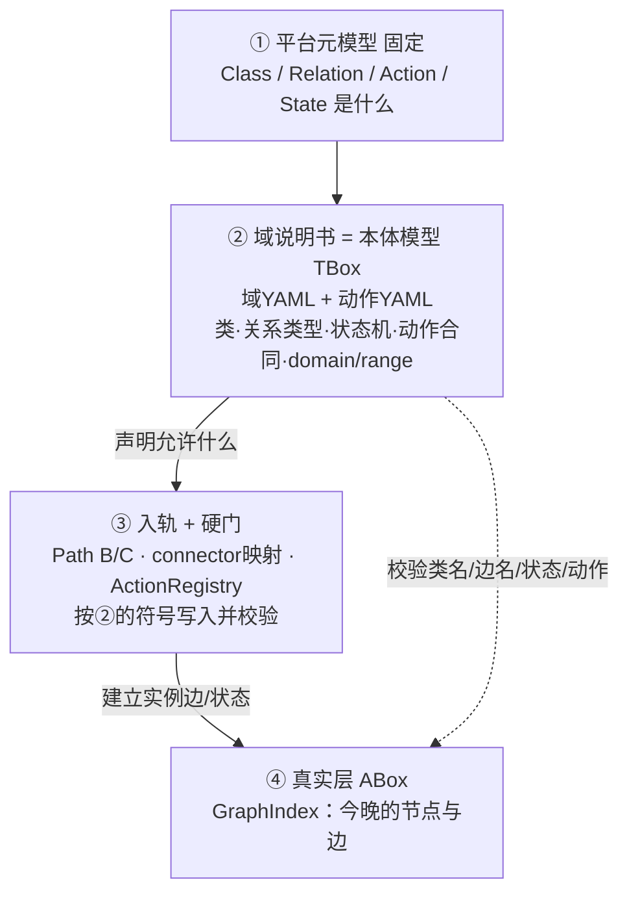

> **图说（一句话）**：② 才是本体模型；③ 按②建④；禁止在②④之间再发明第三套业务词表。

#### 图说（详解）· 四层与「边/动作如何建立」

| 维度 | 说明 |
|------|------|
| **读图目的** | 消掉「说明书像纯文档、真实层边上的 calls 不知从哪来」的误解。 |
| **① 元模型** | 平台固定：什么叫类/关系/动作/状态；不随业务域变。 |
| **② 说明书=本体模型** | `it-ops.yaml` 声明 `Alert`/`calls`/…；动作 YAML 声明 `triage_alert` 的状态门槛与可写边。**关系类型、动作类型都在这一层定义一次。** |
| **③ 入轨+硬门** | 路径 B（webhook/JSON/表映射/confirm）、路径 C（模板种图）调用 `add_entity`/`add_relation`；动作执行写 `suspects`/`rooted_at`。写入时对照②做类名与 domain/range 校验。`connector.json` 是**映射**，把外部列名对到②的符号，不是第三本体。 |
| **④ 真实层** | 只存实例：`SVC-查询 --calls→ SVC-动作` 是④里的一条边，其**类型名** `calls` 必须 ∈②。 |

| 容易混 | 正确拆分 |
|--------|----------|
| 关系类型 `calls` | ② 说明书声明一次 |
| 关系实例「查询调用动作」 | ④ 由③写入的一条具体边 |
| 动作类型 `triage_alert` | ② 动作合同 |
| 某次分诊把 `ALT-主` 改为 `triaging` | ④ 状态写回（经③硬门） |
| 「再加一层本体模型」 | ❌ 重复②；若指映射/校验，那是③ |

**口述 20 秒**

> 说明书不是说明书文档，就是域本体模型：规定能有什么类、什么关系类型、什么动作。真实层的连线和状态，是监控入轨或动作硬门**按这个模型写进去的**；中间没有第三套词表，只有映射和校验。

每篇的复杂事实图**只服务该篇**，不是两边共用的一张「教学全景」。

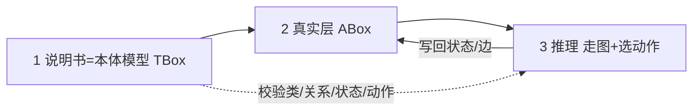

> **图说（一句话）**：解题闭环——模型约束真实层；推理只读已声明符号；写回改状态/边，不另造词表。

#### 图说（详解）· 三层闭环

| 维度 | 说明 |
|------|------|
| **读图目的** | 建立全文共用的操作系统式心智模型：不是「OWL 推完就算」，而是本体模型→真实层→解题写回的闭环。 |
| **怎么读** | 从左到右实线：TBox 约束 ABox 能长什么；ABox 供推理走图；推理选动作后**写回** ABox。虚线：说明书还校验推理步骤里用的类/关系/状态/动作是否合法。写入通道（入轨/硬门）见 §0.1.1 之③，本图从简。 |
| **节点含义** | `1 说明书`=**域本体模型**（类、边类型、状态机、动作合同）；`2 真实层`=今晚现场实例与边；`3 推理`=Agent/人工解题过程，不是第三套本体。 |
| **刻意强调** | 写回箭头指向真实层——结论要落在图上的状态/边上，而不是只写在聊天记录里。 |
| **接到下一节** | §0.2 回答「实例从哪来」；上篇 A3 / 下篇 B3 用具体节点演示这一闭环。 |


### 0.2 应有能力：数据源 / 已有本体 → 真实层（路径 A/B/C）

本体**不**凭空长出今晚的告警实例。说明书（=本体模型）只声明允许什么；真实层内容靠三条**入轨**写入（细节见 §0.1.1）：

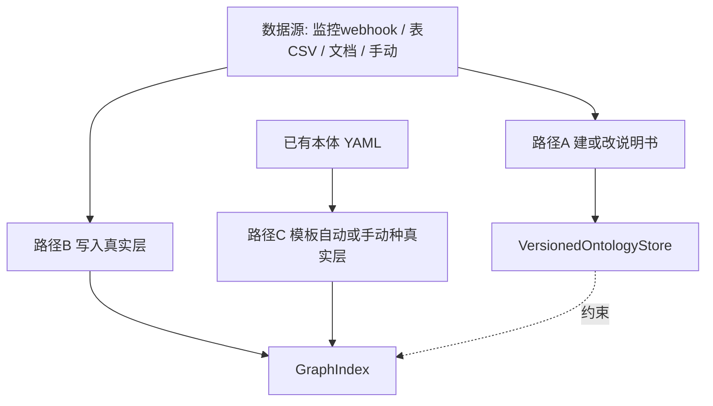

> **图说（一句话）**：实例不从 TBox「长出」；A 改说明书，B 写真实层，C 按已有说明书模板种图。

#### 图说（详解）· 路径 A/B/C

| 维度 | 说明 |
|------|------|
| **读图目的** | 纠正「有了本体就会自动冒出今晚告警」的误解；产品能力是三条**入轨**，不是 TBox 推导现场。 |
| **怎么读** | 上方「数据源」可同时喂路径 A 与 B；左侧「已有本体」只喂路径 C。A 落 VersionedOntologyStore（改说明书）；B/C 落 GraphIndex（写实例）。虚线「约束」表示 live YAML 校验图上符号。 |
| **三条路径分别干什么** | **A**=文档/代码→提案→apply 改类定义；**B**=监控 webhook / 表 CSV / JSON / 抽取 confirm → 写实例；**C**=AcceptTab 模板按已有 YAML 种教学/演示图。 |
| **常见误读** | 「根据本体生成真实层」若指 C，正确；若指「HermiT 推出来今晚告警」，错误。 |
| **接到下一节** | 上篇用叙事模拟「已写入后的现场」；下篇 B2/B3 标明 B 与 C 的代码入口。 |


| 路径 | 应有行为 | aiPlat 现状（防假绿 · 2026-09） |
|------|----------|--------------------------------|
| A 数据源→说明书 | 抽取草稿→confirm→本体提案 apply；代码/ER 亦可产**提案草稿** | **已实现竖切**：confirm 入队 → 批准 → apply 回执写 live YAML；`POST .../ontology/code-suggestions` 仅草稿、**禁自动 apply** |
| B 数据源→真实层 | 导入/抽取确认后写 GraphIndex | **已实现竖切（多入口）**：① JSON `POST .../graph/import`；② **webhook** `POST .../graph/webhook/{source_id}`（connector.json）；③ **表/CSV** `source_type=table_map`；④ 抽取 `confirm`→`write_extraction_to_graph_index`。DB 全自动建全域仍弱 |
| C 已有说明书→真实层 | 场景模板自动种 或 管理端手动建 | **已实现**：AcceptTab「演示告警」+「教学复杂拓扑」+（同构）`retail-ops`；种图前对齐故障版 `it-ops.yaml`；生产同步仍靠路径 B 数据源 |

「根据本体生成真实层」= 路径 C（模板/映射写入并校验），**不是** TBox 推导出业务现场。

### 0.3 下篇额外口径（读 B 篇前扫一眼）

| 口径 | 说明 |
|------|------|
| 三柱 | 数据=GraphIndex；逻辑=axioms / inference_rules（软）；行动=customer_action（硬）。`GET .../ontology/pillars/{domain}` + AcceptTab 速览 |
| 建议≠权威 | `GraphInference` / 离线 OWL 审稿 → 建议；落图须 `assert_inferred_*` 或提案。未跑检查 → `status=unchecked`，`valid` 不得为 true |
| 权限竖切 | GraphIndex ABox ACL + 角色桥（viewer/analyst/admin）；**非**企业全域 CBAC |
| 非目标 | 运行时 HermiT/OWL 权威；建模期内置完备 OWL 推理；星邺人天数字复现 |

### 0.4 PPT 原页对照（备课索引）

材料页码据 [`ONTOLOGY_XINGYE_PPT_ANALYSIS.md`](./ONTOLOGY_XINGYE_PPT_ANALYSIS.md) §2；页码为约数。读本文件时用下表定位「讲到哪一页该翻本文哪一节」。

| 材料约页 | 材料在讲什么 | 本文对应 | 口述入口 |
|----------|--------------|----------|----------|
| ~7 | 产品分层 Onto→AI→Super→数字员工 | 上篇不必展开；下篇用「说明书底座→Agent→场景」代替产品名 | — |
| ~14–15 | 业务本体定义需求 / 实施四阶段 | 概念对齐 §0.1–0.2；不复述人天数字 | — |
| ~17–18 | **故障诊断**场景（调用链 + 超级智能体） | **上篇 A1–A3**；对照工程闭环读 **下篇 B1–B3** | A3.5 / B3.6 |
| ~19–20 | **数据治理**场景（元数据/目录/分类） | **上篇 A4**；对照竖切读 **下篇 B4** | A4.6 / B4.6 |
| ~21 | 企业运营本体规模数字 | **不展开**（宣传数字未验证）；需要规模感时指 OUTCOME，不抄材料数字 | — |

**讲解顺序建议（一场 20 分钟）**

1. 打开材料故障页 → 口述 **A3.5（90s）** 同时翻 A3.2 全景图 → 镜1–5 各指一个节点。  
2. 切到材料治理页 → 口述 **A4.6（90s）** + A4.3 全景。  
3. 换到下篇：**B3.6** 演示 AcceptTab 三动作（或只口述）；**B4.6** 讲闸门与「不齐步」。  
4. 收束：附录用词对照 + 「效果数字不跟吹」。

### 0.5 口述稿怎么用

| 规格 | 何时用 |
|------|--------|
| **30 秒** | 电梯间 / 翻页过渡：只讲「问题→做法→落点」 |
| **90 秒** | 对着一张全景图讲完筛选逻辑；不要念节点清单 |
| **详解表** | 被追问「这个边为什么虚线」时翻对应图说（详解） |

---

# 上篇 · 星邺汇捷

> 据 PPT 叙事 + **本篇专用模拟事实**。不描述 aiPlat。  
> **PPT 锚点**：材料约第 17–18 页（故障）、约第 19–20 页（治理）。

## A1. 本体（说明书）结构

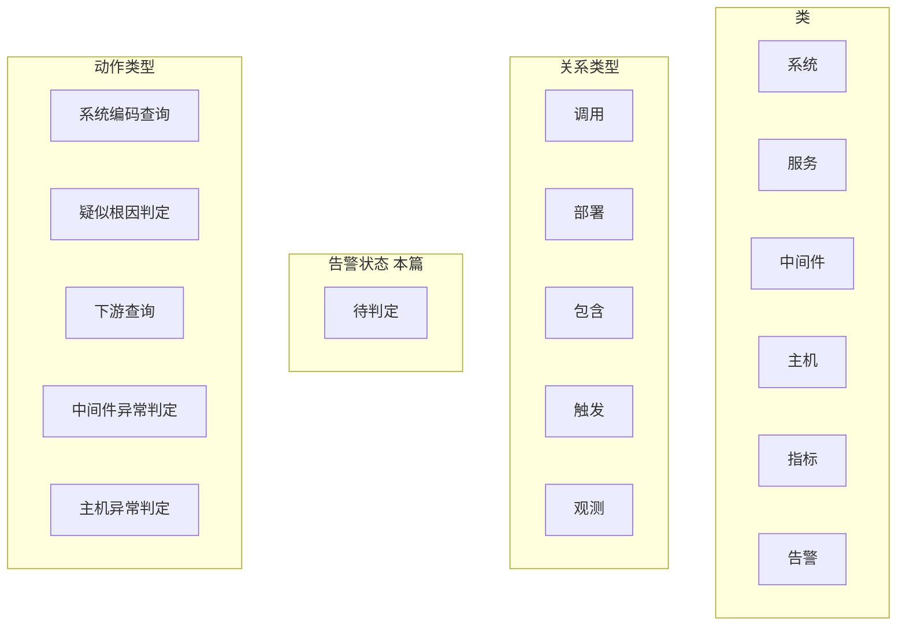

**命名约定（上篇故障 · 强制）**

| 层 | 规则 | 例子 |
|----|------|------|
| 说明书类 | 裸名 | `告警` `服务` `中间件` |
| 真实层实例 | `类·专名` | `告警·查询超时` `服务·查询` `中间件·Redis主` |
| 材料英文别名 | 只作属性/括号备注，**不当第二套节点 id** | 材料称 cast-query → 属性备注，节点仍叫 `服务·查询` |
| 状态 | 仅用说明书「告警状态」枚举 | `待判定`（本例）；勿自造 |

> 已删未入图的死类 `服务节点`（材料若出现，本篇并入 `服务`）。

> **图说（一句话）**：上篇说明书词表——类 / 关系类型 / 动作类型；不含今晚具体告警实例。

#### 图说（详解）· 上篇 A1 说明书词表

| 维度 | 说明 |
|------|------|
| **读图目的** | 先钉死星邺材料侧「能出现哪些词」——后面 A3.2 复杂图、A3.3 推理镜只能用这里出现过的符号。 |
| **怎么读** | 三个子图并列：`类`=能画的对象种类；`关系类型`=边的合法类型名；`动作类型`=可挂在对象上执行的合同名（不是常驻实例节点）。 |
| **类（左）** | 系统 / 服务 / 中间件 / 主机 / 指标 / 告警——描述「世界上有什么种类的东西」（无独立「服务节点」类）。 |
| **状态** | 本例告警只用 `待判定`；真实层 `状态=…` 必须 ∈ 此枚举。 |
| **关系（中）** | 调用 / 部署 / 包含 / 触发 / 观测——描述「种类之间允许怎样连边」。 |
| **动作（右）** | 系统编码查询、疑似根因判定、下游查询、中间件/主机异常判定——描述「解题时允许对哪些对象发令」。 |
| **本图画了什么 / 没画什么** | **有**：类型词表 + 告警状态枚举。**没有**：具体实例专名（`·` 后面那段）。实例在 A3.2。 |
| **三层一致** | A3.2 若画出说明书没有的类名或边名，即违规；推理镜若发明第四套动作名，亦违规。 |


故障例关键是 **对象 + 动作 + 走图**。本篇也要求**三层一致**：A1 有的类/关系/动作，A3.2 才能画，A3.3 推理才能用。材料中的推理机名不作为本例关键路径。

---

## A2. 事实层从哪来

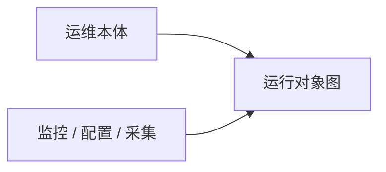

> **图说（一句话）**：本体约束种类；实例由外部写入。下面 A3 的图是**模拟写入后的现场**，用来讲清筛选。

#### 图说（详解）· 上篇 A2 事实层来源

| 维度 | 说明 |
|------|------|
| **读图目的** | 用最小两箭头说明：运维本体只约束「能有什么种类」；运行对象图的内容来自监控/配置/采集写入。 |
| **怎么读** | 左「运维本体」→「运行对象图」=类型约束；下「监控/配置/采集」→「运行对象图」=实例供给。两箭头缺一不可。 |
| **对后续图的含义** | A3.2 那张「复杂」图应理解成**已经写入后的快照**，用来练习筛选与排除，不是本体自动生成的清单。 |
| **与下篇对照（读完上篇再看）** | 下篇把「外部写入」拆成路径 B/C 的具体 API；上篇保持材料叙事即可。 |


---

## A3. 例子一：故障诊断（对着复杂事实解题）

### A3.1 业务问题

晚高峰积分系统告警**同时响多条**。入口症状是查询超时（材料英文常写 cast-query，**本篇实例名统一为** `服务·查询`）。  
要回答：**根因是哪个运行对象？** 并说清为何不是磁盘告警、旁路从库、慢 SQL 主因。

### A3.2 本篇模拟事实层（运行对象图）

> 以下名称仅用于上篇理解，由「监控/配置」叙事写入，**不是**本体定义出来的实例清单。  
> **命名**：一律 `类·专名`，类名 ∈ A1；状态 ∈ A1「待判定」。  
> **动作不画成独立实例节点**：材料动作类型挂在主告警旁（可执行清单）；执行效果见 A3.3；**不**暗示已有 `suspects`/`rooted_at` 边（那是下篇 B1）。

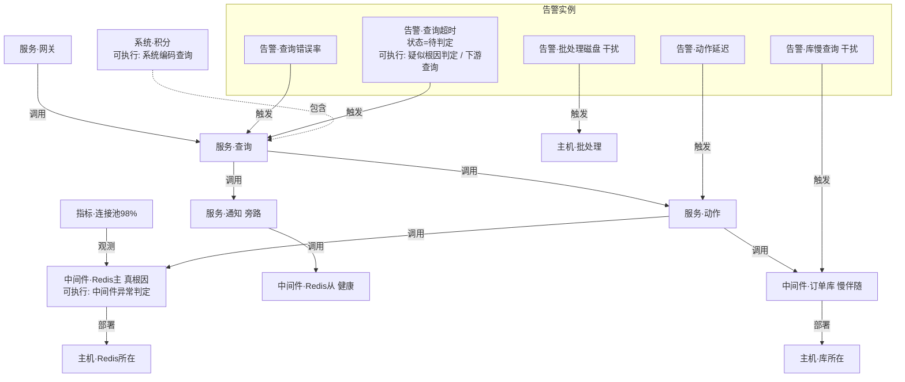

> **图说（一句话）**：上篇教学全景——多告警同场、主路径与旁路、Redis 主/从对比、批处理噪音；节点名仅本篇使用。

#### 图说（详解）· 上篇 A3.2 故障教学全景

| 维度 | 说明 |
|------|------|
| **读图目的** | 给「多告警同时响」一个足够吵的现场，让后续镜 1–5 的「选入口 / 丢噪音 / 旁路证伪 / 主路径落点」每一步都有东西可指。 |
| **怎么读（建议顺序）** | ① 先扫 `告警实例` 子图：五条告警同场；② 看 `告警·查询超时` 触发到 `服务·查询`——这是入口主线索；③ 从查询服务看出边：`调用→动作`（主路径）与 `调用→通知`（旁路）；④ 主路径落到 `Redis主`（池打满）与 `订单库`（慢伴随）；⑤ 旁路落到健康的 `Redis从`；⑥ 最下方批处理磁盘支路与主调用闭包不相交——是噪音。 |
| **关键节点** | `系统·积分`=业务边界；`服务·查询`=症状落点服务；`中间件·Redis主`=真根因候选；`中间件·Redis从`=用于证伪「产品全挂」；`告警·批处理磁盘`/`主机·批处理`=闭包外干扰。 |
| **关键边** | 实线 `触发`/`调用`/`部署`/`观测`=现场已存在的关系；读镜时虚线化表示「本步不选」或「排除」。 |
| **动作怎么画** | 动作**不是**图上的常驻节点；写在告警/系统旁的「可执行: …」表示合同挂载，执行效果见 A3.3。 |
| **节点命名** | 一律 `类·专名`（∈ A1）。跨篇对照见文末附录表 A。勿与下篇 `ALT-主`/`SVC-查询` 混读。 |


#### 动作合同层（说明书类型 → 作用在哪些对象）

> 材料叙事动作名；**不是** aiPlat `action_id`。

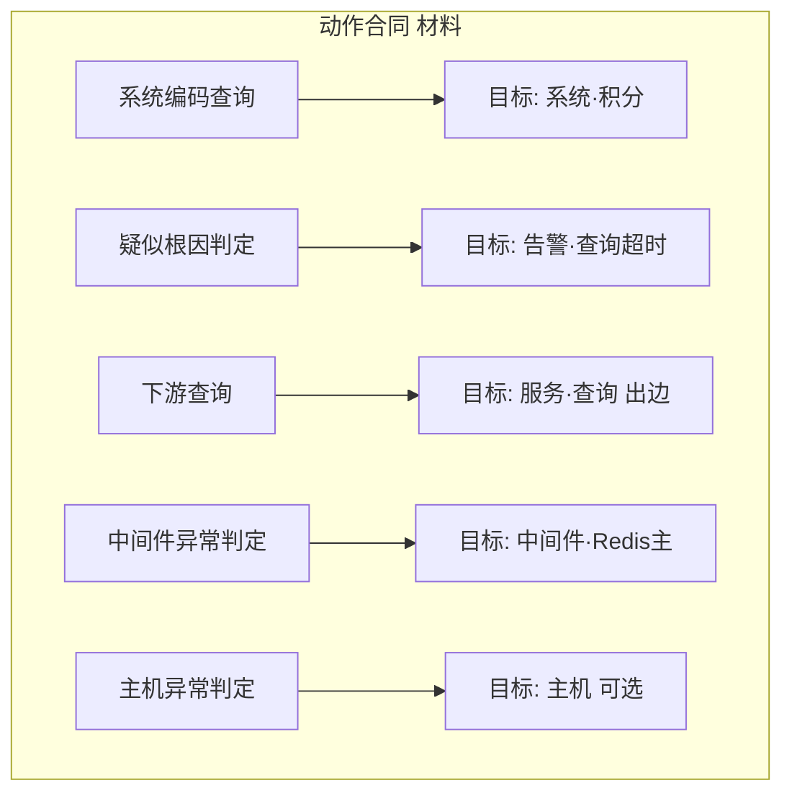

> **图说（一句话）**：材料动作类型挂在目标对象上（合同），不是常驻实例节点；执行效果改状态与边。

#### 图说（详解）· 上篇 A3 动作合同层

| 维度 | 说明 |
|------|------|
| **读图目的** | 把 PPT 里的「对象动作」画成**合同映射**：动作类型 → 作用在哪个运行对象上，避免把动作画成第五类「实例节点」。 |
| **怎么读** | 左列五个动作类型各指向一个目标对象；箭头含义是「对该对象发令」，不是「调用边」。 |
| **与事实图关系** | 执行后：改目标对象的**状态**或解题标注；**不**在图上永久留动作节点。上篇材料**无**正式写回边类型（勿画 `suspects`——那是下篇）。 |
| **材料名 vs 产品 id** | 此处是星邺材料叙事名；下篇换成 `triage_alert` / `link_suspect` / `mark_root_cause` 等 YAML `action_id`。 |


| 动作类型（材料） | 要求/时机 | 在事实图上改什么 |
|------------------|-----------|------------------|
| 系统编码查询 | 开场 | 锁定 `系统·积分` |
| 疑似根因判定 | 多告警并存 | 选定 `告警·查询超时` 为主线索 |
| 下游查询 | 已有主告警 | 沿 `服务·查询` 调用边展开/旁路对比 |
| 中间件异常判定 | 走到中间件 | 结合指标判定 `Redis主` |
| 主机异常判定 | 需要主机层 | 本例不落主机根因 |

**这张图为什么「复杂」才有用：**

| 现象 | 解题时要做什么 |
|------|----------------|
| 5 条告警一起响 | 不能每条都当根因入口 |
| 查询服务两条出边 | 主路径 vs 旁路，要对比 |
| Redis 主池打满、从库健康 | 排除「整个 Redis 产品挂了」 |
| 订单库也慢 | 可能是被拖累的伴随，不是第一推动 |
| 批处理磁盘告警 | 与查询调用闭包无关，应丢掉 |

### A3.3 逐步解题（每镜 = 事实图快照）

以下节点名与 **A3.2** 完全一致。口号流水线已去掉；读图顺序即解题顺序。

**镜1 · 执行「系统编码查询 + 疑似根因判定」定入口**

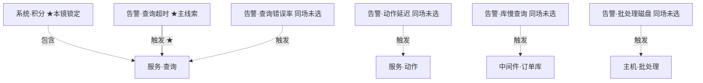

> **图说（一句话）**：入口只认 `系统·积分` + `告警·查询超时→服务·查询`；其余告警同场但本镜不选。

#### 图说（详解）· 上篇镜1 定入口

| 维度 | 说明 |
|------|------|
| **读图目的** | 演示「同场多告警」时如何选定**唯一主线索**，而不是把每条告警都当根因入口。 |
| **怎么读** | ★ 标记的是本镜锁定对象：`系统·积分`、`告警·查询超时`；实线 `触发 ★` 指向 `服务·查询`。其余告警到各自目标的边画成虚线，表示「同场存在但本步不选」。 |
| **执行了哪些材料动作** | `系统编码查询`（锁系统）+ `疑似根因判定`（锁主告警）。 |
| **本镜改了什么 / 没改什么** | 认知上锁定入口；图上尚未宣称根因。磁盘、慢 SQL、错误率告警仍在场，留给后续镜排除。 |
| **接到镜2** | 以 `服务·查询` 为起点做调用闭包。 |


**镜2 · 执行「下游查询」：调用闭包，丢闭包外噪音**

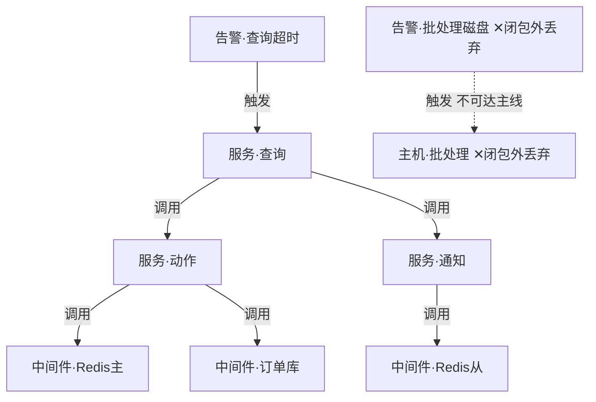

> **图说（一句话）**：从 `服务·查询` 沿「调用」展开可达集；`告警·批处理磁盘`/`主机·批处理` 不在闭包内 → 移出主线。

#### 图说（详解）· 上篇镜2 调用闭包丢噪音

| 维度 | 说明 |
|------|------|
| **读图目的** | 用「可达集」把与主线索调用链无关的告警/主机移出主线，降低认知噪音。 |
| **怎么读** | 从 `服务·查询` 沿实线 `调用` 走到动作/通知及下游中间件——这些在闭包内。左下 `告警·批处理磁盘 → 主机·批处理` 用虚线标「不可达主线」，打 ✕。 |
| **为何批处理要丢** | 它不在查询服务的调用闭包里；若强行当根因，会违反「从症状服务走图」的解题纪律。 |
| **本镜产物** | 主线候选集合缩小；尚未判定 Redis 主从谁有罪。 |


**镜3 · 执行「下游查询」：旁路证伪**


> **图说（一句话）**：走 `查询→通知→Redis从`；对象健康 → 证伪「Redis 产品全挂」。

#### 图说（详解）· 上篇镜3 旁路证伪

| 维度 | 说明 |
|------|------|
| **读图目的** | 专门走**旁路**调用链，用健康对象证伪「整个 Redis 产品都挂了」这类过粗结论。 |
| **怎么读** | 只保留 `服务·查询 → 服务·通知 → 中间件·Redis从`；标注健康与 ★排除。 |
| **为何需要旁路** | 主路径上 Redis 主异常时，若不同时看从库，容易把「一个实例」说成「一类中间件全挂」。 |
| **本镜产物** | 证伪全集群故障叙事；根因候选收窄到主路径对象。 |


**镜4 · 执行「中间件异常判定」：主路径 + 指标；订单库降级伴随**

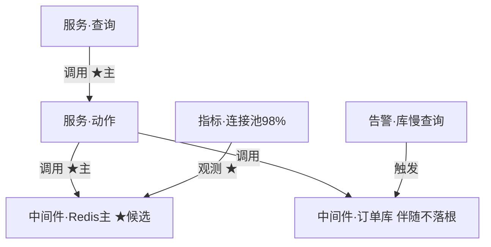

> **图说（一句话）**：主路径 `查询→动作→Redis主` + 池打满 → 首选根因；`订单库` 有慢告警但解释为伴随。

#### 图说（详解）· 上篇镜4 主路径 + 指标

| 维度 | 说明 |
|------|------|
| **读图目的** | 在主调用链上结合指标，给出**首选根因**，并把同场慢库解释为伴随而非第一推动。 |
| **怎么读** | 粗实线主路径：`查询→动作→Redis主`；`指标·连接池98%` 经 `观测` 落在 Redis 主上。`订单库` 仍被动作调用且有慢告警，但标注「伴随不落根」。 |
| **本镜产物** | 首选运行对象 = `中间件·Redis主`；等待镜5向业务交代。 |

#### 结论如何得到（镜4 判定表 · 强制读）

本步**不是**「利用率高 = 根因」的单点规则，也**不是** OWL 推理机输出；而是教学场景里的**排除法 + 拓扑 + 指标对齐**启发式。镜2 之后 Redis主与订单库**同在闭包**，必须再比一轮：

| 判据 | `中间件·Redis主` | `中间件·订单库` |
|------|------------------|-----------------|
| 在症状服务主调用链上？ | 是：`查询→动作→它` | 是：`动作→它`（并行下游） |
| 是否有**直接观测落在该对象**上的异常指标？ | **有**：连接池 98% | **无**对等「第一推动」指标（仅有慢告警本身） |
| 能否顺畅解释入口症状（查询超时）？ | 池打满 → 动作/查询侧等待、超时 | 库慢**可以是结果**：上游因 Redis 卡住后堆积/拖慢访库 |
| 旁路对照（镜3） | 从库健康 → 更像**单实例**问题，非品类全挂 | — |

因此口述拆成两句：

1. **首选根因** = 主路径对象 + 有指向它的异常指标 → `Redis主`  
2. **伴随** = 同场仍有告警，但缺「它是第一推动」的证据，且拓扑上更像受害者 → `订单库` **本镜不落根**

**边界（讲给追问者听）**

- 「伴随」是工程启发式，**未证明**严格因果；生产还要看时序（谁先爆）、限流重试、依赖方向。  
- 教学图**故意**把证据配成「Redis 有指标、库只有慢告警」；若现场证据相反，结论应改判。  
- 上篇镜5 只是口述落点；下篇须经动作硬门写回才算可审计结论。


**镜5 · 落点**


> **图说（一句话）**：对业务交代的运行对象即本节点。

#### 图说（详解）· 上篇镜5 落点

| 维度 | 说明 |
|------|------|
| **读图目的** | 把前面四镜的排除与证据收敛成**一个**可对业务口述的运行对象。 |
| **怎么读** | 单节点图刻意极简：结论不是一段话，而是图上的那个对象。 |
| **材料侧注意** | 上篇材料未必有与下篇对等的「写回合同」；重点是落点可指回 A3.2 同一节点名。 |
| **与下篇对照** | 下篇镜5a/5b 会用硬门真正改 `state` 与 `suspects`/`rooted_at` 边。 |


| 镜 | 执行的动作（材料） | 图上实施 | 结果 |
|----|--------------------|----------|------|
| 1 | 系统编码查询 + 疑似根因判定 | 锁 `系统·积分`、`告警·查询超时` | 正确入口 |
| 2 | 下游查询（闭包） | 丢 `批处理磁盘` 支路 | 噪音下降 |
| 3 | 下游查询（旁路） | `通知→Redis从` 健康排除 | 证伪全集群 |
| 4 | 中间件异常判定 | 主路径 + 指标；库=伴随 | Redis主首选 |
| 5 | （结论，材料侧无单独写回合同） | 落点=`中间件·Redis主` | 可交代 |

贯穿机制（材料）：SuperStar 规划 → 对象动作 → 沿调用/部署走图 → 落点。

### A3.4 本例小结

复杂事实让「排除」可见；说明书提供合法关系与动作类型；事实图提供今晚这些对象。解题步骤必须能指回 A3.2 同一节点。

### A3.5 口述稿（对 PPT 约第 17–18 页）

**对着图**：A3.2 全景；被追问时翻镜1–5 详解表。

**30 秒**

> 晚高峰积分系统多条告警同时响。我们不靠口号，而是对着运行对象图解题：先锁定查询超时这条主线索，再沿调用链丢掉批处理噪音，用旁路健康的 Redis 从库证伪「整个 Redis 挂了」，最后把根因落到 Redis 主实例——连接池打满，订单库慢只是伴随。

**90 秒（指着 A3.2）**

> 请看这张教学全景：上面五条告警同场，下面是服务与中间件。入口不是随便挑一条，而是「系统·积分 + 告警·查询超时 → 服务·查询」。从查询服务有两条调用出边——左边主路径经动作服务到 Redis 主和订单库，右边旁路经通知到 Redis 从。批处理磁盘告警连到批处理主机，根本不在查询调用闭包里，第一步就要丢掉。旁路 Redis 从是健康的，所以不能说「Redis 产品全挂」。到这里 Redis 主和订单库**都还在闭包里**——不能只看谁有告警。主路径上 Redis 主挂着连接池 98% 的观测指标，能顺畅解释查询超时；订单库虽有慢告警，但没有对等的第一推动指标，更像被上游拖累的伴随，所以本步不落根。对业务交代的落点就是中间件·Redis 主。判定表见 A3.3 镜4「结论如何得到」。说明书提供合法的类、关系和动作类型；图上这些节点是监控写入的实例，不是本体长出来的。


**翻页钩子 → 下篇**

> 同一套排除逻辑，在 aiPlat 里换成可执行词表和硬门写回——见下篇 B3。

---

## A4. 例子二：数据治理（与例子一同结构）

> 本例同样遵守三层一致：先定说明书词表 → 再画真实层 → 推理镜只用已声明符号。  
> **PPT 锚点**：材料约第 19–20 页。

### A4.1 业务问题

元数据缺、目录两张皮；同一业务线下多张表成熟度不一，还有**幽灵表 / 错挂目录 / 断链血缘**干扰，不能「一律入库走完河」。

### A4.2 本例说明书词表（治理向 · 材料）

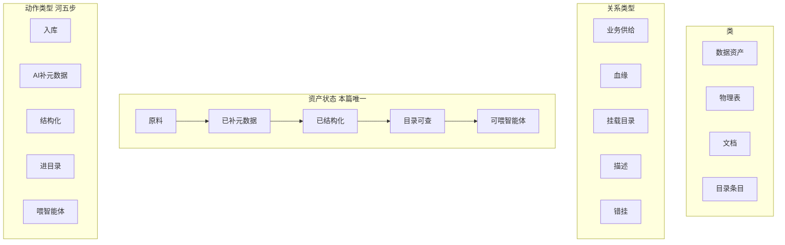

**命名约定（上篇治理 · 强制）**

| 层 | 规则 | 例子 |
|----|------|------|
| 说明书类 | 裸名 | `数据资产` `物理表` `文档` `目录条目` |
| 真实层实例 | `类·专名`（图上 `资产·` = `数据资产·` 短前缀） | `资产·积分流水` |
| 目录实例 | 必须 `目录条目·*`，禁止 `目录·` | `目录条目·账户` |
| 状态 | 仅五档；「语义不完整」只能当**属性** | `状态=已补元数据` + 属性 |
| 关系 | 含正式类型 `错挂`；幽灵孤立只用图注虚线，不发明 `无供给边` 类型 | |
| 动作短名 | 说明书正式名 `结构化`（材料全称「结构化/本体与图谱」仅备注） | |

> **图说（一句话）**：上篇治理说明书——类/关系/状态河 + 材料「河五步」动作类型；不含具体表实例。

#### 图说（详解）· 上篇 A4.2 治理说明书词表

| 维度 | 说明 |
|------|------|
| **读图目的** | 与故障例同构：先定治理向类型词表，再允许画资产图与推理镜。 |
| **怎么读** | 类 → 关系（含 `错挂`）→ 状态河五档 → 河五步（正式短名 `结构化`）。 |
| **状态河含义** | 不是告警三态；表示资产从原料到可消费的成熟度台阶。河五步动作挂在资产上推进台阶。 |
| **没有什么** | 没有具体表名、幽灵表实例——那些在 A4.3。 |


### A4.3 本篇模拟真实层（复杂资产图）

> 实例由采集/导入写入，**不是**说明书生成。节点名仅上篇使用；类前缀与状态 ∈ A4.2。

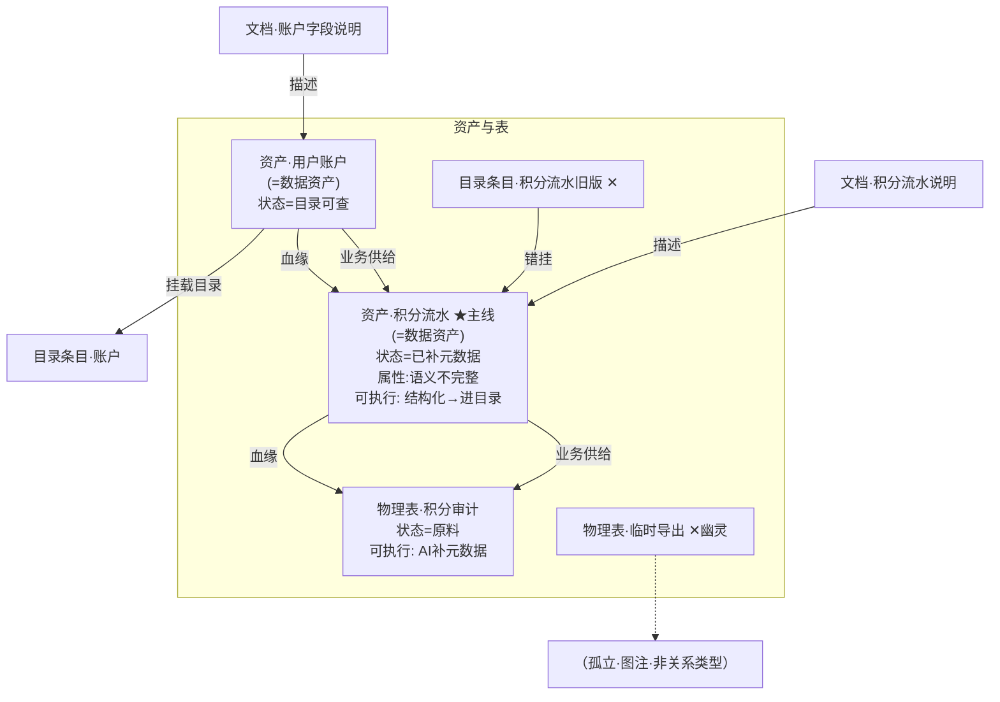

> **图说（一句话）**：上篇治理教学全景——主线流水、账户金标准、审计原料、幽灵表、错挂目录；解题要排除噪音。

#### 图说（详解）· 上篇 A4.3 治理教学全景

| 维度 | 说明 |
|------|------|
| **读图目的** | 制造「多表洪水」：主线、金标准、支线、幽灵、错挂同场，逼着解题先选题再跑河。 |
| **怎么读** | ① 找主线资产（积分流水）；② 找金标准对照（账户）；③ 找尚未就绪支线（审计）；④ 标出幽灵表与错挂目录——应丢弃或纠偏，而不是齐步跑满五步。 |
| **文档节点** | 「账户字段说明」支撑金标准；「流水说明不完整」解释主线为何卡在结构化前。 |
| **解题纪律** | 禁止对幽灵表跑完整条治理河；禁止把错挂目录当发布成功。 |


| 对象 | 现状 | 为何复杂 | 治理重点 |
|------|------|----------|----------|
| 资产·用户账户 | 状态=`目录可查` | 金标准对照 | 不必重做河 |
| 资产·积分流水 | 状态=`已补元数据`+属性语义不完整 | **主线** | `结构化`→`进目录` |
| 物理表·积分审计 | 状态=`原料` | 断在河起点 | 先 `AI补元数据` |
| 物理表·临时导出 | 幽灵（孤立图注） | 无业务供给 | **丢弃/不进主线** |
| 目录条目·积分流水旧版 | 边类型 `错挂` | 与现物理名不一致 | **纠挂或下线** |

#### 动作合同层（材料河 → 作用对象）

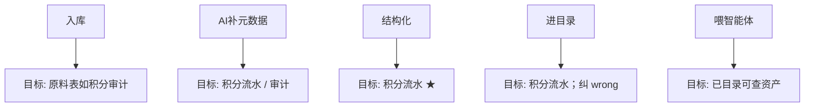

> **图说（一句话）**：材料「河五步」动作合同——每步挂在目标资产/表上；主线优先跑结构化+进目录，支线不必齐步。

#### 图说（详解）· 上篇 A4 河五步动作合同

| 维度 | 说明 |
|------|------|
| **读图目的** | 把材料里的治理步骤画成「动作→目标对象」合同，强调**对症**而非齐步。 |
| **怎么读** | 每步动作指向其合法目标；主线优先结构化与进目录；审计支线可只做到元数据。 |
| **与故障例同构点** | 动作仍不是常驻实例节点；执行改状态/挂载边。 |


### A4.4 推理镜（锚定 A4.3）

**镜1 · 定主线资产**

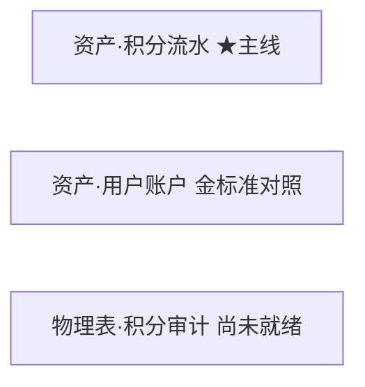

> **图说（一句话）**：定主线=`资产·积分流水`；账户作金标准对照；审计支线尚未就绪。

#### 图说（详解）· 上篇治理镜1 定主线

| 维度 | 说明 |
|------|------|
| **读图目的** | 在复杂资产图中先选题：哪条资产本轮要推进。 |
| **怎么读** | ★ 主线=积分流水；账户=对照金标准；审计=原料、本轮不齐步。 |
| **为何先选题** | 否则会对幽灵/错挂/全表齐步「假绿」。 |


**镜2 · 丢幽灵、标错挂**

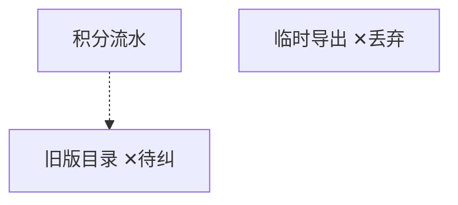

> **图说（一句话）**：丢弃幽灵表；旧版目录标为错挂待纠——噪音↓。

#### 图说（详解）· 上篇治理镜2 丢噪

| 维度 | 说明 |
|------|------|
| **读图目的** | 显式执行「排除」：幽灵表出题面，错挂目录标待纠。 |
| **怎么读** | ✕ 幽灵 / 错挂与主线的虚线关系表示应断开或纠偏，不是继续往下跑河。 |
| **产物** | 主线周围噪音下降，才能做结构化。 |


**镜3 · 对主线执行「结构化」**


> **图说（一句话）**：对主线执行「结构化」——语义不完整→已结构化，才可进目录。

#### 图说（详解）· 上篇治理镜3 结构化

| 维度 | 说明 |
|------|------|
| **读图目的** | 主线从「语义不完整」推进到「已结构化」，满足进目录前置。 |
| **怎么读** | 动作落在主线资产上；文档不完整是输入动机，不是跳过结构化的理由。 |


**镜4 · 执行「进目录」+ 纠错挂**

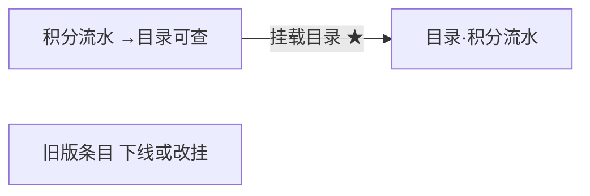

> **图说（一句话）**：主线挂载真源目录；旧版条目下线或改挂。

#### 图说（详解）· 上篇治理镜4 进目录

| 维度 | 说明 |
|------|------|
| **读图目的** | 完成「可被检索消费」的目录挂载，并处理旧版错挂。 |
| **怎么读** | 主线→真源目录为正确挂载；旧版条目下线或改挂，避免两张皮。 |


**镜5 · 审计支线只做到「补文档」；账户可喂智能体**

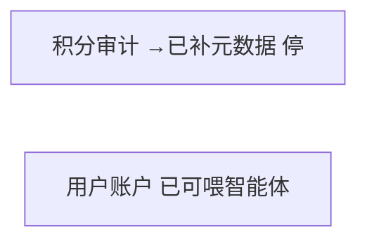

> **图说（一句话）**：审计支线只补到元数据即停；账户已可喂智能体——河五步不是每张表都跑满。

#### 图说（详解）· 上篇治理镜5 对症停步

| 维度 | 说明 |
|------|------|
| **读图目的** | 证明「成功」=对症推进，不是全图同一终点。 |
| **怎么读** | 审计停在元数据；账户已达可喂智能体；与主线终点可以不同。 |
| **反模式** | 强迫审计也跑满五步制造假绿。 |


| 镜 | 动作（材料） | 真实层操作 | 结果 |
|----|--------------|------------|------|
| 1 | （选题） | 锁积分流水为主线 | 不对齐账户重做 |
| 2 | （筛选） | 丢幽灵；标错挂 | 噪音↓ |
| 3 | 结构化 | 改流水状态 | 可进目录 |
| 4 | 进目录 | 挂载+纠 wrong | 目录真源 |
| 5 | 补元数据 / 喂智能体 | 审计停半程；账户可用 | 对症下药 |

贯穿：材料河五步**不是**每张表都跑满；推理按真实层成熟度选动作。

### A4.5 本例小结

与例子一相同：复杂真实层让排除可见；说明书给动作类型；推理镜指回同一节点。

### A4.6 口述稿（对 PPT 约第 19–20 页）

**对着图**：A4.3 资产全景。

**30 秒**

> 治理不是「所有表齐步走完五步河」。现场有主线流水、账户金标准、审计原料，还有幽灵表和错挂目录。先选题、丢噪音，再对主线做结构化并挂真源目录；审计可以只补到元数据，账户已经可以喂智能体——对症才算成功。

**90 秒（指着 A4.3）**

> 这张图故意画得很吵：积分流水是本轮主线，账户是已经进目录的金标准，审计表还是原料。旁边幽灵临时表、旧版错挂目录，如果也去跑完整条治理河，就会假绿。正确顺序是：定主线 → 丢幽灵、标错挂 → 对主线结构化 → 挂真源目录并下线旧版 → 支线对症停步。材料里的「河五步」是动作合同类型，挂在目标资产上执行，不是图上的常驻节点。效果数字（补齐率、人天）是宣传声称，讲场景时不要跟吹。

**翻页钩子 → 下篇**

> aiPlat 把「改说明书」和「写实例」拆成闸1 / confirm / 闸2，见下篇 B4。

---

## A5. 上篇总表

| | 内容 |
|--|------|
| 本体 | 故障向 + 治理向类/关系/动作；与真实层、推理同词 |
| 故障 | 复杂真实层 + 镜1–5 + **口述 A3.5**（PPT ~17–18） |
| 治理 | 复杂资产图（幽灵/错挂/断链）+ 镜1–5 + 动作合同 + **口述 A4.6**（PPT ~19–20） |

---

# 下篇 · aiPlat

> 只写 aiPlat。B3：路径 C 种真实层（minimal / complex）+ **路径 B 表/CSV·webhook** + 动作硬门。B4：路径 A/B 治理双轨。三柱与建议层见 §0.3。  
> **与 PPT 关系**：故事同构上篇；词表与硬门以代码为准。不复述材料人天/准确率。

## B1. 本体（说明书）— 与代码一致

锚点：[`it-ops.yaml`](../../aiPlat-core/workspace_seeds/ontologies/it-ops.yaml)、[`it_ops_alert_lifecycle.yaml`](../../aiPlat-core/core/workspace_seeds/actions/it_ops_alert_lifecycle.yaml)。

**下篇只用这一张词表**（真实层与推理不得另造类名/边名/状态名）。

| 种类 | 说明书符号（唯一） | 中文 label |
|------|-------------------|------------|
| 类 | `Alert` / `Service` / `Middleware` / `Host` | 告警 / 服务 / 中间件 / 主机 |
| 关系 | `calls` / `deployed_on` / `suspects` / `rooted_at` | 调用 / 部署于 / 疑似根因指向 / 根因落点 |
| 告警状态 | `open` → `triaging` → `rooted` | 未分诊 → 分诊中 → 已定位根因 |
| 动作 | `customer_action:it-ops:triage_alert` / `link_suspect` / `mark_root_cause` | 分诊告警 / 挂接疑似 / 确认根因 |

```mermaid
flowchart TB
  subgraph lei [类 仅此四类]
    gj["告警 Alert"]
    fw["服务 Service"]
    zjj["中间件 Middleware"]
    zj["主机 Host"]
  end
  subgraph gx [关系 仅此四边]
    dy["calls 调用"]
    bs["deployed_on 部署于"]
    ys["suspects 疑似根因指向"]
    gy["rooted_at 根因落点"]
  end
  subgraph zt [状态机]
    o["open 未分诊"] --> t["triaging 分诊中"]
    t --> r["rooted 已定位根因"]
  end
  subgraph dz [动作 → 状态迁移]
    a1["triage_alert\n要求 open → triaging"]
    a2["link_suspect\n要求 triaging 保持"]
    a3["mark_root_cause\n要求 triaging → rooted"]
  end
```

> **图说（一句话）**：下篇唯一词表——四类、四边、三状态、三动作；真实层与推理不得另造符号。

#### 图说（详解）· 下篇 B1 唯一词表

| 维度 | 说明 |
|------|------|
| **读图目的** | 把代码侧 `it-ops.yaml` + 动作 YAML 收成一张「只准用这些符号」的图，防止演示口述漂移到说明书外的类/边。 |
| **怎么读** | 四块并列：`类`仅 Alert/Service/Middleware/Host；`关系`仅 calls/deployed_on/suspects/rooted_at；`状态机` open→triaging→rooted；`动作`三合同各带状态门槛。 |
| **与上篇差异** | 上篇有「指标」类、「触发/观测」边；下篇**故意没有**——池利用率写中间件属性，告警挂服务写 `service_name` 属性。 |
| **动作块怎么读** | 每个动作下方「要求 … → …」=硬门：状态不对就 blocked，不是软提示。 |
| **接到 B2/B3** | 真实层与推理镜的每个节点标签、边标签都必须能在本图找到对应符号。 |


**故意不在说明书里的**（因此真实层/推理也禁止当正式类或边）：「指标」类、「触发于」边、「观测」边。池利用率等写在中间件**属性**上；告警挂哪个服务写在告警**属性** `service_name`。

---

## B2. 真实层 = GraphIndex（被说明书校验）

```mermaid
flowchart LR
  yaml["it-ops.yaml"] -->|"类/关系/状态"| gi["GraphIndex 真实层"]
  act["动作合同 YAML"] -->|"执行写回"| gi
  pathB["路径B: webhook / JSON / 表CSV / confirm"] -->|"写入实例"| gi
  pathC["路径C: AcceptTab 模板"] -->|"种图"| gi
  reason["推理 Agent/人工"] -->|"只读说明书符号走图"| gi
  sug["建议层 infer / 离线OWL"] -.->|"不得静默写图"| gi
```

> **图说（一句话）**：YAML/Action 约束与写回；路径 B/C 写入实例；推理只读符号；建议层虚线——不得静默改图。

#### 图说（详解）· 下篇 B2 GraphIndex 权威位置

| 维度 | 说明 |
|------|------|
| **读图目的** | 标明谁能写 GraphIndex、谁只能建议；避免把 inference / 离线 OWL 当成已确认事实。 |
| **怎么读** | 实线写入：YAML 约束、动作写回、路径 B（webhook/JSON/表/confirm）、路径 C（AcceptTab）。推理实线「只读走图」。建议层（infer / 离线 OWL）**虚线**且标注不得静默写图。 |
| **权威链** | 审计与业务结论只认 GraphIndex 上经硬门写下的状态/边；Wiki、聊天、建议列表不是权威。 |
| **接到 B3** | 教学复杂图由路径 C 种出；生产现场由路径 B 写入；解题写回只走三动作。 |


Wiki 非权威。下面 B3 的教学图**只用 B1 词表**。路径 B 配置见 [`ONTOLOGY_CONNECTOR_TEMPLATES.md`](./ONTOLOGY_CONNECTOR_TEMPLATES.md)。

---

## B3. 例子一：故障诊断

### B3.1 业务问题

多告警干扰下，把根因落到正确中间件实例；过程要能**否决**错误状态、可审计。

---

### B3.2 教学复杂真实层（路径 C 目标样例；AcceptTab 可种）

> **路径 C**：按已有 `it-ops` 说明书 + 场景模板写入 GraphIndex（`scenario=it-ops-alert-complex`），**不是**本体自动派生。  
> **说明书对齐**：种图前安装 `workspace_seeds/ontologies/it-ops.yaml`（含类「告警/服务/中间件/主机」）；若 `~/.aiplat/ontologies/it-ops.yaml` 是另一份知识本体，会备份为 `it-ops.knowledge-bak.yaml` 再替换。  
> **三层一致**：类 ∈ B1 四类；边 ∈ `calls`/`deployed_on`（写回后才有 `suspects`/`rooted_at`）；状态 `open|triaging|rooted`。  
> AcceptTab「创建教学复杂拓扑」种本图；「创建演示告警」种 B3.3 直线子集；「导入表/CSV样例」走 B3.3b 路径 B。生产现场仍靠监控 webhook / 表映射 / JSON 导入（路径 B），不是路径 C。

```mermaid
flowchart TB
  subgraph gj [告警 Alert]
    g1["ALT-主\nservice_name=SVC-查询\nstate=open\n可执行: triage_alert"]
    g2["ALT-错误率\nservice_name=SVC-查询\nstate=open"]
    g3["ALT-延迟\nservice_name=SVC-动作\nstate=open"]
    g4["ALT-慢SQL\nservice_name=MW-MySQL\nstate=open 干扰"]
    g5["ALT-磁盘\nservice_name=HOST-批处理\nstate=open 干扰"]
  end
  gw["SVC-网关 Service"]
  q["SVC-查询 Service"]
  act["SVC-动作 Service"]
  ntf["SVC-通知 Service"]
  r1["MW-Redis主 Middleware\npool_util=98% 根因候选"]
  r2["MW-Redis从 Middleware\nhealthy=true"]
  my["MW-MySQL Middleware 伴随"]
  h8["HOST-8 Host"]
  h9["HOST-9 Host"]
  hb["HOST-批处理 Host"]
  gw -->|calls 调用| q
  q -->|calls 调用| act
  q -->|calls 调用| ntf
  act -->|calls 调用| r1
  act -->|calls 调用| my
  ntf -->|calls 调用| r2
  r1 -->|deployed_on 部署于| h8
  my -->|deployed_on 部署于| h9
```

> **图说（一句话）**：路径 C 教学全景（与上篇 A3.2 同构）——多告警、主/旁路、`calls`/`deployed_on`；词表严格 ∈ B1。入口靠 `service_name` 属性对齐，不是「触发于」边。

#### 图说（详解）· 下篇 B3.2 路径 C 教学全景

| 维度 | 说明 |
|------|------|
| **读图目的** | 与上篇 A3.2 **同构讲故事**，但节点/边全部换成 B1 符号，证明「同一解题法可落在可执行词表上」。 |
| **怎么读（建议顺序）** | ① 五条 `ALT-*` 同场，状态均为 `open`；② `ALT-主` 的 `service_name=SVC-查询`（属性对齐，图上用虚线示意，**不是** `触发` 边）；③ `SVC-查询` 两条 `calls`：到 `SVC-动作`（主）与 `SVC-通知`（旁路）；④ 主路径到 `MW-Redis主`（`pool_util=98%`）与 `MW-MySQL`（伴随）；⑤ 旁路到健康 `MW-Redis从`；⑥ `ALT-磁盘`→`HOST-批处理` 不在查询闭包。 |
| **可执行提示** | `ALT-主` 旁「可执行: triage_alert」表示当前状态允许的合同；镜1–4只读，写回从镜5开始。 |
| **种图入口** | AcceptTab「创建教学复杂拓扑」→ `scenario=it-ops-alert-complex`；种前对齐故障版 `it-ops.yaml`。 |
| **与上篇对照读法** | 故事结构相同；禁止把上篇的「触发/观测/指标类」画进本图。 |


入口靠告警属性 `service_name` 对齐到服务/中间件（说明书字段，**不是**「触发于」边）。池利用率是中间件属性，**不是**「指标」类。

#### 动作合同层（与 B1 / YAML 同一套 id）

```mermaid
flowchart TB
  t1["triage_alert"] --> r1a["要求 state=open"]
  r1a --> e1["→ triaging\n可写 suspects"]
  t2["link_suspect"] --> r2a["要求 state=triaging"]
  r2a --> e2["保持 triaging\n写 path_note"]
  t3["mark_root_cause"] --> r3a["要求 state=triaging"]
  r3a --> e3["→ rooted\n写 rooted_at"]
```

> **图说（一句话）**：三动作合同与 YAML 同 id——状态门槛硬；推理镜1–4只读，镜5才写。

#### 图说（详解）· 下篇 B3 三动作合同

| 维度 | 说明 |
|------|------|
| **读图目的** | 把 `it_ops_alert_lifecycle.yaml` 的三动作画成「门槛→效果」流水，强调 L1 硬门。 |
| **怎么读** | 每一行：动作 id → 要求状态 → 写回效果（状态迁移 + 可写边）。 |
| **分工** | 镜1–4 只用 `calls`/`deployed_on`+属性做排除；镜5a/5b 才调用这三动作改图。 |
| **错误示例** | `state≠open` 时 `triage_alert` → blocked；证据指向 Redis 主却对 MySQL 写 `rooted_at` → 与镜4冲突（可审计）。 |


| 动作 id | 要求状态 | 目标类 | 真实层变化 |
|---------|----------|--------|------------|
| `…:triage_alert` | open | 告警 | →triaging；可选 `suspects` |
| `…:link_suspect` | triaging | 告警 | path_note；`suspects` |
| `…:mark_root_cause` | triaging | 告警 | →rooted；`rooted_at` |

推理分工：镜1–4 **只读** `calls`/`deployed_on` + 属性；镜5 **只写** 上表三动作。

#### 推理镜（每镜 = 真实层快照；符号 ∈ B1）

**镜1 · 选定目标告警（读属性；尚未执行动作）**

```mermaid
flowchart TB
  g1["ALT-主 ★\nservice_name=SVC-查询\nstate=open\n可执行: triage_alert"]
  g2["ALT-错误率 同场未选"]
  g3["ALT-延迟 同场未选"]
  g4["ALT-慢SQL 同场未选"]
  g5["ALT-磁盘 同场未选"]
  q["SVC-查询"]
  g1 -.->|属性对齐 service_name| q
```

> **图说（一句话）**：入口只认 `ALT-主`（`service_name=SVC-查询`，`open`）；其余告警同场未选；尚未执行动作。

#### 图说（详解）· 下篇镜1 选目标告警

| 维度 | 说明 |
|------|------|
| **读图目的** | 在多告警同场中选定主线索；本镜**只读属性**，不执行动作。 |
| **怎么读** | ★=`ALT-主`；虚线「属性对齐 service_name」指向 `SVC-查询`。其余 ALT 标注「同场未选」。 |
| **状态 dual-check** | 必须仍是 `open`，否则下一步 `triage_alert` 会被硬门拒绝。 |
| **接到镜2** | 以 `SVC-查询` 为起点沿 `calls` 做闭包。 |


**镜2 · 沿 calls 闭包；丢闭包外噪音**

```mermaid
flowchart TB
  g1["ALT-主"]
  q["SVC-查询"]
  act["SVC-动作"]
  ntf["SVC-通知"]
  r1["MW-Redis主"]
  r2["MW-Redis从"]
  my["MW-MySQL"]
  g5["ALT-磁盘 ✕ service 不在查询闭包"]
  hb["HOST-批处理 ✕"]
  g1 -.->|service_name| q
  q -->|calls| act
  q -->|calls| ntf
  act -->|calls| r1
  act -->|calls| my
  ntf -->|calls| r2
```

> **图说（一句话）**：从 `SVC-查询` 沿 `calls` 展开可达集；`ALT-磁盘` / `HOST-批处理` 不在闭包 → 移出主线。

#### 图说（详解）· 下篇镜2 calls 闭包丢噪音

| 维度 | 说明 |
|------|------|
| **读图目的** | 用说明书关系 `calls` 定义可达集，丢掉与主服务调用链无关的磁盘告警支路。 |
| **怎么读** | 实线 `calls` 构成主线闭包；`ALT-磁盘`/`HOST-批处理` 打 ✕（其 `service_name` 不在查询闭包内）。 |
| **与上篇同构** | 对应「批处理磁盘」排除；边名换成 `calls`。 |
| **本镜仍只读** | 不写 `suspects`，不改 state。 |


**镜3 · 旁路 calls 证伪**

```mermaid
flowchart LR
  q["SVC-查询"]
  ntf["SVC-通知"]
  r2["MW-Redis从 healthy=true ★排除"]
  q -->|calls ★旁路| ntf
  ntf -->|calls ★旁路| r2
```

> **图说（一句话）**：走 `SVC-查询→SVC-通知→MW-Redis从`；从库 healthy → 证伪「整个 Redis 产品挂了」。

#### 图说（详解）· 下篇镜3 旁路证伪

| 维度 | 说明 |
|------|------|
| **读图目的** | 走旁路 `calls` 链，用 `healthy=true` 的从库证伪过粗结论。 |
| **怎么读** | 仅保留查询→通知→Redis从；★排除标在从库上。 |
| **属性角色** | `healthy` 是中间件属性，不是单独「指标」类节点。 |


**镜4 · 主路径 calls + 属性；MySQL 不 mark**

```mermaid
flowchart TB
  q["SVC-查询"]
  act["SVC-动作"]
  r1["MW-Redis主 ★候选 pool_util=98%"]
  my["MW-MySQL 伴随"]
  q -->|calls ★主| act
  act -->|calls ★主| r1
  act -->|calls| my
```

> **图说（一句话）**：主路径 `查询→动作→Redis主` + `pool_util=98%` → 首选根因；MySQL 有慢告警但本镜不 `mark_root_cause`。

#### 图说（详解）· 下篇镜4 主路径 + 属性

| 维度 | 说明 |
|------|------|
| **读图目的** | 主路径 `calls` + `pool_util` 属性给出首选根因对象；慢 SQL 伴随不在本镜落根。 |
| **怎么读** | ★候选=`MW-Redis主`；`MW-MySQL` 仍在闭包但标注伴随。 |
| **纪律** | 本镜仍**不**调用 `mark_root_cause`——先证据后写回（镜5）。 |

#### 结论如何得到（与上篇镜4 同构）

判定逻辑同上篇 A3.3 镜4 判定表，仅换词表：

| 判据 | `MW-Redis主` | `MW-MySQL` |
|------|--------------|------------|
| 主路径 `calls` | `SVC-查询→SVC-动作→它` | `SVC-动作→它` |
| 对象上异常属性 | **有** `pool_util=98%` | 无对等第一推动属性（仅慢告警） |
| 解释入口超时 | 池打满 → 查询/动作等待 | 可解释为被拖累 |
| 旁路（镜3） | `MW-Redis从` healthy → 非品类全挂 | — |

→ 首选写回目标 = Redis 主；本镜**禁止**对 MySQL `mark_root_cause`。完整因果仍要时序等生产证据；教学图故意如此配证据。


**镜5a · 执行 triage_alert**

```mermaid
flowchart LR
  g1["ALT-主 open→triaging\n可执行: link_suspect / mark_root_cause"]
  r1["MW-Redis主"]
  g1 -->|"suspects 疑似根因指向 ★ triage_alert"| r1
```

> **图说（一句话）**：硬门写回——`open→triaging`，并写 `suspects` 指向 `MW-Redis主`；下一步可 `link_suspect` / `mark_root_cause`。

#### 图说（详解）· 下篇镜5a triage_alert

| 维度 | 说明 |
|------|------|
| **读图目的** | 第一次**写图**：状态迁移 + 可选疑似边，全部经 ActionRegistry 硬门。 |
| **怎么读** | `ALT-主` 从 open→triaging；实线 `suspects` 指向 `MW-Redis主`；可执行列表变为 link/mark。 |
| **审计含义** | 回执可查；失败时状态不变（例如本非 open）。 |
| **接到镜5b** | 需要路径笔记与最终根因边时再调后两个动作。 |


**镜5b · 执行 link_suspect 再 mark_root_cause**

```mermaid
flowchart TB
  g1["ALT-主 triaging→rooted\n可执行: 无"]
  q["SVC-查询"]
  act["SVC-动作"]
  r1["MW-Redis主"]
  q -->|calls| act
  act -->|calls| r1
  g1 -->|"rooted_at 根因落点 ★ mark_root_cause"| r1
  note["link_suspect path_note:\nSVC-查询→SVC-动作→MW-Redis主"]
  note -.-> g1
```

> **图说（一句话）**：`link_suspect` 记 path_note；`mark_root_cause` 写 `rooted_at` 并 `→rooted`。对业务交代的根因对象即 `MW-Redis主`。

#### 图说（详解）· 下篇镜5b link + mark

| 维度 | 说明 |
|------|------|
| **读图目的** | 完成可审计闭环：路径笔记 + 根因落点边 + 终态 `rooted`。 |
| **怎么读** | 保留主路径 `calls` 作为证据上下文；`rooted_at` 实线落在 Redis 主；`path_note` 虚线挂在告警上记录走图摘要。 |
| **业务口述** | 「根因对象是 `MW-Redis主`」——必须能指回图上同一 id。 |
| **禁止** | 跳过 triage 直接 mark；或对伴随 MySQL 写 `rooted_at`。 |


错误示例：`state≠open` 时执行 `triage_alert` → blocked；对 `MW-MySQL` 写 `rooted_at` 与镜4证据冲突。

| 镜 | 说明书依据 | 真实层操作 | 结果 |
|----|------------|------------|------|
| 1 | Alert 字段 | 选 ALT-主 | 入口 |
| 2–4 | `calls` + 属性 | 闭包/旁路/主路径 | 候选=Redis主 |
| 5a | `triage_alert` | →triaging + `suspects` | 硬门过 |
| 5b | `link_suspect`+`mark_root_cause` | path_note + `rooted_at` | 闭环 |

---

### B3.3 路径 C 最小竖切（AcceptTab「创建演示告警」）

入口：AcceptTab →「创建演示告警」→ `scenario=it-ops-alert`（`seed_it_ops_demo_graph(profile=minimal)`）。
复杂教学图用「创建教学复杂拓扑」→ `it-ops-alert-complex`（见 B3.2）。

```mermaid
flowchart LR
  gj["告警 ALT\nstate=open\n可执行: triage_alert"]
  q["SVC-CAST-QUERY"]
  a["SVC-CAST-ACTION"]
  r["MW-REDIS-1"]
  h["HOST-1"]
  q -->|calls| a
  a -->|calls| r
  r -->|deployed_on| h
```

> **图说（一句话）**：路径 C 最小竖切——直线拓扑；AcceptTab「创建演示告警」一种即得。

#### 图说（详解）· 下篇 B3.3 minimal 竖切

| 维度 | 说明 |
|------|------|
| **读图目的** | 给出**最短可点**演示拓扑：一条调用链 + 一个 open 告警，方便三动作连点。 |
| **怎么读** | 左告警可执行 triage；右直线 `SVC-CAST-QUERY → SVC-CAST-ACTION → MW-REDIS-1 → HOST-1`。 |
| **与 complex 关系** | 是 B3.2 的子集；故事同构但去掉多告警/旁路噪音，适合 3 分钟竖切。 |
| **入口** | AcceptTab「创建演示告警」→ `scenario=it-ops-alert`。 |


**镜A · triage_alert**

```mermaid
flowchart LR
  gj["open→triaging"]
  r["MW-REDIS-1"]
  gj -->|"suspects ★ triage_alert"| r
```

> **图说（一句话）**：分诊写回 `open→triaging` + `suspects` → Redis。

#### 图说（详解）· minimal 镜A triage

| 维度 | 说明 |
|------|------|
| **读图目的** | 在最小图上执行第一个硬门动作，看到状态与疑似边立刻变化。 |
| **请求体提示** | `new_state=triaging`，`suspected_root=MW-REDIS-1`（见节内 JSON 示例）。 |
| **失败信号** | 若告警已非 open，卡片应显示 blocked 而非假成功。 |


**镜B · link_suspect**

```mermaid
flowchart LR
  gj["保持 triaging"]
  note["path_note=cast-query→cast-action→redis"]
  note -.-> gj
```

> **图说（一句话）**：挂路径笔记，状态保持 `triaging`。

#### 图说（详解）· minimal 镜B link_suspect

| 维度 | 说明 |
|------|------|
| **读图目的** | 写入可审计的走图摘要，**不**结束分诊。 |
| **怎么读** | 状态保持 triaging；`path_note` 记录 cast-query→cast-action→redis。 |
| **为何单独一步** | 把「证据路径」与「最终落点」拆开，便于回放与否决。 |


**镜C · mark_root_cause**

```mermaid
flowchart LR
  gj["→rooted"]
  r["MW-REDIS-1"]
  gj -->|"rooted_at ★ mark_root_cause"| r
```

> **图说（一句话）**：确认根因——`→rooted` + `rooted_at` 落点。

#### 图说（详解）· minimal 镜C mark_root_cause

| 维度 | 说明 |
|------|------|
| **读图目的** | 终态写回：业务可引用的根因边 + `rooted`。 |
| **怎么读** | `rooted_at` 指向 `MW-REDIS-1`；告警不再提供 triage/mark 可执行项。 |
| **验收** | 刷新实体列表可见状态与边；重复 mark 应被状态门槛挡住。 |


```text
分诊:   {"new_state":"triaging","suspected_root":"MW-REDIS-1"}
挂路径: {"new_state":"triaging","suspected_root":"MW-REDIS-1",
         "path_note":"cast-query→cast-action→redis"}
确认:   {"new_state":"rooted","root_entity_id":"MW-REDIS-1"}
```

### B3.3b 路径 B 竖切（非路径 C）

生产真实层主路径是**数据源入轨**，不是 AcceptTab 模板种图。

```mermaid
flowchart LR
  mon["监控 webhook"] --> gi["GraphIndex"]
  csv["表 / CSV table_map"] --> gi
  json["JSON import"] --> gi
  conf["抽取 confirm"] --> gi
  gi --> act["三动作硬门"]
```

> **图说（一句话）**：路径 B 多入口写真实层（webhook / 表映射 / JSON / confirm）；入轨后仍过 L1 动作，不是种完就结案。

#### 图说（详解）· 下篇 B3.3b 路径 B 入轨

| 维度 | 说明 |
|------|------|
| **读图目的** | 强调生产主路径是**数据源→GraphIndex**，AcceptTab 种图只是教学；入轨后仍须过三动作硬门。 |
| **怎么读** | 四个源（webhook / 表·CSV / JSON / confirm）汇入 GraphIndex，再流向「三动作硬门」。 |
| **表映射要点** | `source_type=table_map` + connector.`table_map`；类/边须在 allowlist；禁止 harness 硬编码表名。 |
| **演示入口** | 「导入样例告警JSON」「导入表/CSV样例」；生产 `POST .../graph/webhook/monitor-alerts`。 |


当前可演示：

| 入口 | 操作 | 口述 |
|------|------|------|
| JSON 样例 | AcceptTab「导入样例告警JSON」→ `POST .../graph/import` + `use_sample` | 监控 JSON → 真实层 |
| 表/CSV | AcceptTab「导入表/CSV样例」→ `source_type=table_map` + `use_sample` | 适配层表映射 → 真实层（connector.`table_map`） |
| Webhook | `POST .../graph/webhook/monitor-alerts` + connector.json | 生产推送 Path B |

```http
POST /api/platform/apps/fde/graph/import
{
  "domain_id": "it-ops",
  "source_type": "table_map",
  "use_sample": true
}
```

回执含 `created_entities` / `skipped` / `primary_id`。类与边须 ∈ connector allowlist（禁止 harness 硬编码表名）。入轨后仍走 B3.3 三动作硬门（分诊→挂疑似→落根因）。

同构第二域：`retail-ops`（零改 harness）— 见 OUTCOME Phase 2。

### B3.4 Agent 推理（必须三层同词）

```mermaid
flowchart LR
  a["读 B1 类/关系/动作"] --> b["读 GraphIndex"]
  b --> c["规划: calls走图 + 选动作id"]
  c --> d["ActionRegistry 硬门"]
  d --> e["写 suspects / rooted_at"]
```

> **图说（一句话）**：Agent 推理闭环——读说明书 → 读图 → 选动作 → 硬门 → 写边；禁止发明说明书外符号。

#### 图说（详解）· 下篇 B3.4 Agent 推理闭环

| 维度 | 说明 |
|------|------|
| **读图目的** | 把 Agent 行为约束成与人工镜相同的五步，防止「模型口述一套、图上另一套」。 |
| **怎么读** | 线性五步：读 B1 → 读 GraphIndex → 规划（calls 走图 + 选 action_id）→ ActionRegistry 硬门 → 写 suspects/rooted_at。 |
| **建议层边界** | GraphInference / 离线 OWL 只能产建议；落图必须 `assert_inferred_*` 或走正式动作/提案。 |
| **禁止清单** | 发明「触发于」边；中英文状态混用却不带 `open`；把建议当成已 `rooted`。 |


禁止：推理输出「未分诊」英文混用而不带 `open`；禁止发明「触发于」边；禁止把 inference 建议当成已确认 `rooted`。锚点：`inject_ontology_context`；`ActionRegistry.execute`；`GraphIndex`；落推断边须 `platform_action:graph:assert_inferred_*`。

### B3.5 三柱速览（演示口述 30 秒）

```http
GET /api/platform/apps/fde/ontology/pillars/it-ops
```

| 柱 | 指什么 | 约束级别 |
|----|--------|----------|
| 数据 | 图实体/边计数 | ABox 事实 |
| 逻辑 | axioms / inference_rules | L2 软约束 |
| 行动 | `customer_action:it-ops:*` | L1 硬门 |

AcceptTab「本体三柱速览」只读聚合，**不是**第二套编辑器；改说明书仍走提案。

**三柱 30 秒口述**

> 数据柱看 GraphIndex 里有多少实体和边；逻辑柱是公理和推理规则，约束是软的；行动柱是 triage / link_suspect / mark_root_cause，状态不对就硬挡。三柱速览只读，改说明书还是走提案。

### B3.6 口述稿（对照上篇 A3；工程闭环）

**对着图**：B3.2 教学全景，或现场 AcceptTab「创建教学复杂拓扑」/「创建演示告警」。

**30 秒**

> 同样是多告警找根因，但词表只有四类四边三状态三动作。入口靠告警属性 service_name 对齐到服务，不是「触发于」边。走 calls 闭包丢掉磁盘噪音，旁路证伪 Redis 全集群故障，主路径加 pool_util 锁定 Redis 主；最后 triage → link_suspect → mark_root_cause 硬门写回，图上能审计。

**90 秒**

> 先看说明书 B1：只有 Alert、Service、Middleware、Host；边只有 calls、deployed_on，写回后才有 suspects、rooted_at。B3.2 这张图是路径 C 按模板种出来的，和生产监控 webhook、表映射是两条入轨。解题时镜1–4只读：选 ALT-主，沿 SVC-查询的 calls 丢掉 HOST-批处理，旁路 Redis 从 healthy 排除「产品全挂」，主路径 Redis 主 pool_util=98% 做首选。镜5才写图：triage_alert 把 open 改成 triaging 并写 suspects；link_suspect 记 path_note；mark_root_cause 写 rooted_at 并到 rooted。状态不对就 blocked——这就是和愿景 PPT 的差别：结论必须落在可审计的真实层上。推理建议和离线 OWL 审稿都不能静默改图。

**3 分钟连点（minimal）**

1. AcceptTab「创建演示告警」→ 见 B3.3 直线图。  
2. 分诊 → 挂路径 → 确认根因（JSON 见节内示例）。  
3. 刷新实体：状态 `rooted`，边 `rooted_at` → `MW-REDIS-1`。

---

## B4. 例子二：数据治理（与例子一同结构）

> **词表说明**：本例**不是** `it-ops` 故障词表。治理走平台双轨——说明书变更走**本体提案 apply**；实例走 **GraphIndex / 抽取待审**。教学图用「数据资产」等类名表示业务对象；**不声称**已在 `it-ops.yaml` 注册。已实现竖切见 B4.4。  
> **PPT 锚点**：对照材料约第 19–20 页叙事；工程落点见本节约闸门。

### B4.1 业务问题

多表成熟度不一 + 幽灵表/错挂目录；要把主线资产推到「可检索 + 说明书/实例一致」，且**不能**静默改 YAML、不能 Wiki 假发布。

### B4.2 本例说明书词表（治理向 · 教学）

```mermaid
flowchart TB
  subgraph lei [类 教学]
    da["数据资产"]
    tbl["物理表"]
    doc["文档片段"]
    cat["目录条目"]
    draft["抽取草稿"]
  end
  subgraph gx [关系 教学]
    feed["业务供给"]
    lineage["血缘"]
    describes["描述"]
    mounts["挂载目录"]
  end
  subgraph zt [资产侧状态 示意]
    raw["raw"] --> meta["meta_ready"]
    meta --> struct["structured"]
    struct --> listed["cataloged"]
    listed --> ready["agent_ready"]
  end
  subgraph gate [闸门 / 动作合同]
    g1["闸1 本体提案 apply\n改说明书 TBox"]
    g2["抽取 confirm\n草稿→待审通过"]
    g3["闸2 实例动作\n如发布/挂目录 写 ABox"]
  end
```

> **图说（一句话）**：治理向教学词表——类/关系/状态河 + 闸1（改说明书）/ confirm / 闸2（写 ABox）；**未**注册进 it-ops.yaml。

#### 图说（详解）· 下篇 B4.2 治理教学词表

| 维度 | 说明 |
|------|------|
| **读图目的** | 声明治理例使用**另一套教学词表**，并诚实标明未写入 `it-ops.yaml`，避免听众以为故障域 YAML 已含「数据资产」类。 |
| **怎么读** | 类/关系/状态河描述资产成熟度；右侧三闸：闸1=改 TBox（提案 apply）；confirm=草稿过审；闸2=写 ABox（挂目录/丢幽灵等）。 |
| **与故障三动作对照** | 故障写回走 customer_action；治理改说明书必须走提案门，禁止 Evolve/Agent 静默改 YAML。 |


| 符号 | 含义 | 真实层落点 |
|------|------|------------|
| 闸1 本体提案 apply | 改类/关系/状态定义 | `VersionedOntologyStore`（非 Evolve） |
| 抽取 confirm | 文档→实体草稿过审 | PendingExtraction → 可提案 |
| 闸2 实例动作 | 改 GraphIndex 实例/边 | GraphIndex + Action 硬门（若有合同） |

### B4.3 教学复杂真实层

```mermaid
flowchart TB
  subgraph assets [资产]
    a["DA-账户\nstate=cataloged\n可执行: 检索/喂智能体"]
    s["DA-积分流水 ★主线\nstate=meta_ready\n可执行: 结构化提案 + 挂目录"]
    u["TBL-积分审计\nstate=raw\n可执行: 入库/抽文档"]
    ghost["TBL-tmp_export ✕幽灵"]
    wrong["CAT-流水旧版 ✕错挂"]
  end
  docS["DOC-流水说明 不完整"]
  draftS["DRAFT-流水抽取 待审"]
  a -->|业务供给| s
  s -->|业务供给| u
  a -->|血缘| s
  s -->|血缘| u
  docS -->|描述| s
  draftS -.->|待 confirm| s
  wrong -.->|错挂| s
  ghost -.->|无供给| x["孤立"]
```

> **图说（一句话）**：治理教学全景——主线流水、账户金标准、审计支线、幽灵表、错挂目录、待审草稿；AcceptTab 种子集为子集。

#### 图说（详解）· 下篇 B4.3 治理教学全景

| 维度 | 说明 |
|------|------|
| **读图目的** | 同构上篇治理洪水：主线 / 金标准 / 支线 / 幽灵 / 错挂 / 待审草稿同场，练习选题与过闸。 |
| **怎么读** | ★主线=`DA-积分流水`（meta_ready）；`DA-账户` 已 cataloged 作金标准；`TBL-积分审计` raw；`TBL-tmp_export` 幽灵；`CAT-流水旧版` 错挂；`DRAFT-流水抽取` 待 confirm。 |
| **种子诚实性** | AcceptTab「创建治理教学图」种的是本图**子集**（B4.4）；DOC 等扩展节点为教学对照，不宣称一键全量同构。 |


#### 闸门合同层

```mermaid
flowchart LR
  k["入库可检索"] --> d["抽取草稿"]
  d -->|confirm| c["待审通过"]
  c -->|闸1 提案 apply| y["说明书变更"]
  y --> i["真实层实例对齐"]
  i -->|闸2 动作| p["cataloged / 发布"]
```

> **图说（一句话）**：闸门顺序——入库→抽取→confirm→（可选闸1 改说明书）→闸2 写真实层；禁止跳闸假绿。

#### 图说（详解）· 下篇 B4 闸门顺序

| 维度 | 说明 |
|------|------|
| **读图目的** | 固定治理竖切的合法顺序，防止「Wiki 发了页 = 已 cataloged」之类假绿。 |
| **怎么读** | 从左到右：入库可检索 → 抽取草稿 → confirm →（可选）闸1 改说明书 → 实例对齐 → 闸2 动作达 cataloged/发布。 |
| **可跳过的唯一含义** | 若说明书已含所需类/关系，闸1 可不动；**不可**跳过 confirm 把草稿当权威，也不可跳过闸2 只改 Wiki。 |


| 闸/动作 | 要求 | 禁止 |
|---------|------|------|
| confirm | 草稿存在 | 未审直接当权威 |
| 闸1 apply | 提案过审 | Agent 静默改域 YAML |
| 闸2 | 说明书已含目标类/关系 | Wiki 页假装已发布 |

#### 推理镜（锚定 B4.3）

**镜1 · 定主线**

```mermaid
flowchart LR
  s["DA-积分流水 ★"]
  a["DA-账户 金标准"]
  u["TBL-审计 raw"]
```

> **图说（一句话）**：定主线=`DA-积分流水`；账户作金标准；审计仍为 raw。

#### 图说（详解）· 下篇治理镜1 定主线

| 维度 | 说明 |
|------|------|
| **读图目的** | 选题：本轮推进哪条资产。 |
| **怎么读** | ★流水；账户=金标准对照；审计=原料暂不齐步。 |


**镜2 · 丢幽灵、标错挂**

```mermaid
flowchart TB
  s["DA-积分流水"]
  ghost["TBL-tmp_export ✕"]
  wrong["CAT-流水旧版 ✕"]
```

> **图说（一句话）**：丢弃幽灵 `TBL-tmp_export`；旧版目录标错挂。

#### 图说（详解）· 下篇治理镜2 丢噪

| 维度 | 说明 |
|------|------|
| **读图目的** | 调用闸2 能力（如 `discard_ghost`）前的认知排除；演示上可点 AcceptTab 丢弃动作。 |
| **怎么读** | 幽灵与错挂打 ✕；主线保留。 |
| **ACL 提示** | viewer 对受限实体的写应被拦截（见 OUTCOME P4/P5）。 |


**镜3 · 抽取 confirm（草稿→可提案）**

```mermaid
flowchart LR
  draftS["DRAFT-流水抽取"] -->|confirm ★| s["DA-积分流水"]
```

> **图说（一句话）**：Path B——confirm 写图回执；并可入队 Path A 提案（尚未 apply）。

#### 图说（详解）· 下篇治理镜3 confirm

| 维度 | 说明 |
|------|------|
| **读图目的** | 展示抽取确认的双轨效果：写 GraphIndex 回执（Path B）+ 可选入队说明书提案（Path A）。 |
| **怎么读** | `DRAFT-*` 经 confirm ★ 连到主线资产；**尚未** apply，说明书未变。 |
| **UI** | 知识工厂待审「确认」；回执含 graph_write / proposal_id。 |


**镜4 · 闸1：若需新类/关系 → 本体提案 apply**

```mermaid
flowchart LR
  prop["提案 touches_ontology"] -->|apply ★| tbox["VersionedOntologyStore"]
  tbox --> s["真实层可合法挂新边"]
```

> **图说（一句话）**：闸1——批准后 apply 改 live YAML；禁止 Agent 静默改说明书。

#### 图说（详解）· 下篇治理镜4 闸1 apply

| 维度 | 说明 |
|------|------|
| **读图目的** | 说明书变更的唯一合法写口：提案批准 → apply → VersionedOntologyStore。 |
| **怎么读** | `touches_ontology` 提案经 apply ★ 进入 live YAML，之后真实层才允许挂新类/边。 |
| **禁止** | Agent/Evolve 直接改域 YAML；未批准就当类已存在。 |


**镜5 · 闸2：结构化/挂目录写 ABox；纠错挂**

```mermaid
flowchart LR
  s["DA-积分流水 →cataloged"]
  cat["CAT-积分流水"]
  wrong["旧版 CAT 下线"]
  s -->|挂载目录 ★| cat
```

> **图说（一句话）**：闸2 写 ABox——挂真源目录、下线错挂；状态→cataloged。

#### 图说（详解）· 下篇治理镜5 闸2 挂目录

| 维度 | 说明 |
|------|------|
| **读图目的** | 实例侧闭环：`mount_catalog` 等动作写 ABox，状态到 cataloged。 |
| **怎么读** | 主线挂真源 CAT；旧版 CAT 下线；与说明书符号一致后才算「可检索发布」。 |


**镜6 · 支线：审计只到 meta_ready；账户 agent_ready**

```mermaid
flowchart LR
  u["TBL-审计 →meta_ready 停"]
  a["DA-账户 agent_ready"]
```

> **图说（一句话）**：审计支线只到 meta_ready 即停；账户已 agent_ready——不齐步假绿。

#### 图说（详解）· 下篇治理镜6 对症停步

| 维度 | 说明 |
|------|------|
| **读图目的** | 与上篇镜5同构：成功=对症，不是全图同一终点。 |
| **怎么读** | 审计停 meta_ready；账户保持/展示 agent_ready；主线可已 cataloged。 |


| 镜 | 合同 | 真实层操作 | 结果 |
|----|------|------------|------|
| 1–2 | （选题/筛选） | 主线+丢噪 | 同例子一 |
| 3 | confirm | 草稿过审 | 可提案 |
| 4 | 闸1 apply | 改说明书 | TBox 合法 |
| 5 | 闸2 | 挂目录+纠错 | ABox 一致 |
| 6 | 对症 | 审计半程 | 不齐步假绿 |

OCS 按域打分；**不宣称**企业全域本体建成。

### B4.4 已实现竖切（诚实子集）

相对 B3 AcceptTab 三动作，治理竖切分散在知识工厂 / 提案门：

| 能力 | 状态 | 说明 |
|------|------|------|
| 文档入库 + 检索 | 已有 | Wiki/KB；非 GraphIndex 权威 |
| 抽取 → 待审 → confirm | **已实现** | GraphIndex 回执（Path B）+ 提案入队（Path A） |
| 本体提案 approve→apply | **已实现** | 知识工厂「批准」「应用」；`apply_proposal` 回执 |
| 代码→类建议 | **已实现竖切** | `POST .../ontology/code-suggestions` → 提案草稿；禁自动 apply |
| 多表洪水筛选 / 闸2 | **已实现竖切** | AcceptTab「创建治理教学图」种 B4.3 **子集** + `mount_catalog`/`discard_ghost`；实例/属性 ACL |
| 企业全域治理 RBAC | **未** | 竖切可演示，非全量 CBAC 产品 |

**B4.3 一键种子**：AcceptTab 已种子集（主线资产/幽灵/错挂/草稿）；全图含 `DOC-流水说明` 等扩展节点仍为教学对照，非宣称全量同构。

### B4.5 Agent 推理（三层同词）

```mermaid
flowchart LR
  a["读治理说明书/提案状态"] --> b["读真实层资产图"]
  b --> c["规划: 选主线+选闸"]
  c --> d["confirm / 闸1 / 闸2"]
  d --> e["写回草稿状态或 ABox"]
```

> **图说（一句话）**：治理 Agent 推理同构故障例——读说明书与图 → 选题 → 过闸；写回只能经 confirm/提案/闸2，不可静默改 YAML。

#### 图说（详解）· 下篇 B4.5 治理 Agent 闭环

| 维度 | 说明 |
|------|------|
| **读图目的** | 对齐故障例的 Agent 纪律：同词表、过闸写回、禁止假发布。 |
| **怎么读** | 读治理说明书/提案状态 → 读资产图 → 规划（主线+选闸）→ confirm/闸1/闸2 → 写回草稿状态或 ABox。 |
| **禁止清单** | 静默改 YAML；Wiki 冒充 cataloged；对幽灵表跑满治理河。 |


禁止：静默改 YAML；用 Wiki 冒充 `cataloged`；对幽灵表跑满闸门河。

### B4.6 口述稿（对照上篇 A4；闸门竖切）

**对着图**：B4.3 全景 + 闸门顺序图。

**30 秒**

> 治理成功不是全表齐步 cataloged。先定主线流水、丢幽灵和错挂，confirm 过审可以写图并入队说明书提案；若要新类必须闸1 批准 apply；挂目录、丢幽灵走闸2 写 ABox。审计可以只到 meta_ready——Wiki 发了页不等于已发布。

**90 秒**

> 这张教学图和上篇同构，但工程上拆三道闸。confirm：抽取草稿过审，Path B 写 GraphIndex 回执，并可入队 Path A 提案——此时说明书还没变。闸1：只有 touches_ontology 的提案批准后 apply，才能改 live YAML；Agent 不许静默改域文件。闸2：mount_catalog、discard_ghost 等写实例与边，状态到 cataloged。AcceptTab「创建治理教学图」种的是子集，用来点丢弃和挂目录；viewer 角色对受限实体写入会被 ACL 拦住。我们不宣称企业全域 CBAC，也不把治理类假装写进了 it-ops 故障本体。

---

## B5. 下篇总表

| | 内容 |
|--|------|
| 故障例 | B1–B3：路径 C minimal/complex 种图 + **路径 B**（JSON / 表·CSV / webhook）+ 三动作硬门 + **口述 B3.6** |
| 治理例 | B4：路径 A/B；复杂资产教学 + 闸门镜 + 代码建议草稿 + **口述 B4.6** |
| 共同 | 说明书 ⊇ 真实层符号 ⊇ 推理用词；实例来自 A/B/C 写入非 TBox 派生；三柱可指 |
| 不声称 | 生产监控已全量接入；**运行时 OWL / 建模期内置完备推理**；治理类已写入 it-ops.yaml；DB→全域本体自动建成；企业全域 CBAC |

```bash
# 场景相关回归（含路径 B 表映射 / 三柱 / 离线 OWL 假绿禁令）
cd /path/to/aiPlatform && PYTHONPATH=aiPlat-core:. .venv/bin/python -m pytest \
  aiPlat-core/core/tests/unit/test_harness/test_knowledge/test_it_ops_alert_lifecycle.py \
  aiPlat-core/core/tests/unit/test_harness/test_knowledge/test_data_gov_p4.py \
  aiPlat-core/core/tests/unit/test_harness/test_knowledge/test_lock_service_ontology_loop.py \
  aiPlat-core/core/tests/unit/test_harness/test_knowledge/test_ontology_completeness_ocs.py \
  aiPlat-core/core/tests/unit/test_harness/test_knowledge/test_executable_ontology_phase12.py \
  aiPlat-core/core/tests/unit/test_harness/test_knowledge/test_executable_ontology_phase_ae.py \
  aiPlat-core/core/tests/unit/test_harness/test_knowledge/test_inference_suggestion_authority.py \
  -q
```

---

# 附录 · 用词对照（读完两篇后再看）

| 含义 | 星邺材料 | aiPlat（三层同词） |
|------|----------|-------------------|
| 类型层 | 领域本体 | `it-ops.yaml`（B1） |
| 实例层 | 运行对象图 | GraphIndex（B2/B3） |
| 入轨 | 适配 / 监控 | 路径 B：webhook · JSON · **表/CSV** · confirm；路径 C：AcceptTab |
| 推理 | SuperStar + 对象动作 | 走 `calls` + 执行三动作；建议层 ≠ 确认 |
| 三柱 | 数据/逻辑/行动 | pillars API：图 / 公理·规则 / customer_action |
| 状态 | （材料用语） | 仅 `open`/`triaging`/`rooted` |
| 写回边 | （材料落点） | 仅 `suspects` / `rooted_at`（推断边须 Action） |
| OWL | 材料常宣称融合 | **导出 + 可选离线审稿**；非运行时权威 |

两边故事可同构，但**词表各篇独立**；下篇禁止说明书外的类/边进入真实层或推理。
