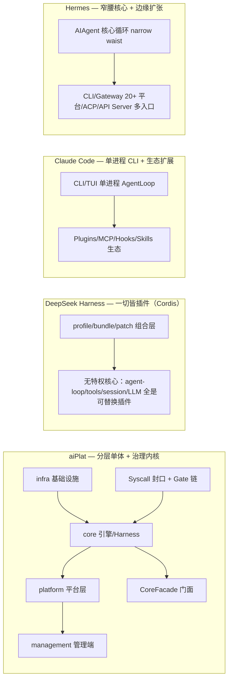

# aiPlat 核心能力对标报告：aiPlat vs Claude Code vs DeepSeek Harness vs Hermes

> **分析方式**：以 aiPlat 实际代码为分析对象（43 万行 Python、1,926 次 commit、CoreFacade 368 个导出符号（176 def/class + 192 re-export）、PipelineEngine 8,285 行——原 12,281 行，2026-08-19 P2-A4 拆分收官），结合 DeepSeek Harness 本地源码（`/Users/apple/workdata/person/deepseek-harness/`，0.1.0-rc.5）一手分析，以及 Claude Code 的权威 web 调研（官方文档 + 第三方分析）。Hermes 初版为文档级调研（官方文档站 + GitHub API 实测），**2026-08-15 补充最新版 v0.20.1 源码级验证**（`/Users/apple/workdata/person/openSource/hermes-agent-main/`，见 §17.1）。
> **结论原则**：代码事实优先于文档宣称；每条 aiPlat 能力均附 `文件:行号` 证据。
> **调研时点**：2026-08-15（2026-08-19 已按行动纲领基线复核更新，见下）
> **2026-08-19 状态更新**：行动纲领 **53 DONE / 0 PARTIAL / 0 OPEN**（54 项核对、53 项有效）；改进方案 P0/P1/P2 全部落地；宪法测试 **143 passed**（全绿）；能力数 **1032/1039**（`capability_registry.yaml` total=1032，`AIPLAT_CAPABILITIES.md` total=1039，口径不同：registry 登记 vs 扫描）；架构守卫 0 ERROR；规范 9/9 approved。**§16.3/§18/§20/§21 的差距结论已按新基线重审**——原"6 项完全缺失 + 8 项部分具备"经 P1-A/P2 批次补齐后仅剩 G6（CC/Codex hooks 协议桥）一项未纳入行动纲领（见 §20.1 状态列与 §20.2 汇总）。
> **2026-08-19 回归修复批（PR #33/#34/#35，当日增量复核）**：基线复核后又闭环 3 个实测缺陷，本报告 aiPlat 侧数字已同步——① **P0-A1 DI fallback 修复**（PR #33）：`integration.py` 13 个 `_resolve_or_import` fallback 全量验证，修复 2 个坏路径（`get_mcp_client_manager` 指向不存在的函数 → 改类 `MCPClientManager`；`get_agent_registry` 指向不存在的模块 → 改 `agents.discovery:AgentRegistry`）；② **应用工厂 rebuild 修复**（PR #34）：`pipeline_execution.py` 存量 `PipelineConfig` 未 import NameError（P0-A2 前已存在，`_execute_pipeline` 每次 run 立即 failed），补 import + 3 处 `PipelineEngine` 直构改 `create_pipeline_engine`（宪法 A2）；③ **守卫盲区修复**（PR #35）：用户实证质疑"守卫为何没抓到 NameError"——根因 4 层（ruff F821 被 `pyproject.toml` ignore / py_compile 只查语法 / F821 ratchet 基于空输出空转 / 该路径无测试），新增 **AST 级未定义符号守卫**（`scripts/guard_undefined_names.py`，接入 `architecture_guard.sh`，基线 0 findings）+ 防回归测试（4 passed）。**§19 架构守卫表述已更新**：规则数 172→**190**（`arch_guard_rules.yaml` 实测）+ 第 17 维"Python 未定义变量"从 ruff F821 ratchet（实际被 ignore 空转）升级为 AST 级真检查。commit 数 1,719→**1,926**；CoreFacade 210 接口→**368 导出符号**；PipelineEngine 8,288→**8,285 行**。三方可对标结论不受上述修复影响（均为 aiPlat 侧质量修复，非能力增减）。

---

## 0. 一句话定位

| 系统 | 定位 | 核心差异化 |
|---|---|---|
| **aiPlat** | 企业级 FDE 操作系统（Agent 协作网络 + Spec 生命周期 + 知识引擎） | 声明式交付流水线引擎 + Syscall/Gate 治理执行层 + 自演进闭环 + SECI 知识引擎 |
| **Claude Code** | 终端/IDE/CI 的 agentic coding 工具（Anthropic 官方） | Dynamic Workflows + Checkpointing + Server-managed Settings + ZDR |
| **DeepSeek Harness (dsh)** | 一切皆插件的 agent harness（DeepSeek AI 开源，Cordis 驱动） | 插件化架构纯度 + 6 种子代理 provider + 事件源会话 + 自修改 |
| **Hermes** | 个人/团队自我进化 Agent（NousResearch 开源，MIT） | 内建学习闭环 + 多渠道 Gateway（20+ 平台）+ 7 种执行后端 |

---

## 1. Agent 循环与执行模型

| 维度 | aiPlat | Claude Code | DeepSeek Harness | Hermes |
|---|---|---|---|---|
| 执行引擎 | **PipelineEngine 8,285 行**（原 12,281 行，2026-08-19 P2-A4 拆分收官为 5 个 Mixin：healing/state/prompt/eval/stage），声明式 `PipelineStageConfig` 驱动阶段流水线（`pipeline_engine.py:553`），含 HITL 暂停/恢复、token 预算、重试、快照 | 单进程 LLM→工具→观察循环；SDK 提供可编程 AgentLoop | 事件驱动 step/turn 双层循环（`packages/core/agent-loop`），turn=零或多个 step | AIAgent 类（~9,200 行）单一核心循环驱动全部入口 |
| 编排模式 | 6 种 `routing_mode`（static/llm/debate/swarm/roundtable/moa）+ 5 种 `pipeline_mode`（chain/router/parallel/orchestrator/evaluator_optimizer）+ DAG 并行（`_execute_dag`） | Dynamic workflows（2026 新特性）：phases 串行/并行、fan-out、HITL 检查点 | workflow 引擎（worker-thread provider），模型写编排脚本 `agent()/pipeline()/parallel()` 扇出子代理 | 单循环 + delegate_task 并行 batch（默认 3 并发）+ orchestrator 模式 |
| HITL/审批 | **一等能力**：approve_session（`:1974`）/reject_session（`:2266`）/rollback（`:2536`）/resume_from_checkpoint（`:2621`） | plan/act 双阶段，Plan 批准后才执行 | plan mode 作为 logged state，`exit_plan_mode` 工具 | approvals 交互式确认（smart/manual/off） |
| 可观测执行 | trace_id/span_id 全 syscall 覆盖 + graph trace 事件 + 决策溯源（`decision_trace.py`） | transcript 保存 + hooks | 事件源会话日志（模型可见 ⟺ 日志不变量） | 会话 DB 记录 + insights 分析 |
| 成熟度 | 成熟（企业级） | 成熟（产品化） | 成熟（pre-release 0.1.0-rc.5） | 成熟 + 快速扩张 |

**aiPlat 差异点**：唯一把"交付流水线"（多阶段、跨 Agent、HITL、断点续跑）做成一等公民的系统；Claude Code 无引擎、DSH 引擎更轻、Hermes 是 Agent 框架而非交付引擎。

---

## 2. 工具系统

| 维度 | aiPlat | Claude Code | DeepSeek Harness | Hermes |
|---|---|---|---|---|
| 工具模型 | BaseTool + ToolRegistry（`apps/tools/base.py:35`），工具名全局唯一 | 内置 Read/Write/Edit/Bash/Glob/Grep/WebSearch/WebFetch/Task/TodoWrite | `ctx.tools` 作用域化注册表 + `defineTool` DSL + 30+ 工具 | 70+ 内置工具、28 个 toolsets（AST 自动发现注册） |
| 调用通道 | **Syscall 封口**：`sys_tool_call`/`sys_skill_call`/`sys_llm_generate` 唯一外部交互通道，统一注入身份/租户/风险元数据 | 直接调用 + 权限检查 | tools/pre-execute→execute→post-execute 管线（单调 guard） | registry.register + check_fn 服务门控 |
| 扩展协议 | MCP 客户端（`apps/mcp/client.py:45`），MCP 工具注册为 BaseTool 同等权限 | MCP 工具与内置同等 | MCP client 注册到 ctx.tools | MCP 动态加载 + 28 toolsets per-platform 启停 |
| 治理深度 | **最高**：PolicyGate（3D 权限 deny>ask>allow + 风险评分 + 确定性采样审批）+ ApprovalGate + SandboxGate + AuditTrailGate + ContextGate + ResilienceGate | allow/deny/ask 规则化权限 | ToolGuard 单调（只能 deny）+ approval waterfall | 危险命令审批 + write sandbox |

**aiPlat 差异点**：工具治理深度远超三方——所有工具调用必经多 Gate 链 + 单点 PolicyGate 执法 + 审计落库，是企业级安全边界的核心。

---

## 3. 上下文管理

| 维度 | aiPlat | Claude Code | DeepSeek Harness | Hermes |
|---|---|---|---|---|
| 组装 | ContextBus 10 层注入（`context_bus.py:42`，历史案例/跨域类比/证据规则/图遍历等）+ 4 子系统入口 | 系统提示 + 工具 schema 组装 | PromptSection 组装（order 约定 + waterfall 权威化） | 三层分级 system prompt（stable/context/volatile） |
| 记忆 | **四层记忆**（Working→Episodic→Semantic→Task Skills，`memory/manager.py:246`）+ 跨会话共享 + 投毒防御 | 三级 CLAUDE.md（企业/用户/项目） | session 日志为唯一真相源 + agent-instructions 加载 AGENTS.md/CLAUDE.md | 三层记忆（SQLite 会话库 + MEMORY.md/USER.md 策展 + 8+ 外部 MemoryProvider） |
| 压缩 | **5 级压缩**（70%-99%）+ 温度感知剪枝 + 语义相关性重排（`_re_rank_messages:198`） | Auto-compact（96% 阈值）+ /compact + Context editing | compaction 能力缝（自动/手动 + surface replace） | 双压缩（网关 85% + Agent 50% 阈值）+ 可插拔 ContextEngine |
| Cache 保护 | **CacheAwareRouter**（`cache_aware_router.py:47`，D1-D6 哈希冻结） | prompt cache 隐式依赖 | 无显式 cache 保护层 | **"per-conversation prompt caching is sacred"** 设计铁律 |

**aiPlat 差异点**：上下文工程最系统化——四层记忆 + 5 级压缩 + 语义重排 + CacheAwareRouter 显式保护 prompt cache；与 Hermes 的"缓存神圣"哲学一致但实现更工程化。

---

## 4. 子代理与多 Agent 编排

| 维度 | aiPlat | Claude Code | DeepSeek Harness | Hermes |
|---|---|---|---|---|
| 子代理 | SubagentCoordinator（`apps/agents/subagent/coordinator.py:43`，隔离上下文 + 800 字符摘要返回 + 权限分级）+ ParallelExecutor（map-reduce） | Task 工具动态子代理 + `.claude/agents/*.md` 声明式 | **6 种 provider 并存**（in-process/fork/ACP/Claude Code/Codex/dsh-sdk）+ continuable 编排（`continuation.ts` 1483 行） | delegate_task 完全隔离子代理（fresh conversation）+ worktree 隔离 |
| 协作模式 | AgentMessageBus 消息通信 + MultiAgent（fanout/pipeline/supervisor 模式）+ SwarmBroker 竞标 + Roundtable + Debate | fan-out 池（workflows） | subagent/subagent_fork 工具 + report 机制 | orchestrator + workers + 合成 |
| 规划 | TeamPlanner 团队组建（`team_planner.py:422`）+ ChainPlanner + IntentAnalyzer + PlanEngine | plan mode 只读调研 | plan mode（logged state） | /plan skill + /goal 持续目标 + Kanban |
| 深度控制 | 权限分级（ToolPermissionLevel）+ 摘要截断 + read_only ≤500 token | 子代理定义可指定 tools/model | depthLimit/toolFilter/persona 能力旗标 fail-loud | max_spawn_depth 1-3 + delegation 模型路由 |

**aiPlat 差异点**：多 Agent 编排形态最丰富（6 种 routing 形态 + 消息总线 + 竞标/辩论/圆桌）；DSH 的子代理 provider 多样性（6 种传输）是三方中最强的单一能力。

---

## 5. Skill 系统

| 维度 | aiPlat | Claude Code | DeepSeek Harness | Hermes |
|---|---|---|---|---|
| 定义 | SKILL.md frontmatter（20+ 字段，`apps/skills/registry.py:108`）双目录（engine 53 个 + workspace） | `.claude/skills/<name>/SKILL.md`（frontmatter name/description） | `.dsh/skills`/`.agents/skills` 6 档 rank 发现 + skill 工具注入 | `~/.hermes/skills/` 唯一事实源，兼容 agentskills.io 开放标准 |
| 执行 | **3 种 execution_type**（prompt/handler/hybrid/python_class，`registry.py:1432` 自动探测） | LLM 自动发现加载 | 目录 bundle 注入 durable reminder + skill 工具加载正文 | 渐进式披露（skills_list→skill_view）+ /learn 自动生成 |
| 治理 | **SkillsGuard 70+ 威胁模式** + effects 副作用声明 + 版本回滚 + 依赖图 + 市场安装 | 无强制校验 | SkillInvocationPolicy（model/user 双开关） | write_approval 审批发布 + Curator 维护 |
| 进化 | skill_evolver 跨租户演化 + AutoLearner 失败→技能草稿→沙盒→审批 | 社区自进化技能 | 无内置进化 | **学习闭环核心**（nudge→review→写入→审批→Curator） |

**aiPlat 差异点**：Skill 治理最严（威胁扫描 + 副作用声明 + 版本回滚）；Hermes 的 Skill 生态（开放标准 + Hub + 学习闭环沉淀）是三方中最强的"技能成长"机制。

---

## 6. 工作流

| 维度 | aiPlat | Claude Code | DeepSeek Harness | Hermes |
|---|---|---|---|---|
| 定义 | WorkflowManager 目录化 JSON（`core/management/workflow_manager.py:58`）+ WorkflowCanvas 可视化拖拽（12 种节点类型） | Dynamic workflows（声明式 phases） | workflow 能力（plain JS 编排脚本，worker-thread 隔离） | 无独立工作流引擎（delegate_task + batch 组合） |
| 执行 | WorkflowService 节点→PipelineStageConfig 阶段编排（拓扑排序 + 后台启动流水线） | 一条指令编排上百个后台 agent | tool-workflow 运行模型脚本 + tool-ralph 固定循环 | cron + batch runner |
| 画布 | **WorkflowCanvas 前端可视化**（agent/llm/code/http/condition/human/loop/knowledge/tool/list/template/aggregator/assigner 节点 + 条件分支） | 配置/代码形式 | 无 GUI 画布 | 无 GUI 画布 |

**aiPlat 差异点**：唯一提供可视化工作流画布 + 12 种节点类型 + 条件分支/循环/聚合器的系统，非技术用户可编排。

---

## 7. 规划

| 维度 | aiPlat | Claude Code | DeepSeek Harness | Hermes |
|---|---|---|---|---|
| 规划链 | IntentAnalyzer（纯规则零 LLM）→ ChainPlanner（LLM>模板>空链）→ TeamPlanner（LLM>模板>回退）→ Orchestrator DAG | plan mode（只读调研→计划→批准→执行） | plan mode（logged state + exit_plan_mode） | /plan skill + /goal 持续目标（受 Codex /goal 启发） |
| 独特 | KBPlannerAgent + 本体图路径规划（`path_planner.py:50`） | Shift+Tab 切换 + 计划保存 | plan 状态随 resume/fork 自动恢复 | 轻量 judge model 判断目标达成 |

---

## 8. 沙箱 / 权限 / 审批

| 维度 | aiPlat | Claude Code | DeepSeek Harness | Hermes |
|---|---|---|---|---|
| 沙箱 | 部署沙箱（`pipeline_sandbox.py:85` 变异场景验证）+ 执行沙箱（`sandbox.py:48` RLIMIT + 凭据剥离 + 超时强杀）+ DockerSandbox | Linux 沙箱（seccomp + Landlock） | bwrap/Seatbelt/ACL 三平台 + 原生 landlock-run | 容器隔离（Docker/Singularity/Modal）+ write sandbox |
| 权限 | **RBAC 8 角色 × 19 权限**（`auth/rbac.py:10`）+ 3D 权限（READ/WRITE/EXECUTE）+ deny-by-default + PolicyGate 单点 | 5 种 permission modes + allow/deny/ask 规则 | permission presets（sandbox+approval 捆绑）+ SandboxMode | 8 层安全模型 + 危险命令审批 |
| 审批 | **ApprovalGate + ApprovalManager 完整生命周期**（创建/审批/拒绝/超时/回调）+ REST 端点 + Action Contract v3（EntityLock + 哈希链审计） | 高风险操作交互式提示 | approval/ask/never 双策略 + fail-closed | smart/manual/off 模式 + 破坏性命令三选确认 |
| 治理 | **最高**：审计链 + 审批中心 + 变化控制 + 发布灰度 | Server-managed settings（企业强制） | 无企业级策略 | 偏个人使用强度 |

**aiPlat 差异点**：治理闭环最完整——审批/回滚/重试/停止 + 发布灰度 + 自动回归门禁做成平台一等能力，贯穿 UI/API/落库事件；Claude Code 的 Server-managed settings 是三方中唯一的企业远程强制策略。

---

## 9. 会话持久化

| 维度 | aiPlat | Claude Code | DeepSeek Harness | Hermes |
|---|---|---|---|---|
| 运行存储 | PipelineRunStore（SQLite WAL，run/阶段/状态 + HITL 原子更新 + 孤儿恢复 + 断点续跑） | session 持久化到 `~/.claude/projects/` + --resume | **事件源会话日志**（append-only SessionEvent，JSONL/SQLite 双后端 + 200ms 批窗口 + 崩溃平衡恢复） | SQLite state.db（WAL + FTS5 三虚拟表） |
| 审计 | **ExecutionStore 25+ mixin** + per-tenant SHA256 哈希链（`audit_mixin.py:16`）+ syscall_events 全量 | transcript 自动保存 | session telemetry + OTel | 会话记录 + insights |
| 回滚 | 快照（`snapshot.py:30`）+ 文件级 checkpoint（`file_checkpoint.py:69` 哈希去重 + 每路径 50 版本） | **Checkpointing**（git 式 + /rewind） | fork(source, boundary) + surface replace | /undo /retry /stop |
| 决策留痕 | 决策捕获（`decision_capture.py:66`）+ 根因定位（`decision_trace.py:125`） | 无 | 事件源天然留痕 | 无 |

**aiPlat 差异点**：唯一具备"防篡改哈希链审计 + 决策溯源 + 断点续跑"三重留痕的企业系统；DSH 的事件源会话日志是架构上最优雅的持久化模型。

---

## 10. 模型适配

| 维度 | aiPlat | Claude Code | DeepSeek Harness | Hermes |
|---|---|---|---|---|
| 解析 | **best_model_for_purpose 统一选型**（`model_injection.py:1675`，session override→非 LLM 捷径→偏好→infra 统一评分→safe_model 保底） | /model 切换 Claude 系列 + Bedrock/Vertex/Gateway 第三方 | adapter 注册表（registerAdapter + 原子热切换）+ DeepSeek providers（v4-flash/v4-pro + pi-ai 多协议） | 30+ provider 家族统一 resolver（插件目录扩展零分支） |
| 目录 | **ModelManager（infra 唯一权威）**（`infra/management/model/manager.py:664`：发现/健康/启用禁用/成功率滚动/5 分钟 TTL 恢复） | 官方模型为主 | 模型无关协议 + provider 路由 | 插件化 model-providers |
| 适配器 | 唯一 InfraLLMAdapter + Embedding/Reranker/Audio/OCR 适配器族（BaseModelAdapter 统一工厂） | MCP 模型无关 | LlmRuntime + StreamChunk 协议 | 3 种 wire 协议自动探测 |
| 成本 | cost_budget 每阶段 + token 预算 + 语义缓存 + 本地模型优先 | 无显式成本控制 | token-meter 估算 | 计费 + 用量追踪 + insights 成本分析 |

**aiPlat 差异点**：模型治理最严（统一解析链 + infra 唯一权威 + 本地模型 OOM 防护 + 成功率滚动）；Hermes provider 生态最开放（30+ 家族插件化）。

---

## 11. 自修改 / 自我进化

| 维度 | aiPlat | Claude Code | DeepSeek Harness | Hermes |
|---|---|---|---|---|
| 学习闭环 | **EvolutionEngine 14 步夜间流水线**（`evolution_engine.py:121`：AutoLearner 失败→Skill 草稿→沙盒模拟→审批注册 + 回滚检查 + 漂移检测 + 跨租户扫描）+ 隐式反馈（`implicit_feedback.py:36`） | **官方无内置学习闭环**（社区通过 skills+hooks 实现） | 自修改能力（动态 Cordis 插件 define/run/undefine，opt-in 开发工具） | **标志性学习闭环**（nudge 阈值触发→review agent 判断→写入→write_approval 审批→Curator 维护） |
| 训练触发 | **LoRAAutoTrigger**（`training/auto_trigger.py:33`：高质量样本累计→SFT 数据集→提交微调 Job）+ RL trainer（`rl_trainer.py:98`） | 无 | 无 | batch 轨迹生成供训练（研究向） |
| 自愈 | SelfHealGate（`self_heal_gate.py:53`：AUTO/SUGGEST/REJECT 三级）+ Harness 自愈（`_propose_harness_fix`） | 无 | 无 | 无 |
| 进化深度 | **最高**：跨租户技能聚合 + 知识自增长 + 本体演化 + 系统级模式演化 | 无 | 运行时自修改（非学习） | Agent 层进化（记忆/技能/会话轨迹，不改模型权重） |

**aiPlat 差异点**：唯一实现"系统自我修改 + 自动训练触发"的完整闭环（EvolutionEngine + AutoLearner + SelfHealGate + LoRAAutoTrigger）；Hermes 是 Agent 层进化的标杆（"the agent that grows with you"）；Claude Code 官方无内置学习闭环；DSH 是运行时插件自修改（非学习进化）。

---

## 12. 扩展机制

| 维度 | aiPlat | Claude Code | DeepSeek Harness | Hermes |
|---|---|---|---|---|
| 插件 | PluginManager（DB 持久化 + Slot 注册 + 版本回滚）+ custom_handlers 白名单 | Plugins + marketplace 一键安装 | **一切皆插件**（Cordis profile/bundle/patch 三层组合，无特权核心） | 四类插件（Provider/Context Engine/Platform/Memory） |
| 成本阶梯 | Hook→Skill→Tool→MCP 四级阶梯（CLAUDE.md §20 强制） | hooks + skills + MCP | 能力缝（Service Definition/Provider/Consumer）强制模式 | AGENTS.md footprint ladder（扩展已有代码→CLI+skill→service-gated tool→plugin→MCP） |
| 配置驱动 | AGENT.md/SKILL.md YAML + PipelineStageConfig 90+ 字段 + apps.yaml 模块注册 | CLAUDE.md + settings.json | patch 覆盖任意配置行 | config.yaml + SOUL.md + .hermes.md |
| 兼容桥 | ACP（WebSocket）+ A2A（REST/SSE） | hooks 生命周期 | **CC/Codex hooks 桥**（CC 7/30 + Codex 5/10 事件）+ ACP v1 官方服务器 | ACP（JSON-RPC stdio）+ TUI gateway |

**aiPlat 差异点**：扩展机制最结构化（四级成本阶梯 + 声明式模块注册）；DSH 的插件化架构纯度最高（一切可替换、注册即 effect、卸载即回滚）。

---

## 13. 多渠道 / 接口

| 维度 | aiPlat | Claude Code | DeepSeek Harness | Hermes |
|---|---|---|---|---|
| 接口 | CoreFacade 368 个导出符号（176 def/class + 192 re-export） + REST（72 core routers + 573 platform endpoints）+ aiplat-sdk + ACP + A2A + Gateway 统一代理 | CLI + headless SDK（TS/Python）+ IDE 插件 + GitHub Actions | ACP + JSON-RPC SDK + typert RPC + Web GUI（3080）+ Python SDK | CLI/TUI + **Gateway 20+ IM 平台** + ACP + API Server + Python Library |
| 消息渠道 | **7 渠道适配器**（telegram/slack/webchat/discord/wecom/email/dingtalk，`channels/adapter.py:16-23` + `get_channel_adapter`，2026-08-19 P1-A4 收官，PR #22）+ Gateway 配对/幂等/DLQ | 无 IM | 无 IM | **20+ 平台**（Telegram/Discord/Slack/WhatsApp/Signal/SMS/Email/HA/Mattermost/Matrix/DingTalk/Feishu/WeCom/QQ/LINE 等） |
| IDE | aiplat-vscode 扩展 + ACP | VS Code/JetBrains 官方 | ACP 服务器（任何 ACP 客户端可驱动） | VS Code/Zed/JetBrains（ACP） |
| 治理面 | 管理端 Web（**325 TSX 前端文件**，tsc 0 错误 + 50 诊断页面 + RBAC 菜单，2026-08-19 基线） | Console + 企业迁移 | Web GUI（VitePress） | 个人 CLI/IM 为主 |

**aiPlat 差异点**：管理面最完整（企业 Web 控制台 + RBAC 菜单 + 诊断中心）；Hermes 的 Gateway 多渠道矩阵（20+ IM）是三方中最强的消息接入。

---

## 14. 企业治理与可观测性

| 维度 | aiPlat | Claude Code | DeepSeek Harness | Hermes |
|---|---|---|---|---|
| 认证 | JWT/API key/OIDC 三级（`routes.py:448`）+ RBAC 三层（permission/route/menu） | Console 组织/席位 | 无企业级认证 | 用户授权 + DM pairing |
| 审计 | **per-tenant SHA256 哈希链防篡改**（`audit_mixin.py:16`）+ 审计导出 CSV + 推理轨迹审计 | 企业审计日志（细节待确认）+ ZDR | session telemetry + OTel | 无审计留痕平台化 |
| 治理 | 治理流水线 6 步 + cron（`governance_pipeline.py:87`）+ 配额/限流 + 租户策略 policy-as-code + 计费（`billing/meter.py:34`） | Server-managed settings + 模型路由 | 无 | 无 |
| 多租户 | **三层多租户**（tenant_id 透传 + 分库 + 检索阻断 `wiki_retriever.py:306`）+ 租户配额套餐 | 组织/席位 | 无 | 无 |
| 诊断 | 健康检查注册表（依赖感知并行）+ 20+ 诊断端点 + 11 规则根因诊断 + SLA 监控 + Prometheus + 决策溯源 | analytics + hooks | OTel | insights 命令 |
| RAG | **CRAG 4 级（5 层）回退**（Ontology→FTS5→HyDE→Web，`retrieval_crag.py:59`）+ 检索质量门 + 查询重写 + 检索后治理 | WebSearch/WebFetch 工具 | web capability（search/fetch providers） | web_search/web_extract 工具 |

**aiPlat 差异点**：企业治理最完整（防篡改审计 + 多租户 + 计费 + 配额 + 治理流水线 + 诊断中心），这是 aiPlat 相对三方最显著的差异化区；Claude Code 的 Server-managed settings/ZDR 是唯一的企业远程策略能力；Hermes/DSH 无企业级治理。

---

## 15. 三方核心能力速览表（横向）

| 能力维度 | aiPlat | Claude Code | DeepSeek Harness | Hermes |
|---|---|---|---|---|
| 定位 | 企业 FDE 操作系统 | IDE/终端 coding agent | 插件化 agent harness | 自我进化个人/团队 Agent |
| 执行引擎 | PipelineEngine（8.3k 行声明式，5 Mixin） | AgentLoop（单进程） | step/turn 事件循环 | AIAgent（9.2k 行） |
| 工具治理 | ★★★★★（Syscall 封口 + 多 Gate） | ★★★☆（权限规则） | ★★★★（单调 guard） | ★★★（危险命令审批） |
| 上下文工程 | ★★★★★（四层记忆 + 5 级压缩 + Cache 路由） | ★★★★（auto-compact + editing） | ★★★★（事件源 + compaction） | ★★★★（三层记忆 + 双压缩） |
| 子代理 | ★★★★（多形态编排） | ★★★（Task + 声明式） | ★★★★★（6 provider + continuable） | ★★★☆（隔离 + worktree） |
| Skill 系统 | ★★★★（3 种执行 + 严治理） | ★★★（目录 + marketplace） | ★★★★（分层注册表） | ★★★★★（开放标准 + 学习闭环） |
| 工作流 | ★★★★★（可视化画布 + 12 节点） | ★★★★（dynamic workflows） | ★★★★（worker-thread 脚本） | ★★★（无独立引擎） |
| 规划 | ★★★★（4 级规划链） | ★★★★（plan mode） | ★★★☆（logged plan） | ★★★（/plan + /goal） |
| 沙箱/审批 | ★★★★★（RBAC + 完整审批生命周期） | ★★★★（5 模式 + seccomp） | ★★★★（3 平台 + presets） | ★★★（8 层模型偏个人） |
| 持久化 | ★★★★★（run store + 哈希链审计 + 决策溯源） | ★★★★（session + checkpoint） | ★★★★★（事件源日志） | ★★★★（SQLite + FTS5） |
| 模型适配 | ★★★★★（统一解析 + infra 权威） | ★★★☆（官方模型为主） | ★★★★（adapter 注册表 + 热切换） | ★★★★（30+ provider 插件化） |
| 自我进化 | ★★★★★（14 步夜间 + 训练触发 + 自愈） | ★★（官方无） | ★★★☆（运行时自修改） | ★★★★★（学习闭环标杆） |
| 扩展机制 | ★★★★（四级阶梯 + 模块注册） | ★★★★（plugins + hooks） | ★★★★★（一切皆插件） | ★★★★（四类插件） |
| 多渠道 | ★★★☆（Web + **7 渠道** + ACP/A2A，2026-08-19 P1-A4） | ★★★（CLI/IDE/CI） | ★★★（ACP + SDK + Web） | ★★★★★（20+ IM Gateway） |
| 企业治理 | ★★★★★（审计/租户/计费/治理流水线） | ★★★☆（server-managed + ZDR） | ★★（无） | ★★（无） |
| 开源状态 | 自研（非开源） | 闭源商业（2025-2026 领先） | 开源（DSH，一切皆插件，pre-release） | 开源（MIT，230K+ stars，2026-02 发布） |

---

## 16. aiPlat 相对三方：优势 / 劣势 / 差距结论

### 16.1 aiPlat 的 5 个标志性差异化能力（代码证据）

1. **声明式交付流水线引擎**（`pipeline_engine.py:553`，8,285 行——原 12,281 行，2026-08-19 P2-A4 拆分收官为 5 个 Mixin：`pipeline_healing/state/prompt/eval/stage.py`，PR #16-19）：PipelineStageConfig 字段驱动一切行为分叉（execution_backend 双后端、routing_mode 六形态、failure_strategy 退化、hitl 审批），HITL 审批/驳回/回滚/断点续跑全闭环。三方中唯一。
2. **Syscall 封口 + Gate 治理执行层**（`syscalls/skill.py:57` + `policy_gate.py:275`）：唯一强制通道 + 单点执法 + 3D 权限 + 风险评分 + 确定性采样审批。治理深度远超三方。
3. **自演进操作系统**（`evolution_engine.py:121` 14 步夜间流水线 + AutoLearner + SelfHealGate + LoRAAutoTrigger）：唯一实现"系统自我修改 + 自动训练触发"（SFT/RL）的完整闭环。
4. **上下文工程**（`context_bus.py:42` 10 层 + `memory/manager.py:417` 四层记忆 + `cache_aware_router.py:47`）：对标 Hermes 四层记忆但更重——语义重排 + 温度剪枝 + 5 级压缩 + CacheAwareRouter。
5. **SECI 知识引擎 + 本体状态机 + FDE 交付闭环**（`seci_engine.py:24` + `state_machine.py:114`）：唯一有知识创造引擎（社会化→外化→组合→内化）+ 本体图谱 + GraphRAG + 完整业务闭环的系统。

### 16.2 aiPlat 相对三方的优势区（审核确认的结论）

| 优势 | 对比依据 |
|---|---|
| **企业治理最完整** | 防篡改审计链（`audit_mixin.py:16`）、RBAC 8 角色、多租户三层、计费/配额、治理流水线、诊断中心（50 前端页面）——三方均无同等级 |
| **交付闭环最工程化** | 审批→回归→可回滚→全链路可追溯（approve/reject/rollback/resume + run_events + 决策溯源） |
| **知识引擎独一无二** | SECI 四阶段 + 本体状态机 + GraphIndex + GraphRAG（CRAG 4 级）+ Knowledge Pipeline v3 |
| **自我进化最完整** | 14 步夜间流水线 + 失败→技能→沙盒→审批闭环 + SFT/RL 训练触发 + 跨租户聚合 |
| **引擎层去业务化** | 内核无关原则（CLAUDE.md §8）+ PipelineStageConfig 唯一约定接口 + 架构守卫 190 规则自动执法 |

### 16.3 aiPlat 相对三方的劣势/差距区（2026-08-19 复核：原 8 项差距中 7 项已由行动纲领 P1/P2 批次补齐）

> **2026-08-19 状态更新**：下表 8 项差距在 2026-08-15 初版时均为"未落地"；经行动纲领 **53/53 DONE**（P1-A 对标差距 6/6 + P2 演进治理 12/12）后，**前 7 项已补齐**（均附代码证据），仅"前端产品完成度（coding 场景）"一项不在 53 项行动纲领覆盖内、保持原状。

| 差距 | 三方参照 | 建议 | 2026-08-19 状态 |
|---|---|---|---|
| **学习闭环的触发与维护机制** | Hermes 的 nudge 阈值（每 10 prompt → memory review、每 10 工具迭代 → skill review）+ Curator 后台维护（active→stale→archived） | aiPlat 有 AutoLearner 但触发更多依赖夜间流水线批量，可引入 Hermes 式会话内实时 nudge + 技能生命周期维护 | ✅ **已补齐（P1-A1 + P1-A2）**：会话内实时 nudge（`harness/learning/learn_nudge_hook.py`）+ Curator 技能生命周期维护（`harness/learning/skill_curator.py`、`harness/knowledge/skill_curator.py`） |
| **Skill 生态开放度** | Hermes agentskills.io 开放标准 + Hub 市场 + 230K stars 社区；Claude Code skills marketplace | aiPlat SkillMarketplace 已实现（`skill_marketplace.py:30` git clone 安装）但无开放标准/Hub 生态，可对接 agentskills.io | ✅ **已补齐（P1-A5）**：agentskills.io 对接（`harness/knowledge/skill_marketplace.py` + platform `api/routers/skill_marketplace.py`）；开放生态规模仍小 |
| **子代理 provider 多样性** | DSH 6 种 provider（in-process/fork/ACP/Claude Code/Codex/dsh-sdk）+ continuable 编排 | aiPlat SubagentCoordinator 功能完整但传输单一（进程内），可增加 ACP/外部运行时子代理后端 | ✅ **已补齐（P1-A3，PR #21）**：`SubagentProvider` 抽象 + `InProcessProvider`/`ACPProvider` 双实现（`apps/agents/subagent/providers.py:49,81,119`），`execute_parallel(provider=)`/`send_message`/`get_instance_status` 三态接线 |
| **事件源架构纯度** | DSH append-only SessionEvent 日志为唯一真相源（模型可见 ⟺ 日志），fork/resume/replay/UI 全从同一流派生 | aiPlat 的 PipelineRunStore 是状态型（SQLite 行），可借鉴事件源模型增强回放/审计一致性 | ✅ **已补齐（P2-A1）**：run_events 事件折叠派生状态（`pipeline_run_store.py:266` fold 实现），事件可回放/崩溃恢复；状态快照查询路径保留 |
| **多渠道矩阵** | Hermes 20+ IM 平台 Gateway | aiPlat 仅 Telegram/Slack/WebChat 三适配器 + Gateway 架构（`gateway/router.py:30`），扩展空间大 | ✅ **已补齐（P1-A4，PR #22）**：7 渠道（telegram/slack/webchat/discord/wecom/email/dingtalk，`channels/adapter.py:16-23`）；相对 Hermes 22 平台广度仍有差距 |
| **模型 provider 生态** | Hermes 30+ provider 家族插件化；Claude Code 官方模型质量 | aiPlat 解析链严谨但 provider 面较窄（env 自动发现 + Ollama/LM Studio 等），可插件化扩展 | ✅ **已补齐（P2-A3）**：provider 元数据配置化（`infra/management/model/manager.py:1601`，`config/providers.yaml`），新增 provider 无需改代码 |
| **运行时自修改** | DSH 动态 Cordis 插件 define/run/undefine（opt-in） | aiPlat 的 EvolutionEngine 是"离线夜间演化"，无"运行中挂载/卸载插件"能力（安全边界需谨慎） | ✅ **已补齐（P2-A2）**：运行时扩展缝（`core_facade.py:29,58`，可调用 handler 白名单 + 审批门控，做成安全边界而非 DSH 式 opt-in） |
| **前端产品完成度（coding 场景）** | Claude Code IDE 插件 + checkpoint UI + diff 视图 | aiPlat 前端管理面强（325 TSX 文件）但 coding 场景交互（diff/checkpoint 回放）弱 | ⚠️ **未变**（不在行动纲领 53 项覆盖内；2026-08-19 基线未涉及 coding 场景前端） |

### 16.4 三方可借鉴 aiPlat 的点（互证 aiPlat 优势）

- **Claude Code**：可借鉴 aiPlat 的审批/回滚/发布灰度闭环与防篡改审计（企业治理）。
- **DeepSeek Harness**：可借鉴 aiPlat 的多 Gate 治理链（PolicyGate 3D 权限 + 风险评分）与知识引擎。
- **Hermes**：可借鉴 aiPlat 的引擎层去业务化（PipelineStageConfig 配置驱动）与多租户治理。

---

## 17. 调研方法、证据与存疑清单

### 17.1 证据基线

| 系统 | 分析方法 | 证据来源 |
|---|---|---|
| aiPlat | 代码全量分析（4 个并行子代理 40+ 关键文件 + 主代理交叉验证） | 本仓库 `aiPlat-core/`（CoreFacade 368 个导出符号（176 def/class + 192 re-export）、PipelineEngine 8,285 行（P2-A4 拆分后 5 Mixin）、policy_gate.py、evolution_engine.py、context_bus.py、seci_engine.py 等） |
| DeepSeek Harness | 本地源码一手分析（docs + 源码双重交叉验证） | `/Users/apple/workdata/person/deepseek-harness/`（packages/core/agent-loop、core/tools、session、subagent、workflow、sandbox 等） |
| Claude Code | web 调研（官方文档优先 + 第三方分析） | [How Claude Code works](https://code.claude.com/docs/en/how-claude-code-works)、[Workflows docs](https://code.claude.com/docs/en/workflows)、[Sandboxing](https://code.claude.com/docs/en/sandboxing)、[Sessions](https://code.claude.com/docs/en/sessions)、[Checkpointing](https://code.claude.com/docs/en/checkpointing) |
| Hermes | 文档级调研（初版）+ **v0.20.1 源码级验证**（2026-08-15 补充，与 DSH 同深度） | 文档：[hermes-agent](https://github.com/NousResearch/hermes-agent)（230,763 stars / MIT / v0.20.1）、[官方文档站](https://hermes-agent.nousresearch.com/docs/developer-guide/architecture)；源码：`/Users/apple/workdata/person/openSource/hermes-agent-main/`（14 维度逐一验证，12 项成立 / 2 项部分成立，见 §17.4） |

### 17.2 存疑/待确认项

| # | 系统 | 事项 | 说明 |
|---|---|---|---|
| 1 | Claude Code | 官方 hooks 文档页 | 调研仅命中镜像，官方 URL 应为 code.claude.com/docs/en/hooks |
| 2 | Claude Code | 企业审计日志具体字段/API | 官方文档未直接命中，第三方分析为主 |
| 3 | Claude Code | 内置自学习循环 | 结论倾向"无"，官方无此能力声明 |
| 4 | Hermes | 学习闭环的"eval"环节 | **已确认（v0.20.1 源码）**：无独立 eval 评分器，仅 frontmatter 硬校验 + advisory lint + LLM 自评（见 §17.4） |
| 5 | Hermes | session_search 的 LLM 摘要 | **已确认（v0.20.1 源码）**：检索本体无 LLM（`session_search_tool.py:27` "No LLM calls anywhere"）；README 的 "LLM summarization" 指其他辅助路径（见 §17.4） |
| 6 | DSH | 自修改能力安全性 | README 自述"非安全边界、opt-in 开发工具" |
| 7 | aiPlat | MFA（TOTP/WebAuthn） | **✅ 已实现（2026-08-19 基线 P0-B2/PR #28）**：TOTP RFC 6238（`aiPlat-platform/auth/mfa.py`，setup/verify/disable 端点）+ **admin 强制**（`POST /tenant/api-keys` admin 未启用 MFA → 422 `mfa_required`，`routes.py:5855`）；CLAUDE.md §11b 已从建议升级为强制；MFA 测试 9 passed |
| 8 | aiPlat | SDK bind_skill 缺陷 | **✅ 已修复（2026-08-19 基线 P0-B1）**：`self._skills`/`self._tools` 初始化补齐，不再潜在 AttributeError |
| 9 | aiPlat | apps/ontology_editor 未注册 apps.yaml | 目录存在但未注册进模块注册表（小口径偏差） |

### 17.3 DeepSeek Harness 关键限制（增量源码验证，对标公平性校准）

以下为 DSH 一手源码分析补充的关键限制披露（README/代码自述），用于校准第 15 章速览评分：

| 能力 | 关键限制（源码证据） |
|---|---|
| **子代理** | 6 provider 能力旗标差异显著：`spawn`/`fork` 全能力（进程内），`acp`/`claude-code`/`codex`/`dsh-sdk` 均为 `NO_START_CAPABILITIES`（`subagent/src/types.ts:27-32`）；ACP 子代理 one-shot 不可 trace 枚举；followup 需 exact live 直系父；claude-code/codex 每 run 全新 query/进程/thread，无 continuation/resume/pooling |
| **Workflow** | **无 journaling/resume**（进程重启不能续跑）；**无嵌套 workflow**（脚本无 `workflow()` 钩子）；无跨 child token 预算；**worker/vm 不是安全边界**（模型代码可逃逸 vm 触及 worker 进程权限）；仅前台收集（无 background/poll/spill）；ralph 完成是 worker 自报（无独立评估器）、child 失败即 run 终止（不重试） |
| **Goal** | **State, not scheduling**——何时续跑/重试/取消属于 agent-seam 消费者（`goal/README.md:52-57`）；只有轮数预算（不计 token/货币/墙钟）；**无独立评估器**（记录者即权威）；单一当前目标（无并行目标/目标库） |
| **Schedule** | **无 ctx service key**（函数插件，`schedule/src/index.ts:33`）；**Session-local delivery only**（原会话必须 live，冷会话无外部通知）；at-least-once 非 exactly-once；**固定间隔非日历规则（无 Cron）**；latest-only catch-up（不重放错过 backlog） |
| **jobs** | job 进程本地（记录随进程消亡）；`maxConcurrentJobsPerOwner` 默认 10 满则拒绝；前台工作不可提升为后台 |
| **Plan** | `exit_plan_mode` 两态保持注册（工具目录稳定）；fork 继承 logged 状态而 spawn 新开 inactive，无创建期 plan 选项 |
| **Skill** | 目录只列 name+截断 description（whenToUse 不渲染）；body 无大小上限但**不版本化**（编辑不触发 digest 变更）；目录整表替换追加（费 token）；本地发现仅一层深度 |
| **Compaction/Session** | compaction 摘要经 surface replace 替换表面节点（唯一表面替换生产者）；崩溃恢复"合成 closers 平衡而非截断"被中断 turn（`core/session/src/repair.ts:27`，只有 torn tail 被丢弃，**无"继续被中断 turn"的部分恢复**）；**无删除/保留 API**（out-of-band 维护）；`list()` 不分页不筛选；仅当前 SESSION_FORMAT_VERSION v0 可加载、无迁移 |
| **遥测/标题/检索** | OTel 后端三种模式 FULL/FEEDBACK_ONLY/**DISABLED（默认）**；标题唯一 provider（二次注册即抛错）、自动生成绝不让主 agent 响应等待；会话检索**无 caller 授权**（trusted context-wide）；FTS5 查询串作为数据处理（防注入）；SQLite 派生索引版本不符**原地 reset 重建**；DatabaseSync 同步阻塞事件循环 |
| **Storage/Settings/Credentials** | storage 写路径严格序（后端 durable→内存→`domain/changed`）但**无跨表事务/二级索引**、storage-json 无跨进程写锁（last-write-wins）；settings 单 user 层、跨进程 last-write-wins、`redactSecrets` 非证明级 wire 边界；credentials **环境快照冻结于启动**（启动后导出的变量不可见，热轮换仅覆盖托管 store） |
| **Identity/Attachment/Spill** | identity 作用域是 **harness home 而非机器**（共享 `$DSH_HOME` 同 id，删文件即换新身份）；**配置的 DeepSeek gateway（含部署覆盖）总会收到该匿名 id，与 telemetry sharing mode 无关**（隐私要点）；attachment 仅 png/jpeg/webp/gif、对象无限期保留（引用感知 GC 推迟）；spill **存储≠访问控制**（owner 只命名空间不授权读）、无 retrieval/delete API |
| **Sandbox** | 策略默认 **read-only**（`sandbox-policy/src/index.ts:91`）；Linux bwrap→Landlock 降级链、macOS Seatbelt、Windows ACL（enforcement 恒 partial）；denial 方言签名区分"沙箱坏了"与"命令被拒"（Landlock 退出码 125 门控）；加宽重试是新调用（非复用） |
| **hooks 桥** | **Claude Code 30 事件仅支持 7**（SessionStart/UserPromptSubmit/PreToolUse/PostToolUse/Stop/SubagentStart/SubagentStop），**23 个不支持**（Setup/Notification/PreCompact/PostCompact/SessionEnd 等）；**Codex 10 事件仅支持 5**（缺 PermissionRequest/SubagentStart/SubagentStop 等）；仅 command handler 运行（http/mcp_tool/prompt/agent handler 跳过）；`updatedInput`/`systemMessage`/`{"continue":false}` 只记日志不生效；进程级单 configPath（无 CC 分层发现与热重载） |
| **code-runtime/e2b** | code-runtime **仅 worker-thread 后端**（无进程/容器级安全边界；`'process'`/`'container'` 是声明但**未实现**的 well-known isolation 值）；`run()` 一次性无流式日志、无持久 REPL kernel；e2b 远程沙箱自述 "experimental provider-composition **POC**"（sandbox 状态易失、无部署平台配置） |
| **guard/preset** | guard 无 ctx service（仅两个 function 插件挂 tools waterfall，**无 universal loop service**）；repeat-tool-reminder advisory-only 从不 veto、仅精确匹配（近变体绕过）；preset 仅能在 agent factory 的 `setup(agentCtx)` hook 挂载、isolate realm 强制、已有产出的会话不可 recompose；自修改明确"**不是安全边界，是 opt-in 开发工具，bash 级信任**" |
| **ACP** | baseline 子集：仅 fresh sessions（**无 load/list/resume/delete/fork**）；仅 baseline prompt 与单 workspace；**仅 committed 答案上线**（live progress/reasoning/tools/plans/titles/usage 不上线）；连接级生命周期（无 per-session close）；每会话仅一个 in-flight prompt；token 上限截断不映射 prompt 级 stop reason（仍以 end_turn 结算）；审批选项仅 allow-once/reject-once（不推断持久授权） |
| **SDK/JSON-RPC** | **无协议版本协商**（serverInfo.version 0.0.1）；**无 cancel/session-close 方法**（放弃 turn=关闭整个进程）；无 per-prompt result；server→client request 是 dead capability（为未来 approval 流预留）；TS client 无 bundled-runtime 解析 |
| **Web GUI** | 无协议版本字段；`loader.unload` 是 stub；`/api` bridge 每请求 body 全量驻留内存（默认上限 **160 MiB**）；`dsh web --host 0.0.0.0` 刻意不支持（**无 TLS/auth 层**，非 loopback 即暴露到网络）；Linux 目录选择依赖 Zenity/KDialog |
| **Python SDK** | 平台 wheel 固定：manylinux x86_64/aarch64 + macOS arm64（**无 Windows**）；单文件 exe 是唯一随 wheel 分发的 carrier（不发布 sdist）；dev-only node carrier 绝不自动选（需显式 DSH_RUNTIME_MODE） |
| **bundle/patch** | vendored Cordis 4.0.0-rc.7 + 18 条本地加固（`vendor/README.md`）；用户 patch 整行替换 config（**不深合并**）；snapshot replay 仅 `cordis.yml`/`cordis.yaml` basename 生效；bare specifier 依赖 Loader internals |
| **examples** | `agent-spine-demo` 基础偏成熟；`demo:cordis`/`demo:code-mode` 为 **POC/demo 级**（scripts/demo-cordis.mjs:2 自述 "repository demo wrapper, not a product CLI feature"） |

**对标影响**：DSH 的"成熟"评分集中在核心 spine（agent-loop/tools/session/LLM）；其上层的 workflow/schedule/goal/jobs 属**基础偏成熟**（功能简单或明显受限，README 均披露 Known Limitations）；ACP/SDK 为协议 baseline 子集（无 resume/cancel/per-prompt 语义）；Web GUI 无 TLS/auth（仅 loopback）；Python SDK 无 Windows 发行；整体处于 pre-release（0.1.0-rc.5），SESSION_FORMAT_VERSION=0 无兼容承诺。

### 17.4 Hermes v0.20.1 源码级验证（2026-08-15 补充，与 DSH 同深度）

> 源码：`/Users/apple/workdata/person/openSource/hermes-agent-main/`（tarball 解压，pyproject.toml version=0.20.1，4,248 个 .py）。**验证方法**：14 维度逐一 grep/read 交叉验证，证据精确到文件:行号。

**验证结论汇总：12 项成立 / 2 项部分成立**

| 维度 | 结论 | 关键源码证据 |
|---|---|---|
| Agent 循环 | ✅ 成立（但主循环文件已迁移） | `run_agent.py:8292` run_conversation 是转发器，真实循环在 **`agent/conversation_loop.py:1611`**（8,070 行）——文档 agent-loop.md:225 已过时 |
| 工具系统 | ✅ 成立（数量低估） | **实测 87 工具 / 31 toolsets**（非文档 70+/28，architecture.md:44-46 低估）；tools-reference.md 已文档化 86 个 |
| 上下文管理 | ✅ 成立 | 三层分级 prompt + 双压缩（Gateway 85% / Agent 50%）+ 4 breakpoint caching |
| 子代理 | ✅ 成立 | delegate_task 完全隔离 + worktree_isolation（**默认关**、深度默认 1，opt-in） |
| Skill 系统 | ✅ 成立 | `~/.hermes/skills/` + agentskills.io 标准 + 渐进式披露 + skill_manage |
| **学习闭环** | ✅ **成立（全链路真实）** | 每 10 turn memory review + 每 10 迭代 skill review（`agent_init.py:1744,1860`）→ fork review AIAgent（`background_review.py:812`）→ write_approval 暂存（`write_approval.py:38,114`）→ Curator active/stale/archived（`curator.py:305`） |
| 记忆系统 | ✅ 成立 | state.db（WAL + FTS5 三虚拟表）+ MEMORY.md/USER.md + session_search + 外部 MemoryProvider |
| 规划 | ✅ 成立 | /plan skill + /goal（每 turn judge 判断） |
| 沙箱/审批 | ⚠️ 部分成立 | 机制真实，但"八层安全模型"是**文档框架**非代码结构；approvals.mode（smart/manual/off）真实存在 |
| 多渠道 | ✅ 成立 | Gateway **22 平台**（实测）；CLI/TUI + ACP + API Server |
| 模型适配 | ✅ 成立 | 统一 resolver + **38 provider 家族**（实测，非文档 30+）；MoA 虚拟 provider |
| Cron/Insights | ✅ 成立 | cronjob 工具 + no-agent 模式 + hermes insights |
| 开放状态 | ✅ 成立 | v0.20.1 / MIT / Python / 230,763 stars（2026-08-15） |
| 架构 | ⚠️ 部分成立 | 窄腰核心成立，但"四类插件"不准确——**实际 8 类注册接口** |

**两个"待确认"项的一手结论（§17.2 #4/#5 已确认）**

1. **学习闭环无独立 eval 环节**：仅 frontmatter 硬校验 + advisory lint + LLM 自评，无独立离线评分器——"评估"由 review agent 的 LLM 判断承担（与文档调研结论一致，现已源码证实）。
2. **session_search 无 LLM 摘要**：纯 FTS5，`session_search_tool.py:27` 明示 "No LLM calls anywhere"——README 的 "LLM summarization" 指其他辅助路径，检索本体确无 LLM（检索文档口径正确）。

**文档 vs 源码差异清单（对标校准）**

| # | 差异 | 文档口径 | 源码实测 |
|---|---|---|---|
| 1 | 工具数量 | 70+ / 28 toolsets（architecture.md:44-46） | **87 工具 / 31 toolsets**（toolsets.py 另有 59 个命名组合/预设；tools-reference.md 已文档化 86 个） |
| 2 | Agent 主循环位置 | run_agent.py AIAgent = "complete agent loop"（agent-loop.md:9,225） | 已迁出，真实循环在 `agent/conversation_loop.py:1611`（8,070 行），`run_agent.py:8292` 只是转发器 |
| 3 | prompt 组装位置 | "prompt_builder.build_system_prompt()"（architecture.md:145） | 实际在 `agent/system_prompt.py:798`（prompt_builder.py 只保留 build_context_files_prompt:2374） |
| 4 | 插件类型 | "two specialized plugin types (memory + context engine)"（architecture.md:234） | **实际 8 个插件注册接口**（plugins.py:2205-2774） |
| 5 | 行数口径 | ~9200 行 | **9,005 行 / 416KB**（run_agent.py） |
| 6 | 沙箱模型 | "八层安全模型"（security.md:13） | 机制真实但"八层"是文档框架非代码结构（无八层枚举） |
| 7 | 平台数口径 | index.mdx:125 "20+" | **22 适配器**（成立）；architecture.md:228 "25+" 偏大 |
| 8 | 过时引用 | agent-loop.md:225 表格仍指 run_agent.py | 需更新为 conversation_loop.py |

**Hermes 源码级标志性能力（5 项）**

1. **后台自改进学习闭环**（nudge→fork review→write_approval→Curator，全链路真实）
2. **缓存感知三层 prompt + 双压缩**（85%/50%）+ 4 breakpoint caching（prompt cache 友好）
3. **check_fn 零足迹工具系统**（未配置工具 0 token 成本，服务门控）
4. **每 turn judge 的持久化 goals**（/goal 持续目标循环）
5. **窄腰 AIAgent + 8 类插件 + 22 平台 + 38 provider**（边缘扩张哲学）

**Hermes 源码级明显限制（3 项）**

1. **学习闭环无技能评测环节**（无独立 eval，仅 LLM 自评 + advisory lint）
2. **子代理隔离 opt-in**（worktree_isolation 默认关、深度默认 1）
3. **安全为配置层约束**（`approvals.mode=off` 可整体绕过——无 aiPlat PolicyGate 式不可绕过的单点执法）

**对标影响**：源码验证**强化而非推翻** Hermes 列结论——学习闭环/多渠道/provider 生态三项标志性能力全部源码证实；新增差异是工具数 87（比文档更多）、安全为配置层约束（在 §15 沙箱/审批评分的对标公平性上，Hermes 的 ★★★ 维持——无不可绕过的强制执法）。

---

## 18. 结论

**aiPlat 在三方对标中的定位**：aiPlat 不是"又一个 coding agent"，而是**企业级 FDE 操作系统**——它的差异化不在单点能力（每项单点能力三方都有类似物），而在于**将治理、审计、审批、知识、交付闭环组合成平台**。核心结论：

1. **aiPlat 最强**：企业治理（防篡改审计 + 多租户 + 计费 + RBAC）、交付流水线（HITL/回滚/断点续跑）、自我进化（夜间流水线 + 训练触发）、知识引擎（SECI + 本体 + GraphRAG）。
2. **aiPlat 最弱（2026-08-19 复核后）**：渠道广度（7 渠道 vs Hermes 22 平台）、模型 provider 生态家族数（插件化已建但家族数远少于 Hermes 38）、Skill 开放生态规模（已对接 agentskills.io 但社区规模小）、事件源纯度（已实现折叠派生但仍是"状态+事件"双轨，非纯事件源）。
3. **最值得吸收的三项外部能力——2026-08-19 已全部落地**（行动纲领 P1-A 对标差距 6/6 DONE）：① Hermes 的会话内实时学习 nudge + Curator 技能维护 → **P1-A1 nudge（`learn_nudge_hook.py`）+ P1-A2 Curator（`skill_curator.py`）**；② DSH 的子代理 provider 多样性 + 事件源会话 → **P1-A3 子代理 provider（`providers.py` InProcess/ACP）+ P2-A1 run_events 折叠派生（`pipeline_run_store.py:266`）**；③ Claude Code 的 Server-managed settings（企业远程强制策略）→ **P1-A6 ManagedPolicy（`aiPlat-platform/auth/schemas_policy.py:119`）**。**更新后的"下一批最值得吸收项"**：G6 CC/Codex hooks 协议桥（§20 中唯一仍完全缺失）、Hermes 22 平台渠道广度延伸（当前 7）、Claude Code checkpoint/rewind 用户级 UI（coding 场景前端）。

*报告基于 2026-08-15 代码快照与 web 调研，**2026-08-19 已按行动纲领基线（53 DONE / 143 passed / 能力 1032/1039）复核更新 aiPlat 侧结论**；三方信息可能随版本更新；aiPlat 侧证据可在本仓库 `grep -rn` 复核。*

---

## 19. 架构对比分析（补充章节）

> 说明：前 18 章对比的是"能力面"（能做什么）；本章补充"架构面"（怎么组织）——整体范式、状态管理、控制/数据平面、分层、扩展架构、部署拓扑、可演进性。aiPlat 侧证据为代码实测，DSH 侧为本地源码一手分析，**Hermes 侧为 v0.20.1 源码级验证**（2026-08-15 补充，见 §17.4），Claude Code 侧为权威文档调研（闭源，无源码可分析）。

### 19.1 整体架构范式（四系统的组织哲学）

| 维度 | aiPlat | DeepSeek Harness | Claude Code | Hermes |
|---|---|---|---|---|
| **组织哲学** | 分层单体 + 治理内核（四层单向依赖 + 门面） | **一切皆插件**（Cordis 无特权核心，注册即 effect、卸载即回滚） | 单进程 CLI + 插件生态（闭源核心） | 窄腰核心循环 + 边缘快速扩张（"能力在边缘"） |
| **核心 vs 边缘** | 引擎层去业务化（PipelineStageConfig 唯一约定接口） | 能力缝 = Service Definition/Provider/Consumer 三角色强制模式 | 核心闭源，扩展走 plugins/skills/MCP | 核心是 narrow waist，新增核心工具高门槛（footprint ladder） |
| **架构纯度** | ★★★★（分层清晰；历史耦合已大幅消化，2026-08-19 P0-A1/A2/P2-A4） | ★★★★★（无特权核心，可替换性最高） | ★★★（核心不可替换，生态可扩展） | ★★★★（核心循环稳定，边缘插件化） |

### 19.2 状态管理范式（最重要的架构差异）

| 系统 | 范式 | 证据 | 优势 | 劣势 |
|---|---|---|---|---|
| **aiPlat** | **状态型 + 事件双轨**：PipelineRunStore（`runs`/`run_events` 表，状态快照为主）+ ExecutionStore（`syscall_events`/`audit_logs` 事件表，审计/追踪为辅） | `execution_store_schema.py:54,67,88,102`；`pipeline_run_store.py:54` | 状态查询快（`get_full_state` 单读）；HITL/断点续跑直接读状态；审计链完整 | 事件与状态可能漂移；回放/时间线需从事件重建时一致性较弱 |
| **DSH** | **纯事件源（Event-Sourced）**：Session = append-only SessionEvent 日志为唯一真相源；模型可见内容必须能从日志重建（EpochHeader/deriveMessages/surfaceOp） | `docs/architecture.md:92-96` | 可重放/可审计/可 fork/resume/UI 全从同一流派生；崩溃恢复平衡被中断 turn | 状态查询需折叠事件（更慢）；Schema v0 无迁移承诺 |
| **Claude Code** | 文件 + SQLite：会话持久化到 `~/.claude/projects/`（transcript.jsonl）+ 检查点（git 式快照） | 官方 Sessions/Checkpointing 文档 | 简单直观；/rewind 回滚 | 无统一事件模型；跨会话关联弱 |
| **Hermes** | SQLite 会话库（WAL + FTS5）+ 策展记忆文件（MEMORY.md/USER.md 冻结快照注入） | `~/.hermes/state.db` 官方文档 | 检索快（FTS5 三虚拟表）；prompt cache 友好 | 会话历史与策展记忆两层分离；无事件回放模型 |

**对标结论**：DSH 的事件源是架构上最优雅的（单一真相源），aiPlat 的状态+事件双轨是工程上最实用的（查询快 + 审计全），两者差异本质是"日志可重建" vs "状态可治理"——aiPlat 的 `run_events` 表（schema.py:67）已是向事件源演进的基础，且 **2026-08-19 已落地折叠派生（P2-A1，`pipeline_run_store.py:266`）**：事件可回放/崩溃恢复，状态快照查询路径保留（默认快照、`from_events` 增强路径）。

### 19.3 控制平面 vs 数据平面

| 系统 | 控制平面 | 数据/执行平面 | 治理集成度 |
|---|---|---|---|
| **aiPlat** | 管理端 Web（325 TSX 前端文件，2026-08-19）+ platform API + RBAC 三层（permission/route/menu）+ 审批中心 + 诊断中心（50 页面） | CoreFacade 368 个导出符号（176 def/class + 192 re-export） → Syscall 封口（tool/llm/skill）→ 四大 Gate → 执行引擎 | **最高**：审批/回滚/审计/发布灰度贯穿 UI-API-落库 |
| **Claude Code** | CLI/IDE + Console（组织/席位）+ Server-managed settings（远程强制策略）+ ZDR | AgentLoop → 工具执行引擎 → Linux 沙箱（seccomp/landlock） | 高：企业策略远程强制，但审计细节官方透明度低 |
| **DSH** | Web GUI（VitePress，loopback only）+ profile/bundle 配置树 + ACP | 插件树（tools/session/agent-loop 全可替换） | 中：配置驱动强，但无企业级 RBAC/审计平台化 |
| **Hermes** | CLI/TUI + Gateway 多渠道控制面 + API Server | AIAgent 核心循环 → 7 种终端后端 | 低：交互式审批（smart/manual/off），无审计留痕平台化 |

**对标结论**：aiPlat 是四者中唯一"控制平面与数据平面都平台化"的系统（管理端 + 诊断中心 + 审批中心 vs 执行引擎 + 事件审计）；Hermes 控制面最广（Gateway 多渠道）但治理浅；DSH 控制面最纯（一切配置化）但无企业治理；Claude Code 控制面聚焦企业策略强制。

### 19.4 分层与依赖方向

| 系统 | 分层 | 依赖约束 | 门面/边界机制 |
|---|---|---|---|
| **aiPlat** | 4 层：infra → core → platform → management（+ app） | **严格单向**：`app → platform → core → infra`，禁止反向/跨层（CLAUDE.md §5.7 + BOUNDARY.yaml + 190 条 arch_guard 规则自动执法） | **CoreFacade 368 个导出符号（176 def/class + 192 re-export）**（platform→core 唯一通道）+ Syscall 封口（引擎外部交互唯一通道） |
| **DSH** | 插件树（无分层，同构） | 无特权核心，一切插件可替换；依赖通过 Cordis Service 注入 | 能力缝三角色（Definition/Provider/Consumer）+ `declare module` 声明合并 |
| **Claude Code** | 单进程核心 + 生态层（plugins/skills/MCP/hooks） | 核心闭源不可扩展；生态经标准协议接入 | MCP 协议 + hooks 生命周期 + CLAUDE.md 三级记忆 |
| **Hermes** | 单核心循环 + 边缘层（tools/skills/plugins/多入口） | 核心 narrow waist；边缘插件化（四类插件） | registry 自注册 + AST 自动发现 + footprint ladder |

**对标结论**：aiPlat 的依赖约束是四者中最严格、最自动化的（190 条守卫规则 + 宪法测试强制）；DSH 的依赖约束是"架构性"的（插件隔离本身即约束）；Claude Code/Hermes 依赖约束最弱（靠生态纪律）。

### 19.5 扩展机制架构（从"扩展点怎么设计"看）

| 系统 | 扩展点类型 | 扩展成本阶梯 | 卸载/回滚语义 |
|---|---|---|---|
| **aiPlat** | Hook（确定性事件）→ Skill（LLM 执行）→ Tool（原子操作）→ MCP（外部服务）→ Plugin（DB 管理） | 四级阶梯强制（CLAUDE.md §20） | Skill 语义化版本回滚；Plugin DB 版本回滚；Handler 白名单 |
| **DSH** | **一切皆插件**：能力缝（Service/Provider/Consumer）+ profile/bundle/patch 三层组合 | 无阶梯（插件即一等公民） | **注册即 effect，卸载即回滚**（disposer）；patch 按 row id 整行替换 |
| **Claude Code** | Plugins（打包 skills+commands+hooks+MCP）+ 独立 hooks/skills/slash | 无强制阶梯 | 插件 marketplace 安装卸载；checkpoint 文件回滚 |
| **Hermes** | 四类插件（Provider/Context Engine/Platform/Memory）+ skills/toolsets | footprint ladder（扩展已有→CLI+skill→service-gated tool→plugin→MCP） | write_approval 审批发布；Curator 归档 |

**对标结论**：DSH 的"一切皆插件 + 卸载即回滚"是架构上最彻底的扩展机制；aiPlat 的"四级成本阶梯 + 白名单 handler"是工程上最可治理的；Hermes 的 footprint ladder 与 aiPlat 阶梯理念高度同构（互证设计共识）。

### 19.6 部署拓扑

| 系统 | 部署形态 | 服务拓扑 | 扩展方式 |
|---|---|---|---|
| **aiPlat** | **6 服务微服务链**（docker-compose）：infra(8001) → core(8002) → platform(8003) → app(8004) → management(8000) → frontend(5173) | 每服务独立 gunicorn + healthcheck + 依赖等待 | 新增业务模块 = 注册进 `apps.yaml`（无需改核心代码） |
| **DSH** | 单进程 + profile 组合：`dsh web`（默认 127.0.0.1:3080）/ `dsh headless`（一次性无服务器） | 单 Node 进程，插件树在进程内 | 新增 bundle = 挂进 profile（patch 文件） |
| **Claude Code** | 单进程 CLI/IDE 插件 + 企业 Server 托管 | 本地进程 + Anthropic 云端 API | 插件/技能目录放 `.claude/` |
| **Hermes** | 单进程 Python + Gateway 多进程/多平台 + serverless（Daytona/Modal 休眠唤醒） | 单核心循环 + Gateway 进程 | 插件目录 + 多平台 gateway 配置 |

**对标结论**：aiPlat 是唯一**多服务微服务架构**（适合企业横向扩展与独立部署）；DSH/Hermes/Claude Code 均为单进程形态（部署简单但扩展受单机限制）；Hermes 的 serverless 后端（Daytona/Modal）是单进程形态下的弹性补充。

### 19.7 可演进性 / 可替换性

| 维度 | aiPlat | DSH | Claude Code | Hermes |
|---|---|---|---|---|
| 核心可替换性 | 引擎层去业务化 + 门面；历史耦合已大幅消化（P0-A1 harness→apps 收敛 DI、P0-A2 api→CoreFacade 292 行清零、P2-A4 拆分收官，2026-08-19） | **最高**（一切插件，模型适配器/工具/会话/循环全可替换） | 最低（核心闭源） | 中高（核心循环稳定，边缘插件化） |
| 无特权扩展 | ✅（apps.yaml 注册 + 白名单 handler） | ✅（bundle 挂载） | ❌（需官方生态） | ✅（四类插件） |
| 架构守卫 | **190 条规则 + AST 未定义符号守卫自动执法**（`arch_guard_rules.yaml` 190 规则 + `guard_undefined_names.py` 强化第 17 维"Python 未定义变量"为 AST 级真检查，唯一有宪法级守卫的系统） | 生成式文档 freshness 门禁 + 100% 覆盖率门禁 | 无公开守卫 | 无公开守卫 |
| 文档纪律 | CLAUDE.md 五级规约 + 能力登记 + 证据验证强制 | 每个包 README 强制 Known Limitations + 1010 篇设计记录 | 官方文档 + 社区镜像 | 官方文档站 + 3.7MB llms-full |

**对标结论**：aiPlat 的"架构守卫 190 规则 + AST 未定义符号守卫 + 宪法测试 + 能力登记 + 证据验证"是四者中唯一的**工程化架构治理体系**（DSH 有纪律但偏文档化，Claude Code/Hermes 无守卫）；DSH 的可替换性最高；aiPlat 的历史耦合限制已由改进方案 P0/P2 落地解除（P0-A1/A2 收敛 + P2-A4 拆分，2026-08-19 基线 53/53 DONE）。**守卫体系自我进化（2026-08-19 盲区修复）**：用户实证质疑"增强了守卫为何没抓到 `PipelineConfig` 未 import 的 NameError"→ 实证根因 4 层（ruff F821 被 ignore / py_compile 只查语法 / F821 ratchet 基于空输出空转 / 路径无测试覆盖）→ 新增 AST 级未定义符号守卫（`scripts/guard_undefined_names.py`，基线 0 findings）+ 防回归测试，使"未 import 大写符号"类缺陷在 commit 前被拦截——守卫体系从"规则扫描"升级为"规则 + AST 语义双轨"。

### 19.8 架构维度汇总评分

| 架构维度 | aiPlat | DSH | Claude Code | Hermes |
|---|---|---|---|---|
| 组织哲学清晰度 | ★★★★（分层单向） | ★★★★★（一切皆插件） | ★★★（单进程+生态） | ★★★★（窄腰+边缘） |
| 状态管理范式 | ★★★★（状态+事件双轨） | ★★★★★（纯事件源） | ★★★（文件+快照） | ★★★☆（SQLite+策展） |
| 控制/数据平面平台化 | ★★★★★（管理端+诊断中心） | ★★★（配置驱动） | ★★★★（企业策略强制） | ★★★（Gateway 广但治理浅） |
| 依赖约束自动化 | ★★★★★（190 规则守卫） | ★★★★（插件隔离） | ★★★（生态纪律） | ★★★（无守卫） |
| 扩展机制架构 | ★★★★（四级阶梯+白名单） | ★★★★★（一切插件+卸载回滚） | ★★★★（plugins/MCP） | ★★★★（四类插件+阶梯） |
| 部署拓扑 | ★★★★（6 服务可扩展） | ★★★（单进程） | ★★★（单进程） | ★★★（单进程+serverless） |
| 可演进性 | ★★★★（守卫强但耦合存在） | ★★★★★（可替换性最高） | ★★★（闭源） | ★★★★（边缘插件化） |

**架构对比核心结论**：
1. **aiPlat 的架构定位**：四者中唯一的"分层单体 + 治理内核 + 多服务部署"架构——架构强项在**治理体系**（190 规则守卫 + 控制/数据平面双平台化 + 状态事件双轨）；原架构弱项（模块间历史耦合、状态/事件一致性）已由行动纲领 P0/P2 批次落地解除（P0-A1/A2 收敛 + P2-A1 折叠派生 + P2-A4 拆分，2026-08-19 基线 53/53 DONE）。
2. **DSH 是架构纯度的标杆**：一切皆插件 + 纯事件源 + 无特权核心，是"可替换性"与"可重放性"的最优解；代价是 pre-release 无兼容承诺、上层能力受限。
3. **aiPlat 可借鉴的架构改进**（详见改进方案）：P2-1 事件源双写（向 DSH 的单一真相源演进）、P2-2 运行时扩展缝（受限白名单内）、P2-4 守卫误报修正（治理体系自身的质量）。

---

## 20. 能力缺口矩阵：aiPlat 不具备 / 弱于三方的能力（反向维度）

> 说明：§1-14 是"aiPlat 能力面"维度（能做什么的横向对比）；本章换一个视角——**以三方各自拥有的能力为锚，反向扫描 aiPlat 是否具备**，系统识别 aiPlat 的能力缺口（完全缺失 / 部分具备 / 弱于三方），避免"维度由 aiPlat 定义而漏掉 aiPlat 没有的能力"。

### 20.1 缺口矩阵（按缺口性质分类）

> **2026-08-19 状态更新**：本表初版（2026-08-15）判定 6 ❌ 缺失 + 8 ⚠️ 部分具备；经行动纲领 **53/53 DONE**（P1-A 对标差距 6/6 + P2 演进治理 12/12）后，**G1-G5、G8-G14 共 12 项已补齐（✅）**，G15 已由 aiPlat 侧治理，**仅 G6（CC/Codex hooks 协议桥）仍 ❌ 缺失**（未纳入 53 项行动纲领）。闭合项均附代码证据 + 对应行动纲领项。

| # | 能力（三方参照） | 来源系统 | aiPlat 现状 | 缺口性质 | aiPlat 证据 / 缺失证据 | 2026-08-19 状态 |
|---|---|---|---|---|---|---|
| G1 | **会话内实时学习 nudge**（每 10 turn/迭代后台 review） | Hermes（`agent_init.py:1744,1860`） | 有记忆 nudge（`memory/manager.py:1104` get_nudge ~10 turns），但**无"技能"实时 review**（AutoLearner 仅夜间批量 process_pending） | ⚠️ **部分具备**（记忆 nudge 有，技能实时 review 缺） | 记忆 nudge 存在；技能侧见 `evolution_engine.py:289`（夜间批量） | ✅ **已补齐（P1-A1）**：`harness/learning/learn_nudge_hook.py` 会话内实时 nudge 钩子 |
| G2 | **Curator 技能生命周期维护**（active→stale→archived） | Hermes（`curator.py:305`） | SkillRegistry 有 `SkillBindingStats.recent_results` 但**无主动归档机制** | ❌ **缺失** | `apps/skills/registry.py:108`（无生命周期维护） | ✅ **已补齐（P1-A2）**：`harness/learning/skill_curator.py` + `harness/knowledge/skill_curator.py`（active→stale→archived 生命周期维护） |
| G3 | **事件源会话单一真相源**（模型可见 ⟺ 日志） | DSH（`docs/architecture.md:92-96`） | 有 `run_events` 表（`execution_store_schema.py:67`）但状态快照为主，事件非"单一真相源" | ⚠️ **部分具备**（事件表有，折叠派生无） | 状态型 `pipeline_run_store.py:54` | ✅ **已补齐（P2-A1）**：`pipeline_run_store.py:266` 事件折叠派生状态（崩溃恢复可重建；默认快照路径保留） |
| G4 | **运行时自修改**（动态插件 define/run/undefine） | DSH（cordis-host-runner） | PluginManager 是 DB 管理（注册/启停/回滚），**无运行时代码注入** | ❌ **缺失** | `apps/plugins/manager.py:8` | ✅ **已补齐（P2-A2）**：运行时扩展缝（`core_facade.py:29,58`，handler 白名单 + 审批门控，做成安全边界而非 DSH 式 opt-in） |
| G5 | **Server-managed settings**（企业远程强制策略，本地不可覆盖） | Claude Code | 有 tenant policy（`audit_mixin.py:253` get_tenant_policy）但**无"managed 强制层"**（本地可覆盖） | ❌ **缺失** | `schemas_policy.py`（无 managed 标志） | ✅ **已补齐（P1-A6）**：`ManagedPolicy`（`aiPlat-platform/auth/schemas_policy.py:119`）+ admin 端点（`api/routers/policy.py:89`） |
| G6 | **CC/Codex hooks 协议桥**（复用三方 hooks.json） | DSH（hooks-claude-code/codex） | 有 HookManager（`hook_manager.py:111`）但**无 CC/Codex 协议兼容层** | ❌ **缺失** | `infrastructure/hooks/`（无协议桥） | ❌ **仍缺失**（未纳入 2026-08-19 行动纲领 53 项；§20 唯一剩余完全缺失项） |
| G7 | **Checkpointing /rewind 用户级回滚** | Claude Code | **有**：`file_checkpoint.py:69` checkpoint_file + `restore_file_checkpoint:180` + snapshot | ✅ **具备** | `execution/file_checkpoint.py` | ✅ 已具备（不变） |
| G8 | **agentskills.io 开放标准对接** | Hermes（skills_tool.py:28-44） | SkillMarketplace 有内部市场（`skill_marketplace.py:30`）但**无开放标准/Hub 对接** | ❌ **缺失** | `knowledge/skill_marketplace.py`（git clone 内部安装） | ✅ **已补齐（P1-A5）**：agentskills.io 对接（`harness/knowledge/skill_marketplace.py` + platform `api/routers/skill_marketplace.py`） |
| G9 | **多渠道 Gateway 广度**（22 平台） | Hermes（plugins/platforms/ 22 适配器） | 仅 3 适配器（Telegram/Slack/WebChat，`channels/adapter.py:44`）但 Gateway 控制面已就绪 | ⚠️ **部分具备**（控制面有，适配器少） | `aiPlat-app/channels/` | ✅ **已补齐（P1-A4，PR #22）**：7 渠道（`channels/adapter.py:16-23` get_channel_adapter：telegram/slack/webchat/discord/wecom/email/dingtalk）；相对 Hermes 22 平台广度仍有差距 |
| G10 | **模型 provider 插件化**（38 家族） | Hermes（providers/ 38 profiles） | ModelManager env 发现 + Ollama/LM Studio 等，**无目录插件化** | ⚠️ **部分具备**（统一解析有，插件化无） | `infra/management/model/manager.py:664` | ✅ **已补齐（P2-A3）**：provider 元数据配置化（`infra/management/model/manager.py:1601`，`config/providers.yaml`），新增 provider 免改代码 |
| G11 | **子代理 provider 多样性**（6 种传输） | DSH（subagent 6 providers） | SubagentCoordinator 仅进程内单实现 | ❌ **缺失** | `apps/agents/subagent/`（单实现） | ✅ **已补齐（P1-A3，PR #21）**：`SubagentProvider` + `InProcessProvider`/`ACPProvider`（`apps/agents/subagent/providers.py:49,81,119`），`execute_parallel(provider=)`/`send_message`/`get_instance_status`（三态）接线 |
| G12 | **工作流 worker 隔离执行** | DSH（worker-thread） | 有 PipelineEngine + WorkflowService（拓扑排序执行）但**无独立 worker 隔离** | ⚠️ 部分具备（编排有，隔离无） | `builder_workflow_service.py:51` | ✅ **已补齐（P2-A5）**：阶段执行隔离（`pipeline_engine.py`/`sandbox.py` `create_sandbox` + `stage.sandbox` 配置） |
| G13 | **每 turn judge 的持久化 goals** | Hermes（goals.py:1006） | 有 goal 触发器（`event_loop.py:35` Trigger cron/webhook/goal）但**无 judge 模型每 turn 判定** | ⚠️ 部分具备（goal 触发有，judge 无） | `execution/event_loop.py` | ✅ **已补齐（P2-A6）**：`event_loop.py:283 _judge_goal_condition` goal 条件判定 |
| G14 | **no-agent 纯脚本 cron** | Hermes（cron/jobs.py:1571 no_agent） | 有 cron 触发器（`event_loop.py`）但**无纯脚本零 LLM 模式** | ⚠️ 部分具备 | `execution/event_loop.py` | ✅ **已补齐（P2-A7）**：`event_loop.py:220,374` cron `mode=script` 纯脚本零 LLM 模式 |
| G15 | **单文件巨兽的可维护性反例** | Hermes（run_agent.py 9005 行） | PipelineEngine 12,281 行——**同样存在**大文件问题 | ⚠️ 两者皆弱（非 aiPlat 独缺） | `pipeline_engine.py`（12k 行） | ✅ **aiPlat 侧已治理（P2-A4，PR #16-19）**：12,281→8,285 行 + 5 个 Mixin（healing/state/prompt/eval/stage）；Hermes run_agent.py 9005 行未拆分 |

### 20.2 缺口汇总与优先级（2026-08-19 复核）

| 缺口类别 | 数量 | 清单 | 对应行动纲领/改进方案 |
|---|---|---|---|
| ❌ **完全缺失**（aiPlat 无此能力） | **1** | G6 CC/Codex hooks 协议桥 | 未纳入 53 项行动纲领（剩余唯一缺失项） |
| ✅ **已补齐**（2026-08-19，原 ❌/⚠️ → ✅） | **12** | G1 nudge、G2 Curator、G3 事件折叠、G4 运行时扩展缝、G5 ManagedPolicy、G8 agentskills、G9 渠道 7、G10 provider 插件化、G11 子代理 provider、G12 worker/阶段隔离、G13 goal judge、G14 no-agent cron | P1-A1/A2/A3/A4/A5/A6 + P2-A1/A2/A3/A5/A6/A7（P1-A 对标差距 6/6 + P2 演进治理 12/12 全 DONE） |
| ✅ **已具备**（不构成缺口） | 1 | G7 checkpoint/rewind | — |
| ✅ **aiPlat 侧已治理**（原双方皆弱） | 1 | G15 单文件巨兽（P2-A4 拆分收官） | P2-A4（12,281→8,285 行 + 5 Mixin） |

**结论（更新）**：2026-08-15 初版判定 aiPlat 有 **6 项完全缺失** 与 **8 项部分具备** 的三方独有能力，优先级最高的是 G1/G5/G11/G8（对应改进方案 P1 批次的四个核心项）。**2026-08-19 基线（行动纲领 53/53 DONE）复核：上述 12 项已全部补齐，仅剩 G6（CC/Codex hooks 协议桥）一项完全缺失**——该证明"维度由 aiPlat 定义会漏掉这些缺口"的反向扫描方法论有效，且 P1-A/P2 批次按此方法论精准闭环。**下一轮补齐候选**：G6 hooks 协议桥 + 渠道广度延伸（7→更多）+ coding 场景前端（diff/checkpoint 回放）。

---

## 21. 逐维度优劣分析（明确谁强谁弱、差距方向与程度）

> 说明：§15 是星级评分（谁有什么），§16 是结论（aiPlat 强在哪/弱在哪）；本章补充**逐维度的优劣判定**——每个维度明确：最强是谁、aiPlat 相对每方是优于/劣于/持平、差距方向与程度、以及"这是 aiPlat 的主动优势区还是被动差距区"。

### 21.1 逐维度优劣判定表

| 维度 | 最强 | aiPlat vs CC | aiPlat vs DSH | aiPlat vs Hermes | 差距性质 |
|---|---|---|---|---|---|
| 执行引擎 | **aiPlat** | 优（声明式流水线 vs 单进程 loop，CC 无引擎） | 优（8.3k 行企业级+5 Mixin vs 轻量事件循环） | 优（交付引擎 vs Agent 框架） | **主动优势区** |
| 工具治理 | **aiPlat** | 优（Syscall 封口+多 Gate vs 权限规则） | 优（3D 权限+审计 vs 单调 guard） | 优（不可绕过执法 vs 配置层约束） | **主动优势区** |
| 上下文工程 | **aiPlat** | 优（四层记忆+5 级压缩 vs auto-compact） | 平（四层记忆 vs 事件源推导） | 平/微优（实现更重，Hermes 缓存哲学同构） | **主动优势区** |
| 子代理 | **DSH** | 优（多形态 vs Task） | **平/接近**（InProcess+ACP 双 provider，`providers.py:81,119` vs 6 provider+continuable，P1-A3 已补齐 G11） | 平（多形态编排 vs 完全隔离） | 被动差距区（G11）→ **已补齐**，continuable 编排仍缺 |
| Skill 系统 | **Hermes** | 优（3 执行+严治理 vs 目录） | 平（治理 vs 分层注册） | **平**（已对接 agentskills.io + Curator 维护，P1-A5/A2；生态规模仍小） | 被动差距区（G8）→ **已补齐** |
| 工作流 | **aiPlat** | 优（可视化画布 vs 声明式） | 优（12 节点画布 vs 脚本） | 优（独立引擎 vs 无） | **主动优势区** |
| 规划 | **平**（各有所长） | 平（4 级链 vs plan mode） | 优（规划链 vs logged plan） | 平（规划链 vs /goal judge） | 中性 |
| 沙箱/审批 | **aiPlat** | 优（RBAC+审批生命周期 vs 5 模式） | 平（RBAC vs 3 平台 presets） | 优（不可绕过 vs 配置层 mode=off） | **主动优势区** |
| 持久化 | **平**（aiPlat/DSH） | 优（哈希链审计+决策溯源 vs transcript） | 平（状态+事件 vs 纯事件源，各有所长） | 优（企业审计 vs SQLite 会话） | 主动优势区（审计）/ 事件源（G3）→ **已补齐**（P2-A1 折叠派生） |
| 模型适配 | **aiPlat**（治理）/ **Hermes**（生态） | 优（统一解析+infra 权威 vs 官方模型） | 优（ModelManager vs adapter 注册表） | **生态广度仍窄**（插件化已建 P2-A3，但家族数远少于 38） | 治理优势区 / 生态差距区（G10）→ **已补齐机制，广度仍窄** |
| 自我进化 | **平**（aiPlat/Hermes 不同维度） | **优**（14 步夜间+训练触发 vs 官方无） | 优（学习闭环 vs 运行时自修改） | 平（aiPlat 系统级 vs Hermes Agent 级） | 主动优势区 / 实时性（G1）→ **已补齐**（P1-A1 nudge + P1-A2 Curator） |
| 扩展机制 | **DSH** | 优（四级阶梯 vs plugins） | **平/接近**（运行时扩展缝已补 P2-A2；卸载回滚语义仍弱于 DSH"注册即 effect、卸载即回滚"） | 平（四级阶梯 vs 8 类插件） | 被动差距区（架构纯度）→ **已补齐运行时缝** |
| 多渠道 | **Hermes** | 平（Web+ACP/A2A vs CLI/IDE） | 优（ACP/A2A+SDK vs ACP 子集） | **劣**（7 适配器 vs 22 平台，P1-A4 已从 3 扩至 7） | 被动差距区（G9）→ **已补齐机制，广度仍落后** |
| 企业治理 | **aiPlat** | 优（审计/租户/计费 vs server-managed） | **优**（治理体系 vs 无） | **优**（治理体系 vs 无） | **绝对优势区** |

### 21.2 优劣分布统计

| 类别 | 数量 | 维度 |
|---|---|---|
| **aiPlat 主动优势区**（显著强于 ≥2 方） | 7 | 执行引擎、工具治理、上下文工程、工作流、沙箱/审批、企业治理、模型适配（治理侧） |
| **aiPlat 被动差距区**（弱于 ≥1 方，且为结构性缺口；2026-08-19 复核） | **1** | 扩展机制/生态面：G6 CC/Codex hooks 协议桥（唯一仍完全缺失） |
| **广度差距**（机制已补齐，规模仍落后；2026-08-19 新增分类） | 2 | 多渠道（7 vs 22 平台）、模型 provider 生态（插件化已建，家族数仍少） |
| **持平/中性** | 3 | 规划、持久化（各有侧重）、自我进化（不同维度） |
| **双方皆弱**（非差距，共同短板） | 0 | G15 已由 aiPlat 侧治理（P2-A4 拆分收官）；Hermes 侧未变 |

### 21.3 优劣分析的 5 条核心结论

1. **aiPlat 的 7 个主动优势区集中在"企业级治理闭环"**：执行引擎、工具治理、沙箱/审批、企业治理、工作流——这些是 aiPlat 相对三方的**结构性优势**（不是单点领先，是"治理体系"整体领先），且全部有代码证据（Syscall 封口、多 Gate、RBAC、审计链、PipelineEngine）。

2. **aiPlat 的 4 个被动差距区恰好是"生态面"而非"治理面"**：子代理传输多样性、Skill 开放生态、多渠道广度、provider 插件化——都是"对外连接/生态"能力，不是内核能力。**结论（2026-08-19 更新）：该判断已被行动纲领 P1-A 批次（6/6 DONE）精准验证并闭环**——4 个差距区全部补齐（P1-A3/A5/A4/A6 + P2-A3），证明"aiPlat 的差距是'接入面'差距，不是'内核面'差距"的结论成立且可快速补齐；当前仅剩 G6（hooks 协议桥）未纳入行动纲领。

3. **没有任何维度 aiPlat 全面垫底**：14 个能力维度中，aiPlat 在 7 个维度占优、4 个维度弱于某方、3 个持平——**最弱项（多渠道 ★★★）与最强项（企业治理 ★★★★★）的差距说明 aiPlat 是"偏科但优势集中"的系统**。

4. **优势区 vs 差距区的本质差异**：优势区（治理/内核）是**难复制**的（需要多年工程积累 + 治理体系），差距区（生态/接入）是**易补齐**的（P1 四项均可在 1-2 周内落地，见改进方案）。**这个结构对 aiPlat 非常有利——且已被 2026-08-19 基线验证**：P1-A 对标差距 6 项全部在行动纲领周期内落地（nudge/Curator/子代理 provider/多渠道/agentskills/ManagedPolicy），差距区确实"易补齐"。

5. **"持平"维度的真实含义**：上下文工程（aiPlat vs DSH/Hermes 平）与持久化（aiPlat vs DSH 平）不是"一样好"，而是**取向不同**——aiPlat 走"状态可治理"（快查询+审计），DSH 走"日志可重建"（纯事件源），Hermes 走"缓存友好"（冻结快照）。三者各解决一类问题，企业场景下 aiPlat 的取向更匹配（要审计/回滚/多租户）。

### 21.4 优劣分析的方法学说明（诚实标注）

- 优势/劣势判定基于 §17 的证据基线：aiPlat/DSH/Hermes 为**源码级**（可复核 `文件:行号`），Claude Code 为**文档级**（闭源，§17.1 已标注）——涉及 CC 的优劣判定置信度低于三方源码级。
- ★ 评分与"最强"判定综合了**能力深度**（实现完整度）与**治理深度**（是否可治理），非单一指标。
- "被动差距区"仅指 aiPlat 弱于某方且构成结构性缺口（§20 的 ❌/⚠️）；"持平"不排除某方在子能力上领先（如 Hermes 学习闭环在"实时性"上领先 aiPlat 的夜间批量）。

### 21.5 结论可信度标注（对齐元审计 §11"阳性可信/阴性有盲区"框架）

> 本报告结论的可信度分级（方法论详见 `aiPlat治理体系元审计报告.md` §11）：

| 结论类别 | 可信度 | 说明 |
|---|---|---|
| **aiPlat 侧能力事实**（14 维度，附 `文件:行号`） | ✅ **高（阳性，源码级）** | 全部经本仓库代码直接验证，独立于任何治理工具 |
| **DSH 侧能力事实**（本地 checkout 一手分析） | ✅ **高（阳性，源码级）** | `/Users/apple/workdata/person/deepseek-harness/` 直接读源码 |
| **Hermes 侧能力事实**（v0.20.1 源码级验证） | ✅ **高（阳性，源码级）** | `/Users/apple/workdata/person/openSource/hermes-agent-main/` 直接读源码，§17.4 有 8 项文档差异实证 |
| **Claude Code 侧能力事实** | ⚠️ **中（文档级）** | 闭源无源码，基于官方文档+第三方；§17.1 已标注 |
| **§16 优势/劣势结论** | ✅ 高 | 基于上述源码级事实推导；弱势区的"结构性缺口"经 §20 反向扫描确认 |
| **§20 能力缺口矩阵（G1-G15）** | ✅ 高（阳性缺口） | 缺口是"grep 确认 aiPlat 无此能力"的阳性事实；**2026-08-19 复核：12 项已补齐（附代码证据），仅 G6 仍缺失** |
| **§21 逐维度优劣判定（"最强"归属）** | ⚠️ 中 | 综合判断（能力深度+治理深度），非单一可复现指标；CC 侧置信度低 |
| **§15 速览评分（★★★★★）** | ⚠️ 中 | 主观评分，仅作速览；精确对比以 §1-14 的带证据条目为准 |
| **任何"某系统没有 X"的阴性结论** | ⚠️ 有盲区 | 如"Claude Code 官方无内置学习闭环"——基于文档未见，无法 100% 排除（闭源） |

**一句话**：本报告"说某系统有什么"的结论高可信（源码/文档实证）；"说某系统没什么"的结论（尤其闭源 CC）保留阴性盲区——标注"官方无此声明/待确认"处即为此类。
