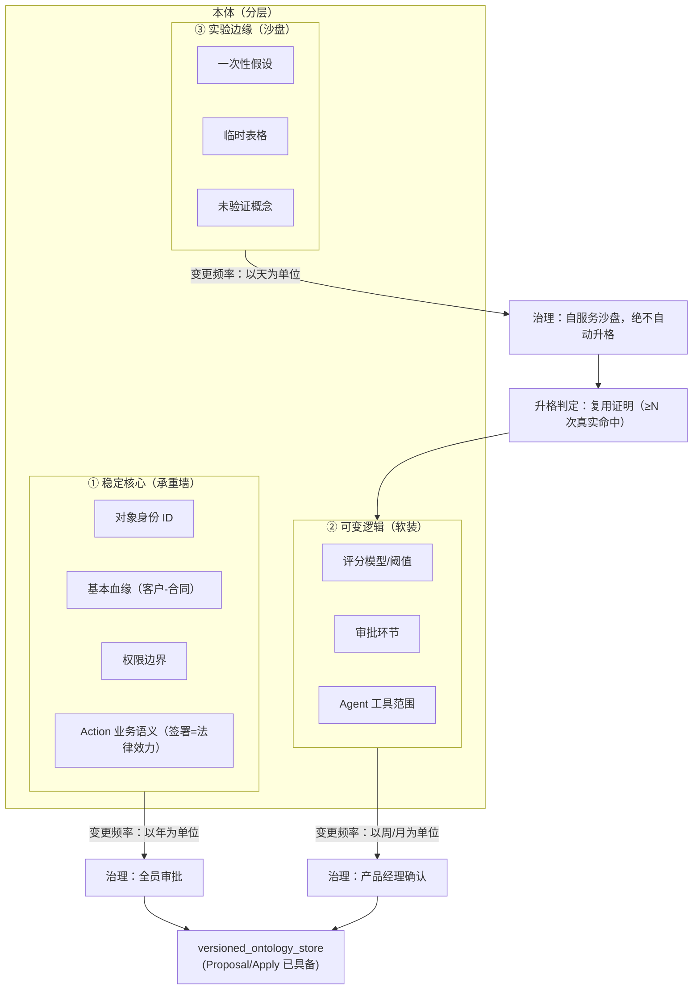

# 本体三层分离设计（P2-L1：稳定核心 / 可变逻辑 / 实验边缘）

> **目的**：为 aiPlat 本体引入"分层治变"能力——让本体变更的治理规则按影响半径分级，解决"业务变化快，架构跟不上"的行业死穴。
> **状态**：**设计文档（2026-08-19，文档先行）**——程序暂停期间先定设计，后续代码实施（ontology YAML 加 `tier` 字段）以此为据。
> **关联**：《企业级AI可信落地全景图-aiPlat对照.md》§3.5 P2-L1 项。

---

## 1. 为什么需要分层（问题定义）

当前 aiPlat 本体是**整体 YAML**（`~/.aiplat/ontologies/{domain_id}.yaml`）+ 代码内嵌 `CLASSES`（`knowledge_ontology.py:148`）：

| 现状问题 | 后果 |
|---|---|
| 所有类/属性同权 | 改一个"折扣阈值"（软装）与改"客户身份定义"（承重墙）走同一审批流程 |
| 无变更频率区分 | 一次性实验（沙盘）可能被误升格为全公司标准 |
| 无影响半径标注 | 无法自动判断"这改动会影响承重墙还是软装" |

## 2. 三层分离架构图



## 3. 治理规则矩阵（按 tier 分级）

| tier | 语义 | 变更频率 | 审批 | 自动升格 | 影响半径 |
|---|---|---|---|---|---|
| `core` | 稳定核心（身份/血缘/权限/Action 语义） | 年 | **全员/架构评审**（阻断） | 禁止 | 全系统（变更即版本化 Proposal） |
| `logic` | 可变逻辑（评分/阈值/审批/工具范围） | 周/月 | 产品经理确认 | 允许（复用证明后） | 业务行为 |
| `edge` | 实验边缘（一次性假设/临时概念） | 天 | 自服务 | **绝不自动升格**（需复用证明） | 沙盘隔离 |

**升格判定**：`edge → logic` 需"复用证明"（如高频概念 count ≥ 阈值，复用 `add_suggestions_from_patterns` 的聚类数据）；`logic → core` 需架构评审（走 `versioned_ontology_store.create_proposal` + 全员确认）。

## 4. 字段设计（后续代码实施依据）

```yaml
# ~/.aiplat/ontologies/{domain_id}.yaml — 新增 tier 字段
domains:
  ship-design:
    classes:
      - name: Customer
        tier: core        # 稳定核心：身份定义，变更需全员审批
        required_fields: [id, contract_ref]
      - name: RiskScore
        tier: logic       # 可变逻辑：评分模型，产品经理可调
        required_fields: [formula_ref, threshold]
      - name: TempHypothesis
        tier: edge        # 实验边缘：沙盘概念，绝不自动升格
        required_fields: [note, expires_at]
```

**代码侧变化（设计约定，本轮不实施）**：
- `ontology_loader.load_ontology_from_yaml`：解析 `tier` 字段 → `OntologyClass.tier`
- `versioned_ontology_store.apply_proposal`：按 tier 分级审批（core 需全员 / logic 需产品 / edge 自服务）
- 变更审计：`ontology_audit` 报告按 tier 分组，展示各 tier 变更频率与未决 Proposal

## 5. 验收标准（设计完成度）

| # | 验收 | 方法 |
|---|------|------|
| 1 | tier 字段语义明确 | 本文档 §3/§4 |
| 2 | 治理规则可执行 | 审批矩阵（全员/产品/自服务） |
| 3 | 与现有 Proposal 机制衔接 | 复用 `versioned_ontology_store`（`create_proposal:78`/`apply_proposal:104`） |
| 4 | 不破坏现有本体 | `tier` 默认 `logic`（存量零改动，兼容旧 YAML） |

**默认值决策**：`tier` 默认 `logic`——存量 YAML 无 tier 时按"可变逻辑"处理（不误伤现有编辑权限，也不把未知内容当承重墙）。
