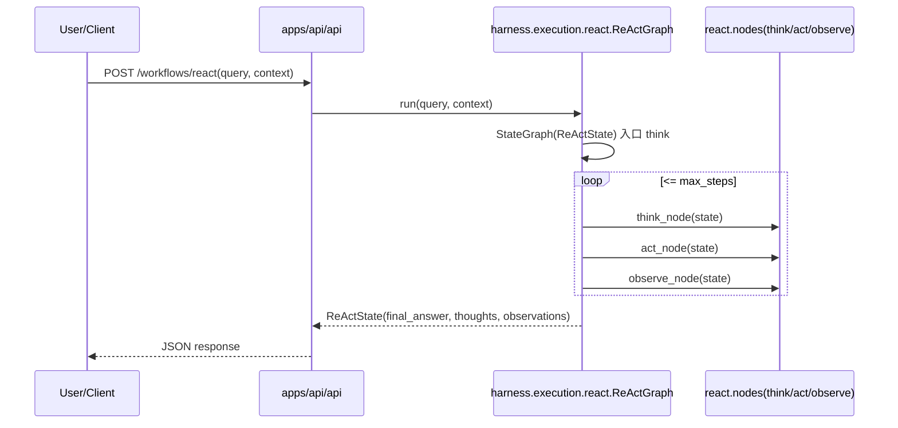
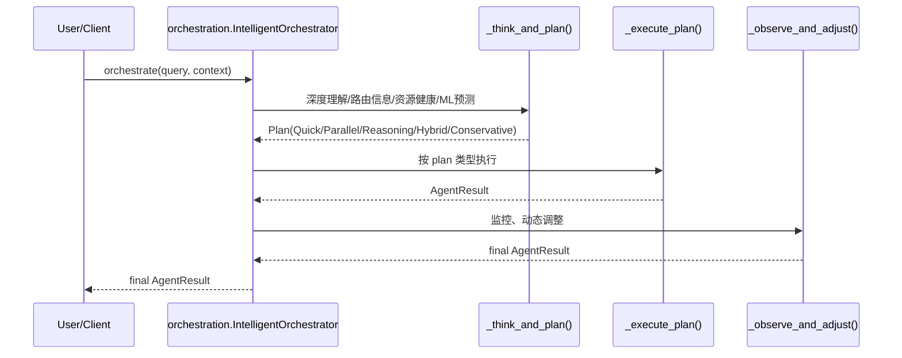

# RANGEN-main(syu-python) vs aiPlatform：核心能力层（aiPlat-core）实现对比（基于代码）
更新时间：2026-04-16

> 说明：  
> - RANGEN 项分析对象：你提供的 `rangen_core.zip`，其核心能力层代码根包为 `rangen_core/`（Python package：`rangen_core`）。  
> - aiPlatform 项分析对象：当前工作区 `aiPlat-core/core`（Python package：`core`）。  
> - 本文只以 **代码实现** 为准；若文档与代码不一致，以代码为准。

---

## 1. 两个项目的“核心能力层”边界差异

### 1.1 RANGEN（rangen_core）

RANGEN 的核心层是一个“**四层架构 + Harness 操作系统层 + 大编排层**”的集合体（同一仓库内并存多条执行主路径）：

```
Layer 4: agents/                 # 领域智能（业务 Agent）
Layer 3: orchestration/          # 编排/决策/多路径调度（强）
Layer 2: services/               # AI 服务、prompt 工程、能力服务
Layer 1: memory/ + harness/memory/ # 记忆系统（并存：向后兼容 + Harness 版）
Layer 0: harness/infrastructure/ # Hook/权限/治理/基础设施

同时还存在：context/、tools/、skills/、apps/（API、应用入口）
```

关键入口/骨架：
- API：`rangen_core/apps/api/api/server.py`（FastAPI）
- 工作流（LangGraph）：`rangen_core/harness/execution/*`、`rangen_core/harness/langgraph/*`
- 大编排（策略选择/多资源协调）：`rangen_core/orchestration/intelligent_orchestrator.py`
- Agent 实现：`rangen_core/agents/core/*`（`BaseAgent`、`ReActAgent` 等）
- “Claude 风格流式循环”：`rangen_core/orchestration/agent_loop.py`（AsyncGenerator AgentLoop）
- 治理：`rangen_core/harness/permissions/panel.py`

### 1.2 aiPlatform（aiPlat-core）

aiPlatform 的核心能力层更接近“**apps + harness + adapters + services/management**”的清晰分层，主执行路径以 Loop-first 为主：

```
apps/       # Agent/Skill/Tool 实现与 registry/executor
harness/    # interfaces + execution(loop) + hooks/approval + feedback_loops + langgraph(可选)
adapters/   # LLM adapters
services/   # execution_store / trace_service / context_service / prompt_service ...
management/ # Agent/Skill/Memory/Knowledge/Adapter/Harness Manager
server.py   # FastAPI 对外入口
```

---

## 2. RANGEN 核心能力层架构（代码映射）

### 2.1 总体结构图（按代码真实组织）

```mermaid
flowchart TB
  API[apps/api/api/server.py\nFastAPI] --> Routes[apps/api/api/routes/v1/*]

  %% Workflow paths exposed by API
  Routes --> WF1[harness/execution/react/graph.py\nReActGraph(LangGraph)]
  Routes --> WF2[harness/langgraph/graphs/tri_agent/*\nTriAgentGraph]
  Routes --> WF3[harness/langgraph/graphs/multi_agent/*\nMultiAgentGraph]

  %% Orchestration path (core brain)
  Orch[orchestration/intelligent_orchestrator.py\nIntelligentOrchestrator] --> Plan[_think_and_plan()\nQuick/Parallel/Reasoning/Hybrid]
  Plan --> Exec[_execute_plan()]
  Exec --> Obs[_observe_and_adjust()]

  %% Agent layer
  Orch --> AgentCore[agents/core/*\nBaseAgent/ReActAgent/...]
  AgentCore --> Tools1[tools/*\nToolRegistry(自动发现/DB登记)]
  AgentCore --> MemTok[TokMem/FAISS\n(tool_token_bank + enhanced_faiss_memory)]

  %% Harness OS
  subgraph HarnessOS[harness/*（操作系统层）]
    HI[harness/integration.py\nHarnessIntegration]
    Perm[harness/permissions/*\nGovernancePanel/Adapter/Escalation]
    ExecSys[harness/execution/*\nReActGraph/Executors/Policies/Retry]
    ToolAbs[harness/tools/*\nToolInterface + Registry(定义文件加载)]
    MemAbs[harness/memory/*\nGateway/TokenBank/StatePersistence]
    FB[harness/feedback_loops/*]
  end

  Orch --> HI
  WF1 --> ExecSys
  ExecSys --> ToolAbs
  ExecSys --> MemAbs
  Perm --> HI
```

### 2.2 关键模块职责（以代码为准）

**(1) API 层（对外入口）**
- `apps/api/api/server.py`：注册 v1 router
- `apps/api/api/routes/v1/__init__.py`：
  - `/agents`：通过 `rangen_core.apps.agents.registry` 列 Agent
  - `/skills`：通过 `rangen_core.apps.skills.registry` 列 Skill
  - `/tools`：通过 `rangen_core.harness.tools.registry` 列 Tool
  - `/workflows/react`：调用 `rangen_core.harness.execution.react.get_react_graph().run(query, context)`
  - `/workflows/tri-agent|multi-agent`：调用 `harness.langgraph.graphs.*.get_*_graph().run(...)`

**(2) Harness 执行系统（Graph-first 的工作流框架）**
- `harness/execution/__init__.py`：导出
  - Loop 接口：`ILoop/LoopState/LoopResult`
  - ReAct：`ReActGraph`（别名 ReActLoop）
  - executor：`UnifiedExecutor/SandboxExecutor/BackgroundTasks/ToolOrchestrator/IntelligentToolSelector`
  - workflow：`ReActWorkflow/create_react_workflow`
  - 策略：`ExecutionPolicy/FeedbackLoopMechanism/UnifiedRetryManager`
- `harness/execution/react/graph.py`：用 LangGraph `StateGraph(ReActState)` 构造 Think→Act→Observe 循环。
  - **注意**：当前 `harness/execution/react/nodes.py` 中仍存在 `TODO: 集成实际 LLM / 工具执行` 的占位实现（更像示例/骨架）。

**(3) 编排层（RANGEN 的“核心大脑”）**
- `orchestration/intelligent_orchestrator.py`：
  - `orchestrate(query, context)` 是“唯一入口”（代码注释如此）
  - 核心三段式：
    1. `plan = await _think_and_plan(query, context)`：深度理解 + 选择执行策略（受 route_path、资源健康、ML 预测影响）
    2. `result = await _execute_plan(plan)`：按 plan 类型执行（Quick/Parallel/Reasoning/Conservative/Hybrid）
    3. `final_result = await _observe_and_adjust(result)`：监控与动态调整
  - 该文件提供了非常强的“多路径策略调度”，并维护大量 performance metrics、ML predictor 使用情况等。

**(4) Agent 层（可执行的 ReActAgent 实现）**
- `agents/core/base_agent.py`：BaseAgent 极重（配置管理、性能追踪、历史、HUD、TokMem、心跳监控、自进化 mixin 等）
- `agents/core/react_agent.py`：ReActAgent 的“完整实现版本”
  - 自带工具注册（`rangen_core.tools.tool_registry.get_tool_registry()`）
  - 可选：智能工具选择器、LangGraph workflow、AutonomousDecisionEngine、RuleManager、统一配置中心等

**(5) Context / Prompt（与执行强耦合）**
- `context/*`：compactor/compressor/persistence/session/summarizer 等，强调 token budget 下的压缩与持久化
- `orchestration/agent_loop.py`：提供 `AgentLoop(AsyncGenerator)`，带：
  - token budget 检查、nudge、compact_threshold
  - 工具调用抽取与执行（`ToolExecutor.execute(tool_uses)`）
  - 流式消费/自然取消/背压控制
  - 更接近“Claude Code Loop”运行时

**(6) 权限与治理**
- `harness/permissions/panel.py`：治理对象加载（SPEC/ADR/RULE 等），提供 coverage report 与 visualization。
- 还有 `harness/permissions/escalation.py` / `adapter.py` 等用于治理接入。

**(7) Tool Registry 的“多实现并存”**
RANGEN 里至少存在两类 ToolRegistry（会影响你理解“工具系统到底在哪里”）：
1. `harness/tools/registry.py`：从 `harness/tools/definitions/*.tool.md` 加载工具元信息（偏“声明式定义”）
2. `tools/tool_registry.py`：从 `tools/`、`src/agents/tools` 自动发现 `.py` 工具，并写入 infra 的 DB（偏“运行时发现+登记”）

---

## 3. RANGEN 端到端执行流程（按“代码里真实存在的主路径”）

RANGEN 的“执行主路径”是 **多条并存** 的（这是它与 aiPlatform 最大差异之一）。下面按“你最可能关心的两条主路径”拆开：

### 3.1 路径 A：API 暴露的 LangGraph 工作流（Graph-first）

入口：`POST /api/v1/workflows/react` → `harness.execution.react.get_react_graph().run(query, context)`



> 关键实现提醒：当前 `think_node/act_node` 仍是占位逻辑（TODO），并没有真正调用 LLM/工具。这条路径更像“框架骨架/示例工作流”。

### 3.2 路径 B：编排层 IntelligentOrchestrator（策略决策 + 多资源执行）

入口（典型）：你的上层调用如果走“核心大脑”，会直接调用 `IntelligentOrchestrator.orchestrate(query, context)`（见代码注释“唯一入口”）。



这条路径的“核心特征”：
- **多路径执行**：MAS 并行、标准 loop、ReAct 深推理、混合等
- **强可观测与优化**：大量 metrics + ML predictor 参与路径选择
- **工具注册中心统一**：优先复用父类 tool_registry，否则使用 `tools/tool_registry.py` 的 registry

### 3.3 路径 C：Claude 风格 AgentLoop（流式、背压、工具执行）

入口：`orchestration/agent_loop.py` 定义的 `AgentLoop`（AsyncGenerator），强调：
- 每轮：LLM → tool_uses → tool_executor → tool_result
- token budget 管理：nudge/compact
- 更适合“长任务流式输出+可取消”

> 该路径通常会被 orchestration 的 executor/CLI/团队执行器等模块组合使用（需要结合你的上层入口实际调用点进一步追踪）。

---

## 4. 与 aiPlatform(aiPlat-core) 的核心差异清单（实现级）

### 4.1 分层与“主路径收敛度”

| 维度 | RANGEN（rangen_core） | aiPlatform（aiPlat-core） |
|---|---|---|
| 分层风格 | 四层架构 + Harness OS + 大编排层（orchestration） | apps + harness + adapters + services/management |
| 主执行路径 | **多条并存**（Graph-first 工作流、Orchestrator 多策略、AgentLoop 流式 loop、Agent 自己的 ReAct loop） | **单主路径清晰**：Agent → Harness Loop（ReActLoop/PlanExecuteLoop），LangGraph 为可选子系统 |
| 复杂度 | 高（大量“优化/学习/治理/多资源”代码在核心层内） | 中（更工程化、主路径更易追踪） |

### 4.2 ReAct 实现形态差异（最关键）

| 维度 | RANGEN | aiPlatform |
|---|---|---|
| ReAct 核心实现 | 既有 `agents/core/react_agent.py`（相对完整），也有 `harness/execution/react/*`（Graph骨架，nodes 存在 TODO） | `harness/execution/loop.py` 中 `ReActLoop` 是主路径，Reason/Act/Observe 都落地（含 approval/hooks/观测控制） |
| 编排风格 | Graph-first（LangGraph）与 Loop/Orchestrator 并存 | Loop-first 为主，LangGraph 用于特定 graphs |
| 工具调用解析 | ReActAgent 内部解析与工具选择（且可选“智能工具选择器/工作流”） | ReActLoop 解析 tool/skill JSON，统一在 Loop 内执行 |

### 4.3 上下文/提示词治理

| 维度 | RANGEN | aiPlatform |
|---|---|---|
| 上下文模块 | `context/*` 很完整（压缩/持久化/session/summarizer），并在 AgentLoop 中体现 token budget/nudge/compact | 有 `services/ContextService`（会话容器）+ `harness/context/ContextLoader`（文件上下文渐进加载），但主 ReAct prompt 仍以字符串拼装为主，未统一收敛 |
| 提示词治理 | 在 services/prompt_engineering、prompts、prompt_cache 等体系里更“重” | 有 `PromptService` + LangChain prompt wrapper，但主路径未强绑定（更多是能力就位） |

### 4.4 工具系统与权限/治理

| 维度 | RANGEN | aiPlatform |
|---|---|---|
| Tool registry | 多套并存（声明式 definitions + 运行时发现/登记 + agents/tools registry 等） | `apps/tools/ToolRegistry` 为主；Tool.execute 包含 validate/permission/tracing/stats 的统一包装 |
| 权限模型 | “治理面板”+规则对象（SPEC/ADR/RULE…）更偏组织治理；另有 permissions 模块 | 更偏“执行期安全”：PermissionManager（EXECUTE）+ ApprovalManager（敏感操作）+ hooks 扫描 |
| 可观测性 | 强调 HUD/监控/移动监控（见多个 monitoring/mobile_monitoring.py） | TraceService + ExecutionStore + hooks + 简化的观测驱动控制（tool error rate/token compaction） |

---

## 5. 对齐建议（如果你的目标是“两个核心层可互相迁移/复用”）

1) **先决定“唯一主执行路径”**  
   - RANGEN 建议明确：到底以 Orchestrator 路径为主，还是以 Harness Graph 为主；目前 API 暴露的 ReActGraph nodes 仍是 TODO，会让使用者误判能力成熟度。  

2) **统一 ToolRegistry/ToolInterface**  
   - 目前 RANGEN 同名 `ToolRegistry` 多处存在，建议收敛到一个“运行时 registry + 声明式元信息”的组合模型（类似：registry 管实例，definitions 管 schema/权限/并行属性）。

3) **把 Context/Prompt 变成可插拔的“组装器（Assembler）”**  
   - RANGEN 已有 AgentLoop 的 token budget/nudge/compact 思路；aiPlatform 有 ContextLoader（文件上下文）和 PromptService（模板治理）基础。  
   - 目标形态可以是：`ContextAssembler(AgentContext) -> PromptContext`，再由 PromptTemplate 渲染为 messages/prompt。

---

## 6. 下一步我需要你确认的一个问题（避免对比结论偏差）

在 RANGEN 项里，你实际生产调用时更常走哪条路径？
1) **走 API 的 `/workflows/*`**（LangGraph 工作流）  
2) **走 `IntelligentOrchestrator.orchestrate()`**（大编排层）  
3) **走 `AgentLoop` 流式执行**  

你告诉我主路径，我可以把“对比报告”进一步收敛到那条主路径上，把差异点写得更“可落地迁移”。

