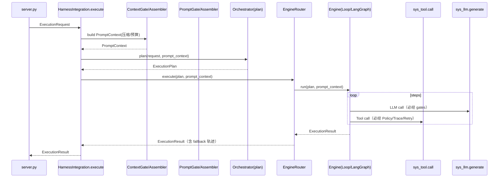

# aiPlat-core 内核化改造方案（吸收 RANGEN 优点）
更新时间：2026-04-16  
适用范围：`aiPlat-core/core`（核心能力层）  

> 目标：将 **Harness 定位为 Core 的操作系统（Kernel）**，将 **Orchestrator 定位为用户态编排进程（User-space）**，吸收 `rangen_core` 的多路径/多引擎/强上下文与提示词工程/强治理/自学闭环优点，同时避免多入口与多套实现并存导致的分叉风险。

---

## 1. 北极星约束（必须写死为工程纪律 + CI 规则）

1) **唯一对外执行入口**  
所有执行请求（Agent/Skill/Tool/Workflow）最终都只能走：
`core/harness/integration.py::HarnessIntegration.execute(request)`

2) **系统调用（Syscalls）封口**  
任何实际副作用执行必须经过 3 类 syscall：
- `sys_llm.generate(llm_request)`
- `sys_tool.call(tool_call)`
- `sys_skill.call(skill_call)`

3) **四大必经门禁（Kernel Gates）不可绕过**  
权限+审批 / Trace+审计 / Context预算与压缩 / Retry+Fallback，必须由 Kernel 强制装配并贯穿全路径。

4) **多路径但不分叉**  
多引擎（Loop/LangGraph/未来 AgentLoop）允许并存，但必须统一输入输出与治理链：
- 输入：`ExecutionPlan + PromptContext`
- 输出：`ExecutionResult`
- 执行副作用：只能走 syscalls

---

## 2. To-Be 架构总览（Kernel / User-space）

### 2.1 职责边界

**Harness（Kernel）负责：**
- syscall 入口：`execute() / sys_llm / sys_tool / sys_skill`
- 调度：EngineRouter（按 plan 选引擎 + fallback）
- 治理：PolicyGate / TraceGate / ContextGate / ResilienceGate
- 资源管理：ContextAssembler / PromptAssembler（模板版本、输出契约、token 预算）
- 观测与回放：TraceService + ExecutionStore + LangGraph checkpoints
- 反馈闭环：evaluation + feedback_loops + evolution（版本化/灰度/回滚）

**Orchestrator（User-space）负责：**
- 深度任务理解与规划：产出 `ExecutionPlan`（Quick/Reasoning/Parallel/Hybrid…）
- 动态策略调整：但必须通过 Kernel 接口生效（不直接执行 tool/llm）

### 2.2 推荐目录结构（落地）

```text
core/
  harness/
    kernel/
      types.py                    # ExecutionRequest/PromptContext/ExecutionPlan/ExecutionResult
    integration.py                # HarnessIntegration.execute（唯一入口）
    syscalls/
      llm.py                      # sys_llm.generate
      tool.py                     # sys_tool.call
      skill.py                    # sys_skill.call
    infrastructure/
      gates/
        policy_gate.py            # 权限+审批
        trace_gate.py             # trace/span + 审计
        context_gate.py           # token budget + 压缩
        resilience_gate.py        # retry/fallback/timeout/circuit
    assembly/
      context_assembler.py        # ContextService + ContextLoader + Memory/Knowledge
      prompt_assembler.py         # PromptService(版本模板) + 输出契约
    execution/
      router.py                   # EngineRouter
      engines/
        loop_engine.py
        langgraph_engine.py
        agentloop_engine.py       # (可选，后续)
  orchestration/
    orchestrator.py               # 只产出 plan（不执行副作用）
    plans.py
  services/
    execution_store.py
    trace_service.py
    context_service.py
    prompt_service.py
  apps/
    agents/ skills/ tools/ mcp/ ...
  server.py                       # 仅协议转换 → HarnessIntegration.execute
```

---

## 3. 核心数据契约（Kernel Types）

> 建议统一定义在：`core/harness/kernel/types.py`

### 3.1 ExecutionRequest（来自 API/上层的“系统调用请求”）
最小字段建议：
- `request_id`：上层传入或 Kernel 生成
- `user_id` / `session_id`
- `messages`：对话历史（原始）
- `query`：可选（messages 最后一条也可推断）
- `preferred_agent`：可选（指定 agent 类型/ID）
- `tool_allowlist / tool_denylist`
- `skill_allowlist / skill_denylist`
- `attachments`：文件/路径/引用（供 ContextLoader 使用）
- `metadata`：模型、温度、预算、租户信息等

### 3.2 PromptContext（Kernel 组装后的“可执行上下文”）
- `messages`：压缩/裁剪后的消息
- `system_instructions`：系统提示与安全约束
- `tool_schemas`：可调用工具 schema（含危险等级/默认超时/并行性）
- `skill_schemas`：可调用技能 schema
- `artifacts`：文件摘要、检索结果、记忆召回、执行中间产物
- `budgets`：token budget、max_steps、timeout、compact_threshold
- `prompt_version`：模板版本（用于回放/审计）

### 3.3 ExecutionPlan（Orchestrator 输出）
- `plan_type`：`quick | reasoning | planning | parallel | hybrid | conservative`
- `engine_hint`：`loop | langgraph | agentloop | auto`
- `steps`：推理步骤 / 子任务列表（可为空）
- `fallback_chain`：例如 `["langgraph", "loop", "quick"]`
- `constraints`：强约束（禁止工具、预算上限、必须审批策略等）
- `explain`：plan 选择理由（必须落库）

### 3.4 ExecutionResult（Kernel 返回）
- `status`：`completed | failed | approval_required | cancelled`
- `output`：最终文本/结构化输出
- `error`：失败原因（若失败）
- `trace_id/run_id`
- `tool_calls` / `skill_calls`：审计级别记录
- `token_usage` / `latency_ms`
- `metadata`：包含 plan、fallback、压缩摘要、审批状态等

---

## 4. Kernel 关键流程（端到端）



---

## 5. 分期改造里程碑（每期可上线、可回滚）

### Phase 1（P0）：入口收敛（不改业务行为）
**目标**：所有执行入口统一转发到 Kernel `execute()`，先把观测/落库跑通。  
**改动**：
- 新增 `HarnessIntegration.execute`
- `server.py` 执行路由统一调用 `execute`
**验收**：每次执行都有 `run_id/trace_id` 且落 ExecutionStore。

### Phase 2（P0）：Syscalls 封口（副作用入口封死）
**目标**：LLM/Tool/Skill 的实际执行只能走 syscalls。  
**改动**：
- 新增 `sys_llm/sys_tool/sys_skill`
- Loop/Graph/SkillExecutor/ToolCalling 改走 syscalls
**验收**：主路径无直接 `tool.execute/adapter.generate` 调用。

### Phase 3（P0）：四大 Gate 下沉 Kernel（治理不可绕过）
**目标**：权限+审批/追踪/压缩/重试，成为 syscalls 与 execute 的必经设施。  
**验收**：任意 tool_call：权限/审批/span/重试/审计齐全，且可回放。

### Phase 4（P1）：ContextAssembler + PromptAssembler 收敛
**目标**：统一上下文预算/压缩与模板版本化，Loop 不再手工拼 prompt。  
**验收**：prompt_version、压缩摘要、工具 schema 均记录可回放。

### Phase 5（P1）：Orchestrator 引入（只产 plan）
**目标**：吸收 RANGEN 智能编排优势（多路径、多引擎选择、动态调整），但不破坏 Kernel 纪律。  
**验收**：plan 选择理由/回退链可解释、可审计；Orchestrator 无副作用执行权限。

### Phase 6（P2）：自学闭环（受控演进）
**目标**：Evaluation+Feedback+Evolution 产出策略/模板/工具排序的版本化改进，支持灰度/回滚。  
**验收**：学习产物可追溯到 run 与指标提升，且可一键回滚。

---

## 6. CI 静态约束（防分叉必备）

建议最少做 3 类扫描（grep/AST 皆可）：

1) **server 层禁止直接执行**  
禁止出现：`agent.execute(`、`loop.run(`、`graph.run(`、`tool.execute(`、`adapter.generate(`

2) **orchestration 层禁止副作用**  
禁止出现：`tool.execute(`、`adapter.generate(`（必须走 syscalls，经 Kernel 管控）

3) **engines/loop/langgraph 内禁止绕过 syscalls**
禁止出现：对 Tool/LLM 直接调用（必须走 sys_tool/sys_llm）

---

## 7. 交付件清单（你在评审时要看到的“成品”）

- [ ] `HarnessIntegration.execute` 成为唯一执行入口（server 全量转发）
- [ ] syscalls 三件套落地并覆盖主路径
- [ ] 四大 Gate 作为 Kernel 基础设施强制生效
- [ ] ContextAssembler / PromptAssembler 上主路径（Loop 不再手工拼 prompt）
- [ ] Orchestrator 只产 plan，执行由 EngineRouter + syscalls 完成
- [ ] ExecutionStore 可回放：plan、prompt_version、压缩摘要、tool_calls、审批状态、fallback 链
- [ ] Evaluation/Feedback/Evolution 受控闭环上线（版本化/灰度/回滚）

