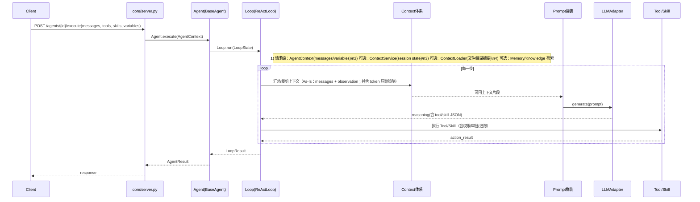

# 核心能力层（aiPlat-core）架构与处理流程（基于代码实现）
更新时间：2026-04-16

> 范围：`aiPlat-core/core`  
> 口径：以 As-Is 代码事实为准；对未形成“主路径闭环”的部分会标注为“可用但未统一收敛”。

---

## 1. 核心能力层边界

核心能力层在仓库中的主边界为：
- **对外入口**：`core/server.py`（FastAPI REST API）
- **能力实现**：`core/apps/*`（agents / skills / tools / mcp / quality）
- **执行内核**：`core/harness/*`（interfaces / execution / infrastructure / feedback_loops / context / memory / knowledge 等）
- **适配器**：`core/adapters/*`（当前主要是 LLM 适配）
- **管理与服务**：`core/management/*`、`core/services/*`

---

## 2. 架构图（含：上下文/提示词处理）

```mermaid
flowchart TB
  %% ========== External ==========
  Client[上层调用方\n(platform/app/CLI)] -->|HTTP| API[core/server.py\nFastAPI Router]

  %% ========== Management / Registry ==========
  API --> MGMT[core/management/*\nAgent/Skill/Memory/Knowledge/Harness Manager]
  MGMT --> AREG[apps/agents/AgentRegistry]
  MGMT --> SREG[apps/skills/SkillRegistry]
  MGMT --> TREG[apps/tools/ToolRegistry]

  %% ========== Agent ==========
  API -->|AgentContext| Agent[apps/agents/*\nReActAgent/PlanExecute/...]
  Agent -->|create_loop| Loop[harness/execution/*\nReActLoop/PlanExecuteLoop]

  %% ========== Context ==========
  subgraph ContextLayer[上下文（Context）体系]
    AC[AgentContext\n(session_id/user_id/messages/tools/skills/variables)]
    CS[services/ContextService\nSessionContext/状态与共享文件]
    CL[harness/context/ContextLoader\n渐进加载: 目录摘要/文件上下文]
    MEM[harness/memory/*\n短期/长期/会话管理（As-Is）]
    KN[harness/knowledge/*\nRAG 知识检索（As-Is）]
  end

  Agent --> AC
  API --> CS
  Loop --> MEM
  Loop --> KN
  Loop --> CL

  %% ========== Prompt ==========
  subgraph PromptLayer[提示词（Prompt）体系]
    PS[services/PromptService\n模板注册/渲染/版本]
    LCPT[harness/infrastructure/langchain/prompts.py\nPromptTemplate/ChatPrompt/FewShot]
    PromptAsm[执行时 Prompt 拼装\nReActLoop._reason()（As-Is：字符串拼装）]
  end

  Loop --> PromptAsm
  PromptAsm -.可选(未统一收敛).-> PS
  PromptAsm -.可选(未统一收敛).-> LCPT

  %% ========== LLM ==========
  PromptAsm --> LLM[adapters/llm/*\nILLMAdapter.generate()]

  %% ========== Skills & Tools ==========
  Loop -->|Skill call| SkillExec[apps/skills/SkillExecutor]
  SkillExec --> Skill[apps/skills/BaseSkill.execute()]

  Loop -->|Tool call| Tool[apps/tools/BaseTool.execute()]
  Tool --> Perm[apps/tools/permission.py\nPermissionManager/RBAC]
  Tool --> Trace[services/TraceService\nTool span/tracing]

  %% ========== Persistence ==========
  Loop --> Store[services/ExecutionStore\n执行历史/图运行/Checkpoint]
```

### 2.1 为什么你没在“架构图例”里看到上下文/提示词？

之前我给的图偏“执行闭环（Loop/Tool/Skill）”，确实漏掉了两块重要支撑面：

**（1）上下文处理分散在三条链路：**
- **请求级上下文**：`AgentContext` 直接携带 `messages/variables/tools/skills/session_id/user_id`（`core/harness/interfaces`）。
- **会话级上下文**：`services/ContextService` 管理 `SessionContext`（TTL/状态/共享文件等），更像“会话状态容器”。
- **代码/文件上下文**（用于开发类任务）：`harness/context/ContextLoader` 支持“渐进加载 + 目录摘要 + 文件优先级裁剪”。

**（2）提示词处理存在两套“能力”，但主路径未统一：**
- **主路径（As-Is）**：`ReActLoop._reason()` 直接拼装字符串 prompt（包含 task、history、tools_desc、observation、以及 tool/skill 的结构化输出规范）。
- **可用能力（但未在 ReAct 主路径统一收敛）**：
  - `services/PromptService`：模板注册/渲染/版本控制；
  - `harness/infrastructure/langchain/prompts.py`：LangChain prompt wrapper（PromptTemplate/ChatPrompt/FewShot）。

---

## 3. 端到端处理流程（重点标出 Context/Prompt）



---

## 4. “上下文”在代码里的关键落点（便于你对照）

### 4.1 请求级上下文：AgentContext
- 入口：`core/harness/interfaces`（`AgentContext` / `LoopState`）
- 注入到 Loop：`apps/agents/base.py` → `BaseAgent.execute()` → 构造 `LoopState(context={task, session_id, user_id, ...})`

### 4.2 会话级上下文：ContextService
- 文件：`core/services/context_service.py`
- 能力：
  - `create_context()/get_context()/update_context()`：管理 `SessionContext`
  - 支持 TTL、状态（ACTIVE/IDLE/EXPIRED/CLOSED）
  - 支持“上下文文件”（spec/feedback/handoff 等）作为协作载体
- 备注：当前更偏“通用会话状态容器”，是否进入 Agent 主路径取决于 API/Manager 如何编排（可作为后续收敛点）。

### 4.3 代码/工程上下文：ContextLoader（渐进加载）
- 文件：`core/harness/context/loader.py`
- 典型场景：代码编辑/调试/评审类任务，需要把目录摘要、关键文件片段塞进上下文或 prompt。

### 4.4 记忆/知识：Memory & Knowledge
- 目录：`core/harness/memory/*`、`core/harness/knowledge/*`
- 备注：属于 As-Is 可用能力；是否在某个 Agent 的执行 prompt 中“默认注入”，需要看具体 Agent/Loop 的拼装策略（可作为后续“统一上下文编排”工作项）。

---

## 5. “提示词”在代码里的关键落点（便于你对照）

### 5.1 主路径（As-Is）：ReActLoop._reason()
- 文件：`core/harness/execution/loop.py`
- 行为：把 `task/history/tools_desc/observation` 拼成一个大 prompt，并约定输出为：
  - tool JSON：`{"tool":"tool_name","args":{...}}`
  - skill JSON：`{"skill":"skill_name","args":{...}}`

### 5.2 PromptService（模板管理能力）
- 文件：`core/services/prompt_service.py`
- 能力：模板注册、变量提取、render、版本递增等。
- 备注：目前看属于“能力已具备”，但 ReActLoop 主路径未直接使用（未形成统一模板化闭环）。

### 5.3 LangChain Prompt wrapper（可选）
- 文件：`core/harness/infrastructure/langchain/prompts.py`
- 能力：PromptTemplate / ChatPromptTemplate / FewShotPromptTemplate 的 wrapper。

---

## 6. 建议的“统一收敛点”（可选）

如果你希望架构上“上下文/提示词”更集中、可治理，建议后续演进目标是：
1) 以 `ContextService + ContextLoader + Memory/Knowledge` 组成统一的 `ContextAssembler`（输入：AgentContext；输出：PromptContext）。
2) ReAct/PlanExecute 的 prompt 构造从“字符串拼装”升级为：
   - `PromptService`（版本化模板） + `LangChain Prompt`（结构化） + `PromptContext`（注入策略）。

